# Horizontal vs Vertical Scaling — How Systems Handle Growth

When your single server can't handle the load anymore, you have two choices: make the server bigger (vertical) or add more servers (horizontal). This decision impacts your entire architecture, cost, and reliability.

---

- **Scaling:** The ability of a system to handle increased load by adding resources.
- **Vertical Scaling (Scale Up):** Adding more power (CPU, RAM, Disk) to an existing machine.
- **Horizontal Scaling (Scale Out):** Adding more machines to distribute the load.
- **Elasticity:** The ability to automatically scale resources up/down based on current demand (auto-scaling).
- **Load Balancer:** A device/service that distributes incoming traffic across multiple servers.
- **Stateless Server:** A server that stores no session data locally, so any server can handle any request.
- **Session Affinity (Sticky Sessions):** Routing all requests from a specific client to the same server.
- **Shared-Nothing Architecture:** Each node is independent and self-sufficient; no shared state between nodes.
- **Single Point of Failure (SPOF):** A component whose failure brings down the entire system.
- **Auto-Scaling:** Automatically adding/removing server instances based on metrics (CPU, memory, request count).
- **Capacity Planning:** Estimating the resources needed to handle expected load growth.
- **Throughput:** Total number of requests/transactions the system can process per unit time.
- **Bottleneck:** The component that limits overall system performance (weakest link).
- **Scale Cube:** A 3D model of scaling — X-axis (horizontal cloning), Y-axis (functional decomposition), Z-axis (data partitioning).

---

## 1. The Scaling Problem — Why You Need This

> **Your single server works great at launch. Then you get featured on Product Hunt. Now what?**

### The Growth Timeline

```
Day 1:     10 users      → Single laptop could handle this
Week 1:    100 users     → Small VPS (2 CPU, 4GB RAM) works fine
Month 1:   1,000 users   → Need a proper server (8 CPU, 32GB RAM)
Month 3:   10,000 users  → Server at 90% CPU. Database slow. Users complaining.
Month 6:   100,000 users → Single server CANNOT handle this. Period.
Year 1:    1,000,000 users → Need a distributed architecture
```

### What Breaks First?

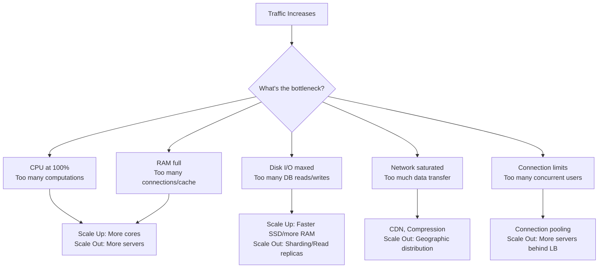

### Real Example — Smart Freight Growth

```python
"""
Stage 1 — MVP (you are here)
  Users: 50 fleet owners, 200 drivers
  Traffic: ~100 requests/minute
  Server: Single NestJS on ₹2,000/month VPS
  DB: Single PostgreSQL
  → ZERO scaling needed. Focus on product.

Stage 2 — Product-Market Fit
  Users: 500 fleet owners, 2,000 drivers
  Traffic: ~1,000 requests/minute
  Problem: DB queries slowing down (2s → 5s)
  Fix: VERTICAL — upgrade to 16 CPU, 64GB RAM (₹10,000/month)
  Fix: Add Redis cache for hot data (truck locations)
  → Still single server. Just bigger.

Stage 3 — Growth Phase
  Users: 5,000 fleet owners, 20,000 drivers
  Traffic: ~10,000 requests/minute
  Problem: Single server at 85% CPU. Deployments cause 30s downtime.
  Fix: HORIZONTAL — 3 app servers behind load balancer
  Fix: PostgreSQL read replica for dashboard queries
  Fix: Separate WebSocket server for live tracking
  → Now distributed. Need load balancer, health checks.

Stage 4 — Scale Phase
  Users: 50,000 fleet owners, 200,000 drivers
  Traffic: ~100,000 requests/minute
  Fix: Auto-scaling (3-10 servers based on load)
  Fix: Database sharding by region (North/South/East/West India)
  Fix: CDN for dashboard static assets
  Fix: Kafka for async event processing
  → Full distributed architecture.
"""
```

---

## 2. Vertical Scaling (Scale Up)

> **Make your existing machine more powerful. Like upgrading from a Maruti to a BMW — same car, more power.**

### How It Works

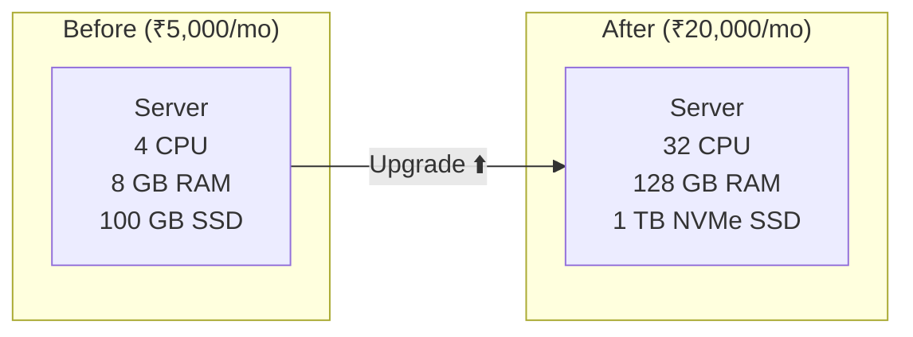

### What You Can Upgrade

| Resource | Why Upgrade | Impact | Cost |
|---|---|---|---|
| **CPU cores** | More concurrent request processing | 2x cores ≈ 1.8x throughput | Medium |
| **RAM** | More in-memory data, connections, cache | Reduces disk I/O, faster queries | Low-Medium |
| **SSD → NVMe** | Faster disk reads/writes | 3-10x faster DB queries | Medium |
| **Network (1G → 10G)** | More data transfer bandwidth | Faster for large payloads | Low |
| **GPU** | ML inference, video processing | Specialized workloads | High |

### AWS EC2 Instance Vertical Scaling

```
t3.micro    →  2 vCPU,   1 GB RAM  →  $8/month     (MVP)
t3.medium   →  2 vCPU,   4 GB RAM  →  $30/month    (Early stage)
m5.xlarge   →  4 vCPU,  16 GB RAM  →  $140/month   (Growing)
m5.4xlarge  →  16 vCPU, 64 GB RAM  →  $560/month   (Established)
r5.8xlarge  →  32 vCPU, 256 GB RAM →  $1,460/month (Heavy workload)
u-24tb1.metal→ 448 vCPU, 24 TB RAM →  $160,000/month (extreme)
                                       ↑ CEILING — can't go higher!
```

### Advantages of Vertical Scaling

```python
PROS = [
    "Simple — no code changes needed",
    "No distributed system complexity",
    "No data consistency issues (single DB)",
    "No network latency between nodes",
    "Lower operational overhead (1 server to manage)",
    "Transactions are straightforward (single machine ACID)",
    "Good enough for most startups until 10K-50K users",
]
```

### Limitations of Vertical Scaling

```python
CONS = [
    "Hard ceiling — biggest machine has limits (24 TB RAM max on AWS)",
    "Single Point of Failure — server dies, everything dies",
    "Downtime during upgrade — must stop server to add RAM/CPU",
    "Cost grows exponentially — 2x power ≠ 2x cost, often 4x cost",
    "No geographic distribution — users far from server get slow response",
    "Diminishing returns — going from 4→8 CPU helps, 64→128 CPU barely helps",
]
```

### When Vertical Scaling is the RIGHT Choice

```python
USE_VERTICAL_WHEN = [
    "You're a startup with < 10,000 users",
    "Your bottleneck is DB (just needs more RAM for indexes)",
    "Your app is stateful (hard to distribute)",
    "You need strong consistency (financial/banking systems)",
    "Team is small (1-3 devs) — can't manage distributed infra",
    "Cost of engineering time > cost of bigger server",
    "You need a quick fix TODAY while planning horizontal for next quarter",
]
```

---

## 3. Horizontal Scaling (Scale Out)

> **Add more machines. Like opening more restaurant branches instead of making the kitchen bigger.**

### How It Works

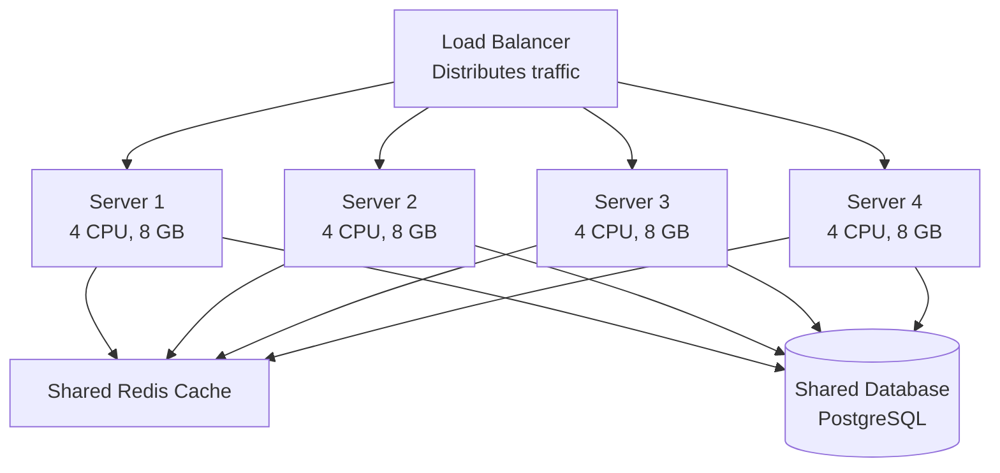

### Requirements for Horizontal Scaling

```python
# Your app MUST be stateless for horizontal scaling to work

# ❌ BAD — Stateful: Session stored in server memory
class StatefulServer:
    sessions = {}  # Dies when THIS server dies
    
    def login(self, user_id, token):
        self.sessions[token] = user_id  # Only THIS server knows
    
    def get_user(self, token):
        return self.sessions.get(token)  # Other servers don't have this!


# ✅ GOOD — Stateless: Session in external store (Redis)
class StatelessServer:
    def __init__(self, redis_client):
        self.redis = redis_client  # Shared across ALL servers
    
    def login(self, user_id, token):
        self.redis.setex(f"session:{token}", 3600, user_id)  # Any server can read
    
    def get_user(self, token):
        return self.redis.get(f"session:{token}")  # Works on ANY server


# ✅ EVEN BETTER — JWT: No session store needed at all
import jwt

class JWTServer:
    SECRET = "your-secret-key"
    
    def login(self, user_id):
        token = jwt.encode({"user_id": user_id, "exp": time.time() + 3600}, self.SECRET)
        return token  # Client carries the state!
    
    def get_user(self, token):
        payload = jwt.decode(token, self.SECRET, algorithms=["HS256"])
        return payload["user_id"]  # Decoded from token — no DB/Redis needed
```

### What Must Be Shared Across Servers?

| Resource | Where to Put It | Why |
|---|---|---|
| **Session data** | Redis / JWT token | Any server must handle any request |
| **File uploads** | S3 / MinIO (object store) | Files on Server 1 won't exist on Server 2 |
| **Database** | Shared PostgreSQL / managed DB | Single source of truth |
| **Cache** | Shared Redis cluster | Consistent cache across servers |
| **Config/Secrets** | Environment variables / Vault | Same config on all servers |
| **Logs** | Centralized (ELK, CloudWatch) | Can't SSH into 20 servers to read logs |
| **Cron jobs** | Separate worker / single leader | Don't run same cron on all 10 servers! |

### Advantages of Horizontal Scaling

```python
PROS = [
    "No ceiling — need more capacity? Add more servers",
    "Fault tolerant — 1 server dies, others handle traffic",
    "Zero-downtime deployment — rolling updates (1 server at a time)",
    "Geographic distribution — servers in Mumbai, Delhi, Bangalore",
    "Cost-linear — 2x servers ≈ 2x cost (not 4x like vertical)",
    "Auto-scaling — add servers at peak, remove at night (pay only for what you use)",
]
```

### Challenges of Horizontal Scaling

```python
CONS = [
    "Distributed system complexity — CAP theorem, network partitions",
    "Data consistency — which server has the latest data?",
    "Stateful apps need refactoring — move sessions to Redis/JWT",
    "Load balancer is a new SPOF (need LB redundancy too)",
    "More moving parts — monitoring, deployment, debugging harder",
    "Database becomes bottleneck — app scales but DB doesn't (yet)",
    "Need DevOps skills — Docker, Kubernetes, CI/CD",
]
```

---

## 4. Head-to-Head Comparison

> **The definitive comparison table.**

### Complete Comparison

| Factor | Vertical (Scale Up) | Horizontal (Scale Out) |
|---|---|---|
| **Method** | Bigger machine | More machines |
| **Complexity** | Low (same architecture) | High (distributed systems) |
| **Cost pattern** | Exponential (2x power = 3-4x cost) | Linear (2x servers = 2x cost) |
| **Max capacity** | Hard ceiling (biggest machine) | No theoretical limit |
| **SPOF** | Yes (single machine) | No (redundancy built in) |
| **Downtime** | Needed for hardware upgrade | Zero (rolling deploys) |
| **Data consistency** | Easy (single machine, ACID) | Hard (distributed transactions) |
| **Code changes** | None | Significant (stateless, shared state) |
| **Latency** | Lower (no network hops) | Slightly higher (LB + network) |
| **Best for** | DB, cache, single-threaded workloads | Web servers, stateless APIs |
| **Failure impact** | Total outage | Partial degradation |
| **Auto-scaling** | Not possible | Fully supported |
| **Geographic** | Single location | Multi-region possible |
| **Team skill** | Any developer | Needs DevOps knowledge |

### Visual Comparison

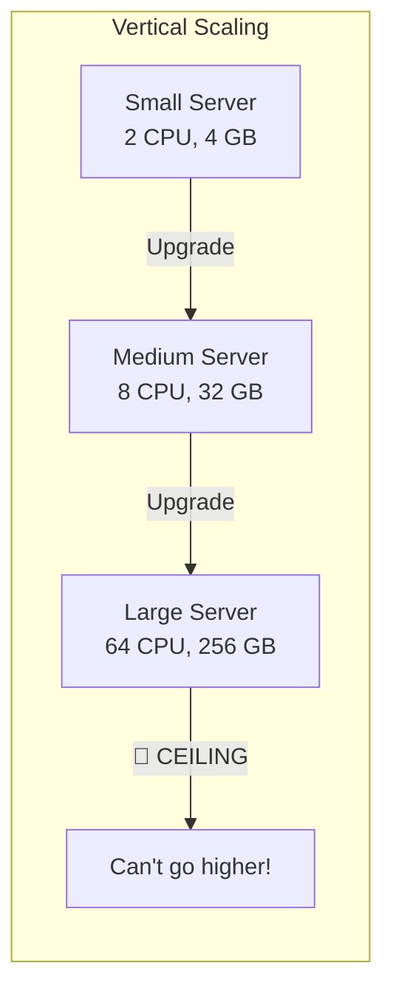

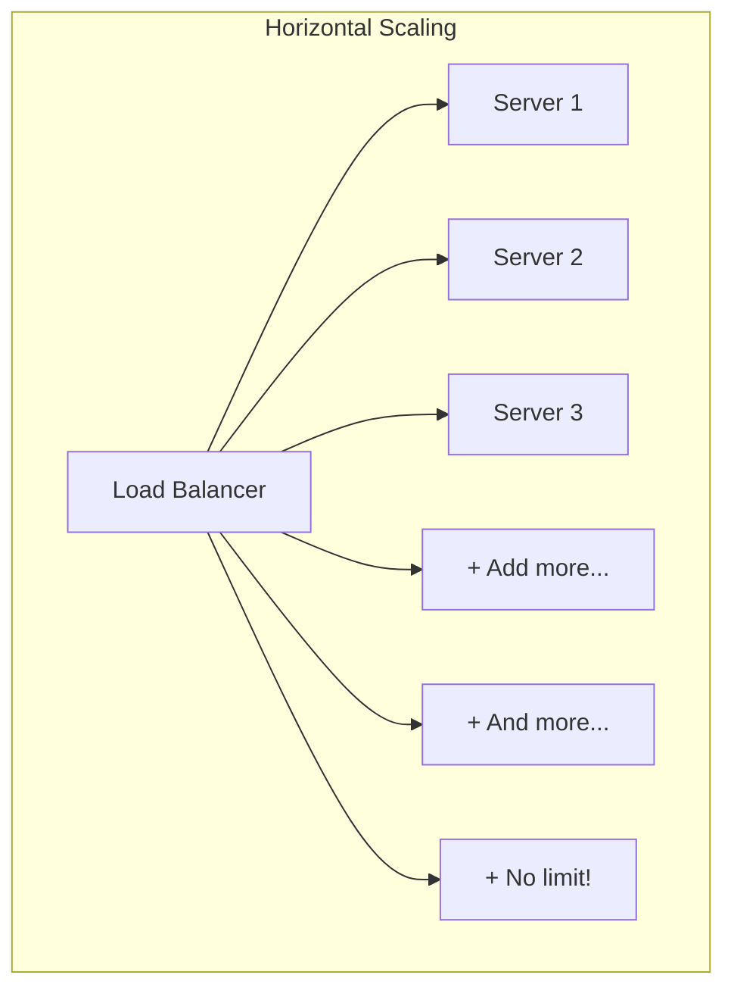

### Cost Comparison (Real AWS Pricing)

```
Vertical Scaling (single EC2):
  t3.medium   →  2 vCPU,  4 GB  →  $30/mo     (baseline)
  m5.xlarge   →  4 vCPU, 16 GB  →  $140/mo    (4x resource, 4.7x cost)
  m5.4xlarge  → 16 vCPU, 64 GB  →  $560/mo    (16x resource, 18.7x cost)
  m5.24xlarge → 96 vCPU,384 GB  →  $3,360/mo  (96x resource, 112x cost!)

Horizontal Scaling (multiple t3.medium):
  1 server    →  2 vCPU,   4 GB →  $30/mo
  4 servers   →  8 vCPU,  16 GB →  $120/mo    (4x resource, 4x cost ✅)
  16 servers  → 32 vCPU,  64 GB →  $480/mo    (16x resource, 16x cost ✅)
  96 servers  →192 vCPU, 384 GB →  $2,880/mo  (96x resource, 96x cost ✅)

  Winner at scale: Horizontal — $2,880 vs $3,360 for same capacity
  Plus: fault tolerance, zero-downtime deploys, auto-scaling included FREE
```

---

## 5. Load Balancing — The Enabler of Horizontal Scaling

> **Without a load balancer, horizontal scaling is impossible. It's the traffic cop for your servers.**

### How a Load Balancer Works

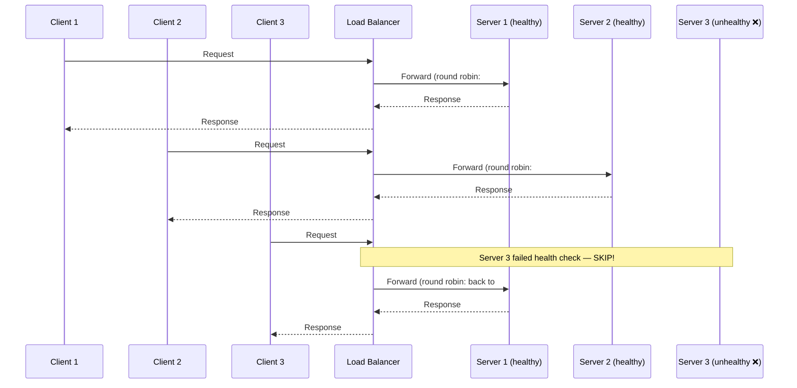

### Load Balancing Algorithms

| Algorithm | How It Works | Best For | Drawback |
|---|---|---|---|
| **Round Robin** | 1→2→3→1→2→3 cycle | Equal servers, stateless | Ignores server load |
| **Weighted Round Robin** | 1→1→1→2→3 (by weight) | Unequal server capacities | Manual weight tuning |
| **Least Connections** | Route to server with fewest active connections | Long-lived connections | Slightly more overhead |
| **Least Response Time** | Route to fastest responding server | Mixed workloads | Requires monitoring |
| **IP Hash** | hash(client_ip) % servers | Session affinity needed | Uneven if IP distribution skewed |
| **Consistent Hashing** | Hash ring, minimal redistribution | Cache servers | Complex implementation |
| **Random** | Pick randomly | Surprisingly effective | No intelligence |

### Code: Simple Load Balancer

```python
import itertools
import random
from collections import defaultdict

class LoadBalancer:
    def __init__(self, servers: list[str]):
        self.servers = servers
        self.healthy = set(servers)
        self.connections = defaultdict(int)
        self._rr_cycle = itertools.cycle(servers)

    # Algorithm 1: Round Robin
    def round_robin(self) -> str:
        """Cycle through servers equally"""
        for _ in range(len(self.servers)):
            server = next(self._rr_cycle)
            if server in self.healthy:
                return server
        raise Exception("All servers unhealthy!")

    # Algorithm 2: Least Connections
    def least_connections(self) -> str:
        """Route to server handling fewest requests right now"""
        healthy_servers = {s: self.connections[s] for s in self.healthy}
        return min(healthy_servers, key=healthy_servers.get)

    # Algorithm 3: Weighted Round Robin
    def weighted_round_robin(self, weights: dict) -> str:
        """Servers with higher weight get more traffic
        weights = {"server1": 5, "server2": 3, "server3": 2}
        server1 gets 50%, server2 gets 30%, server3 gets 20%
        """
        pool = []
        for server, weight in weights.items():
            if server in self.healthy:
                pool.extend([server] * weight)
        return random.choice(pool)

    # Algorithm 4: IP Hash (sticky sessions)
    def ip_hash(self, client_ip: str) -> str:
        """Same client always goes to same server"""
        healthy_list = sorted(self.healthy)
        index = hash(client_ip) % len(healthy_list)
        return healthy_list[index]

    # Health Check
    def health_check(self, server: str, is_healthy: bool):
        if is_healthy:
            self.healthy.add(server)
        else:
            self.healthy.discard(server)
            print(f"⚠️ {server} marked UNHEALTHY — removed from rotation")


# Usage
lb = LoadBalancer(["server-1", "server-2", "server-3"])

# Simulate 10 requests with round robin
for i in range(10):
    server = lb.round_robin()
    print(f"Request {i+1} → {server}")

# Output:
# Request 1 → server-1
# Request 2 → server-2
# Request 3 → server-3
# Request 4 → server-1
# ...

# Server 2 goes down
lb.health_check("server-2", is_healthy=False)
# Now only server-1 and server-3 receive traffic
```

### Types of Load Balancers

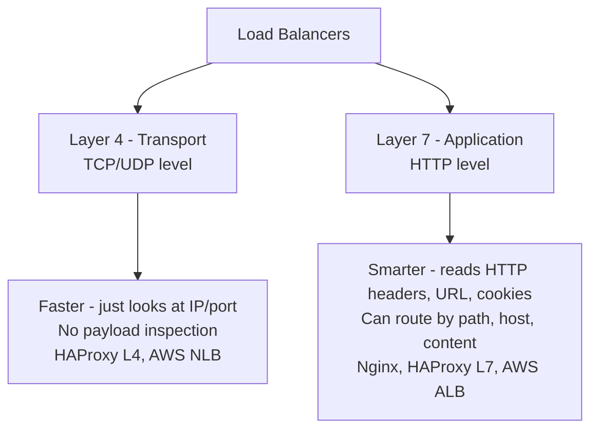

| Type | Layer | Sees | Can Route By | Example |
|---|---|---|---|---|
| **L4 (Transport)** | TCP/UDP | IP, port, protocol | IP hash, round robin | AWS NLB, HAProxy (mode tcp) |
| **L7 (Application)** | HTTP | URL, headers, cookies, body | Path, host, header, cookie | Nginx, AWS ALB, Traefik |

```nginx
# Nginx L7 Load Balancer Example
upstream api_servers {
    least_conn;  # Use least connections algorithm
    server 10.0.1.1:3000 weight=3;  # 3x traffic
    server 10.0.1.2:3000 weight=2;
    server 10.0.1.3:3000 weight=1;
    server 10.0.1.4:3000 backup;    # Only if others are down
}

upstream websocket_servers {
    ip_hash;  # Sticky sessions for WebSocket
    server 10.0.2.1:8080;
    server 10.0.2.2:8080;
}

server {
    listen 443 ssl;
    server_name api.smartfreight.in;

    # Route by path (L7 power!)
    location /api/ {
        proxy_pass http://api_servers;
    }

    location /ws/ {
        proxy_pass http://websocket_servers;
        proxy_http_version 1.1;
        proxy_set_header Upgrade $http_upgrade;
        proxy_set_header Connection "upgrade";
    }

    location /static/ {
        # Serve directly from disk — don't bother app servers
        root /var/www/smartfreight;
        expires 30d;
    }
}
```

### Health Checks

```python
"""
Health checks ensure load balancer only sends traffic to working servers.

Types:
1. Active Health Check — LB pings server every N seconds
   GET /health → 200 OK means healthy
   
2. Passive Health Check — LB monitors actual responses
   5 consecutive 5xx errors → mark unhealthy
"""

# Your NestJS health endpoint should check everything:
# GET /health response:
{
    "status": "healthy",
    "uptime": 86400,
    "checks": {
        "database": "connected",       # Can reach PostgreSQL?
        "redis": "connected",          # Can reach Redis?
        "disk_space": "sufficient",    # > 10% free?
        "memory": "normal"            # < 90% used?
    }
}

# If ANY check fails:
{
    "status": "unhealthy",             # HTTP 503
    "checks": {
        "database": "disconnected",    # ← This is why
        "redis": "connected",
        "disk_space": "sufficient",
        "memory": "normal"
    }
}
```

---

## 6. Auto-Scaling — Horizontal Scaling on Autopilot

> **Automatically add servers during traffic spikes and remove them when traffic drops.**

### How Auto-Scaling Works

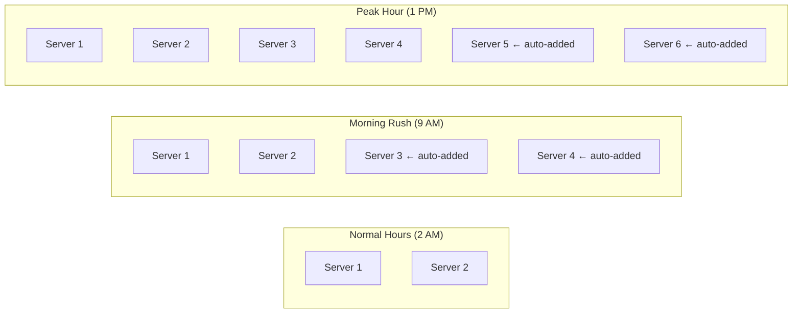

### Auto-Scaling Policies

```python
AUTO_SCALING_CONFIG = {
    "min_instances": 2,          # Always running (even at 3 AM)
    "max_instances": 20,         # Cost safety cap
    "desired_instances": 4,      # Normal state
    
    "scale_up_rules": [
        {
            "metric": "cpu_utilization",
            "threshold": 70,         # When avg CPU > 70%
            "action": "add 2 instances",
            "cooldown": 300,         # Wait 5 min before scaling again
        },
        {
            "metric": "request_count",
            "threshold": 1000,       # When > 1000 req/min per instance
            "action": "add 1 instance",
            "cooldown": 180,
        },
        {
            "metric": "response_time_p99",
            "threshold": 2000,       # When p99 latency > 2 seconds
            "action": "add 2 instances",
            "cooldown": 120,
        }
    ],
    
    "scale_down_rules": [
        {
            "metric": "cpu_utilization",
            "threshold": 30,         # When avg CPU < 30%
            "action": "remove 1 instance",
            "cooldown": 600,         # Wait 10 min (conservative — don't scale down too fast)
        }
    ]
}
```

### Scaling Metrics

| Metric | Scale Up When | Scale Down When | Best For |
|---|---|---|---|
| **CPU %** | > 70% | < 30% | CPU-bound workloads |
| **Memory %** | > 80% | < 40% | Memory-intensive apps |
| **Request Count** | > threshold per server | < 50% of threshold | Web APIs |
| **Queue Depth** | > N messages pending | Queue empty for 10 min | Worker processes |
| **Response Time** | p99 > 2 seconds | p99 < 200ms | User-facing APIs |
| **Custom Metric** | Business-specific | Business-specific | Specialized |

### Auto-Scaling Pitfalls

```python
COMMON_MISTAKES = {
    "Scaling too aggressively": {
        "problem": "Adding 10 servers for a 5-minute spike, then removing all",
        "fix": "Use cooldown periods (5 min up, 10 min down)"
    },
    "Ignoring boot time": {
        "problem": "New server takes 3 minutes to start, by then spike is over",
        "fix": "Pre-warm instances, keep min_instances high enough"
    },
    "Database bottleneck": {
        "problem": "Added 10 app servers but all hitting same DB → DB crashes",
        "fix": "Scale DB too (read replicas, connection pooling)"
    },
    "No max limit": {
        "problem": "DDoS attack → auto-scale to 1000 instances → $50,000 bill",
        "fix": "Always set max_instances and billing alerts"
    },
    "Flapping": {
        "problem": "Scale up → load drops → scale down → load rises → repeat",
        "fix": "Different cooldowns for up (short) and down (long)"
    }
}
```

---

## 7. Database Scaling — The Hardest Part

> **Scaling app servers is easy (stateless, add more). Scaling the database is the REAL challenge.**

### Why Database Scaling is Harder

```
App Server: Stateless → add copies freely
Database:   Stateful → data must be consistent, durable, available

You can't just "add more databases" like you add more app servers.
Every database instance needs the same data (or a well-defined subset).
```

### Database Scaling Strategies

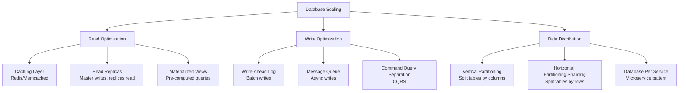

### Strategy 1: Read Replicas

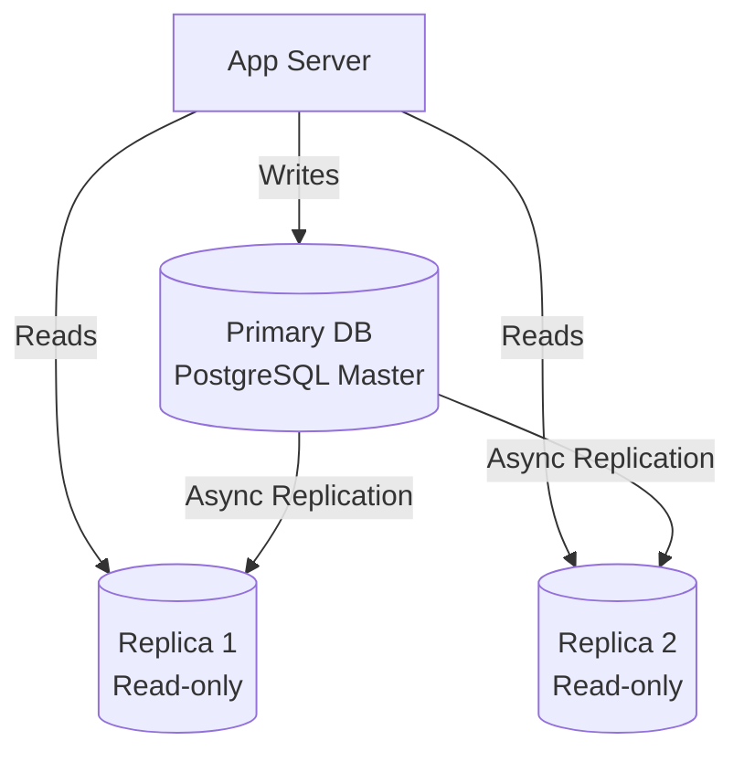

```python
# In Prisma (your stack), this is straightforward:
# schema.prisma
"""
datasource db {
  provider = "postgresql"
  url      = env("DATABASE_URL")         // Primary — for writes
}

// In your service:
// Write operations → primary
await prisma.trip.create({ data: tripData })

// Read operations → replica
// Configure at connection level or use read replica URL
await prisma.trip.findMany({ where: { status: 'active' } })
"""

# Decision: When to use read replicas
"""
Your Smart Freight app:
  - 70% reads (dashboard views, trip lists, reports)
  - 30% writes (new trips, GPS updates, invoices)
  
  Without replicas: Primary handles 1000 queries/sec (overloaded)
  With 2 replicas: Primary handles 300 writes/sec, replicas handle 700 reads/sec each
  
  Rule of thumb: Add read replicas when read:write ratio > 2:1
"""
```

### Strategy 2: Caching (Before You Scale DB, Cache!)

```python
# 80% of DB queries are repetitive — cache them!

"""
Pattern: Cache-Aside (most common)

1. App checks cache → HIT → return cached data
2. App checks cache → MISS → query DB → store in cache → return data
"""

import redis
import json

cache = redis.Redis(host="localhost", port=6379)

async def get_trip(trip_id: str):
    # Step 1: Check cache
    cached = cache.get(f"trip:{trip_id}")
    if cached:
        return json.loads(cached)  # Cache HIT — 0.5ms
    
    # Step 2: Cache MISS — query DB
    trip = await db.query("SELECT * FROM trips WHERE id = $1", trip_id)  # 5-50ms
    
    # Step 3: Store in cache for next time
    cache.setex(
        f"trip:{trip_id}",
        300,  # TTL: 5 minutes
        json.dumps(trip)
    )
    
    return trip

# Cache hit rates in production:
# Good:    > 80% hit rate → DB sees only 20% of traffic
# Great:   > 95% hit rate → DB is barely touched
# Problem: < 50% hit rate → cache isn't helping much
```

### Strategy 3: Sharding (Last Resort)

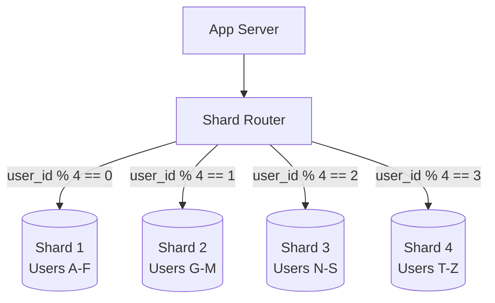

```python
# Sharding: Split data across multiple databases

def get_shard(user_id: int, num_shards: int = 4) -> int:
    """Determine which shard stores this user's data"""
    return user_id % num_shards

# For Smart Freight, a better sharding key might be region:
def get_shard_by_region(state: str) -> str:
    REGION_MAP = {
        "Maharashtra": "shard-west",
        "Gujarat": "shard-west",
        "Karnataka": "shard-south",
        "Tamil Nadu": "shard-south",
        "Delhi": "shard-north",
        "UP": "shard-north",
        "West Bengal": "shard-east",
        "Odisha": "shard-east",
    }
    return REGION_MAP.get(state, "shard-default")

# WARNING: Sharding adds massive complexity
SHARDING_PAIN_POINTS = [
    "Cross-shard queries are expensive (JOINs across shards)",
    "Rebalancing when adding new shards is hard",
    "Some shards get more data (hot spots)",
    "Transaction across shards = distributed transaction (nightmare)",
    "Application must know about sharding logic",
]

# DON'T shard until you absolutely must (usually > 1 TB data or > 50K writes/sec)
```

---

## 8. The Scale Cube — X, Y, Z Scaling

> **A framework for thinking about ALL types of scaling in one model.**

### The Three Axes

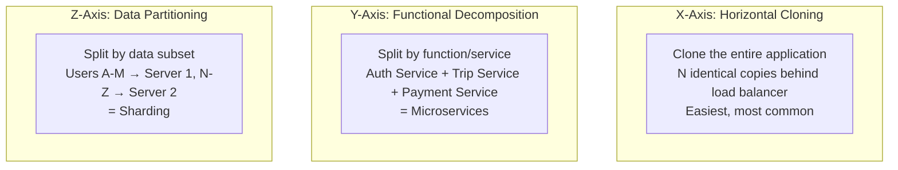

### Applied to Smart Freight

```python
"""
X-Axis (Clone): 
  3 identical NestJS servers behind Nginx
  All handle all endpoints
  Simplest — do this FIRST

Y-Axis (Decompose):
  Auth Service (login, JWT, permissions)
  Trip Service (CRUD trips, matching, tracking)
  Payment Service (invoicing, Razorpay integration)
  Notification Service (SMS, push, email)
  Each can scale independently

Z-Axis (Partition):
  Region-based sharding:
    West India DB (Maharashtra, Gujarat, Rajasthan)
    South India DB (Karnataka, Tamil Nadu, Kerala)
    North India DB (Delhi, UP, Punjab)
  Each region's data is completely independent

Scaling Journey:
  Day 1:     Monolith (no scaling)
  Month 6:   X-axis (3 cloned servers)
  Year 1:    X + caching (Redis)
  Year 2:    Y-axis (split into services)
  Year 3+:   Z-axis (shard DB by region) — only if needed
"""
```

---

## 9. Real-World Architectures — How Companies Scale

### Swiggy/Zomato — Food Delivery Scale

```
Traffic: ~2M orders/day, ~100K concurrent users at peak

Architecture:
├── CDN (Cloudflare) → Static assets, menu images
├── API Gateway → Rate limiting, auth, routing
├── Microservices:
│   ├── User Service → profiles, addresses
│   ├── Restaurant Service → menus, availability
│   ├── Order Service → order lifecycle
│   ├── Payment Service → Razorpay/Paytm integration
│   ├── Delivery Service → driver matching, tracking
│   ├── Search Service → Elasticsearch for restaurant search
│   └── Notification Service → push notifications, SMS
├── Database:
│   ├── PostgreSQL (orders, users) → sharded by city
│   ├── MongoDB (restaurant menus) → document store
│   ├── Redis (sessions, real-time tracking, rate limits)
│   └── Elasticsearch (search, autocomplete)
├── Message Queue: Kafka
│   ├── Order events → payment, notification, analytics
│   └── GPS pings → location aggregation
└── Auto-scaling: 50-200 app instances based on time of day
```

### Uber — Ride-Sharing Scale

```
Traffic: ~20M rides/day, 5M drivers, global

Key Scaling Decision:
├── GEOSPATIAL problem → location-based sharding
├── Real-time matching → in-memory (not DB) with Redis/custom
├── Event-driven → Kafka for trip lifecycle events
├── Separate read/write paths → CQRS
├── City-level isolation → each city can operate independently

GPS Scale:
  5M drivers × 1 ping/4 seconds = 1.25M location updates/second
  → Cannot use traditional DB
  → Custom in-memory geospatial index
  → Kafka ingestion → async persistence
```

---

## 10. Common Mistakes & Anti-Patterns

### ❌ BAD: Premature horizontal scaling

```python
# Day 1: 50 users, already deploying Kubernetes cluster
# with 10 microservices, Kafka, and 3 database shards

# Result:
# - 3 months of DevOps work instead of building features
# - $2,000/month infra bill for 50 users
# - Team debugging Kubernetes instead of talking to customers
```

### ✅ GOOD: Scale when you need it

```python
# Day 1: Single server, single DB, deploy with git push
# Focus: Build features, get users, find product-market fit
# Scale ONLY when metrics show you need to (CPU > 70%, response > 2s)

# Instagram had 1 server handling 25K users at launch.
# Stack Overflow serves 1.3 BILLION pageviews/month with ~9 web servers.
```

---

### ❌ BAD: Scaling app servers but not the database

```python
# 10 app servers all hitting 1 database
# Database connection limit: 100
# 10 servers × 20 connections each = 200 → DB REJECTS CONNECTIONS

# Server scales: ✅ 
# Database becomes bottleneck: ❌
```

### ✅ GOOD: Scale database alongside app servers

```python
# Step 1: Connection pooling (PgBouncer / Prisma built-in)
# Step 2: Redis cache (80% hit rate → DB sees 20% traffic)
# Step 3: Read replicas (offload reads)
# Step 4: Vertical scale DB (more RAM for indexes)
# Step 5: Sharding (only if needed)
```

---

### ❌ BAD: Sticky sessions as a scaling strategy

```python
# "Let's use IP hash so each user always goes to the same server"
# Problems:
# - Server dies → all its users lose their sessions
# - One server gets all heavy users → uneven load
# - Can't auto-scale effectively
```

### ✅ GOOD: Stateless servers + shared state

```python
# Store sessions in Redis → any server handles any request
# Use JWT → no session store needed at all
# Store files in S3 → any server can access uploads
# Centralize config → environment variables, same everywhere
```

---

### ❌ BAD: No auto-scaling limits

```python
# Auto-scale policy: "Add server when CPU > 70%"
# DDoS attack: 1M malicious requests/second
# Auto-scaler: Launches 500 instances
# AWS bill: $50,000 in one day

# Rate limiting BEFORE auto-scaling prevents this.
```

### ✅ GOOD: Set guardrails

```python
AUTO_SCALING = {
    "max_instances": 20,           # Hard cap
    "billing_alert": "$500/day",   # Alert if bill exceeds
    "rate_limiter": "100 req/sec per IP",  # Before reaching servers
    "WAF_enabled": True,           # Block suspicious traffic
}
```

---

## 11. Quick Reference: Mistakes Table

| Mistake | Problem | Fix |
|---|---|---|
| Premature scaling | Wasted time/money, no users yet | Scale only when metrics demand it |
| Only scaling app servers | DB becomes bottleneck | Cache + read replicas + connection pooling |
| Sticky sessions | SPOF, uneven load | Stateless servers + Redis/JWT |
| No auto-scaling limits | DDoS = $50K bill | Set max instances + rate limiter |
| Skipping caching | Every request hits DB | Add Redis, cache hot data (80/20 rule) |
| Sharding too early | Massive complexity for no benefit | Exhaust vertical + replicas first |
| Ignoring connection pooling | DB connection exhaustion | PgBouncer / built-in pool (Prisma) |
| Same scaling for reads/writes | Over-provisioning | Separate read path (replicas) from write path |

---

## 12. Decision Framework — When to Scale What

```python
def scaling_decision(problem: str) -> str:
    decisions = {
        "CPU > 70% on app server": 
            "Horizontal: Add more app servers behind LB",
        
        "RAM full on app server": 
            "Vertical: Increase RAM, or check for memory leaks first",
        
        "DB queries > 2 seconds": 
            "1. Add indexes. 2. Cache hot queries (Redis). 3. Read replicas. 4. Vertical scale DB",
        
        "DB connections exhausted": 
            "Connection pooling (PgBouncer). If still not enough, add read replicas",
        
        "Too many writes overloading DB": 
            "Message queue (batch writes). If still not enough, sharding",
        
        "Users in other countries have high latency": 
            "CDN for static. Multi-region deploy for API",
        
        "Deployment causes downtime": 
            "Horizontal scaling + rolling deployment",
        
        "Single server failure = full outage": 
            "Horizontal scaling + load balancer + health checks",
        
        "Traffic spiky (peak 10x average)": 
            "Auto-scaling with cooldown periods",
        
        "Team can't deploy independently": 
            "Y-axis scaling (microservices)",
    }
    return decisions.get(problem, "Profile first, then decide")
```

---

## 13. Back-of-the-Envelope: Capacity Planning

### Quick Math Framework

```python
# Given: 1M daily active users (DAU)

# Step 1: Requests per second
requests_per_day = 1_000_000 * 10  # 10 requests per user per day
avg_rps = requests_per_day / 86400  # ≈ 116 requests/second
peak_rps = avg_rps * 3             # ≈ 348 requests/second (peak = 3x average)

# Step 2: Server count
rps_per_server = 1000  # Conservative estimate for NestJS
servers_needed = peak_rps / rps_per_server  # ≈ 1 server (but use 2 for redundancy)

# Step 3: Database sizing
# 1M users × 1 KB per user = 1 GB
# 10M trips × 0.5 KB per trip = 5 GB
# Total: ~6 GB (easily fits in single PostgreSQL)

# Step 4: Cache sizing
# Cache top 20% of data (80/20 rule)
# 20% of 6 GB = 1.2 GB in Redis (tiny!)

# Step 5: Bandwidth
# Average API response: 2 KB
# 348 rps × 2 KB = 696 KB/sec = 5.6 Mbps (negligible)

print(f"""
Capacity Plan for 1M DAU:
  App Servers: 2 (min for redundancy)
  Database: 1 PostgreSQL (8 CPU, 32 GB RAM)
  Cache: 1 Redis (2 GB)
  Estimated Cost: ~₹20,000/month
""")
```

### Scaling Milestones

| DAU | App Servers | Database | Cache | Estimated Cost |
|---|---|---|---|---|
| 1K | 1 | 1 PostgreSQL (basic) | Optional | ₹2,000/mo |
| 10K | 1-2 | 1 PostgreSQL (medium) | 1 Redis | ₹8,000/mo |
| 100K | 3-5 | 1 Primary + 2 Replicas | Redis Cluster | ₹40,000/mo |
| 1M | 5-10 + auto-scale | Primary + 3 Replicas + PgBouncer | Redis Cluster | ₹2,00,000/mo |
| 10M | 20-50 + auto-scale | Sharded + Replicas | Redis Cluster (multi-node) | ₹15,00,000/mo |

---

## 14. Quick Cheat Sheet

| Concept | One-liner | Key Takeaway |
|---|---|---|
| Vertical Scaling | Bigger machine | Simple but has a ceiling |
| Horizontal Scaling | More machines | No ceiling but complex |
| Load Balancer | Traffic distribution | Enables horizontal scaling |
| Round Robin | Cycle through servers equally | Simplest LB algorithm |
| Least Connections | Route to least busy server | Best for varied request sizes |
| Stateless Server | No session on server | Required for horizontal scaling |
| Auto-Scaling | Add/remove servers dynamically | Handles traffic spikes cost-effectively |
| Read Replicas | Copy DB for read traffic | First step in DB scaling |
| Caching | Store hot data in memory | Reduces DB load by 80%+ |
| Sharding | Split data across DBs | Last resort, maximum complexity |
| Connection Pooling | Reuse DB connections | Prevents connection exhaustion |
| Scale Cube | X (clone), Y (split), Z (partition) | Framework for scaling decisions |
