# Load Balancing — Distributing Traffic Across Servers

A load balancer is the traffic cop that sits between clients and servers, distributing incoming requests so no single server gets overwhelmed. Without it, horizontal scaling is impossible. Every system design interview expects you to place one and explain how it works.

---

- **Load Balancer (LB):** A device/service that distributes incoming network traffic across multiple backend servers to ensure no single server is overloaded.
- **Upstream / Backend:** The pool of servers that receive traffic from the load balancer.
- **Health Check:** Periodic probes sent by the LB to servers to verify they're alive and able to serve requests.
- **Failover:** Automatically redirecting traffic away from a failed server to healthy ones.
- **Session Affinity / Sticky Sessions:** Routing all requests from a specific client to the same backend server.
- **Layer 4 (L4) Load Balancing:** Operates at Transport layer (TCP/UDP); routes based on IP address and port without inspecting payload.
- **Layer 7 (L7) Load Balancing:** Operates at Application layer (HTTP); routes based on URL, headers, cookies, or body content.
- **Reverse Proxy:** A server that sits in front of backend servers and forwards client requests to them (load balancers ARE reverse proxies).
- **Forward Proxy:** A server that sits in front of clients and forwards their requests to the internet (VPN, corporate proxy).
- **High Availability (HA):** System design goal where the system remains operational even when components fail (99.9%+ uptime).
- **Active-Passive (Failover):** One LB handles traffic; the standby takes over if the active fails.
- **Active-Active:** Multiple LBs handle traffic simultaneously; if one fails, others absorb the load.
- **Connection Draining:** Allowing existing connections to complete before removing a server from the pool (graceful shutdown).
- **Blue-Green Deployment:** Running two identical environments; LB switches traffic from blue (old) to green (new) for zero-downtime deploys.
- **Canary Deployment:** Routing a small percentage (1-5%) of traffic to the new version to test before full rollout.
- **Global Server Load Balancing (GSLB):** DNS-based load balancing that routes users to the nearest geographic data center.

---

## 1. Why Load Balancing Matters

> **Without a load balancer, you have a single server = single point of failure = one crash and your app is dead.**

### Before vs After Load Balancer

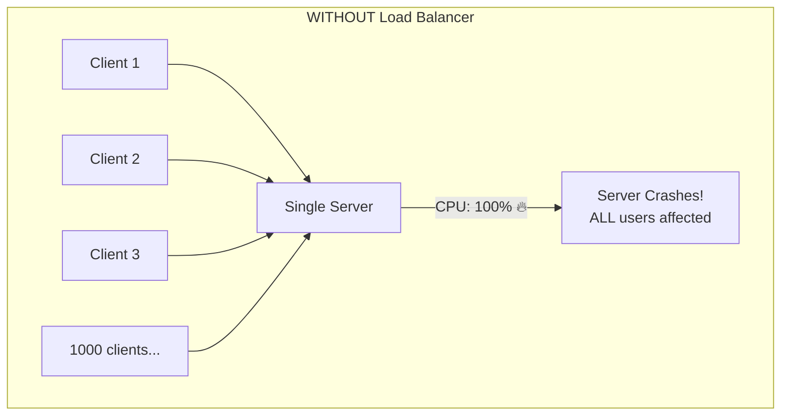

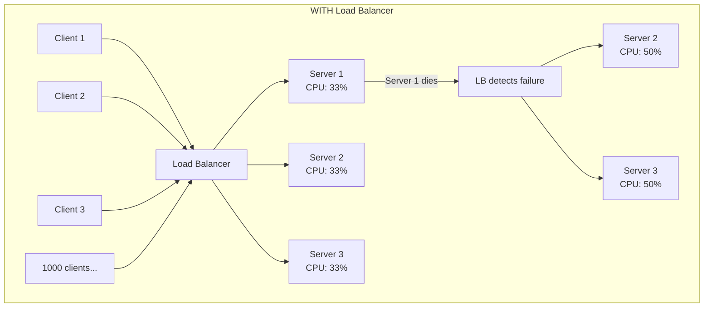

### What a Load Balancer Does

| Function | Without LB | With LB |
|---|---|---|
| **Traffic distribution** | All requests hit one server | Spread across multiple servers |
| **Fault tolerance** | Server dies = full outage | Server dies = others absorb load |
| **Scaling** | Can't add more servers | Add/remove servers transparently |
| **Zero-downtime deploy** | Restart = downtime | Rolling restart one server at a time |
| **SSL termination** | Each server handles TLS | LB handles TLS, servers get plain HTTP |
| **DDoS mitigation** | Server directly exposed | LB absorbs/filters bad traffic |
| **Monitoring** | No central visibility | LB logs all traffic, latency, errors |

---

## 2. Layer 4 vs Layer 7 — The Two Types

> **L4 is fast and dumb. L7 is smart and slightly slower. Most production systems use L7.**

### Layer 4 Load Balancer (Transport Layer)

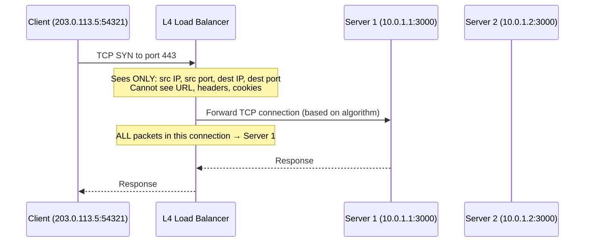

**What L4 Sees:**
```
Source IP:   203.0.113.5
Source Port: 54321
Dest IP:     13.234.100.50
Dest Port:   443
Protocol:    TCP

That's it. No URL, no headers, no cookies. Just route the raw TCP connection.
```

### Layer 7 Load Balancer (Application Layer)

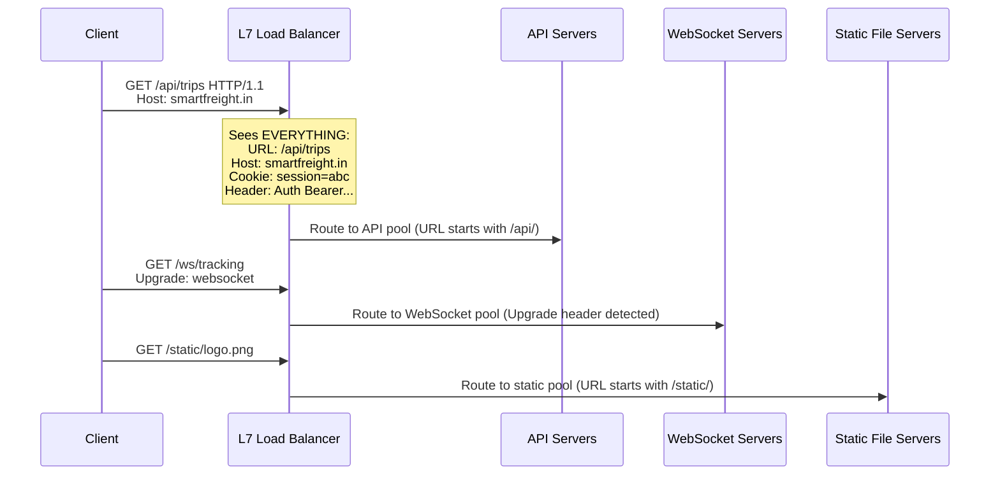

**What L7 Sees:**
```
HTTP Method:     POST
URL Path:        /api/v1/trips
Host Header:     api.smartfreight.in
Content-Type:    application/json
Authorization:   Bearer eyJhbG...
Cookie:          session_id=abc123
User-Agent:      SmartFreight-iOS/2.1.0
Request Body:    {"origin": "Pune", "destination": "Mumbai"}

Can make intelligent routing decisions based on ALL of this.
```

### Complete Comparison

| Feature | Layer 4 (Transport) | Layer 7 (Application) |
|---|---|---|
| **Operates at** | TCP/UDP level | HTTP/HTTPS level |
| **Sees** | IP addresses, ports only | Full HTTP request (URL, headers, body) |
| **Speed** | Faster (no payload inspection) | Slightly slower (parses HTTP) |
| **CPU usage** | Low | Higher |
| **Routing decisions** | IP hash, round robin | URL path, host, header, cookie |
| **SSL termination** | Pass-through or terminate | Typically terminates |
| **Content-based routing** | ❌ Cannot | ✅ Route /api/ vs /static/ vs /ws/ |
| **WebSocket support** | Pass-through | Full support (upgrade detection) |
| **Request modification** | ❌ Cannot | ✅ Add/modify headers |
| **Caching** | ❌ Cannot | ✅ Can cache HTTP responses |
| **WAF integration** | ❌ Limited | ✅ Full request inspection |
| **Use case** | TCP-level services, extreme throughput | Web apps, APIs (90% of use cases) |
| **Examples** | AWS NLB, HAProxy (mode tcp) | Nginx, AWS ALB, HAProxy (mode http), Traefik |

### When to Use Which?

```python
# L4: When you need raw performance and don't need content routing
USE_L4 = [
    "Database load balancing (PostgreSQL, MySQL)",
    "Game servers (raw TCP/UDP)",
    "Non-HTTP protocols (MQTT, custom TCP)",
    "Extreme throughput (millions of connections)",
    "Simple round-robin is sufficient",
]

# L7: When you need intelligent routing (THIS IS YOUR DEFAULT)
USE_L7 = [
    "Web applications and REST APIs",
    "Microservices routing (/auth → auth service, /trips → trip service)",
    "A/B testing (route 5% of users to new version)",
    "SSL termination (offload TLS from app servers)",
    "WebSocket + HTTP on same domain",
    "Canary deployments",
    "Rate limiting by URL or user",
    "Request/response modification (add headers, compress)",
]
```

---

## 3. Load Balancing Algorithms — Deep Dive

> **The algorithm decides WHICH server gets the next request. Choose wrong and you get uneven load or lost sessions.**

### Algorithm 1: Round Robin

```python
"""
Simplest possible algorithm: cycle through servers 1→2→3→1→2→3

Best for: Stateless servers with equal capacity
Problem: Ignores server load — busy server gets same traffic as idle one
"""

class RoundRobinLB:
    def __init__(self, servers: list[str]):
        self.servers = servers
        self.index = 0
    
    def next_server(self) -> str:
        server = self.servers[self.index % len(self.servers)]
        self.index += 1
        return server

lb = RoundRobinLB(["server-1", "server-2", "server-3"])

# Request 1 → server-1
# Request 2 → server-2
# Request 3 → server-3
# Request 4 → server-1 (cycle repeats)
# Request 5 → server-2
```

```
Distribution: Perfectly equal (33% each for 3 servers)
Pros: Dead simple, zero overhead
Cons: Doesn't account for:
  - Server 1 processing a heavy report (slow)
  - Server 2 just started (cold cache)
  - Server 3 has more RAM (can handle more)
```

### Algorithm 2: Weighted Round Robin

```python
"""
Like round robin, but some servers get MORE traffic based on their capacity.
Server with 8 CPU gets 4x traffic of server with 2 CPU.
"""

class WeightedRoundRobinLB:
    def __init__(self, servers: dict):
        # {"server-1": 5, "server-2": 3, "server-3": 1}
        # server-1 gets 5/9 (55%) of traffic
        self.pool = []
        for server, weight in servers.items():
            self.pool.extend([server] * weight)
        self.index = 0
    
    def next_server(self) -> str:
        server = self.pool[self.index % len(self.pool)]
        self.index += 1
        return server

lb = WeightedRoundRobinLB({
    "big-server": 5,    # 16 CPU — gets 55% traffic
    "medium-server": 3, # 8 CPU  — gets 33% traffic
    "small-server": 1,  # 2 CPU  — gets 11% traffic
})
```

### Algorithm 3: Least Connections

```python
"""
Route to the server handling the FEWEST active connections right now.
Best for: Requests with varying processing time (some fast, some slow).
"""

class LeastConnectionsLB:
    def __init__(self, servers: list[str]):
        self.active_connections = {s: 0 for s in servers}
    
    def next_server(self) -> str:
        # Pick server with minimum active connections
        server = min(self.active_connections, key=self.active_connections.get)
        self.active_connections[server] += 1
        return server
    
    def release(self, server: str):
        self.active_connections[server] -= 1

# Scenario:
# Server 1: 15 active connections (processing heavy queries)
# Server 2: 3 active connections (fast responses)
# Server 3: 8 active connections (normal)
# → Next request goes to Server 2 (least connections)
```

### Algorithm 4: Least Response Time

```python
"""
Route to the server with the FASTEST average response time + fewest connections.
Combines latency awareness with connection count.
"""

class LeastResponseTimeLB:
    def __init__(self, servers: list[str]):
        self.response_times = {s: 0.0 for s in servers}
        self.active_connections = {s: 0 for s in servers}
    
    def next_server(self) -> str:
        # Score = active_connections × avg_response_time
        scores = {
            s: self.active_connections[s] * self.response_times[s]
            for s in self.response_times
        }
        return min(scores, key=scores.get)
    
    def record_response(self, server: str, response_time: float):
        # Exponential moving average
        alpha = 0.3
        self.response_times[server] = (
            alpha * response_time + (1 - alpha) * self.response_times[server]
        )
```

### Algorithm 5: IP Hash

```python
"""
Hash the client's IP address to determine the server.
Same client ALWAYS goes to same server (sticky sessions).
"""

class IPHashLB:
    def __init__(self, servers: list[str]):
        self.servers = sorted(servers)
    
    def next_server(self, client_ip: str) -> str:
        index = hash(client_ip) % len(self.servers)
        return self.servers[index]

lb = IPHashLB(["server-1", "server-2", "server-3"])
lb.next_server("203.0.113.50")   # Always → server-2
lb.next_server("203.0.113.50")   # Always → server-2 (same client)
lb.next_server("198.51.100.10")  # Always → server-1 (different client)

# Problem: Adding/removing servers reshuffles ALL mappings
# Solution: Consistent Hashing (Topic 14)
```

### Algorithm 6: Consistent Hashing

```python
"""
Uses a hash ring to minimize redistribution when servers are added/removed.
Only 1/N keys are remapped when a server is added (vs ALL keys with IP hash).
Detailed coverage in Topic 14.
"""

import hashlib
import bisect

class ConsistentHashLB:
    def __init__(self, servers: list[str], virtual_nodes: int = 150):
        self.ring = []  # Sorted list of (hash, server) pairs
        self.hash_to_server = {}
        
        for server in servers:
            for i in range(virtual_nodes):
                key = f"{server}:vn{i}"
                h = self._hash(key)
                self.ring.append(h)
                self.hash_to_server[h] = server
        
        self.ring.sort()
    
    def _hash(self, key: str) -> int:
        return int(hashlib.md5(key.encode()).hexdigest(), 16)
    
    def get_server(self, request_key: str) -> str:
        h = self._hash(request_key)
        idx = bisect.bisect_right(self.ring, h)
        if idx == len(self.ring):
            idx = 0
        return self.hash_to_server[self.ring[idx]]

# Adding a new server only moves ~1/N of the keys
# Used by: Memcached, Cassandra, DynamoDB, CDNs
```

### Algorithm 7: Random

```python
"""
Pick a random server. Surprisingly effective for large pools.
With enough requests, distribution approaches uniform.
"""

import random

class RandomLB:
    def __init__(self, servers: list[str]):
        self.servers = servers
    
    def next_server(self) -> str:
        return random.choice(self.servers)

# Power of Two Random Choices:
# Pick 2 random servers, route to the one with fewer connections
# Nearly as good as Least Connections with much less overhead!

class PowerOfTwoLB:
    def __init__(self, servers: list[str]):
        self.servers = servers
        self.connections = {s: 0 for s in servers}
    
    def next_server(self) -> str:
        s1, s2 = random.sample(self.servers, 2)
        return s1 if self.connections[s1] <= self.connections[s2] else s2
```

### Algorithm Comparison Table

| Algorithm | Complexity | Even Load | Session Affinity | Best For |
|---|---|---|---|---|
| **Round Robin** | O(1) | ✅ Equal distribution | ❌ No | Equal servers, stateless |
| **Weighted RR** | O(1) | ✅ Proportional | ❌ No | Mixed server capacities |
| **Least Connections** | O(N) | ✅ Adaptive | ❌ No | Variable request duration |
| **Least Response Time** | O(N) | ✅ Quality-aware | ❌ No | User-facing APIs |
| **IP Hash** | O(1) | ⚠️ Depends on IP distribution | ✅ Yes | Simple sticky sessions |
| **Consistent Hashing** | O(log N) | ✅ Even with ring | ✅ Yes | Caches, stateful services |
| **Random** | O(1) | ✅ With enough traffic | ❌ No | Simple, no state needed |
| **Power of Two** | O(1) | ✅ Near-optimal | ❌ No | Large server pools |

### Which Algorithm to Choose?

```python
def choose_algorithm(scenario: str) -> str:
    decisions = {
        "All servers identical, stateless API":
            "Round Robin — simplest, works great",
        
        "Servers have different CPU/RAM":
            "Weighted Round Robin — proportional to capacity",
        
        "Some requests take 10ms, others take 10s":
            "Least Connections — adapts to actual load",
        
        "Need sticky sessions (legacy app)":
            "IP Hash — same client always same server",
        
        "Cache servers (memcached, Redis cluster)":
            "Consistent Hashing — minimize cache misses on scale",
        
        "User-facing API, latency matters":
            "Least Response Time — routes to fastest server",
        
        "Huge cluster (100+ servers)":
            "Power of Two Random — near-optimal with minimal overhead",
    }
    return decisions.get(scenario, "Start with Round Robin, optimize later")
```

---

## 4. Health Checks — Keeping Unhealthy Servers Out

> **A load balancer is useless if it sends traffic to dead servers. Health checks are how it knows who's alive.**

### Types of Health Checks

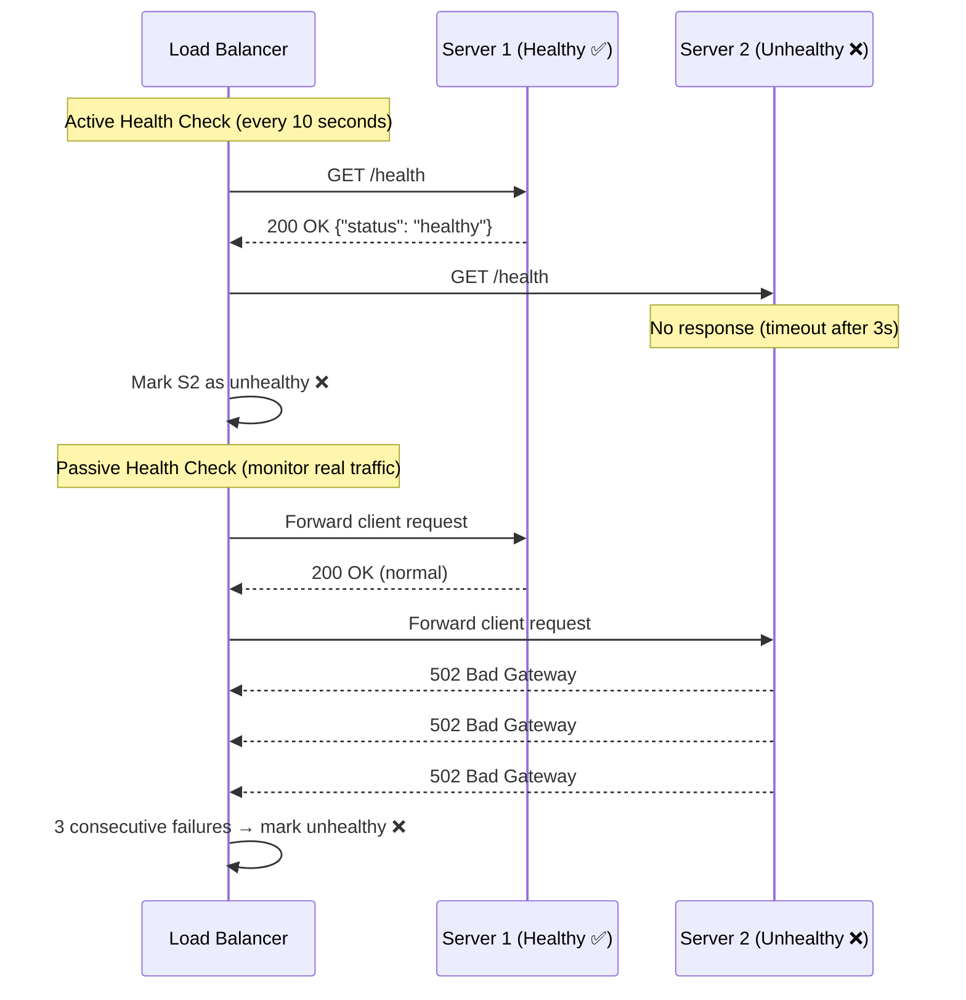

| Type | How It Works | Pros | Cons |
|---|---|---|---|
| **Active** | LB pings `/health` every N seconds | Catches failures before users see them | Adds load (N pings × M servers) |
| **Passive** | LB monitors real request outcomes | Zero overhead | Users see failures first |
| **Hybrid** | Both active + passive together | Best coverage | Most complex |

### Designing a Good Health Endpoint

```python
# ❌ BAD: Trivial health check
@app.get("/health")
async def health():
    return {"status": "ok"}  # Always returns OK — even if DB is down!

# ✅ GOOD: Deep health check
@app.get("/health")
async def health():
    checks = {}
    overall = "healthy"
    
    # Check database connectivity
    try:
        await db.execute("SELECT 1")
        checks["database"] = "connected"
    except Exception:
        checks["database"] = "disconnected"
        overall = "unhealthy"
    
    # Check Redis connectivity
    try:
        await redis.ping()
        checks["redis"] = "connected"
    except Exception:
        checks["redis"] = "disconnected"
        overall = "unhealthy"
    
    # Check disk space
    import shutil
    total, used, free = shutil.disk_usage("/")
    disk_pct = (used / total) * 100
    if disk_pct > 90:
        checks["disk"] = f"critical ({disk_pct:.0f}% used)"
        overall = "unhealthy"
    else:
        checks["disk"] = f"ok ({disk_pct:.0f}% used)"
    
    # Check memory
    import psutil
    mem = psutil.virtual_memory()
    if mem.percent > 90:
        checks["memory"] = f"critical ({mem.percent}%)"
        overall = "unhealthy"
    else:
        checks["memory"] = f"ok ({mem.percent}%)"
    
    status_code = 200 if overall == "healthy" else 503
    return JSONResponse(
        status_code=status_code,
        content={
            "status": overall,
            "checks": checks,
            "uptime_seconds": get_uptime(),
            "version": "2.1.0",
        }
    )

# Response when healthy (200):
{
    "status": "healthy",
    "checks": {
        "database": "connected",
        "redis": "connected",
        "disk": "ok (45% used)",
        "memory": "ok (62%)"
    },
    "uptime_seconds": 86400,
    "version": "2.1.0"
}

# Response when unhealthy (503):
{
    "status": "unhealthy",
    "checks": {
        "database": "disconnected",  # ← Problem!
        "redis": "connected",
        "disk": "ok (45% used)",
        "memory": "ok (62%)"
    }
}
```

### Health Check Configuration

```python
HEALTH_CHECK_CONFIG = {
    "interval": 10,          # Check every 10 seconds
    "timeout": 3,            # Fail if no response in 3 seconds
    "unhealthy_threshold": 3, # 3 consecutive failures → mark unhealthy
    "healthy_threshold": 2,   # 2 consecutive successes → mark healthy again
    "path": "/health",        # Endpoint to probe
    "expected_status": 200,   # Expected HTTP status code
}

# Timeline of a failure:
"""
t=0s:  Health check → 200 OK ✅
t=10s: Health check → 200 OK ✅
t=20s: Health check → timeout ❌ (1/3)
t=30s: Health check → timeout ❌ (2/3)
t=40s: Health check → timeout ❌ (3/3) → MARKED UNHEALTHY
       → Load balancer stops sending traffic to this server
       
t=50s: Server recovers, health check → 200 OK ✅ (1/2)
t=60s: Health check → 200 OK ✅ (2/2) → MARKED HEALTHY
       → Load balancer resumes sending traffic
"""
```

### Liveness vs Readiness Probes

```python
# Kubernetes-style health checks (important for container orchestration)

# Liveness Probe: "Is the process alive?"
# If fails → Kubernetes RESTARTS the container
@app.get("/healthz")
async def liveness():
    # Just check if the app is running and not deadlocked
    return {"status": "alive"}

# Readiness Probe: "Can this server handle requests?"
# If fails → Kubernetes STOPS sending traffic (but doesn't restart)
@app.get("/readyz")
async def readiness():
    # Check all dependencies
    if not await db.is_connected():
        return JSONResponse(status_code=503, content={"status": "not ready"})
    if not await redis.is_connected():
        return JSONResponse(status_code=503, content={"status": "not ready"})
    return {"status": "ready"}

# Why two probes?
# Scenario: App is alive but DB is temporarily down
# Liveness: ✅ (don't restart — app is fine)
# Readiness: ❌ (stop sending traffic until DB reconnects)
```

---

## 5. SSL/TLS Termination

> **The load balancer handles the expensive TLS encryption/decryption so your app servers don't have to.**

### How SSL Termination Works

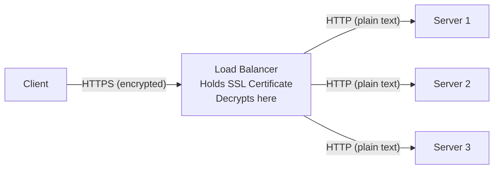

### Termination Strategies

| Strategy | How It Works | Pros | Cons |
|---|---|---|---|
| **SSL Termination** | LB decrypts → sends plain HTTP to servers | Simple, offloads CPU | Traffic LB↔Server is unencrypted |
| **SSL Passthrough** | LB forwards encrypted traffic directly | End-to-end encryption | LB can't inspect/route by content (L4 only) |
| **SSL Re-encryption** | LB decrypts → re-encrypts → sends HTTPS to servers | End-to-end encryption + L7 routing | Double encryption CPU cost |

```nginx
# Nginx SSL Termination Configuration
server {
    listen 443 ssl;
    server_name api.smartfreight.in;

    # SSL Certificate (from Let's Encrypt or AWS ACM)
    ssl_certificate     /etc/ssl/certs/smartfreight.crt;
    ssl_certificate_key /etc/ssl/private/smartfreight.key;
    
    # Modern TLS settings
    ssl_protocols TLSv1.2 TLSv1.3;
    ssl_ciphers ECDHE-ECDSA-AES128-GCM-SHA256:ECDHE-RSA-AES128-GCM-SHA256;
    ssl_prefer_server_ciphers on;
    
    # HSTS — tell browsers to always use HTTPS
    add_header Strict-Transport-Security "max-age=31536000" always;
    
    # Forward decrypted traffic to backend (plain HTTP)
    location / {
        proxy_pass http://backend_servers;
        proxy_set_header X-Forwarded-For $remote_addr;
        proxy_set_header X-Forwarded-Proto $scheme;  # Server knows original was HTTPS
    }
}
```

```python
# Why X-Forwarded-Proto matters:
# Your NestJS app receives plain HTTP from LB
# But it needs to know the client used HTTPS (for redirect URLs, cookies)

# Request from client:
#   Client → HTTPS → Load Balancer → HTTP → App Server
#                                            ↑
#                                    X-Forwarded-Proto: https
#                                    X-Forwarded-For: 203.0.113.50 (real client IP)
```

---

## 6. Nginx Configuration — Production Setup

> **Nginx is the most popular L7 load balancer. Here's a production-ready config for Smart Freight.**

### Complete Nginx Load Balancer Config

```nginx
# /etc/nginx/nginx.conf

# Worker processes = number of CPU cores
worker_processes auto;

# Max open files per worker
worker_rlimit_nofile 65535;

events {
    worker_connections 10240;  # Max simultaneous connections per worker
    use epoll;                 # Linux high-performance event model
}

http {
    # Basic settings
    sendfile on;
    tcp_nopush on;
    tcp_nodelay on;
    keepalive_timeout 65;
    
    # Logging
    log_format main '$remote_addr - $remote_user [$time_local] '
                    '"$request" $status $body_bytes_sent '
                    '"$http_referer" "$http_user_agent" '
                    'rt=$request_time uct=$upstream_connect_time '
                    'uht=$upstream_header_time urt=$upstream_response_time';
    
    access_log /var/log/nginx/access.log main;
    error_log /var/log/nginx/error.log warn;
    
    # Gzip compression (save bandwidth)
    gzip on;
    gzip_types text/plain application/json application/javascript text/css;
    gzip_min_length 1000;
    
    # Rate limiting
    limit_req_zone $binary_remote_addr zone=api_limit:10m rate=100r/s;
    limit_req_zone $binary_remote_addr zone=auth_limit:10m rate=10r/s;
    
    # ─── UPSTREAM: API Servers ───
    upstream api_backend {
        least_conn;  # Route to server with fewest connections
        
        server 10.0.1.1:3000 weight=3 max_fails=3 fail_timeout=30s;
        server 10.0.1.2:3000 weight=3 max_fails=3 fail_timeout=30s;
        server 10.0.1.3:3000 weight=2 max_fails=3 fail_timeout=30s;
        server 10.0.1.4:3000 backup;  # Only used if all others are down
        
        # Keep-alive connections to backend (reduces TCP handshakes)
        keepalive 32;
    }
    
    # ─── UPSTREAM: WebSocket Servers ───
    upstream ws_backend {
        ip_hash;  # Sticky sessions for WebSocket (same client → same server)
        
        server 10.0.2.1:8080 max_fails=2 fail_timeout=10s;
        server 10.0.2.2:8080 max_fails=2 fail_timeout=10s;
    }
    
    # ─── HTTP → HTTPS Redirect ───
    server {
        listen 80;
        server_name api.smartfreight.in;
        return 301 https://$host$request_uri;
    }
    
    # ─── HTTPS Server Block ───
    server {
        listen 443 ssl http2;
        server_name api.smartfreight.in;
        
        # SSL
        ssl_certificate     /etc/ssl/certs/smartfreight.crt;
        ssl_certificate_key /etc/ssl/private/smartfreight.key;
        ssl_protocols TLSv1.2 TLSv1.3;
        
        # Security headers
        add_header X-Frame-Options DENY always;
        add_header X-Content-Type-Options nosniff always;
        add_header X-XSS-Protection "1; mode=block" always;
        add_header Strict-Transport-Security "max-age=31536000" always;
        
        # ─── API Routes ───
        location /api/ {
            limit_req zone=api_limit burst=20 nodelay;
            
            proxy_pass http://api_backend;
            proxy_http_version 1.1;
            proxy_set_header Host $host;
            proxy_set_header X-Real-IP $remote_addr;
            proxy_set_header X-Forwarded-For $proxy_add_x_forwarded_for;
            proxy_set_header X-Forwarded-Proto $scheme;
            proxy_set_header Connection "";  # Enable keep-alive to backend
            
            # Timeouts
            proxy_connect_timeout 5s;
            proxy_send_timeout 30s;
            proxy_read_timeout 30s;
            
            # Retry failed requests on next server
            proxy_next_upstream error timeout http_502 http_503;
            proxy_next_upstream_tries 2;
        }
        
        # ─── Auth Routes (stricter rate limit) ───
        location /api/auth/ {
            limit_req zone=auth_limit burst=5 nodelay;
            
            proxy_pass http://api_backend;
            proxy_http_version 1.1;
            proxy_set_header Host $host;
            proxy_set_header X-Real-IP $remote_addr;
            proxy_set_header X-Forwarded-For $proxy_add_x_forwarded_for;
        }
        
        # ─── WebSocket Routes ───
        location /ws/ {
            proxy_pass http://ws_backend;
            proxy_http_version 1.1;
            proxy_set_header Upgrade $http_upgrade;
            proxy_set_header Connection "upgrade";
            proxy_set_header Host $host;
            proxy_set_header X-Real-IP $remote_addr;
            
            # WebSocket timeout (keep connection alive)
            proxy_read_timeout 3600s;
            proxy_send_timeout 3600s;
        }
        
        # ─── Static Files (serve directly, no backend needed) ───
        location /static/ {
            root /var/www/smartfreight;
            expires 30d;
            add_header Cache-Control "public, immutable";
        }
        
        # ─── Health Check Endpoint ───
        location /health {
            proxy_pass http://api_backend;
            access_log off;  # Don't log health checks
        }
    }
}
```

### Key Nginx Directives Explained

| Directive | What It Does | Production Value |
|---|---|---|
| `worker_processes auto` | One worker per CPU core | Matches server CPU count |
| `worker_connections 10240` | Max connections per worker | 10K (adjust based on RAM) |
| `least_conn` | LB algorithm | Best for variable request times |
| `max_fails=3 fail_timeout=30s` | Health check | 3 failures → remove for 30s |
| `keepalive 32` | Persistent connections to backend | Reduces TCP overhead |
| `proxy_next_upstream` | Retry on failed backend | Auto-retry on 502/503 |
| `limit_req zone=... rate=100r/s` | Rate limiting | 100 requests/sec per client IP |
| `gzip on` | Compress responses | 60-80% bandwidth savings |
| `expires 30d` | Cache static files | Browser caches for 30 days |
| `proxy_read_timeout 3600s` | WebSocket keep-alive | 1 hour timeout for WS |

---

## 7. Load Balancer High Availability — LB is Also a SPOF!

> **If the load balancer itself dies, ALL traffic stops. You need redundant load balancers.**

### Active-Passive (Failover)

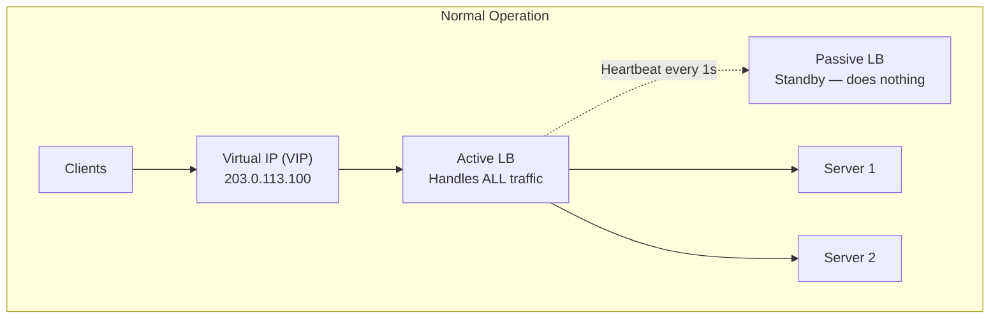

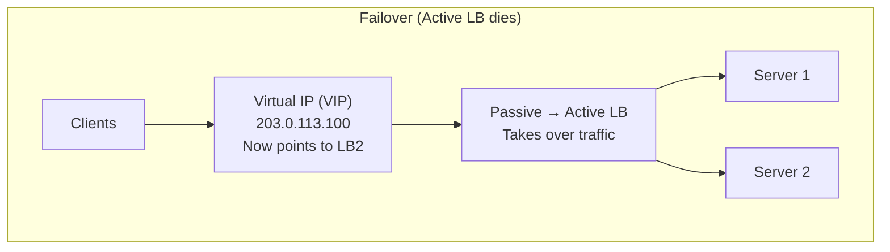

```python
# How failover works (VRRP / Keepalived):
"""
1. Active LB sends heartbeat to Passive LB every second
2. Passive LB monitors heartbeat
3. If 3 heartbeats missed (3 seconds) → Passive assumes Active is dead
4. Passive takes over the Virtual IP (VIP)
5. DNS still points to VIP → clients don't notice anything
6. Failover time: 1-5 seconds

Technologies: Keepalived (Linux), AWS ELB (managed), GCP Load Balancer (managed)
"""
```

### Active-Active

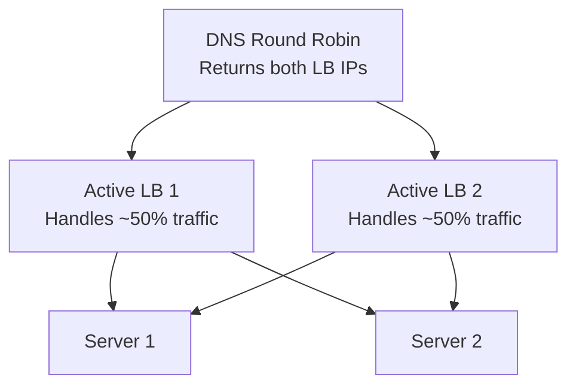

| Mode | Pros | Cons | When to Use |
|---|---|---|---|
| **Active-Passive** | Simple, resource efficient | Passive wastes resources (idle), 1-5s failover | Small-medium scale |
| **Active-Active** | Full utilization, instant failover | Complex config, need session sync | Large scale, zero-downtime critical |

---

## 8. Global Load Balancing (GSLB)

> **Route users to the nearest data center for minimum latency. A load balancer for your load balancers.**

### How GSLB Works

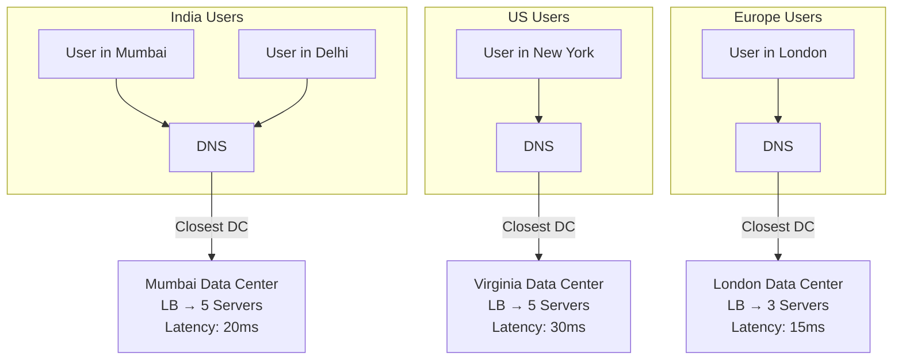

### GSLB Strategies

| Strategy | How It Works | Use Case |
|---|---|---|
| **Geolocation** | Route based on client country/region | Data residency requirements (GDPR) |
| **Latency-based** | Route to DC with lowest latency | Global user base, best UX |
| **Weighted** | 80% to DC-1, 20% to DC-2 | Canary deployments across regions |
| **Failover** | Primary DC → fallback DC if primary unhealthy | Disaster recovery |

```python
# Smart Freight GSLB (future state):
"""
Phase 1 (Now): Single DC in Mumbai (ap-south-1)
  - All traffic goes to Mumbai
  
Phase 2 (50K users): Add CDN for static assets
  - Static: CDN edge nodes across India
  - API: Still Mumbai

Phase 3 (500K users): Multi-region
  - West India (Mumbai): Maharashtra, Gujarat, Rajasthan
  - South India (Chennai): Karnataka, Tamil Nadu, Kerala
  - North India (Delhi): Delhi, UP, Punjab
  - DNS routes to nearest DC based on user location
  
Why? A driver in Chennai gets 150ms latency to Mumbai DC
     but only 20ms to local Chennai DC
     For GPS pings every 10s, this matters!
"""
```

---

## 9. Session Persistence (Sticky Sessions)

> **When you MUST route the same client to the same server every time.**

### Why Sticky Sessions?

```python
# Problem: Without sticky sessions
"""
Request 1: Client → LB → Server 1 (uploads file chunk 1)
Request 2: Client → LB → Server 3 (uploads file chunk 2)
Request 3: Client → LB → Server 2 (uploads file chunk 3)

Server 1 has chunk 1, Server 3 has chunk 2, Server 2 has chunk 3
NOBODY has the complete file! 💥
"""

# Solution 1: Sticky sessions (route by cookie)
"""
Request 1: Client → LB → Server 1 (LB sets cookie: server=S1)
Request 2: Client → LB (sees cookie: server=S1) → Server 1
Request 3: Client → LB (sees cookie: server=S1) → Server 1
All chunks on Server 1 ✅
"""

# Solution 2 (BETTER): Shared storage (no stickiness needed)
"""
Request 1: Client → LB → Server 1 → upload chunk 1 to S3
Request 2: Client → LB → Server 3 → upload chunk 2 to S3
Request 3: Client → LB → Server 2 → upload chunk 3 to S3
S3 has all chunks ✅ Any server works ✅
"""
```

### Sticky Session Methods

| Method | How | Pros | Cons |
|---|---|---|---|
| **Cookie-based** | LB inserts cookie with server ID | Precise, survives IP change | Requires cookie support |
| **IP Hash** | hash(client_ip) → server | No cookies needed | Breaks with shared IPs (NAT) |
| **URL parameter** | Append `?server=S1` to URLs | Works without cookies | Ugly URLs, security risk |

```nginx
# Nginx cookie-based sticky sessions
upstream api_backend {
    # sticky cookie route expires=1h;  # Nginx Plus feature
    
    # Open-source alternative: ip_hash
    ip_hash;
    server 10.0.1.1:3000;
    server 10.0.1.2:3000;
    server 10.0.1.3:3000;
}
```

### When to Avoid Sticky Sessions

```python
# ❌ Avoid sticky sessions when possible because:
PROBLEMS = [
    "Server dies → all its users lose their sessions",
    "Uneven load → one server gets all heavy users",
    "Can't auto-scale effectively (new server gets no traffic)",
    "Limits load balancing algorithm choices",
]

# ✅ Instead, make your app STATELESS:
STATELESS_ALTERNATIVES = {
    "Server-side sessions": "Move to Redis (shared) or JWT (client-side)",
    "File uploads in progress": "Upload directly to S3 (presigned URLs)",
    "WebSocket": "Use Redis pub/sub for cross-server messaging",
    "Shopping cart": "Store in DB or Redis, not server memory",
}
```

---

## 10. Connection Draining (Graceful Shutdown)

> **When removing a server, let existing requests finish before cutting it off.**

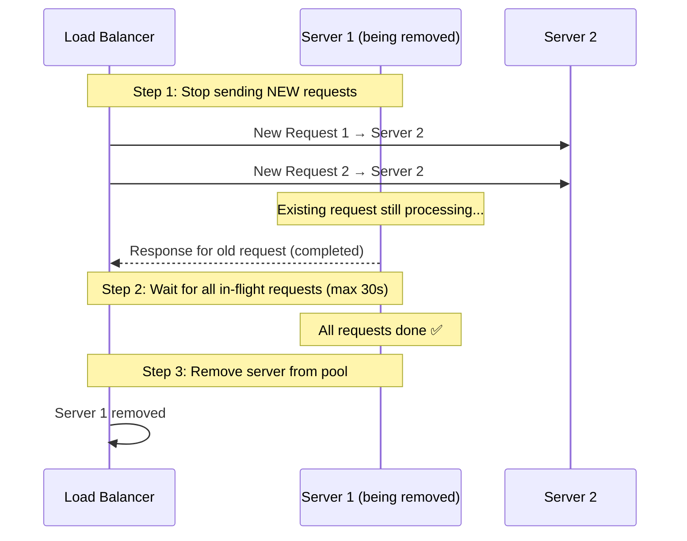

```python
# Without connection draining:
"""
Deploy new version → kill Server 1 immediately
→ 50 in-flight requests get 502 Bad Gateway
→ Users see error page
"""

# With connection draining:
"""
Deploy new version → stop NEW traffic to Server 1
→ Wait for 50 in-flight requests to complete (max 30 seconds)
→ Kill Server 1
→ ZERO user-facing errors
"""

# Configuration
DRAINING_CONFIG = {
    "deregistration_delay": 30,  # seconds to wait for in-flight requests
    # AWS ALB: "deregistration_delay.timeout_seconds"
    # Nginx: handled by upstream health checks
}
```

---

## 11. Deployment Strategies Using Load Balancers

> **Load balancers enable zero-downtime deployments.**

### Rolling Deployment

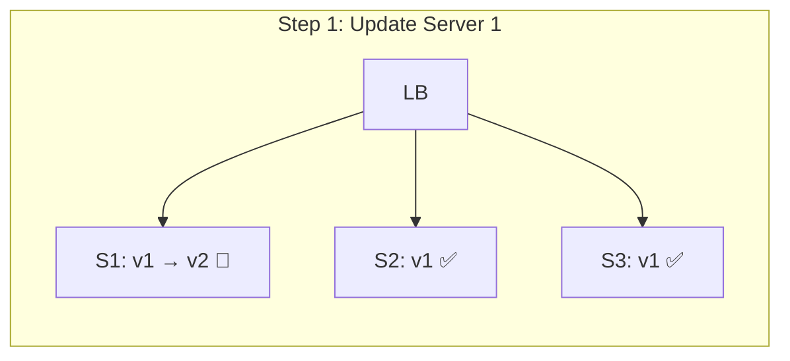

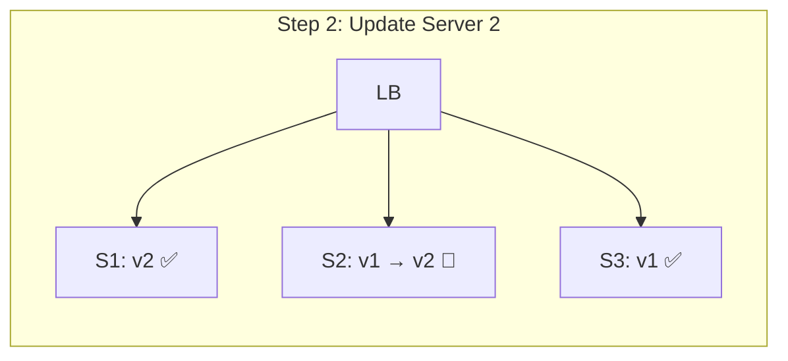

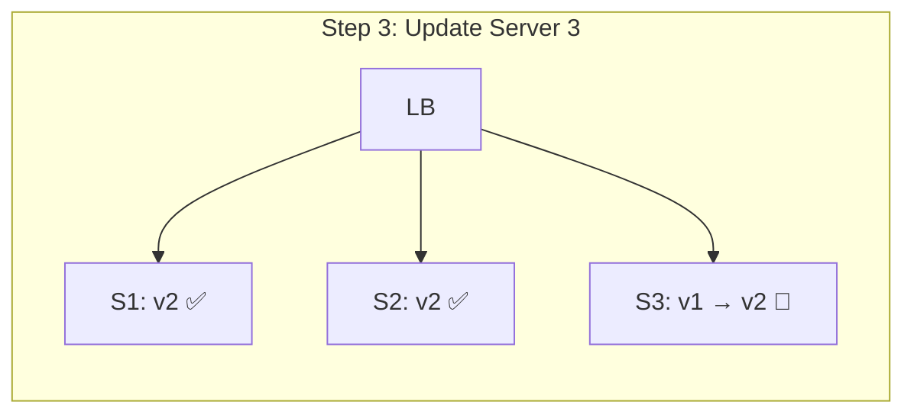

### Blue-Green Deployment

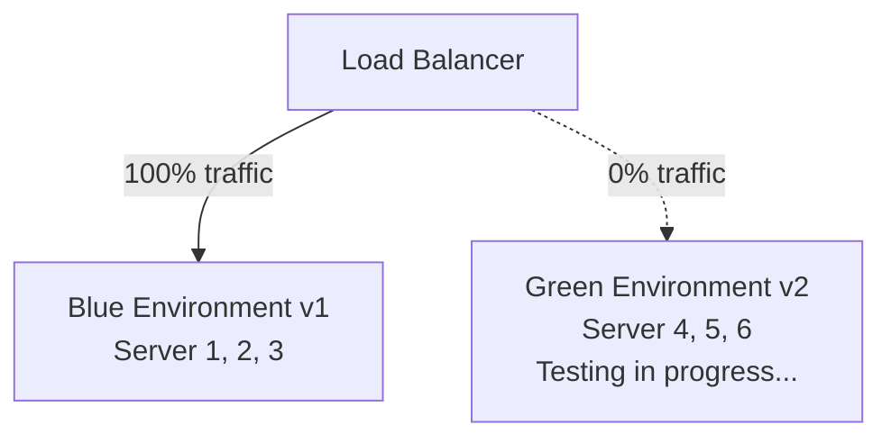

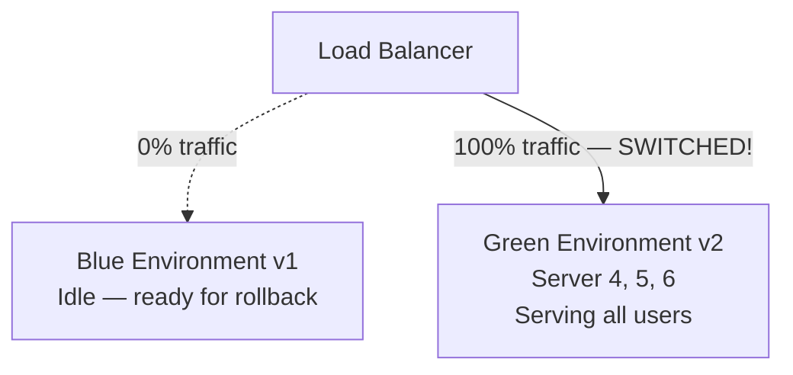

### Canary Deployment

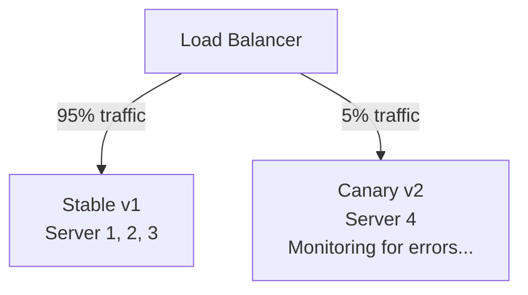

### Comparison

| Strategy | Downtime | Rollback Speed | Resource Cost | Risk |
|---|---|---|---|---|
| **Rolling** | Zero | Slow (must re-deploy) | Same servers | Medium (mixed versions briefly) |
| **Blue-Green** | Zero | Instant (switch back) | 2x servers | Low |
| **Canary** | Zero | Instant (remove canary) | +1 server | Very Low (only 5% affected) |

---

## 12. Common Mistakes & Anti-Patterns

### ❌ BAD: Load balancer as single point of failure

```
Client → Single LB → Servers
         ↑ If this dies, everything dies!
```

### ✅ GOOD: Redundant load balancers

```
Client → DNS (returns both LB IPs)
       → Active LB ──→ Servers
       → Passive LB (standby, takes over via VIP failover)
```

---

### ❌ BAD: No health checks

```nginx
upstream backend {
    server 10.0.1.1:3000;
    server 10.0.1.2:3000;  # This server is dead but still receives traffic!
}
```

### ✅ GOOD: Health checks with proper thresholds

```nginx
upstream backend {
    server 10.0.1.1:3000 max_fails=3 fail_timeout=30s;
    server 10.0.1.2:3000 max_fails=3 fail_timeout=30s;
}
```

---

### ❌ BAD: Same rate limit for all endpoints

```nginx
# Login and data APIs have same limit
limit_req_zone $binary_remote_addr zone=global:10m rate=100r/s;
```

### ✅ GOOD: Different rate limits per endpoint

```nginx
limit_req_zone $binary_remote_addr zone=api:10m rate=100r/s;
limit_req_zone $binary_remote_addr zone=auth:10m rate=10r/s;   # Stricter for auth
limit_req_zone $binary_remote_addr zone=upload:10m rate=5r/s;  # Stricter for uploads
```

---

### ❌ BAD: No connection draining during deploys

```
Kill Server 1 → 200 in-flight requests get 502 → users see errors
```

### ✅ GOOD: Drain connections before removing server

```
Stop new traffic → wait 30s for in-flight → kill server → zero errors
```

---

### ❌ BAD: Hardcoding backend server IPs

```nginx
upstream backend {
    server 10.0.1.1:3000;  # What if IP changes? Edit config + reload?
}
```

### ✅ GOOD: Service discovery or DNS-based backends

```nginx
# Use DNS-resolved hostname
upstream backend {
    server api-servers.internal:3000 resolve;
}
# Or use service discovery (Consul, Kubernetes Service)
```

---

## 13. Quick Reference: Mistakes Table

| Mistake | Problem | Fix |
|---|---|---|
| Single load balancer | LB dies = total outage | Active-passive or active-active LB pair |
| No health checks | Traffic sent to dead servers | Active + passive health checks |
| Uniform rate limits | Auth endpoints get brute-forced | Per-endpoint rate limits |
| No connection draining | 502s during deployments | Drain in-flight requests (30s) before kill |
| Sticky sessions by default | Uneven load, poor fault tolerance | Stateless app + Redis/JWT instead |
| L4 when L7 is needed | Can't route by URL/path | Use L7 for web/API applications |
| No SSL termination | Each server wastes CPU on TLS | Terminate at LB, plain HTTP to backend |
| Missing X-Forwarded-For | Logs show LB IP, not client IP | Set X-Forwarded-For header |
| No retry on 502/503 | Single backend failure = user error | `proxy_next_upstream` in Nginx |
| Backend keep-alive disabled | TCP handshake on every request | `keepalive 32` in upstream block |

---

## 14. Load Balancer Selection Guide

### Cloud-Managed vs Self-Hosted

| Factor | Cloud-Managed (AWS ALB/NLB) | Self-Hosted (Nginx/HAProxy) |
|---|---|---|
| **Setup** | 5 minutes | Hours of config |
| **Maintenance** | AWS manages patches, scaling | You manage everything |
| **Cost** | Pay per LCU/hour (~$25-100/month) | Server cost only |
| **Customization** | Limited to AWS features | Full control |
| **Scaling** | Auto-scales transparently | Manual scaling |
| **SSL certs** | Free with ACM | Let's Encrypt + renewal scripts |
| **Best for** | Most teams, production | Cost-sensitive, custom needs |

### Popular Load Balancers Compared

| Load Balancer | Type | Layer | Best For |
|---|---|---|---|
| **Nginx** | Self-hosted | L7 (L4 possible) | Web apps, reverse proxy, static files |
| **HAProxy** | Self-hosted | L4 and L7 | High-performance, TCP load balancing |
| **Traefik** | Self-hosted | L7 | Docker/Kubernetes, auto-discovery |
| **Envoy** | Self-hosted | L7 | Service mesh (Istio), gRPC |
| **AWS ALB** | Managed | L7 | AWS web apps, ECS/EKS |
| **AWS NLB** | Managed | L4 | High throughput, TCP/UDP, static IPs |
| **GCP LB** | Managed | L4/L7 | GCP workloads, global anycast |
| **Cloudflare** | Managed | L7 | CDN + LB + DDoS protection |

### For Smart Freight

```python
SMART_FREIGHT_LB_DECISION = {
    "Now (MVP)": {
        "choice": "Vercel (automatic) for Next.js + simple PM2 for NestJS",
        "reason": "Zero config, focus on product",
    },
    "100-1K users": {
        "choice": "Nginx reverse proxy on same server",
        "reason": "Simple, free, handles SSL termination",
    },
    "1K-10K users": {
        "choice": "AWS ALB or DigitalOcean Load Balancer",
        "reason": "Managed, auto-scales, health checks included",
    },
    "10K+ users": {
        "choice": "AWS ALB (L7) + NLB (L4 for WebSocket/GPS UDP)",
        "reason": "Different LBs for different traffic types",
    },
}
```

---

## 15. Interview Questions & Answer Frameworks

### Q1: "What is a load balancer and why do we need it?"

```
A load balancer distributes incoming traffic across multiple backend servers.

We need it for:
1. High Availability — if one server dies, others serve traffic
2. Scalability — add more servers as traffic grows
3. Performance — no single server gets overwhelmed
4. Zero-downtime deployments — rolling updates one server at a time
5. SSL termination — offload encryption from app servers
```

### Q2: "L4 vs L7 — when to use which?"

```
L4 (Transport):
  - Only sees IP + port
  - Faster, less CPU
  - Use for: TCP-level services (databases, game servers, non-HTTP)

L7 (Application):
  - Sees full HTTP request (URL, headers, cookies)
  - Can route /api/ → API servers, /static/ → CDN
  - Use for: 90% of web applications (default choice)

Rule of thumb: Start with L7 unless you need raw TCP/UDP.
```

### Q3: "How do you handle load balancer failure?"

```
The LB itself is a SPOF. Solutions:

1. Active-Passive:
   - Two LBs, one active, one standby
   - Heartbeat monitoring between them
   - Passive takes over VIP if active dies (1-5s failover)

2. Active-Active:
   - Multiple LBs, all handling traffic
   - DNS returns multiple LB IPs
   - If one dies, DNS health checks remove it

3. Cloud-Managed (recommended):
   - AWS ALB/NLB are inherently HA
   - Run across multiple AZs
   - AWS manages redundancy transparently
```

### Q4: "Design the load balancing for a food delivery app"

```
Traffic types:
  1. REST API (order, search, menu) → L7 LB (ALB), least connections
  2. WebSocket (real-time tracking)  → L7 LB, sticky sessions (ip_hash)
  3. Static assets (images, CSS)     → CDN (Cloudflare/CloudFront)
  4. GPS pings from drivers (UDP)    → L4 LB (NLB)

Architecture:
  CDN → WAF → L7 ALB → API servers (auto-scaling group 3-20)
                    → WebSocket servers (2-5, sticky)
  NLB → GPS ingestion servers (2-3)

Rate limiting:
  /api/search → 100 req/s (heavy DB queries)
  /api/auth   → 10 req/s (brute force protection)
  /api/orders → 50 req/s
```

### Q5: "How would you do zero-downtime deployment?"

```
Strategy: Rolling deployment with Nginx + health checks

1. Deploy new version to Server 1
   - LB health check fails (server restarting) → marks unhealthy
   - Traffic goes to Server 2 and 3 only
   
2. Server 1 starts, health check passes → LB adds it back

3. Repeat for Server 2, then Server 3

4. At no point are ALL servers down

Key requirements:
  - Health check endpoint (/health)
  - Connection draining (30s timeout)
  - Backward-compatible API changes (or use blue-green)
```

---

## 16. Quick Cheat Sheet

| Concept | One-liner | Key Takeaway |
|---|---|---|
| Load Balancer | Distributes traffic across servers | Enables scaling + fault tolerance |
| L4 LB | Routes by IP + port | Fast, for TCP/UDP services |
| L7 LB | Routes by URL, headers, cookies | Smart, for web/API (default) |
| Round Robin | 1→2→3→1→2→3 | Simplest, for equal servers |
| Least Connections | Route to least busy server | Best for variable workloads |
| IP Hash | hash(IP) → same server | Sticky sessions (but fragile) |
| Consistent Hashing | Hash ring, minimal redistribution | Best for cache servers |
| Health Check | Ping servers to verify they're alive | Prevents traffic to dead servers |
| SSL Termination | LB handles encryption | Offloads CPU from app servers |
| Sticky Sessions | Same client → same server | Avoid if possible, use stateless |
| Connection Draining | Finish in-flight before removing | Zero errors during deploys |
| Active-Passive | Standby LB takes over on failure | LB high availability |
| Blue-Green Deploy | Two environments, instant switch | Safest deployment strategy |
| Canary Deploy | 5% traffic to new version | Lowest risk rollout |
| GSLB | Route to nearest data center | Global latency optimization |
