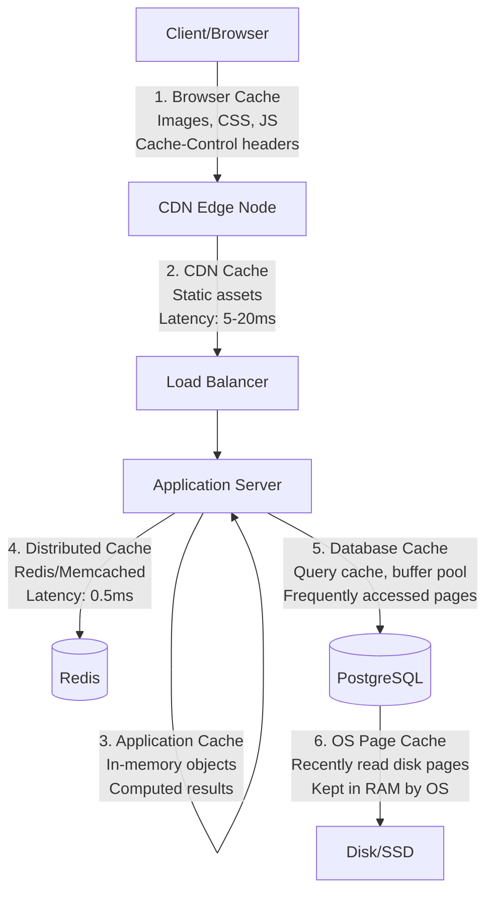
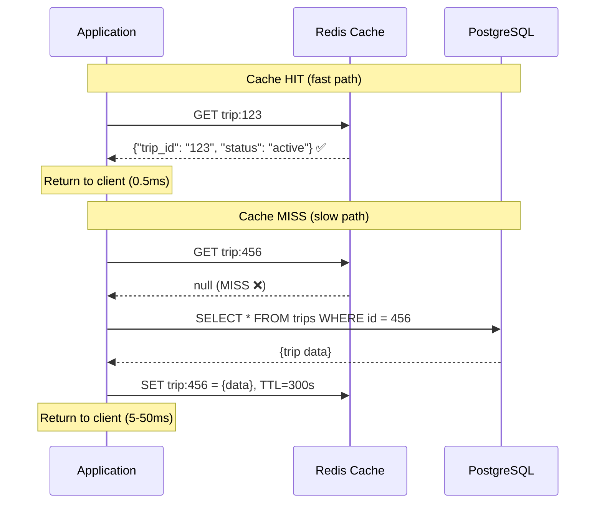
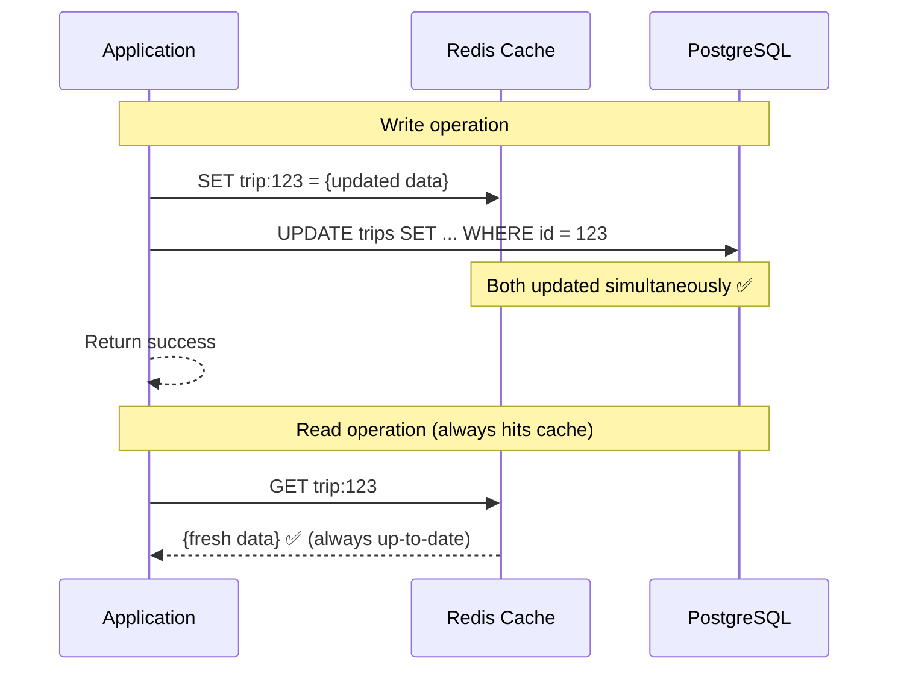
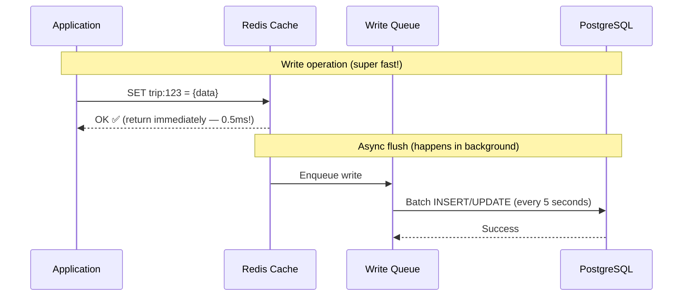
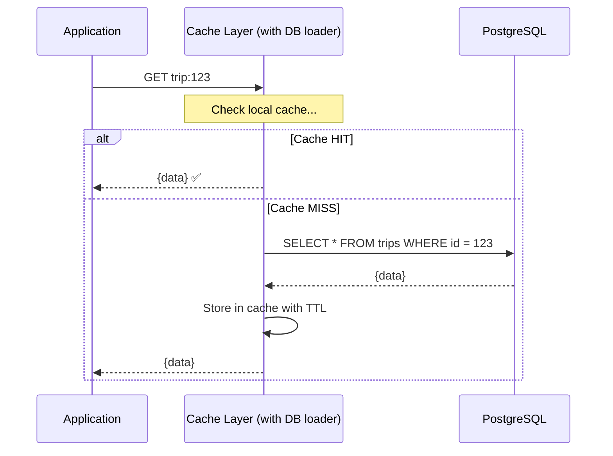
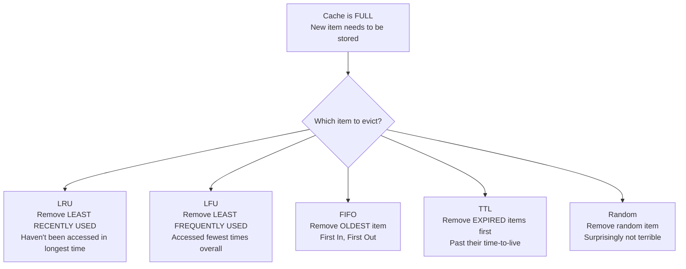
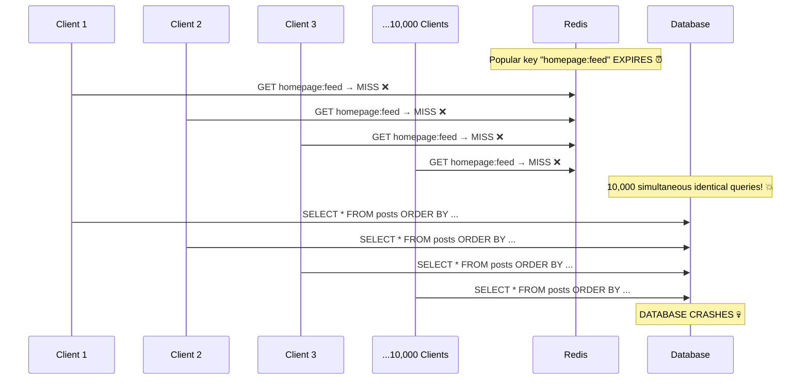
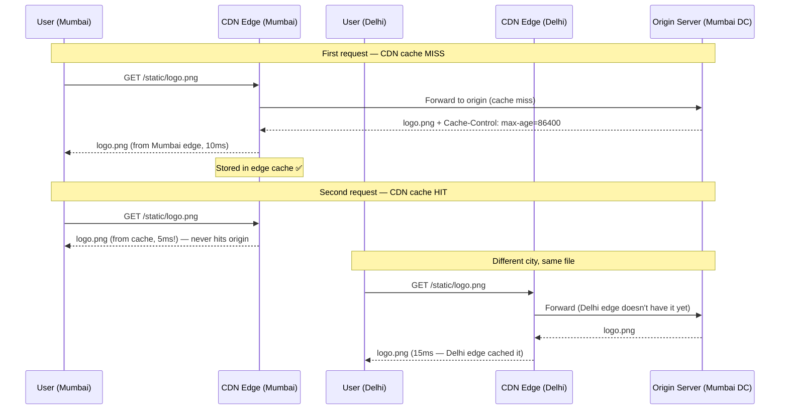
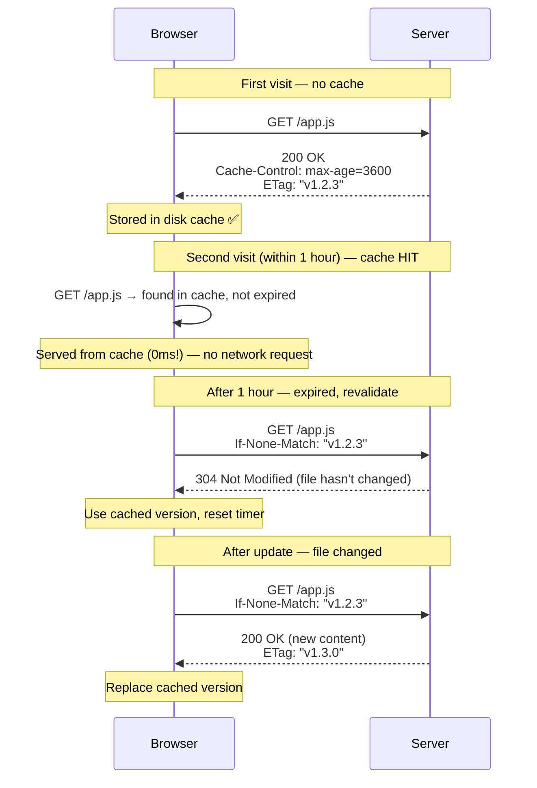

# Caching — Speed Up Everything by Storing Hot Data in Memory

Caching is the single most impactful optimization in system design. A well-designed cache can reduce database load by 80-95%, cut response times from 500ms to 5ms, and save thousands in infrastructure costs. Every system you'll ever design needs caching at multiple layers.

---

- **Cache:** A high-speed storage layer that stores a subset of data, typically transient, so future requests are served faster than accessing the primary data source.
- **Cache Hit:** When the requested data is found in the cache (fast path).
- **Cache Miss:** When the requested data is NOT in the cache, requiring a trip to the primary source (slow path).
- **Hit Ratio / Hit Rate:** Percentage of requests served from cache. Hit Rate = Cache Hits / (Cache Hits + Cache Misses). Target: >80%.
- **TTL (Time to Live):** Duration for which a cached item is considered valid before it expires and must be refreshed.
- **Cache Invalidation:** The process of removing or updating stale data from the cache when the source data changes.
- **Eviction Policy:** The algorithm that decides which items to remove when the cache is full (LRU, LFU, FIFO).
- **Cache-Aside (Lazy Loading):** Application checks cache first; on miss, reads from DB and populates cache.
- **Write-Through:** Every write goes to both cache AND database simultaneously.
- **Write-Behind (Write-Back):** Writes go to cache immediately; cache asynchronously flushes to database later.
- **Read-Through:** Cache itself is responsible for loading data from DB on a miss (transparent to application).
- **Cache Stampede (Thundering Herd):** When a popular cache key expires and thousands of requests simultaneously hit the database.
- **Cold Cache:** A newly started or cleared cache with no data — all requests are misses until cache warms up.
- **Warm Cache:** A cache populated with frequently accessed data — most requests are hits.
- **Distributed Cache:** A cache spread across multiple nodes (Redis Cluster, Memcached) for scalability.
- **CDN (Content Delivery Network):** A geographically distributed cache for static content, serving users from the nearest edge node.
- **Cache Coherence:** Ensuring all caches in the system have consistent/up-to-date data.
- **Stale Data:** Cached data that no longer matches the current state of the primary source.

---

## 1. Why Caching Matters — The Numbers

> **Database queries take 5-50ms. Redis cache reads take 0.1-0.5ms. That's 10-500x faster.**

### Speed Comparison

| Operation | Latency | Relative Speed |
|---|---|---|
| L1 CPU Cache | 0.5 ns | Baseline |
| L2 CPU Cache | 7 ns | 14x slower |
| RAM | 100 ns | 200x slower |
| **Redis (in-memory cache)** | **0.1-0.5 ms** | **200,000x slower than L1** |
| SSD read | 0.15 ms | 300,000x |
| **PostgreSQL simple query** | **1-5 ms** | **2-10M x slower** |
| **PostgreSQL complex query** | **10-500 ms** | **20M-1B x slower** |
| Network round trip (same region) | 0.5-1 ms | 1-2M x |
| Network round trip (cross-continent) | 100-200 ms | 200-400M x |

### The Impact of Caching

```python
"""
WITHOUT caching:
  1000 requests/second × 50ms per DB query = 50 seconds of DB time per second
  Database capacity: ~20,000 queries/sec max
  At 1000 req/s, DB is at 5% capacity → fine
  At 15,000 req/s → DB at 75% → slowing down
  At 20,000 req/s → DB at 100% → crashing

WITH caching (90% hit rate):
  1000 requests/second
  → 900 served from Redis (0.5ms each) = 0.45 seconds of Redis time
  → 100 hit the database (50ms each) = 5 seconds of DB time
  Database load reduced by 90%!
  
  Now at 15,000 req/s:
  → 13,500 from Redis → trivial for Redis (handles 100K+ ops/sec)
  → 1,500 hit DB → well within capacity
  
  Same traffic, 10x less DB load.
"""
```

### Caching Layers in a System



### Every Layer Has Its Own Cache

| Layer | What's Cached | TTL | Size | Example |
|---|---|---|---|---|
| **Browser** | Static assets, API responses | Seconds to days | 50-500 MB | Chrome DevTools → Network |
| **CDN** | Images, CSS, JS, HTML | Minutes to months | Terabytes | Cloudflare, CloudFront |
| **API Gateway** | Repeated API responses | 1-60 seconds | Gigabytes | AWS API Gateway cache |
| **Application** | Computed values, config | App lifetime | 100 MB - 1 GB | Python dict, Node Map |
| **Distributed (Redis)** | Sessions, hot data, feeds | 5 min - 24 hours | 1 GB - 100 GB | Redis, Memcached |
| **Database** | Query results, buffer pool | Auto-managed | 25-75% of RAM | PostgreSQL shared_buffers |
| **OS** | Disk pages in RAM | Until evicted | Available RAM | Linux page cache |

---

## 2. Caching Strategies — The Big 4

> **How does data get INTO the cache and stay consistent with the source? Four strategies, each with trade-offs.**

### Strategy 1: Cache-Aside (Lazy Loading)

> Most common strategy. Application manages the cache explicitly.



```python
import redis
import json
from typing import Optional

cache = redis.Redis(host="localhost", port=6379, decode_responses=True)

class TripService:
    CACHE_TTL = 300  # 5 minutes
    
    async def get_trip(self, trip_id: str) -> dict:
        cache_key = f"trip:{trip_id}"
        
        # Step 1: Check cache
        cached = cache.get(cache_key)
        if cached:
            return json.loads(cached)  # ✅ Cache HIT — 0.5ms
        
        # Step 2: Cache MISS — query database
        trip = await self.db.query(
            "SELECT * FROM trips WHERE id = $1", trip_id
        )
        if not trip:
            return None
        
        # Step 3: Populate cache for next time
        cache.setex(cache_key, self.CACHE_TTL, json.dumps(trip))
        
        return trip  # Took 5-50ms (but next request will be 0.5ms)
    
    async def update_trip(self, trip_id: str, data: dict) -> dict:
        # Update database
        trip = await self.db.query(
            "UPDATE trips SET status = $1 WHERE id = $2 RETURNING *",
            data["status"], trip_id
        )
        
        # Invalidate cache (delete stale data)
        cache.delete(f"trip:{trip_id}")
        # Next read will fetch fresh data from DB and re-cache
        
        return trip
```

**Pros & Cons:**
| Pros | Cons |
|---|---|
| Only caches data that's actually requested (efficient memory) | First request for any item is always slow (cache miss) |
| Cache failure doesn't break the system (falls back to DB) | Data can become stale (up to TTL duration) |
| Simple to implement and understand | Application responsible for cache management |

### Strategy 2: Write-Through

> Every write goes to cache AND database together. Cache is always fresh.



```python
class WriteThoughTripService:
    async def create_trip(self, data: dict) -> dict:
        # Write to BOTH cache and DB
        trip = await self.db.query(
            "INSERT INTO trips (...) VALUES (...) RETURNING *", data
        )
        
        # Immediately cache the new data
        cache.setex(f"trip:{trip['id']}", 300, json.dumps(trip))
        
        return trip
    
    async def update_trip(self, trip_id: str, data: dict) -> dict:
        # Write to both
        trip = await self.db.query(
            "UPDATE trips SET status = $1 WHERE id = $2 RETURNING *",
            data["status"], trip_id
        )
        
        # Update cache with fresh data (not delete — write through)
        cache.setex(f"trip:{trip_id}", 300, json.dumps(trip))
        
        return trip
```

**Pros & Cons:**
| Pros | Cons |
|---|---|
| Cache is never stale (always has latest data) | Higher write latency (write to 2 places) |
| Reads are always fast (data is pre-cached) | Caches data that may never be read (wastes memory) |
| Simple consistency model | What if cache write succeeds but DB fails? (need transactions) |

### Strategy 3: Write-Behind (Write-Back)

> Write to cache immediately, asynchronously flush to database later. Fastest writes possible.



```python
class WriteBehindService:
    def __init__(self):
        self.write_queue = []  # Buffer writes
    
    async def update_truck_location(self, truck_id: str, lat: float, lng: float):
        """GPS locations update every 10 seconds — PERFECT for write-behind.
        We don't need every single ping in the DB instantly."""
        
        location_data = {
            "truck_id": truck_id,
            "lat": lat,
            "lng": lng,
            "timestamp": datetime.now().isoformat()
        }
        
        # Write to cache immediately (for real-time dashboard)
        cache.set(f"truck:location:{truck_id}", json.dumps(location_data))
        
        # Queue for batch DB write (every 30 seconds)
        self.write_queue.append(location_data)
        
        if len(self.write_queue) >= 100:  # Flush every 100 items
            await self._flush_to_db()
    
    async def _flush_to_db(self):
        """Batch write — much more efficient than individual INSERTs"""
        if self.write_queue:
            await self.db.executemany(
                "INSERT INTO truck_locations (truck_id, lat, lng, timestamp) VALUES ($1,$2,$3,$4)",
                self.write_queue
            )
            self.write_queue.clear()
```

**Pros & Cons:**
| Pros | Cons |
|---|---|
| Extremely fast writes (cache speed, 0.5ms) | Risk of data loss if cache crashes before DB flush |
| Batch writes to DB (more efficient) | Complex — need queue management, retry logic |
| Great for high-frequency updates (GPS, metrics) | Data is temporarily inconsistent (cache ahead of DB) |

### Strategy 4: Read-Through

> Cache itself is responsible for fetching from DB on a miss. Application only talks to cache.



```python
# Read-through is usually provided by cache libraries/frameworks
# Your application just calls cache.get() — the library handles DB loading

class ReadThroughCache:
    def __init__(self, loader_fn, ttl=300):
        self.cache = {}
        self.loader_fn = loader_fn  # Function to call on cache miss
        self.ttl = ttl
    
    async def get(self, key: str):
        # Check cache
        if key in self.cache and not self._is_expired(key):
            return self.cache[key]["value"]
        
        # Cache miss — load from source (transparent to caller)
        value = await self.loader_fn(key)
        self.cache[key] = {"value": value, "expires": time.time() + self.ttl}
        return value

# Usage — application doesn't know about DB at all
trip_cache = ReadThroughCache(
    loader_fn=lambda key: db.query(f"SELECT * FROM trips WHERE id = '{key}'"),
    ttl=300
)

# Just call get() — cache handles everything
trip = await trip_cache.get("trip:123")
```

### Strategy Comparison Table

| Strategy | Read Speed | Write Speed | Consistency | Data Loss Risk | Best For |
|---|---|---|---|---|---|
| **Cache-Aside** | Fast (after first miss) | Normal (DB speed) | Eventually consistent | None | General purpose (DEFAULT) |
| **Write-Through** | Always fast | Slower (write 2 places) | Strong | None | Read-heavy, consistency critical |
| **Write-Behind** | Always fast | Fastest (cache speed) | Weak (async) | ⚠️ If cache crashes | High-frequency writes (GPS, logs) |
| **Read-Through** | Fast (after first miss) | Normal | Eventually consistent | None | Library/framework-level caching |

### Which Strategy for Smart Freight?

```python
SMART_FREIGHT_CACHING = {
    # Trip details (read 80%, write 20%)
    "trip_data": {
        "strategy": "Cache-Aside",
        "ttl": 300,  # 5 minutes
        "reason": "Read-heavy, occasional updates, stale for 5 min is OK"
    },
    
    # Real-time truck location (write 90%, read 10%)
    "truck_location": {
        "strategy": "Write-Behind",
        "ttl": None,  # Always overwritten
        "reason": "GPS pings every 10s — too frequent for direct DB writes"
    },
    
    # User profile/auth (read 99%, write 1%)
    "user_profile": {
        "strategy": "Write-Through",
        "ttl": 3600,  # 1 hour
        "reason": "Rarely changes, must be fresh for auth decisions"
    },
    
    # Dashboard analytics (computed, read-only)
    "analytics": {
        "strategy": "Read-Through",
        "ttl": 60,  # 1 minute
        "reason": "Pre-computed every minute, everyone sees same data"
    }
}
```

---

## 3. Cache Eviction Policies

> **Cache is finite (RAM is expensive). When it's full, which item do you remove to make room?**

### Eviction Algorithms



### LRU (Least Recently Used) — Most Common

```python
"""
Evicts the item that hasn't been accessed for the longest time.
Assumption: If you haven't used it recently, you probably won't use it soon.
"""

from collections import OrderedDict

class LRUCache:
    def __init__(self, capacity: int):
        self.cache = OrderedDict()
        self.capacity = capacity
    
    def get(self, key: str):
        if key not in self.cache:
            return None  # Cache miss
        
        # Move to end (most recently used)
        self.cache.move_to_end(key)
        return self.cache[key]
    
    def put(self, key: str, value):
        if key in self.cache:
            self.cache.move_to_end(key)
        
        self.cache[key] = value
        
        if len(self.cache) > self.capacity:
            # Remove FIRST item (least recently used)
            evicted_key, _ = self.cache.popitem(last=False)
            print(f"Evicted: {evicted_key}")


# Example
cache = LRUCache(capacity=3)
cache.put("trip:1", "Pune→Mumbai")      # [trip:1]
cache.put("trip:2", "Delhi→Jaipur")     # [trip:1, trip:2]
cache.put("trip:3", "Chennai→Bangalore") # [trip:1, trip:2, trip:3]

cache.get("trip:1")  # Access trip:1 → moves to end: [trip:2, trip:3, trip:1]

cache.put("trip:4", "Kolkata→Patna")    # Full! Evict LRU (trip:2)
# Cache now: [trip:3, trip:1, trip:4]
```

### LFU (Least Frequently Used)

```python
"""
Evicts the item accessed the FEWEST times overall.
Assumption: Popular items should stay, rarely-accessed items should go.
Problem: New items start with frequency=1 and get evicted immediately!
"""

from collections import defaultdict

class LFUCache:
    def __init__(self, capacity: int):
        self.capacity = capacity
        self.cache = {}           # key → value
        self.freq = defaultdict(int)  # key → access count
        self.min_freq = 0
    
    def get(self, key: str):
        if key not in self.cache:
            return None
        self.freq[key] += 1
        return self.cache[key]
    
    def put(self, key: str, value):
        if self.capacity <= 0:
            return
        
        if key in self.cache:
            self.cache[key] = value
            self.freq[key] += 1
            return
        
        if len(self.cache) >= self.capacity:
            # Find and remove item with lowest frequency
            min_freq_key = min(self.freq, key=self.freq.get)
            del self.cache[min_freq_key]
            del self.freq[min_freq_key]
        
        self.cache[key] = value
        self.freq[key] = 1
```

### Eviction Policy Comparison

| Policy | Evicts | Best For | Weakness |
|---|---|---|---|
| **LRU** | Least recently accessed | General purpose (DEFAULT) | Scan pollution (one-time bulk read evicts hot data) |
| **LFU** | Least frequently accessed | Data with stable popularity | Stale popular items stick, new items evicted too fast |
| **FIFO** | Oldest inserted | Simple, predictable | Ignores access patterns entirely |
| **TTL** | Expired items | Time-sensitive data | Doesn't help when all items have same TTL |
| **Random** | Random item | Large caches, uniform access | No intelligence, but O(1) and no bookkeeping |
| **LRU + TTL** | Expired first, then LRU | Production systems (Redis default) | Slightly more complex |

### Redis Eviction Policies

```python
# Redis configuration: what happens when maxmemory is reached?

REDIS_EVICTION_POLICIES = {
    "noeviction": "Return error on new writes (safest, but writes fail)",
    "allkeys-lru": "Evict LRU key from ALL keys (most common choice ✅)",
    "volatile-lru": "Evict LRU key only from keys WITH expiry set",
    "allkeys-lfu": "Evict LFU key from ALL keys",
    "volatile-lfu": "Evict LFU key only from keys WITH expiry set",
    "allkeys-random": "Evict random key from ALL keys",
    "volatile-random": "Evict random key only from keys WITH expiry set",
    "volatile-ttl": "Evict key with shortest TTL remaining",
}

# Redis config:
# maxmemory 2gb
# maxmemory-policy allkeys-lru

# Recommendation for Smart Freight:
# Use allkeys-lru with TTL on all keys
# This gives you: expired items removed first, then LRU if memory full
```

---

## 4. Cache Invalidation — The Hardest Problem

> **"There are only two hard things in Computer Science: cache invalidation and naming things." — Phil Karlton**

### The Staleness Problem

```python
"""
Scenario:
  1. Cache has trip:123 with status = "active"
  2. User updates trip:123 to status = "completed"
  3. Database now has "completed"
  4. Cache STILL has "active" (STALE!)
  5. Next reader sees "active" from cache — WRONG!
  
  How long is the data wrong?
  → Up to TTL duration (if TTL=300s, user might see stale data for 5 minutes)
"""
```

### Invalidation Strategies

#### Strategy 1: TTL-Based (Time Expiry)

```python
# Simplest approach: data auto-expires after N seconds

cache.setex("trip:123", 300, json.dumps(trip_data))
# After 300 seconds, key disappears → next read fetches fresh from DB

# Pros: Simple, no coordination needed
# Cons: Data is stale for up to TTL duration
# Use when: Eventual consistency is acceptable (product catalog, analytics)

# TTL Guidelines:
TTL_RECOMMENDATIONS = {
    "real_time_critical": 5,        # 5 seconds (stock prices, live scores)
    "near_real_time": 30,           # 30 seconds (trip status for tracking)
    "standard": 300,                # 5 minutes (trip details, user profiles)
    "slow_changing": 3600,          # 1 hour (product catalog, config)
    "static": 86400,                # 24 hours (city list, vehicle types)
    "immutable": None,              # Forever (historical data, logs)
}
```

#### Strategy 2: Event-Based Invalidation (Pub/Sub)

```python
# When data changes, publish an event to invalidate all caches

import redis

r = redis.Redis()

# ─── PUBLISHER (runs when data changes) ───
async def update_trip(trip_id: str, new_status: str):
    # 1. Update database
    await db.query("UPDATE trips SET status = $1 WHERE id = $2", new_status, trip_id)
    
    # 2. Publish invalidation event
    r.publish("cache:invalidate", json.dumps({
        "key": f"trip:{trip_id}",
        "action": "delete"
    }))


# ─── SUBSCRIBER (runs on every app server) ───
def cache_invalidation_listener():
    pubsub = r.pubsub()
    pubsub.subscribe("cache:invalidate")
    
    for message in pubsub.listen():
        if message["type"] == "message":
            event = json.loads(message["data"])
            cache.delete(event["key"])
            print(f"Invalidated cache: {event['key']}")

# Result: ALL app servers invalidate the cache immediately
# Staleness window: ~1-10ms (time for pub/sub message)
```

#### Strategy 3: Write-Through Invalidation

```python
# Update cache whenever you update DB (ensures cache is always fresh)

async def update_trip(trip_id: str, data: dict) -> dict:
    # Update DB
    trip = await db.query(
        "UPDATE trips SET status=$1, updated_at=NOW() WHERE id=$2 RETURNING *",
        data["status"], trip_id
    )
    
    # Option A: Delete from cache (next read will re-fetch)
    cache.delete(f"trip:{trip_id}")
    
    # Option B: Update cache with fresh data (pre-warm)
    cache.setex(f"trip:{trip_id}", 300, json.dumps(trip))
    
    return trip

# Delete vs Update:
# Delete: Simpler, but next read is a cache miss (adds latency)
# Update: Faster reads, but what if cache update fails? Stale data!
# Recommendation: DELETE for simplicity, UPDATE for hot keys
```

#### Strategy 4: Version-Based (ETag/Generation)

```python
# Instead of invalidating, store a version number with cached data

async def get_trip_versioned(trip_id: str) -> dict:
    cache_key = f"trip:{trip_id}"
    
    # Get current version from a fast counter
    current_version = cache.get(f"trip:version:{trip_id}")
    
    # Get cached data
    cached = cache.get(cache_key)
    if cached:
        cached_data = json.loads(cached)
        if cached_data.get("_version") == current_version:
            return cached_data  # Version matches — data is fresh ✅
    
    # Version mismatch or cache miss — fetch fresh
    trip = await db.query("SELECT * FROM trips WHERE id = $1", trip_id)
    trip["_version"] = current_version
    cache.setex(cache_key, 300, json.dumps(trip))
    return trip

async def update_trip_versioned(trip_id: str, data: dict):
    await db.query("UPDATE trips SET ...", data)
    # Increment version — all cached copies become stale instantly
    cache.incr(f"trip:version:{trip_id}")
```

### Invalidation Strategy Comparison

| Strategy | Staleness Window | Complexity | Best For |
|---|---|---|---|
| **TTL only** | 0 to TTL duration | Very Low | Slow-changing data, tolerant reads |
| **Event-based (Pub/Sub)** | ~1-10ms | Medium | Multi-server, real-time apps |
| **Write-through delete** | Next read (one miss) | Low | Single-server, simple apps |
| **Write-through update** | ~0ms | Medium | Hot keys, high-read data |
| **Version-based** | Next read (if version mismatch) | Medium | Distributed systems |

---

## 5. Cache Stampede (Thundering Herd) — And How to Prevent It

> **When a popular cache key expires and 10,000 requests simultaneously hit the database.**

### The Problem



### Solution 1: Locking (Mutex)

```python
import redis
import time

r = redis.Redis()

async def get_with_lock(key: str, ttl: int, fetch_fn):
    """Only ONE request fetches from DB; others wait for cache."""
    
    # Try cache first
    cached = r.get(key)
    if cached:
        return json.loads(cached)
    
    # Cache miss — try to acquire lock
    lock_key = f"lock:{key}"
    acquired = r.set(lock_key, "1", nx=True, ex=10)  # Lock for 10 seconds
    
    if acquired:
        # I'm the ONE that fetches from DB
        try:
            data = await fetch_fn()
            r.setex(key, ttl, json.dumps(data))
            return data
        finally:
            r.delete(lock_key)  # Release lock
    else:
        # Someone else is fetching — wait and retry
        for _ in range(50):  # Wait up to 5 seconds
            time.sleep(0.1)
            cached = r.get(key)
            if cached:
                return json.loads(cached)
        
        # Timeout — fetch ourselves as fallback
        return await fetch_fn()
```

### Solution 2: Stale-While-Revalidate

```python
async def get_with_stale_revalidate(key: str, ttl: int, stale_ttl: int, fetch_fn):
    """Serve stale data while refreshing in the background."""
    
    cached = r.get(key)
    if cached:
        data = json.loads(cached)
        
        # Check if data is "soft expired" (stale but servable)
        if data.get("_expires_at", 0) < time.time():
            # Stale! Trigger background refresh
            # But still serve stale data NOW (user doesn't wait)
            asyncio.create_task(refresh_cache(key, ttl, stale_ttl, fetch_fn))
        
        return data  # Serve (possibly stale) data immediately
    
    # True cache miss — must fetch
    return await refresh_cache(key, ttl, stale_ttl, fetch_fn)

async def refresh_cache(key, ttl, stale_ttl, fetch_fn):
    data = await fetch_fn()
    data["_expires_at"] = time.time() + ttl  # Soft expiry
    r.setex(key, ttl + stale_ttl, json.dumps(data))  # Hard expiry = soft + stale buffer
    return data

# Example: TTL=300s, stale_ttl=60s
# 0-300s: Fresh data served
# 300-360s: Stale data served, background refresh triggered
# 360s: Hard expiry if refresh didn't happen
```

### Solution 3: Probabilistic Early Expiration

```python
import random
import math

def should_recompute(expiry_time: float, delta: float, beta: float = 1.0) -> bool:
    """
    XFetch algorithm: randomly recompute BEFORE expiry.
    As expiry approaches, probability of recompute increases.
    Result: Cache never actually expires — one request refreshes it early.
    """
    remaining = expiry_time - time.time()
    probability = math.exp(-remaining / (delta * beta))
    return random.random() < probability

# With 1000 concurrent readers, approximately 1 will trigger early refresh
# The other 999 continue reading from cache — no stampede!
```

### Solution Comparison

| Solution | Complexity | User Impact | Guarantees |
|---|---|---|---|
| **Locking (Mutex)** | Medium | Some users wait briefly | Only 1 DB query |
| **Stale-While-Revalidate** | Medium | Zero wait (serve stale) | Users may see briefly stale data |
| **Early Expiration** | Low | Zero impact | Probabilistic (not guaranteed) |
| **Pre-warming** | Low | None | Requires knowing hot keys upfront |

---

## 6. Redis — The Most Popular Cache

> **Redis is an in-memory data structure store. It's not just a key-value cache — it's a Swiss Army knife.**

### Redis Data Structures

| Structure | Use Case | Commands | Example |
|---|---|---|---|
| **String** | Simple cache, counters | GET, SET, INCR | Cache trip JSON, rate limit counter |
| **Hash** | Object with fields | HGET, HSET, HGETALL | User profile fields |
| **List** | Queues, recent items | LPUSH, RPOP, LRANGE | Recent notifications, activity feed |
| **Set** | Unique collections, tags | SADD, SMEMBERS, SINTER | Online drivers, trip tags |
| **Sorted Set** | Rankings, leaderboards | ZADD, ZRANGE, ZRANK | Driver ratings, nearest trucks |
| **Stream** | Event log, message queue | XADD, XREAD, XGROUP | GPS event stream |
| **Pub/Sub** | Real-time messaging | PUBLISH, SUBSCRIBE | Cache invalidation, notifications |

### Redis for Smart Freight

```python
import redis

r = redis.Redis(host="localhost", port=6379, decode_responses=True)

# ─── 1. Trip Caching (String) ───
def cache_trip(trip_id: str, trip_data: dict):
    r.setex(f"trip:{trip_id}", 300, json.dumps(trip_data))

def get_cached_trip(trip_id: str) -> dict | None:
    data = r.get(f"trip:{trip_id}")
    return json.loads(data) if data else None


# ─── 2. Real-time Truck Location (Hash — fast field access) ───
def update_truck_location(truck_id: str, lat: float, lng: float):
    r.hset(f"truck:{truck_id}", mapping={
        "lat": str(lat),
        "lng": str(lng),
        "updated_at": datetime.now().isoformat(),
        "speed_kmh": "65"
    })
    r.expire(f"truck:{truck_id}", 120)  # Expire if no update in 2 min (truck offline)

def get_truck_location(truck_id: str) -> dict:
    return r.hgetall(f"truck:{truck_id}")


# ─── 3. Online Drivers (Set) ───
def driver_online(driver_id: str):
    r.sadd("drivers:online", driver_id)

def driver_offline(driver_id: str):
    r.srem("drivers:online", driver_id)

def get_online_drivers() -> set:
    return r.smembers("drivers:online")

def count_online_drivers() -> int:
    return r.scard("drivers:online")


# ─── 4. Rate Limiting (String + INCR) ───
def is_rate_limited(user_id: str, limit: int = 100, window: int = 60) -> bool:
    """Sliding window rate limiter using Redis"""
    key = f"ratelimit:{user_id}:{int(time.time()) // window}"
    
    current = r.incr(key)
    if current == 1:
        r.expire(key, window)
    
    return current > limit


# ─── 5. Nearby Trucks (Sorted Set with GEO) ───
def register_truck_position(truck_id: str, lat: float, lng: float):
    r.geoadd("trucks:positions", (lng, lat, truck_id))

def find_nearby_trucks(lat: float, lng: float, radius_km: float = 10) -> list:
    """Find all trucks within radius_km of a point"""
    return r.geosearch(
        "trucks:positions",
        longitude=lng,
        latitude=lat,
        radius=radius_km,
        unit="km",
        sort="ASC"  # Nearest first
    )


# ─── 6. Leaderboard — Driver Ratings (Sorted Set) ───
def update_driver_rating(driver_id: str, rating: float):
    r.zadd("drivers:ratings", {driver_id: rating})

def get_top_drivers(count: int = 10) -> list:
    return r.zrevrange("drivers:ratings", 0, count - 1, withscores=True)


# ─── 7. Recent Activity Feed (List — capped) ───
def add_activity(user_id: str, activity: dict):
    key = f"activity:{user_id}"
    r.lpush(key, json.dumps(activity))
    r.ltrim(key, 0, 49)  # Keep only last 50 activities
    r.expire(key, 86400)  # Expire after 24 hours

def get_recent_activity(user_id: str, count: int = 20) -> list:
    items = r.lrange(f"activity:{user_id}", 0, count - 1)
    return [json.loads(item) for item in items]
```

### Redis vs Memcached

| Feature | Redis | Memcached |
|---|---|---|
| **Data Structures** | Strings, Lists, Sets, Hashes, Sorted Sets, Streams | Strings only |
| **Persistence** | RDB snapshots + AOF log | None (pure cache) |
| **Replication** | Master-Replica support | None built-in |
| **Cluster** | Redis Cluster (auto-sharding) | Client-side sharding |
| **Pub/Sub** | Built-in | Not available |
| **Lua Scripting** | Yes (atomic operations) | No |
| **Max Value Size** | 512 MB | 1 MB |
| **Multi-threading** | Single-threaded (io_threads in 6.0+) | Multi-threaded |
| **Memory Efficiency** | Good (but more overhead per key) | Better for simple strings |
| **Use Case** | General purpose (cache + data store + queue) | Pure simple caching |
| **Winner** | ✅ For most use cases | Only if you need multi-threaded simple cache |

---

## 7. CDN — Caching at the Edge

> **A CDN is a global network of cache servers. Users get content from the nearest server, not your origin.**

### How CDN Works



### What to Cache on CDN vs What NOT to

| Content | Cache on CDN? | TTL | Why |
|---|---|---|---|
| **Images, videos** | ✅ Yes | 30 days | Static, immutable (use content hash in filename) |
| **CSS, JS bundles** | ✅ Yes | 1 year | Immutable (filename changes on rebuild: app.abc123.js) |
| **Fonts** | ✅ Yes | 1 year | Never change |
| **HTML (static pages)** | ✅ Yes | 5-60 min | Changes occasionally |
| **API responses (public)** | ⚠️ Maybe | 1-60 sec | Only if not personalized |
| **API responses (private)** | ❌ No | — | Personalized, auth-dependent |
| **User uploads** | ✅ Yes | 30 days | After uploaded, rarely changes |
| **Real-time data** | ❌ No | — | Must be fresh (WebSocket instead) |

### Cache-Control Headers

```python
# These headers tell browsers AND CDNs how to cache your responses

CACHE_HEADERS = {
    # Static assets (CSS, JS, images) — cache forever (filename has content hash)
    "immutable_assets": {
        "Cache-Control": "public, max-age=31536000, immutable"
        # public: CDN can cache
        # max-age=31536000: cache for 1 year
        # immutable: never revalidate (file never changes, URL changes instead)
    },
    
    # HTML pages — cache briefly, revalidate
    "html_pages": {
        "Cache-Control": "public, max-age=0, must-revalidate",
        "ETag": '"abc123"'  # Version identifier
        # Browser will send If-None-Match: "abc123" next time
        # Server responds 304 Not Modified (no body sent) if unchanged
    },
    
    # Private API responses — NEVER cache on CDN
    "private_api": {
        "Cache-Control": "private, no-store"
        # private: only browser can cache (not CDN)
        # no-store: don't cache at all
    },
    
    # Public API (e.g., city list) — CDN can cache briefly
    "public_api": {
        "Cache-Control": "public, max-age=300, s-maxage=600"
        # max-age=300: browser caches for 5 min
        # s-maxage=600: CDN caches for 10 min (overrides max-age for CDN)
    },
    
    # Stale-while-revalidate
    "smart_caching": {
        "Cache-Control": "public, max-age=60, stale-while-revalidate=300"
        # Serve from cache for 60s
        # After 60s: serve stale cache BUT revalidate in background
        # After 360s: actually expired, must refetch
    }
}
```

### CDN Providers Comparison

| Provider | Best For | Edge Locations | Free Tier |
|---|---|---|---|
| **Cloudflare** | All-in-one (CDN + DNS + DDoS + WAF) | 300+ cities | ✅ Generous |
| **AWS CloudFront** | AWS ecosystem, fine-grained control | 400+ locations | ✅ 1TB/month free |
| **Vercel Edge** | Next.js, static sites | 100+ locations | ✅ (with Vercel hosting) |
| **Fastly** | Real-time purging, edge computing | 70+ POPs | ❌ |
| **Bunny CDN** | Budget-friendly, simple | 100+ locations | ❌ (but very cheap) |

---

## 8. Browser Caching

> **The fastest cache is the one on the user's own device. Zero network latency.**

### How Browser Caching Works



### Cache Busting Strategies

```python
# Problem: You deploy new CSS but users have old version cached for 1 year!
# Solution: Change the filename when content changes

# ❌ BAD: Same filename forever
# <link href="/styles.css">  ← How do you invalidate 1-year cache?

# ✅ GOOD: Content hash in filename (Vite/Webpack do this automatically)
# <link href="/styles.a1b2c3.css">  ← New hash = new URL = fresh download
# Old: /styles.a1b2c3.css (cached forever, users who have it keep using it)
# New: /styles.d4e5f6.css (new URL, browser fetches fresh)

# Your Next.js / Vite build does this automatically:
# _next/static/chunks/app.abc123.js → content changes → app.def456.js
```

---

## 9. Multi-Level Caching Strategy

> **Production systems use caching at EVERY layer simultaneously.**

### The Cache Hierarchy

```python
"""
Request for trip details: GET /api/trips/123

Level 1: Browser Cache (0ms)
  → Is response cached locally? (Cache-Control header)
  → HIT? Done. MISS? Continue...

Level 2: CDN Edge (5-20ms)
  → Is response cached at edge node?
  → Only for public, non-personalized data
  → HIT? Done. MISS? Continue...

Level 3: API Gateway Cache (1-5ms)
  → Some gateways cache responses by URL + headers
  → HIT? Done. MISS? Continue...

Level 4: Application In-Memory Cache (0.01ms)
  → Local process memory (Node.js Map, Python dict)
  → Small, per-server, very fast
  → HIT? Done. MISS? Continue...

Level 5: Distributed Cache — Redis (0.5ms)
  → Shared across all app servers
  → HIT? Done. MISS? Continue...

Level 6: Database Query Cache (varies)
  → PostgreSQL cached query plans and buffer pool
  → Database handles internally

Level 7: Disk (SSD/HDD) (0.1-10ms)
  → Final source of truth
  → Always hits (assuming data exists)
"""

# Implementation:
async def get_trip_multi_level(trip_id: str):
    # Level 4: Local in-memory cache (fastest)
    local_cache = {}  # In real app, use TTLCache or Node.js Map
    if trip_id in local_cache:
        return local_cache[trip_id]
    
    # Level 5: Redis distributed cache
    cached = await redis.get(f"trip:{trip_id}")
    if cached:
        trip = json.loads(cached)
        local_cache[trip_id] = trip  # Promote to local cache
        return trip
    
    # Level 7: Database (slowest)
    trip = await db.query("SELECT * FROM trips WHERE id = $1", trip_id)
    
    # Populate both cache levels
    await redis.setex(f"trip:{trip_id}", 300, json.dumps(trip))
    local_cache[trip_id] = trip
    
    return trip
```

### Cache Hit Rate by Level (Typical)

```
Browser Cache:     90-99% hit rate (static assets)
CDN:               80-95% hit rate (static assets, public pages)
Redis:             70-95% hit rate (depends on data pattern)
DB Buffer Pool:    95-99% hit rate (hot data stays in RAM)

Combined effect:
  100 requests arrive
  → 90 served by browser cache (never reach server)
  → 10 reach CDN → 8 served from CDN edge
  → 2 reach app server → Redis hit for 1.5
  → 0.5 actually hit database

  Effective DB load: 0.5% of total requests!
```

---

## 10. Caching Patterns for Common Scenarios

### Pattern: User Session Caching

```python
# Sessions are read on EVERY request (auth middleware) — perfect for caching

async def get_session(token: str) -> dict | None:
    # Check Redis first (session should always be in Redis)
    session = await redis.get(f"session:{token}")
    if session:
        return json.loads(session)
    
    # Fallback: Check DB (shouldn't happen often)
    session = await db.query("SELECT * FROM sessions WHERE token = $1", token)
    if session:
        # Re-cache (maybe Redis was restarted)
        await redis.setex(f"session:{token}", 3600, json.dumps(session))
    return session

async def create_session(user_id: str) -> str:
    token = generate_secure_token()
    session_data = {"user_id": user_id, "created_at": time.time()}
    
    # Store in both Redis (fast reads) and DB (persistence)
    await redis.setex(f"session:{token}", 3600, json.dumps(session_data))
    await db.query("INSERT INTO sessions ...", token, user_id)
    
    return token
```

### Pattern: Feed/Timeline Caching

```python
# News feed / activity timeline — computed once, read by many

async def get_dashboard_feed(fleet_owner_id: str) -> list:
    cache_key = f"feed:{fleet_owner_id}"
    
    # Try cache (TTL: 30 seconds — feed updates frequently)
    cached = await redis.get(cache_key)
    if cached:
        return json.loads(cached)
    
    # Compute feed (expensive query with JOINs)
    feed = await db.query("""
        SELECT t.*, d.name as driver_name, v.plate_number
        FROM trips t
        JOIN drivers d ON t.driver_id = d.id
        JOIN vehicles v ON t.vehicle_id = v.id
        WHERE t.fleet_owner_id = $1
        ORDER BY t.updated_at DESC
        LIMIT 50
    """, fleet_owner_id)
    
    await redis.setex(cache_key, 30, json.dumps(feed))
    return feed

# Invalidate when trip status changes:
async def on_trip_status_change(trip):
    await redis.delete(f"feed:{trip['fleet_owner_id']}")
```

### Pattern: Config/Feature Flags Caching

```python
# Config changes rarely — cache aggressively

class ConfigCache:
    def __init__(self):
        self._local_cache = {}
        self._cache_time = 0
        self._ttl = 60  # Refresh from Redis every 60 seconds
    
    async def get(self, key: str, default=None):
        # Refresh local cache from Redis periodically
        if time.time() - self._cache_time > self._ttl:
            all_config = await redis.hgetall("app:config")
            self._local_cache = all_config
            self._cache_time = time.time()
        
        return self._local_cache.get(key, default)

config = ConfigCache()

# Usage:
if await config.get("feature:new_tracking_ui") == "enabled":
    return render_new_ui()
```

### Pattern: Expensive Computation Caching

```python
# Cache results of expensive calculations (reports, analytics)

async def get_fleet_analytics(fleet_id: str, date: str) -> dict:
    cache_key = f"analytics:{fleet_id}:{date}"
    
    cached = await redis.get(cache_key)
    if cached:
        return json.loads(cached)
    
    # Expensive computation (aggregation over millions of GPS points)
    analytics = await compute_fleet_analytics(fleet_id, date)
    
    # Cache for 1 hour (or forever if date is in the past)
    ttl = 86400 if date < today() else 3600
    await redis.setex(cache_key, ttl, json.dumps(analytics))
    
    return analytics
```

---

## 11. Common Mistakes & Anti-Patterns

### ❌ BAD: Caching everything blindly

```python
# Caching rarely-accessed data wastes memory and adds complexity
cache.setex("trip:rare_trip_from_2019", 3600, data)
# This key will never be read again — just wastes Redis RAM
```

### ✅ GOOD: Cache only hot data (80/20 rule)

```python
# 20% of data serves 80% of requests — cache THAT
# Use access frequency to decide:
# - Trip created 5 min ago? Cache it (likely to be accessed)
# - Trip from 2 years ago? Don't cache (query on demand)
```

---

### ❌ BAD: Same TTL for everything

```python
# User profile TTL = 5 seconds? Too short — wastes DB queries
# Truck location TTL = 1 hour? Too long — shows stale position!
cache.setex("user:profile:123", 5, data)     # Why so short?
cache.setex("truck:location:456", 3600, data) # Dangerously stale!
```

### ✅ GOOD: TTL based on data characteristics

```python
TTL_BY_TYPE = {
    "truck_location": 30,       # Changes every 10 seconds
    "trip_status": 60,          # Changes during trip lifecycle
    "user_profile": 3600,       # Changes once a month
    "city_list": 86400,         # Changes once a year
    "vehicle_types": 86400,     # Static reference data
}
```

---

### ❌ BAD: No cache warm-up after restart

```python
# Redis restarts → EMPTY cache → ALL requests hit DB → DB overloaded
# This is a "cold start" problem
```

### ✅ GOOD: Pre-warm cache on startup

```python
async def warm_cache_on_startup():
    """Load frequently accessed data into cache before accepting traffic"""
    
    # Top 1000 active trips
    active_trips = await db.query("SELECT * FROM trips WHERE status = 'active' LIMIT 1000")
    for trip in active_trips:
        await redis.setex(f"trip:{trip['id']}", 300, json.dumps(trip))
    
    # All online drivers
    drivers = await db.query("SELECT * FROM drivers WHERE is_online = true")
    for driver in drivers:
        await redis.sadd("drivers:online", driver["id"])
    
    # Config / feature flags
    config = await db.query("SELECT * FROM config")
    for item in config:
        await redis.hset("app:config", item["key"], item["value"])
    
    print(f"Cache warmed: {len(active_trips)} trips, {len(drivers)} drivers")
```

---

### ❌ BAD: Not handling cache failures

```python
# If Redis is down, entire app crashes!
trip = json.loads(cache.get(f"trip:{trip_id}"))  # Throws if Redis unreachable
```

### ✅ GOOD: Cache failure = graceful degradation

```python
async def get_trip_resilient(trip_id: str) -> dict:
    try:
        cached = await redis.get(f"trip:{trip_id}")
        if cached:
            return json.loads(cached)
    except redis.ConnectionError:
        # Redis is down — log warning, fall through to DB
        logger.warning("Redis unavailable, falling back to DB")
    
    # Fallback: Direct DB query (slower but works)
    return await db.query("SELECT * FROM trips WHERE id = $1", trip_id)
```

---

### ❌ BAD: Caching null/empty results without TTL

```python
# If a trip doesn't exist, every request for it hits DB repeatedly
trip = db.query("SELECT * FROM trips WHERE id = 'nonexistent'")
# Returns None — we don't cache it — next request hits DB again!
# Attacker can DoS your DB by requesting random non-existent IDs
```

### ✅ GOOD: Cache negative results (with short TTL)

```python
async def get_trip(trip_id: str):
    cached = await redis.get(f"trip:{trip_id}")
    if cached == "NULL":
        return None  # Cached negative result — don't hit DB
    if cached:
        return json.loads(cached)
    
    trip = await db.query("SELECT * FROM trips WHERE id = $1", trip_id)
    if trip:
        await redis.setex(f"trip:{trip_id}", 300, json.dumps(trip))
    else:
        # Cache the "not found" result too (short TTL)
        await redis.setex(f"trip:{trip_id}", 60, "NULL")
    
    return trip
```

---

## 12. Quick Reference: Mistakes Table

| Mistake | Problem | Fix |
|---|---|---|
| Cache everything | Wastes memory on cold data | Cache only hot data (80/20 rule) |
| Same TTL for all | Stale critical data OR thrashing on static data | TTL based on change frequency |
| No warm-up | Cold start → DB overwhelmed | Pre-warm critical data on restart |
| No failure handling | Redis down = app down | Graceful fallback to DB |
| No negative caching | Non-existent keys always hit DB | Cache "NULL" with short TTL |
| Unbounded cache | RAM grows until OOM | Set maxmemory + eviction policy |
| Cache stampede ignored | Hot key expires → DB crushed | Locking, stale-while-revalidate |
| Inconsistent invalidation | Users see stale data after updates | Event-based invalidation + TTL |
| Caching mutable URLs | Can't update cached content | Content hash in filenames (cache busting) |
| No monitoring | Don't know if cache is effective | Track hit rate, memory, evictions |

---

## 13. Monitoring Your Cache

> **If you can't measure it, you can't improve it.**

### Key Metrics to Track

| Metric | Target | Alert If | Action |
|---|---|---|---|
| **Hit Rate** | > 80% | < 60% | Check TTLs, warm-up, key patterns |
| **Memory Usage** | < 80% of maxmemory | > 90% | Increase RAM or reduce TTLs |
| **Eviction Rate** | ~0 (normal) | Sustained high | Cache too small, need more RAM |
| **Latency (p99)** | < 1ms | > 5ms | Check network, Redis CPU, slow commands |
| **Connection Count** | < max | > 80% of max | Increase pool size or add replicas |
| **Key Count** | Stable growth | Sudden spike | Check for cache pollution |

```python
# Redis INFO command gives you these metrics:
"""
redis-cli INFO stats

# keyspace_hits:12345
# keyspace_misses:1234
# Hit Rate = 12345 / (12345 + 1234) = 91% ✅

# evicted_keys:0 (good!)
# used_memory: 1.2GB / 2GB maxmemory = 60% ✅
"""
```

---

## 14. Interview Questions & Answer Frameworks

### Q1: "What is caching and why do we use it?"

```
Caching stores frequently accessed data in a faster storage layer (RAM)
to avoid expensive recomputation or slow data source access.

Why:
1. Speed — Redis: 0.5ms vs PostgreSQL: 5-50ms (10-100x faster)
2. Reduce DB load — 80-95% of requests served from cache
3. Cost — Fewer database replicas needed
4. Availability — Can serve stale cached data even if DB is temporarily down
```

### Q2: "Explain cache-aside vs write-through"

```
Cache-Aside (Lazy Loading):
  - App checks cache → miss → reads DB → stores in cache
  - Cache only has data that's been requested at least once
  - Simple, most common strategy
  - Con: First request always slow (cache miss)

Write-Through:
  - App writes to cache AND DB on every write
  - Cache always has latest data
  - Reads are always fast
  - Con: Writes are slower (2 writes), caches data that may never be read
```

### Q3: "How do you handle cache invalidation?"

```
Multiple strategies based on requirements:

1. TTL (Time-based expiry) — simplest
   Data expires after N seconds. Stale for up to TTL.

2. Write-through delete — on update, delete cache key
   Next read re-fetches. Stale window = 0 (after first read).

3. Event-based (Pub/Sub) — on update, publish invalidation event
   All servers invalidate immediately. Stale window = ~1ms.

4. Version-based — check version before using cached data
   If version mismatch, re-fetch. Works for distributed systems.

In practice: TTL + write-through delete for most systems.
Add pub/sub when you have multiple cache layers or servers.
```

### Q4: "What is cache stampede and how to prevent it?"

```
Problem: Popular cache key expires → 10,000 requests simultaneously
hit the database → database crashes.

Solutions:
1. Locking (Mutex) — only 1 request fetches from DB, others wait
2. Stale-while-revalidate — serve stale data while refreshing in background
3. Probabilistic early expiration — random requests refresh BEFORE expiry
4. Never expire hot keys — use event-based invalidation instead of TTL

Best practice: Combination of stale-while-revalidate + locking for critical keys.
```

### Q5: "Design the caching layer for a food delivery app"

```
Layers:
1. Browser/App cache — restaurant images, static assets (CDN URLs)
2. CDN — images, CSS/JS, restaurant photos (30-day TTL)
3. Redis distributed cache:
   - Restaurant menu: TTL 5 min (changes occasionally)
   - User session: TTL 1 hour
   - Search results: TTL 1 min (fresh options)
   - Active order status: TTL 10 sec (changes frequently)
   - Delivery partner location: TTL 5 sec (real-time)
4. DB buffer pool — hot rows stay in PostgreSQL memory

Invalidation:
- Menu updated → delete cache key (event from restaurant portal)
- Order status change → update cache immediately (write-through)
- Location → overwrite every 5 seconds (latest wins)

Estimated impact:
- Without cache: 10K QPS to DB
- With cache (90% hit rate): 1K QPS to DB → 10x reduction
```

---

## 15. Quick Cheat Sheet

| Concept | One-liner | Key Takeaway |
|---|---|---|
| Cache | Fast storage for hot data | 10-100x faster than DB |
| Cache Hit | Data found in cache | Fast path (0.5ms) |
| Cache Miss | Data NOT in cache, fetch from DB | Slow path (5-50ms) |
| TTL | Auto-expire after N seconds | Simplest invalidation |
| LRU | Evict least recently accessed | Most common eviction policy |
| Cache-Aside | App checks cache, fills on miss | Default strategy for most apps |
| Write-Through | Write to cache + DB together | Always fresh, slightly slower writes |
| Write-Behind | Write to cache, async flush to DB | Fastest writes, data loss risk |
| Cache Stampede | Hot key expires, DB flooded | Fix: locking, stale-while-revalidate |
| CDN | Cache static files at network edge | Images, CSS, JS — serve from nearest node |
| Redis | In-memory data structure store | The Swiss Army knife of caching |
| Hit Rate | % of requests served from cache | Target: >80%, great: >95% |
| Negative Cache | Cache "not found" results | Prevents DB attacks with fake IDs |
| Cache Warming | Pre-load data on startup | Prevents cold start thundering herd |
