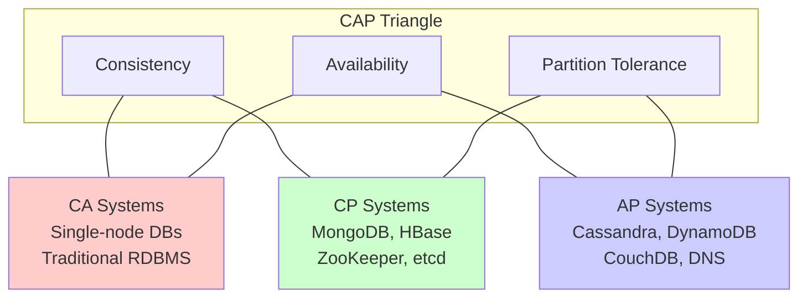
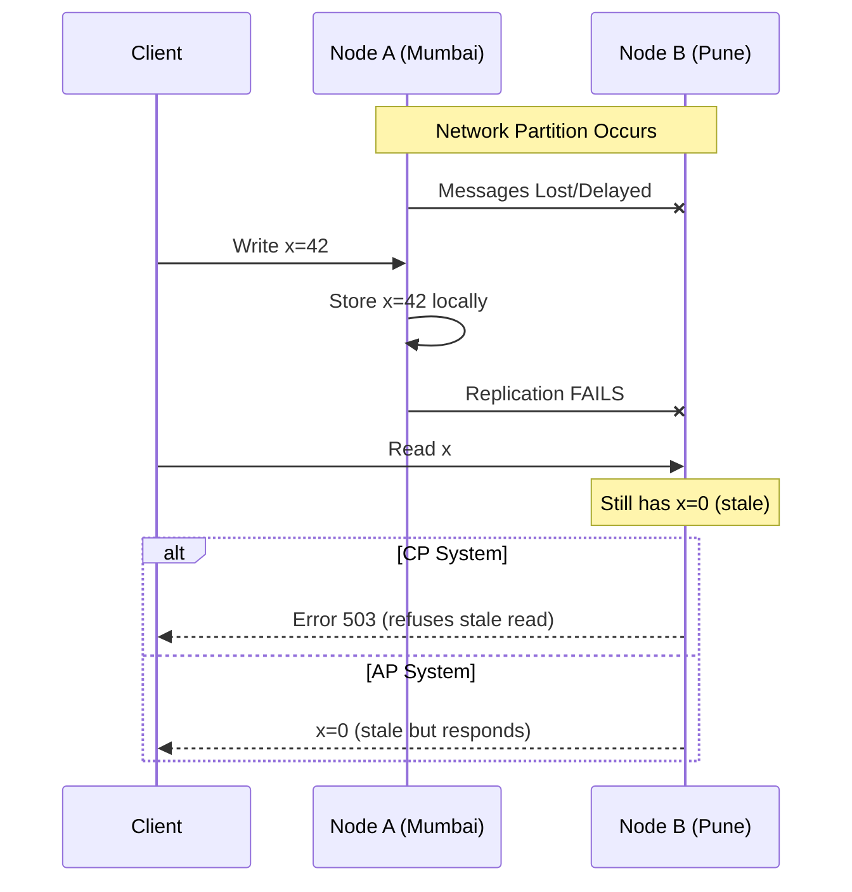
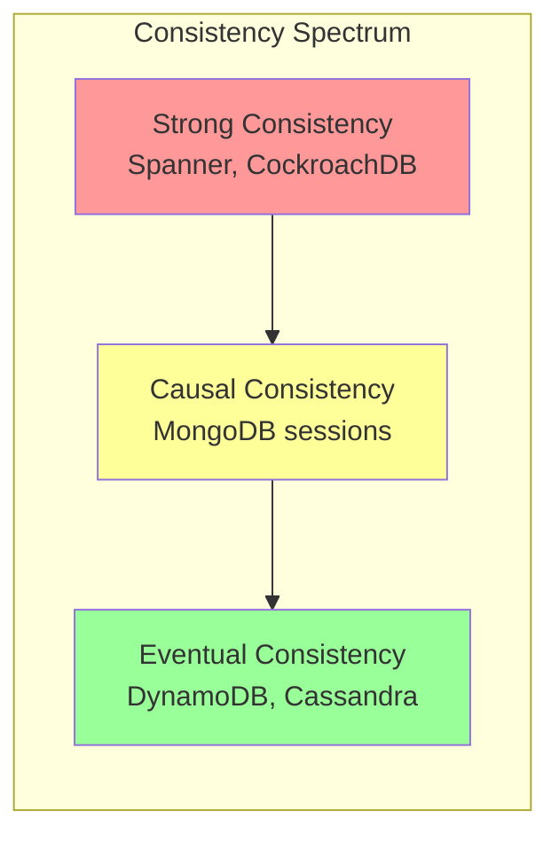
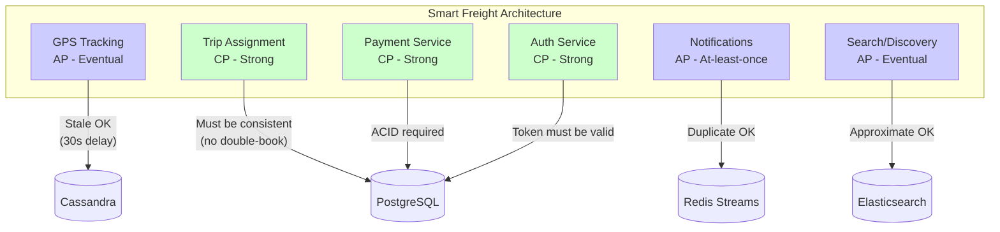
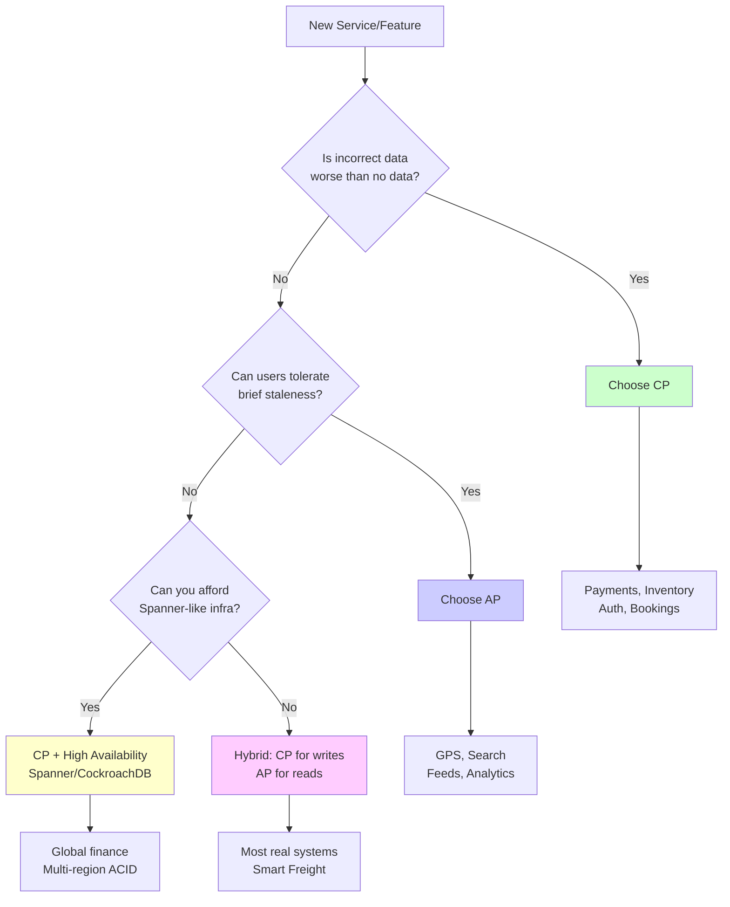

# CAP Theorem — The Fundamental Trade-off of Distributed Systems

> "You can have it all — just not at the same time during a network partition." — Eric Brewer

---

## 1. Why CAP Theorem Matters

Every distributed system (microservices, replicated databases, geo-distributed apps) must answer one question:

**When the network breaks, do you return stale data (availability) or refuse to respond (consistency)?**

### The Real-World Moment

```
Smart Freight Scenario:
├── Your GPS service runs in Mumbai + Pune data centers
├── A fiber cut breaks communication between them
├── A shipper in Pune requests "where is my truck?"
│
├── Option A (Consistency): "Sorry, system unavailable" → shipper panics
├── Option B (Availability): Show last-known position (30 sec stale) → shipper waits
└── Your business decides which is worse
```

---

## 2. The Three Guarantees (C, A, P)

### Formal Definitions

| Property | Meaning | Formal |
|----------|---------|--------|
| **Consistency** | Every read receives the most recent write | All nodes see the same data at the same time (linearizability) |
| **Availability** | Every request gets a (non-error) response | Every non-failing node returns a response in reasonable time |
| **Partition Tolerance** | System continues despite network failures | System operates even when messages between nodes are dropped |

### Mermaid Visualization



### Key Insight: P is Not Optional

In any distributed system, network partitions **will** happen. So the real choice is:

```
Distributed System → P is mandatory
                   → Choose between C and P... wait, both need P
                   → Real choice: CP or AP (during partitions)
```

**CAP is really about: What do you sacrifice DURING a partition?**

---

## 3. Deep Dive: Each Property

### 3.1 Consistency (Linearizability)

```
Write x=5 to Node A
                    ← Network replication →
Read from Node B should return x=5

If Node B returns x=3 (old value) → Consistency violated
```

**Levels of Consistency (strongest → weakest):**

| Level | Guarantee | Example |
|-------|-----------|---------|
| **Linearizability** | Reads always see latest write | ZooKeeper |
| **Sequential** | All nodes see same order | Spanner |
| **Causal** | Causally related ops in order | MongoDB (causal reads) |
| **Eventual** | All nodes converge... eventually | DynamoDB, Cassandra |

### 3.2 Availability

```python
# Available system: ALWAYS responds (even if stale)
def handle_request(request):
    try:
        return get_data()  # May be stale during partition
    except:
        return get_local_cache()  # Never returns error to client

# Unavailable system: May refuse during partition
def handle_request(request):
    if not can_reach_leader():
        raise ServiceUnavailableError()  # 503
    return get_consistent_data()
```

**Availability ≠ Uptime**
- 99.99% uptime but returning errors during partitions = NOT available (in CAP terms)
- Always responding (even with stale data) = Available

### 3.3 Partition Tolerance



---

## 4. The CAP Proof (Simplified)

### Why You Can't Have All Three

```
Given:
- Two nodes: N1, N2
- A network partition separates them
- Client writes x=1 to N1

Scenario:
1. N1 has x=1, N2 has x=0 (old)
2. Client reads from N2

To be CONSISTENT: N2 must return x=1
  → But N2 can't get x=1 (partition blocks replication)
  → N2 must WAIT or REFUSE → NOT available

To be AVAILABLE: N2 must respond
  → N2 can only return x=0 (its local value)
  → Client gets stale data → NOT consistent

∴ Cannot have both C and A during partition P
```

### The Formal Proof (Gilbert & Lynch, 2002)

```
Theorem: It is impossible for a distributed system to simultaneously 
provide all three of Consistency, Availability, and Partition Tolerance.

Proof sketch:
- Assume a system provides C + A + P
- Introduce a partition between two nodes
- Write to one side → read from other side
- Contradiction: Can't be both fresh (C) and responding (A)
```

---

## 5. CP Systems — Consistency + Partition Tolerance

**Behavior during partition:** Refuses some requests to maintain consistency.

### Examples & How They Work

| System | How It Achieves CP |
|--------|-------------------|
| **ZooKeeper** | Leader-based; minority partition becomes read-only |
| **etcd** | Raft consensus; needs quorum (majority) to write |
| **HBase** | Region server must contact master; fails if partitioned |
| **MongoDB** (default) | Primary handles writes; secondaries may be unavailable |
| **Redis Cluster** (WAIT) | Can block until replicas acknowledge |

### ZooKeeper Example (CP)

```
Cluster: 5 nodes (need 3 for quorum)

Partition splits: [Node1, Node2] | [Node3, Node4, Node5]

Left partition (2 nodes):
  - Cannot form quorum (need 3)
  - REFUSES writes → maintains consistency
  - Returns error to clients → sacrifices availability

Right partition (3 nodes):
  - Forms quorum ✓
  - Elects new leader among Node3-5
  - Serves reads AND writes normally
```

### When to Choose CP

```
Use CP when:
├── Financial transactions (bank transfers)
├── Inventory systems (can't oversell)
├── Leader election / distributed locks
├── Configuration management (etcd, ZooKeeper)
└── Any system where WRONG data is worse than NO data

Smart Freight CP Example:
├── Payment processing → Never charge twice
├── Trip assignment → One driver per trip (no double-booking)
└── Wallet balance → Must be accurate
```

---

## 6. AP Systems — Availability + Partition Tolerance

**Behavior during partition:** Always responds, but data may be stale/conflicting.

### Examples & How They Work

| System | How It Achieves AP |
|--------|-------------------|
| **Cassandra** | Tunable consistency; can read/write with 1 replica |
| **DynamoDB** | Eventually consistent reads by default |
| **CouchDB** | Multi-master replication with conflict detection |
| **DNS** | Returns cached records even if source is unreachable |
| **Riak** | Vector clocks + sibling resolution |

### Cassandra Example (AP)

```
Cluster: 3 replicas, Consistency Level = ONE

Partition splits: [Replica1] | [Replica2, Replica3]

Both sides:
  - Can serve reads AND writes (CL=ONE satisfied)
  - Data diverges during partition
  - After partition heals → anti-entropy repair reconciles

Conflict resolution: Last-Write-Wins (LWW) by timestamp
```

### When to Choose AP

```
Use AP when:
├── Social media feeds (stale post OK)
├── Product catalog (price update delay OK)
├── Analytics / metrics (approximate OK)
├── Shopping cart (merge conflicts later)
└── Any system where STALE data is better than NO data

Smart Freight AP Example:
├── GPS location tracking → 30-sec stale position is fine
├── Notification delivery → Duplicate OK, missed = bad
├── Search results → Slightly outdated driver list is acceptable
└── Activity feed → Timeline can be eventually consistent
```

---

## 7. CA Systems — Do They Exist?

### The Controversy

```
CA = Consistent + Available, NOT Partition Tolerant

But... in a distributed system, partitions ALWAYS happen
  → CA means "single node" or "same network assumed reliable"
  → Once you distribute, P is unavoidable
  → CA is essentially a non-distributed system
```

### "CA" Systems (Single-Node or LAN-Only)

| System | Why It's "CA" |
|--------|---------------|
| **Single-node PostgreSQL** | No partition possible (one machine) |
| **Oracle RAC** (shared disk) | Treats network as reliable (shared storage) |
| **Traditional RDBMS** | Master-only, no replication |

### The Modern View

```
CA doesn't exist in distributed systems.
CAP is really: During a partition, choose C or A.
When there's NO partition, you can have BOTH C and A.
```

---

## 8. CAP in Practice: It's a Spectrum

### Real Systems Are Not Pure CP or AP



### Tunable Consistency (Cassandra/DynamoDB)

```python
# Cassandra: You CHOOSE per-query
# N = total replicas, R = read quorum, W = write quorum

# Strong consistency: R + W > N
# Example: N=3, R=2, W=2 → 2+2 > 3 → guaranteed overlap

# AP mode (fast): R=1, W=1
session.execute(
    SimpleStatement("SELECT * FROM gps_positions WHERE truck_id = %s", 
                    consistency_level=ConsistencyLevel.ONE)
)

# CP mode (safe): R=QUORUM, W=QUORUM
session.execute(
    SimpleStatement("UPDATE wallet SET balance = %s WHERE driver_id = %s",
                    consistency_level=ConsistencyLevel.QUORUM)
)
```

### The R + W > N Rule

```
N = Number of replicas
R = Replicas that must respond to a READ
W = Replicas that must acknowledge a WRITE

If R + W > N → At least one node has latest write → Strong consistency
If R + W ≤ N → May read stale data → Eventual consistency

Examples (N=3):
┌─────────┬─────┬─────┬──────────────────┬────────────┐
│ Setting │  R  │  W  │ R+W > N?         │ Type       │
├─────────┼─────┼─────┼──────────────────┼────────────┤
│ Fast    │  1  │  1  │ 2 > 3? NO        │ Eventual   │
│ Balanced│  2  │  2  │ 4 > 3? YES       │ Strong     │
│ Write-  │  3  │  1  │ 4 > 3? YES       │ Strong     │
│ heavy   │     │     │                  │ (fast write│
│ Read-   │  1  │  3  │ 4 > 3? YES       │ Strong     │
│ heavy   │     │     │                  │ (fast read)│
└─────────┴─────┴─────┴──────────────────┴────────────┘
```

---

## 9. Beyond CAP: PACELC Theorem

### CAP Doesn't Tell the Full Story

CAP only talks about partition scenarios. What about normal operation?

```
PACELC:
  if (Partition) → choose Availability or Consistency (same as CAP)
  else (normal) → choose Latency or Consistency

Full expression: PAC / ELC
  PA/EL → Available during partition, Low latency normally (DynamoDB, Cassandra)
  PA/EC → Available during partition, Consistent normally (???)
  PC/EL → Consistent during partition, Low latency normally (???)  
  PC/EC → Consistent during partition, Consistent normally (Spanner, VoltDB)
```

### PACELC Classification

```mermaid
quadrantChart
    title PACELC System Classification
    x-axis "During Partition: Availability" --> "Consistency"
    y-axis "Normal: Latency" --> "Consistency"
    quadrant-1 PC/EC (Always Consistent)
    quadrant-2 PA/EC (Rare)
    quadrant-3 PA/EL (Fast & Available)
    quadrant-4 PC/EL (Rare)
    "Spanner": [0.8, 0.85]
    "CockroachDB": [0.75, 0.8]
    "DynamoDB": [0.2, 0.2]
    "Cassandra": [0.25, 0.15]
    "MongoDB": [0.7, 0.5]
    "PostgreSQL+Replicas": [0.6, 0.6]
```

| System | During Partition | Normal Operation | PACELC |
|--------|-----------------|------------------|--------|
| DynamoDB | Available (AP) | Low Latency | PA/EL |
| Cassandra | Available (AP) | Low Latency | PA/EL |
| MongoDB | Consistent (CP) | Low Latency | PC/EL |
| Spanner | Consistent (CP) | Consistent | PC/EC |
| CockroachDB | Consistent (CP) | Consistent | PC/EC |

---

## 10. Smart Freight: CAP Decisions in Practice

### Service-Level CAP Choices



### Decision Matrix for Smart Freight

```
┌────────────────────────┬────────┬─────────────────────────────────┐
│ Service                │ Choice │ Reasoning                        │
├────────────────────────┼────────┼─────────────────────────────────┤
│ GPS Location           │ AP     │ Stale position > no position    │
│ Trip Assignment        │ CP     │ Double-booking = money loss     │
│ Payment/Wallet         │ CP     │ Wrong balance = legal issue     │
│ Driver Search          │ AP     │ Missing 1 driver in list is OK  │
│ Notifications          │ AP     │ Duplicate notification > missed │
│ Authentication         │ CP     │ Invalid token = security breach │
│ Route History          │ AP     │ Analytics can be delayed        │
│ Fare Calculation       │ CP     │ Must use consistent rates       │
│ ETA Estimation         │ AP     │ Approximate ETA is acceptable   │
│ Document Verification  │ CP     │ Compliance requires accuracy    │
└────────────────────────┴────────┴─────────────────────────────────┘
```

### Implementation Pattern: Dual-Write with Fallback

```typescript
// Smart Freight: GPS location update
// Strategy: Write to both, but ALWAYS respond (AP behavior)

async function updateTruckLocation(truckId: string, lat: number, lng: number) {
  const location = { truckId, lat, lng, timestamp: Date.now() };
  
  // Primary: Try consistent store
  try {
    await prisma.truckLocation.upsert({
      where: { truckId },
      update: { lat, lng, updatedAt: new Date() },
      create: { truckId, lat, lng },
    });
  } catch (error) {
    // DB unreachable? Still don't fail the request
    logger.warn('Primary DB write failed, using fallback', { truckId, error });
  }
  
  // Secondary: Always write to Redis (fast, AP)
  await redis.geoadd('truck:locations', lng, lat, truckId);
  await redis.set(`truck:${truckId}:last`, JSON.stringify(location), 'EX', 300);
  
  // Always return success to device (availability > consistency for GPS)
  return { status: 'ok', timestamp: location.timestamp };
}

// Reading: Prefer consistent, fallback to cache
async function getTruckLocation(truckId: string) {
  try {
    // Try consistent source first
    const dbLocation = await prisma.truckLocation.findUnique({ where: { truckId } });
    if (dbLocation) return { ...dbLocation, source: 'primary' };
  } catch {
    // Partition? Fall through to cache
  }
  
  // Fallback: Redis (may be slightly stale)
  const cached = await redis.get(`truck:${truckId}:last`);
  if (cached) return { ...JSON.parse(cached), source: 'cache', stale: true };
  
  // Last resort: Return last known from any source
  return { truckId, status: 'unknown', stale: true };
}
```

---

## 11. Conflict Resolution Strategies (AP Systems)

When you choose AP, conflicts **will** happen. How to resolve them:

### Strategy 1: Last-Write-Wins (LWW)

```python
# Simple but lossy — later timestamp wins
def resolve_lww(version_a, version_b):
    if version_a.timestamp > version_b.timestamp:
        return version_a
    return version_b

# Problem: If clocks are skewed, "later" may not mean "correct"
# Use: Cassandra default, DynamoDB default
# Good for: GPS positions, metrics, logs
# Bad for: Shopping carts, counters, balances
```

### Strategy 2: Vector Clocks

```python
# Track causality — detect true conflicts vs. sequential updates
class VectorClock:
    def __init__(self, nodes):
        self.clock = {node: 0 for node in nodes}
    
    def increment(self, node):
        self.clock[node] += 1
    
    def merge(self, other):
        """Take max of each component"""
        for node in self.clock:
            self.clock[node] = max(self.clock[node], other.clock.get(node, 0))
    
    def is_concurrent(self, other):
        """Neither dominates the other → true conflict"""
        dominated_by_other = all(
            self.clock[n] <= other.clock.get(n, 0) for n in self.clock
        )
        dominates_other = all(
            self.clock[n] >= other.clock.get(n, 0) for n in self.clock
        )
        return not dominated_by_other and not dominates_other

# Example:
# Node A: {A:2, B:1} — saw B's first write, did 2 writes
# Node B: {A:1, B:2} — saw A's first write, did 2 writes
# These are CONCURRENT → need application-level resolution
```

### Strategy 3: CRDTs (Conflict-Free Replicated Data Types)

```python
# Data structures that ALWAYS merge correctly — no conflicts possible

# G-Counter (Grow-only counter) — each node has its own counter
class GCounter:
    def __init__(self, node_id, nodes):
        self.node_id = node_id
        self.counts = {node: 0 for node in nodes}
    
    def increment(self):
        self.counts[self.node_id] += 1
    
    def value(self):
        return sum(self.counts.values())
    
    def merge(self, other):
        """Take max of each node's count — always converges"""
        for node in self.counts:
            self.counts[node] = max(self.counts[node], other.counts.get(node, 0))

# PN-Counter (supports increment AND decrement)
class PNCounter:
    def __init__(self, node_id, nodes):
        self.increments = GCounter(node_id, nodes)
        self.decrements = GCounter(node_id, nodes)
    
    def increment(self):
        self.increments.increment()
    
    def decrement(self):
        self.decrements.increment()
    
    def value(self):
        return self.increments.value() - self.decrements.value()

# Use: Redis CRDT (active-active), Riak data types
# Smart Freight: Trip count per driver (distributed counters)
```

### Strategy 4: Application-Level Merge

```typescript
// Shopping cart merge — union of items
function mergeShoppingCarts(cartA: CartItem[], cartB: CartItem[]): CartItem[] {
  const merged = new Map<string, CartItem>();
  
  // Take max quantity for each item
  for (const item of [...cartA, ...cartB]) {
    const existing = merged.get(item.productId);
    if (!existing || item.quantity > existing.quantity) {
      merged.set(item.productId, item);
    }
  }
  
  return Array.from(merged.values());
}
```

### Conflict Resolution Comparison

```
┌──────────────────┬────────────┬───────────┬───────────────────┐
│ Strategy         │ Data Loss? │ Complexity│ Use Case           │
├──────────────────┼────────────┼───────────┼───────────────────┤
│ Last-Write-Wins  │ Yes        │ Simple    │ Metrics, GPS, logs │
│ Vector Clocks    │ No (detect)│ Medium    │ General KV stores  │
│ CRDTs            │ No         │ High      │ Counters, sets     │
│ App-Level Merge  │ No         │ Custom    │ Domain-specific    │
└──────────────────┴────────────┴───────────┴───────────────────┘
```

---

## 12. Common Misconceptions & Mistakes

### Misconception 1: "We chose AP so we have no consistency"

```
WRONG: AP during partition ≠ always inconsistent

Reality:
├── When network is HEALTHY → system is BOTH consistent and available
├── CAP trade-off only kicks in DURING a partition
├── Most of the time (99.9%+) your system has no partitions
└── Eventual consistency means "converges quickly" (often milliseconds)
```

### Misconception 2: "CAP means pick 2 out of 3"

```
WRONG: You don't "pick 2 and lose 1 forever"

Reality:
├── P is not optional in distributed systems
├── Real choice: What to sacrifice DURING a partition
├── CA = single-node system (not distributed)
└── Think of it as "CP or AP during failures"
```

### Misconception 3: "MongoDB is CP so it's always consistent"

```
WRONG: MongoDB's behavior depends on read/write concern

Reality:
├── Default read concern: "local" (may read uncommitted data)
├── Default write concern: w=1 (acknowledged by primary only)
├── For TRUE consistency: readConcern="majority" + writeConcern="majority"
└── Most users run MongoDB in an eventually-consistent mode!
```

### Misconception 4: "Latency and Availability are the same"

```
WRONG: A slow response is still "available" in CAP terms

Reality:
├── CAP Availability: System responds (even if slow)
├── SLA Availability: System responds WITHIN time limit
├── Spanner is "CP" but has 99.999% uptime
└── CAP doesn't consider response time — PACELC does
```

### ❌ Anti-Pattern: Treating All Data the Same

```typescript
// ❌ BAD: Everything goes through one consistency model
const config = {
  database: 'postgresql',  // Strong consistency for ALL data
  replication: 'synchronous',
};
// Result: GPS updates bottlenecked by synchronous replication

// ✅ GOOD: Match consistency to data requirements
const services = {
  payments: { db: 'postgresql', consistency: 'strong' },
  gpsTracking: { db: 'redis', consistency: 'eventual' },
  tripAssignment: { db: 'postgresql', consistency: 'serializable' },
  analytics: { db: 'clickhouse', consistency: 'eventual' },
};
```

### ❌ Anti-Pattern: Ignoring Partition Detection

```typescript
// ❌ BAD: No partition detection — system behaves unpredictably
async function writeData(data) {
  await primaryDB.write(data);  // Hangs forever if partitioned
}

// ✅ GOOD: Explicit partition handling with timeouts
async function writeData(data) {
  try {
    await Promise.race([
      primaryDB.write(data),
      timeout(2000),  // 2-second deadline
    ]);
  } catch (error) {
    if (error.code === 'TIMEOUT' || error.code === 'ECONNREFUSED') {
      // Partition detected — switch to AP mode
      await localQueue.enqueue(data);  // Write locally, sync later
      return { status: 'accepted', mode: 'degraded' };
    }
    throw error;
  }
}
```

---

## 13. Real-World CAP Examples

### How Big Companies Decide

| Company | Service | Choice | Why |
|---------|---------|--------|-----|
| **Amazon** | Shopping Cart | AP | Cart must always work; merge conflicts later |
| **Amazon** | Order Processing | CP | Can't oversell inventory |
| **Google** | Spanner | CP | Global strong consistency (TrueTime) |
| **Netflix** | Recommendations | AP | Stale recommendations are fine |
| **Uber** | Ride Matching | CP | Can't assign same driver twice |
| **Uber** | ETA Display | AP | Approximate ETA is acceptable |
| **Twitter** | Timeline | AP | Missing a tweet briefly is OK |
| **Banks** | Transfers | CP | Wrong balance = legal liability |

### Google Spanner: Having It "All" (Almost)

```
How Spanner achieves "effectively CA" in a distributed system:

1. TrueTime API → GPS + atomic clocks → bounded clock uncertainty
2. Commit wait → delays commit until uncertainty window passes
3. Result: Externally consistent (strongest consistency)
4. Trade-off: Higher latency (commit wait ~7ms average)

Why it works:
├── Google controls the ENTIRE network (private fiber)
├── Partitions are extremely rare (redundant paths)
├── When partitions occur, Spanner chooses Consistency (CP)
├── But partitions are so rare it "feels" like CA
└── Cost: Only Google can afford this infrastructure
```

### DynamoDB: AP with Knobs

```
DynamoDB gives you both modes:

Eventually Consistent Read (default):
├── Fast (single replica)
├── May return stale data (ms to seconds)
├── Half the cost of strong reads
└── Use for: GPS, analytics, feeds

Strongly Consistent Read:
├── Slower (must contact leader)
├── Always returns latest write
├── Double the read cost
└── Use for: Payments, inventory, user profiles
```

---

## 14. Interview Questions & Answers

### Q1: "Explain CAP theorem in simple terms"

**Framework Answer:**
```
CAP theorem states that a distributed system can provide at most 
two of three guarantees simultaneously:
- Consistency: All nodes see the same data
- Availability: Every request gets a response
- Partition Tolerance: System works despite network failures

Since network partitions are inevitable in distributed systems, 
the real choice is between consistency and availability DURING a partition.

Example: If Mumbai-Pune link breaks in Smart Freight:
- CP choice: GPS service returns error (consistent but unavailable)
- AP choice: GPS shows last-known position (available but stale)
```

### Q2: "Your system needs to handle payments AND show real-time locations. How do you apply CAP?"

**Answer:**
```
Different services need different CAP choices:

Payment Service (CP):
- Cannot have inconsistent balances
- If partition occurs, reject the transaction
- Use PostgreSQL with synchronous replication
- Accept brief unavailability over wrong charges

GPS Tracking (AP):
- Stale location (30s old) is better than no location
- If partition occurs, show last-known position
- Use Redis/Cassandra with eventual consistency
- Accept staleness over service outage

Key insight: CAP is applied per-service, not system-wide.
A single system can have both CP and AP components.
```

### Q3: "Is it possible to have all three? What about Google Spanner?"

**Answer:**
```
Theoretically impossible (proven by Gilbert & Lynch, 2002).
Practically, Spanner comes very close because:

1. Google owns the entire network infrastructure
2. TrueTime (GPS + atomic clocks) minimizes uncertainty
3. Partitions are astronomically rare on Google's network
4. When they DO occur, Spanner chooses Consistency (it's CP)

So Spanner is technically CP but with 99.999% availability because 
partitions almost never happen on their infrastructure.

For the rest of us without Google's network:
- Accept that partitions will happen
- Design for graceful degradation
- Use different strategies for different data
```

### Q4: "How do you handle conflicts in an AP system?"

**Answer:**
```
Four strategies, ordered by complexity:

1. Last-Write-Wins (LWW):
   - Latest timestamp wins
   - Simple but may lose data
   - Use for: metrics, GPS, logs

2. Vector Clocks:
   - Track causal relationships
   - Detect true conflicts
   - Use for: general KV stores (Riak, Dynamo)

3. CRDTs:
   - Mathematically guaranteed to merge without conflicts
   - Use for: counters, sets, registers
   - Example: G-Counter, OR-Set

4. Application-Level Merge:
   - Custom logic per domain
   - Use for: shopping carts (union), documents (OT/CRDT)

Smart Freight: GPS uses LWW (latest position wins),
trip counters use CRDTs, wallet uses CP (avoid conflicts entirely).
```

### Q5: "What is PACELC and how does it extend CAP?"

**Answer:**
```
PACELC addresses CAP's blind spot: What happens when there's NO partition?

PAC: During Partition → Availability or Consistency (same as CAP)
ELC: Else (normal) → Latency or Consistency

System classifications:
- PA/EL (DynamoDB, Cassandra): Fast always, eventually consistent
- PC/EC (Spanner): Always consistent, accepts latency cost
- PC/EL (MongoDB default): Consistent during partition, fast normally

This matters because most of the time there's no partition,
and the Latency vs Consistency trade-off affects every single request.
```

---

## 15. Decision Framework

### When to Choose CP vs AP



### Quick Reference Decision Table

```
Ask yourself:

1. "If this data is wrong, what happens?"
   → Legal/financial harm → CP
   → Minor inconvenience → AP

2. "If this service is down for 30 seconds, what happens?"
   → Users leave/revenue lost → AP (stay available)
   → Users can retry later → CP (be correct)

3. "How fresh does this data need to be?"
   → Real-time exact → CP
   → Seconds/minutes stale OK → AP

4. "What's the conflict resolution cost?"
   → Hard to merge/undo → CP (prevent conflicts)
   → Easy to merge → AP (resolve later)
```

---

## 16. Cheat Sheet

```
┌─────────────────────────────────────────────────────────────────┐
│                    CAP THEOREM CHEAT SHEET                       │
├─────────────────────────────────────────────────────────────────┤
│                                                                 │
│  C = Every read gets the latest write (linearizability)         │
│  A = Every request gets a non-error response                    │
│  P = System works despite network partitions                    │
│                                                                 │
│  Key Insight: P is mandatory → real choice is C or A            │
│                                                                 │
│  CP Systems: ZooKeeper, etcd, HBase, MongoDB (majority)         │
│  AP Systems: Cassandra, DynamoDB, CouchDB, DNS                  │
│  CA Systems: Single-node RDBMS (not truly distributed)          │
│                                                                 │
│  PACELC: During Partition (A or C) / Else (Latency or C)        │
│                                                                 │
│  Tunable Consistency: R + W > N → strong; R + W ≤ N → eventual  │
│                                                                 │
│  Conflict Resolution: LWW < Vector Clocks < CRDTs < App-Merge   │
│                                                                 │
│  Per-Service Decision (not system-wide):                        │
│    Money/Booking/Auth → CP                                      │
│    GPS/Search/Feeds → AP                                        │
│                                                                 │
│  Spanner "breaks" CAP by making partitions nearly impossible    │
│                                                                 │
│  Most systems: CP for writes, AP for reads (hybrid approach)    │
│                                                                 │
└─────────────────────────────────────────────────────────────────┘
```
