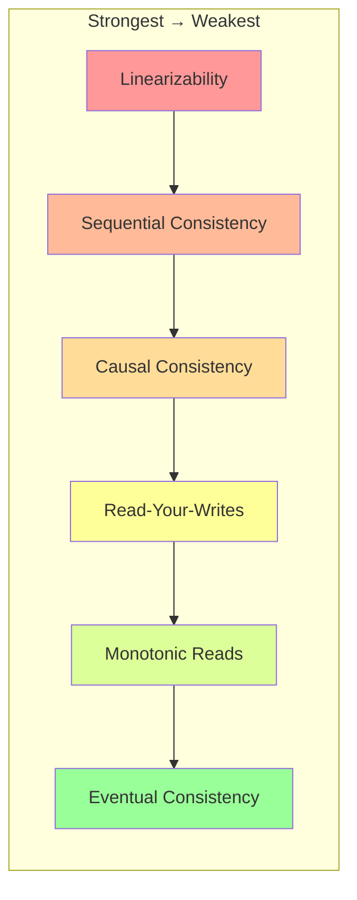
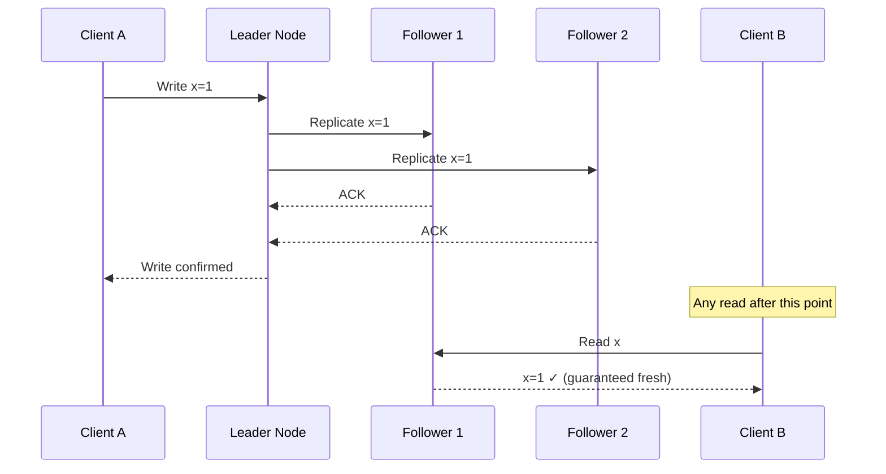
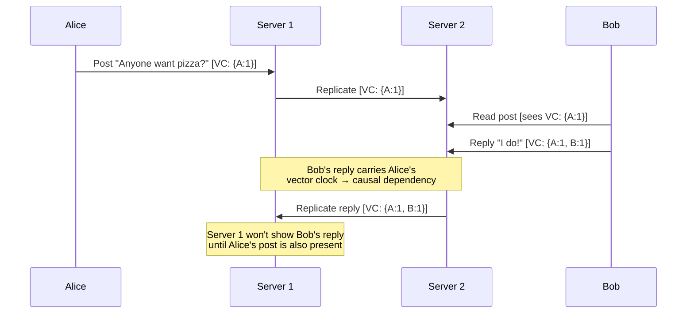
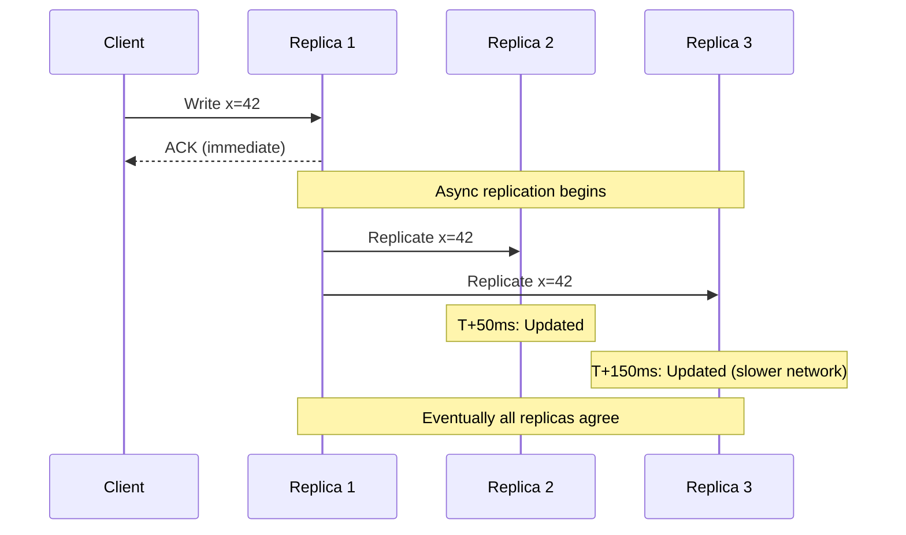
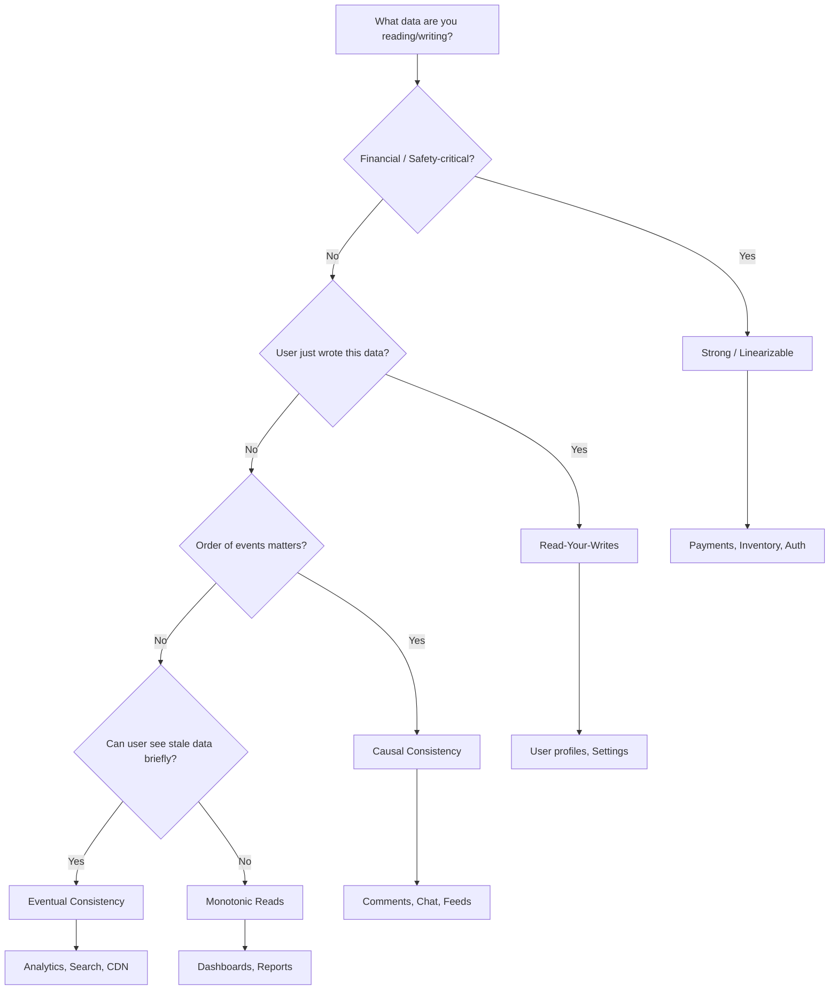

# Consistency Models — The Spectrum of Data Correctness

> "Consistency is not binary. It's a spectrum — and choosing the right point on that spectrum is what separates good architects from great ones."

---

## 1. Why Consistency Models Matter

After learning CAP theorem, you know distributed systems must choose between consistency and availability during partitions. But **consistency itself has many levels** — from "every read sees the latest write" to "reads will eventually catch up."

```
The Real Question:
├── You have 5 replicas of your database
├── User writes "balance = ₹500" to Replica 1
├── Another user reads from Replica 3
│
├── Strict: Must return ₹500 (blocks until replicated)
├── Eventual: May return old value, but WILL converge
├── Causal: Returns ₹500 IF reader saw the write happen
└── Your choice depends on what your system can tolerate
```

---

## 2. The Consistency Spectrum



### Overview Table

| Model | Guarantee | Latency | Use Case |
|-------|-----------|---------|----------|
| **Linearizability** | Reads always see latest write | Highest | Bank balances, locks |
| **Sequential** | All nodes see same ORDER of operations | High | Distributed databases |
| **Causal** | Causally related ops are ordered | Medium | Social media, comments |
| **Read-Your-Writes** | You see your own writes | Low-Medium | User profiles |
| **Monotonic Reads** | Never see older data after seeing newer | Low | Dashboards |
| **Eventual** | All replicas converge... eventually | Lowest | DNS, caches, analytics |

---

## 3. Linearizability (Strongest)

### Definition
Every operation appears to happen instantaneously at some point between invocation and response. All nodes agree on the same order, and that order matches real-time.

```
Timeline:
Client A: Write x=1 ─────────|──────── (completes at T1)
Client B:          Read x ────|──────── (starts at T2 > T1)
                              ↑
                    B MUST see x=1 (linearizable)
```

### How It Works



### Implementation: Quorum-Based

```python
class LinearizableKVStore:
    """
    Using quorum reads/writes (R + W > N) for linearizability.
    N=3 replicas, W=2 (write quorum), R=2 (read quorum)
    """
    def __init__(self, replicas):
        self.replicas = replicas  # List of replica connections
        self.N = len(replicas)
        self.W = self.N // 2 + 1  # Majority for writes
        self.R = self.N // 2 + 1  # Majority for reads
    
    def write(self, key, value):
        version = int(time.time() * 1000000)  # Lamport-ish timestamp
        acks = 0
        for replica in self.replicas:
            try:
                replica.put(key, value, version)
                acks += 1
            except ConnectionError:
                continue
        
        if acks < self.W:
            raise WriteFailedError(f"Only {acks}/{self.W} acks received")
        return version
    
    def read(self, key):
        responses = []
        for replica in self.replicas:
            try:
                val, ver = replica.get(key)
                responses.append((val, ver))
            except ConnectionError:
                continue
        
        if len(responses) < self.R:
            raise ReadFailedError("Quorum not reached")
        
        # Return the value with highest version (latest write)
        responses.sort(key=lambda x: x[1], reverse=True)
        latest_value, latest_version = responses[0]
        
        # Read repair: update stale replicas
        for replica in self.replicas:
            try:
                replica.put(key, latest_value, latest_version)
            except ConnectionError:
                continue
        
        return latest_value
```

### When to Use
- Bank account balances
- Distributed locks (leader election)
- Inventory counts (prevent overselling)
- Configuration management (etcd, ZooKeeper)

### Cost
- **High latency** — must wait for quorum/leader
- **Lower throughput** — serialization bottleneck
- **Reduced availability** — unavailable during partitions (CP)

---

## 4. Sequential Consistency

### Definition
All nodes see operations in the **same order**, but that order doesn't need to match real-time. Like a single-threaded execution that all agree on.

```
Real-time:          Client A writes x=1, then Client B writes x=2
Sequential order:   Could be [x=2, x=1] — as long as ALL nodes see this same order

Linearizable: Order MUST match real-time → [x=1, x=2]
Sequential:   Order just needs to be AGREED upon → [x=2, x=1] is valid
```

### Difference from Linearizability

```
Linearizable:
  Wall clock: A writes at 10:00, B writes at 10:01
  Required order: A's write, then B's write (must match real time)

Sequential:
  Wall clock: A writes at 10:00, B writes at 10:01
  Allowed order: B's write, then A's write (if all nodes agree on this)
  
Key: Sequential = same order for all. Linearizable = same order AND matches real time.
```

### Implementation: Total Order Broadcast

```python
class SequentialConsistencyStore:
    """
    Use a single sequencer to assign order numbers.
    All operations are totally ordered.
    """
    def __init__(self):
        self.sequence_number = 0
        self.log = []  # Ordered operation log
        self.state = {}  # Current KV state
        self.lock = threading.Lock()
    
    def append_to_log(self, operation):
        with self.lock:
            self.sequence_number += 1
            entry = {
                'seq': self.sequence_number,
                'op': operation,
                'timestamp': time.time()
            }
            self.log.append(entry)
            self._apply(entry)
            return entry['seq']
    
    def _apply(self, entry):
        op = entry['op']
        if op['type'] == 'write':
            self.state[op['key']] = op['value']
    
    def write(self, key, value):
        return self.append_to_log({'type': 'write', 'key': key, 'value': value})
    
    def read(self, key):
        # Read from local state (which follows the total order)
        return self.state.get(key)
```

### When to Use
- Multi-processor systems
- Distributed databases where order matters but real-time isn't critical
- Replicated state machines

---

## 5. Causal Consistency

### Definition
Operations that are **causally related** are seen in the same order by all nodes. Concurrent (unrelated) operations can be seen in any order.

```
Causal relationship:
  Alice posts: "Anyone want pizza?"          (Event A)
  Bob replies: "I do!"                       (Event B, caused by A)
  
  ALL nodes must see A before B (causal order)
  
Concurrent (no causal relation):
  Alice posts about pizza                    (Event A)
  Charlie posts about weather                (Event C)
  
  Some nodes see A first, others see C first (both valid)
```

### How Causality is Tracked



### Implementation: Vector Clocks

```python
class CausalKVStore:
    """
    Track causality using vector clocks.
    Ensures causally related operations are ordered.
    """
    def __init__(self, node_id, num_nodes):
        self.node_id = node_id
        self.vector_clock = [0] * num_nodes
        self.store = {}  # key -> (value, vector_clock)
        self.pending = []  # Operations waiting for causal dependencies
    
    def write(self, key, value, client_clock=None):
        # Merge client's clock (captures what client has seen)
        if client_clock:
            for i in range(len(self.vector_clock)):
                self.vector_clock[i] = max(self.vector_clock[i], client_clock[i])
        
        # Increment own component
        self.vector_clock[self.node_id] += 1
        
        self.store[key] = (value, list(self.vector_clock))
        return list(self.vector_clock)
    
    def read(self, key):
        if key in self.store:
            value, clock = self.store[key]
            # Update our clock to reflect this read
            for i in range(len(self.vector_clock)):
                self.vector_clock[i] = max(self.vector_clock[i], clock[i])
            return value, list(self.vector_clock)
        return None, list(self.vector_clock)
    
    def receive_replication(self, key, value, remote_clock):
        """Only apply if all causal dependencies are met."""
        if self._dependencies_met(remote_clock):
            self._apply(key, value, remote_clock)
            self._check_pending()
        else:
            self.pending.append((key, value, remote_clock))
    
    def _dependencies_met(self, remote_clock):
        """Check if we've seen all operations that happened before this one."""
        for i in range(len(self.vector_clock)):
            if i != self.node_id and remote_clock[i] > self.vector_clock[i]:
                return False  # Missing a causal dependency
        return True
    
    def _apply(self, key, value, clock):
        for i in range(len(self.vector_clock)):
            self.vector_clock[i] = max(self.vector_clock[i], clock[i])
        self.store[key] = (value, clock)
```

### When to Use
- Social media (comments must appear after the post)
- Collaborative editing (edits that depend on each other)
- Chat applications (messages in conversation order)

---

## 6. Session Guarantees (Practical Models)

These are weaker but very practical guarantees that most applications need:

### 6.1 Read-Your-Writes

```
Guarantee: After you write, YOUR subsequent reads see that write.

Example:
  User updates profile picture
  User refreshes page → MUST see new picture
  Other users → may see old picture briefly (OK)
```

```python
class ReadYourWritesProxy:
    """
    Track each client's latest write version.
    Route reads to replicas that have that version.
    """
    def __init__(self, replicas):
        self.replicas = replicas
        self.client_versions = {}  # client_id -> last_write_version
    
    def write(self, client_id, key, value):
        version = self.replicas[0].write(key, value)  # Write to primary
        self.client_versions[client_id] = version
        return version
    
    def read(self, client_id, key):
        min_version = self.client_versions.get(client_id, 0)
        
        # Find a replica that's caught up to client's last write
        for replica in self.replicas:
            if replica.get_version() >= min_version:
                return replica.read(key)
        
        # Fallback: read from primary (always up-to-date)
        return self.replicas[0].read(key)
```

### 6.2 Monotonic Reads

```
Guarantee: You never see OLDER data after seeing NEWER data.

Example:
  Read 1: balance = ₹500 (from Replica A, version 5)
  Read 2: balance = ₹300 (from Replica B, version 3) ← VIOLATION!
  
  With monotonic reads:
  Read 2 must return version ≥ 5
```

```python
class MonotonicReadsProxy:
    def __init__(self, replicas):
        self.replicas = replicas
        self.client_last_version = {}  # client_id -> last_seen_version
    
    def read(self, client_id, key):
        min_version = self.client_last_version.get(client_id, 0)
        
        for replica in self.replicas:
            value, version = replica.read_with_version(key)
            if version >= min_version:
                self.client_last_version[client_id] = version
                return value
        
        # No replica fresh enough — go to primary
        value, version = self.replicas[0].read_with_version(key)
        self.client_last_version[client_id] = version
        return value
```

### 6.3 Monotonic Writes

```
Guarantee: Your writes are applied in the order you made them.

Example:
  Write 1: Set password = "abc123"
  Write 2: Set password = "xyz789"
  
  ALL replicas must apply Write 1 before Write 2
  (Never end up with old password on some replicas)
```

### 6.4 Writes-Follow-Reads

```
Guarantee: A write that follows a read is ordered after the read's value.

Example:
  Read: "Alice says: anyone want pizza?" (version 5)
  Write: "Bob replies: I do!" (must be after version 5)
  
  All replicas see Alice's post before Bob's reply.
  (This is essentially causal consistency for a session)
```

---

## 7. Eventual Consistency (Weakest)

### Definition
If no new writes are made, all replicas will **eventually** converge to the same value. No guarantee on WHEN.

```
Write x=42 to Replica A
  ↓
  T+0ms:   Replica A has x=42, others have x=0
  T+50ms:  Replicas A,B have x=42, C has x=0
  T+200ms: All replicas have x=42 ← "eventually" consistent
  
  Window of inconsistency: 0-200ms (in practice, usually <100ms)
```

### How Eventual Consistency Works in Practice



### Anti-Entropy Mechanisms

```python
# How replicas detect and fix inconsistencies:

# 1. Read Repair — Fix stale data during reads
def read_with_repair(key, replicas, quorum_size):
    responses = []
    for r in replicas[:quorum_size]:
        responses.append(r.get(key))
    
    # Find the latest version
    latest = max(responses, key=lambda x: x.version)
    
    # Repair stale replicas in background
    for r, resp in zip(replicas, responses):
        if resp.version < latest.version:
            r.put(key, latest.value, latest.version)  # Async repair
    
    return latest.value

# 2. Merkle Tree — Efficiently find differing keys between replicas
class MerkleTree:
    """
    Hash tree over key ranges. Compare root hashes first —
    if equal, replicas are in sync. If not, drill down to find
    the specific differing keys.
    """
    def __init__(self, data: dict):
        self.data = data
        self.root = self._build(sorted(data.items()))
    
    def _build(self, items):
        if len(items) == 1:
            key, value = items[0]
            return {'hash': hashlib.md5(f"{key}:{value}".encode()).hexdigest(),
                    'keys': [key]}
        
        mid = len(items) // 2
        left = self._build(items[:mid])
        right = self._build(items[mid:])
        combined_hash = hashlib.md5(
            f"{left['hash']}:{right['hash']}".encode()
        ).hexdigest()
        
        return {'hash': combined_hash, 'left': left, 'right': right,
                'keys': left['keys'] + right['keys']}
    
    def diff(self, other_tree):
        """Find keys that differ between two replicas."""
        return self._diff_recursive(self.root, other_tree.root)
    
    def _diff_recursive(self, node1, node2):
        if node1['hash'] == node2['hash']:
            return []  # Subtrees are identical
        if 'left' not in node1:
            return node1['keys']  # Leaf node differs
        diffs = self._diff_recursive(node1['left'], node2['left'])
        diffs += self._diff_recursive(node1['right'], node2['right'])
        return diffs

# 3. Gossip Protocol — Spread updates like rumors
class GossipNode:
    def __init__(self, node_id, peers):
        self.node_id = node_id
        self.peers = peers
        self.data = {}
        self.version_map = {}  # key -> version
    
    def update(self, key, value):
        version = time.time()
        self.data[key] = value
        self.version_map[key] = version
    
    def gossip_round(self):
        """Periodically exchange state with random peer."""
        peer = random.choice(self.peers)
        # Send our version map
        their_versions = peer.receive_gossip(self.version_map, self.data)
        # Update any keys where peer has newer version
        for key, version in their_versions.items():
            if version > self.version_map.get(key, 0):
                self.data[key] = peer.data[key]
                self.version_map[key] = version
```

### When to Use
- DNS (TTL-based cache expiry)
- CDN content (eventual propagation)
- Analytics and metrics
- Social media timelines
- Search indexes

---

## 8. Strong vs Eventual Consistency: Head-to-Head

```
┌──────────────────────┬─────────────────────┬──────────────────────┐
│ Aspect               │ Strong (Linear.)    │ Eventual             │
├──────────────────────┼─────────────────────┼──────────────────────┤
│ Guarantee            │ Latest write always  │ Converges eventually │
│ Latency              │ High (wait for      │ Low (local read)     │
│                      │ quorum/leader)      │                      │
│ Throughput           │ Lower               │ Higher               │
│ Availability         │ Lower (needs quorum)│ Higher (any replica) │
│ Implementation       │ Raft, Paxos, 2PC    │ Gossip, async repli. │
│ Network partition    │ Unavailable          │ Still serves         │
│ Mental model         │ Single-node illusion │ Multiple timelines   │
│ Example              │ Spanner, etcd        │ Cassandra, DynamoDB  │
└──────────────────────┴─────────────────────┴──────────────────────┘
```

### Per-Operation Consistency (Modern Approach)

```python
# Most real systems don't use ONE consistency level for everything:

class MultiConsistencyStore:
    """
    Choose consistency level per operation.
    Like DynamoDB or Cassandra.
    """
    def read_balance(self, user_id):
        """Financial data: strong consistency."""
        return self.db.read(
            key=f"balance:{user_id}",
            consistency='strong',  # Quorum read
        )
    
    def read_recommendations(self, user_id):
        """Recommendations: eventual is fine."""
        return self.db.read(
            key=f"recs:{user_id}",
            consistency='eventual',  # Any replica
        )
    
    def read_profile(self, user_id, session_id):
        """Profile: read-your-writes (see own changes)."""
        return self.db.read(
            key=f"profile:{user_id}",
            consistency='session',  # Route to replica that has session's writes
            session_token=session_id,
        )
```

---

## 9. Consistency in Real Databases

| Database | Default Consistency | Configurable? | Strongest Available |
|----------|-------------------|---------------|-------------------|
| **PostgreSQL** | Linearizable (single node) | Replication modes | Synchronous replication |
| **MySQL** | Linearizable (single node) | Group replication | Group Replication (Paxos) |
| **MongoDB** | Eventual (default reads) | Per-operation | Linearizable (readConcern: linearizable) |
| **Cassandra** | Eventual (CL=ONE) | Per-query | Linearizable (CL=ALL + LWT) |
| **DynamoDB** | Eventual | Per-read | Strong (consistent read flag) |
| **CockroachDB** | Serializable | No (always strong) | Serializable |
| **Spanner** | External consistency | No (always strong) | External (strongest possible) |
| **Redis** | Eventual (async replication) | WAIT command | Synchronous (WAIT N) |

### MongoDB Example

```javascript
// Eventual (default) — fast but may be stale
db.orders.find({ userId: "u123" })

// Read-your-writes (session)
const session = client.startSession({ causalConsistency: true });
session.startTransaction();
db.orders.insertOne({ userId: "u123", total: 500 }, { session });
// This read IN THE SAME SESSION will see the insert above
db.orders.find({ userId: "u123" }, { session });
session.commitTransaction();

// Strong (linearizable) — slowest but freshest
db.orders.find({ userId: "u123" }).readConcern("linearizable")
```

---

## 10. Implementing Consistency in Your Application

### Pattern 1: Sticky Sessions (Read-Your-Writes)

```nginx
# Nginx: Route user to the same backend/replica
upstream app_servers {
    ip_hash;  # Same client IP → same server
    server replica1:5432;
    server replica2:5432;
    server replica3:5432;
}
```

### Pattern 2: Write-Through with Sync Replication

```python
# PostgreSQL: Synchronous replication for strong consistency
# postgresql.conf on primary:
# synchronous_standby_names = 'replica1, replica2'
# synchronous_commit = on

# Application reads from primary for critical data:
async def get_account_balance(user_id):
    # Always read from primary (strong consistency)
    return await primary_db.query(
        "SELECT balance FROM accounts WHERE user_id = $1", user_id
    )

# Non-critical reads can go to replicas:
async def get_user_activity(user_id):
    # Any replica is fine (eventual consistency)
    return await replica_pool.query(
        "SELECT * FROM activity_log WHERE user_id = $1 ORDER BY created_at DESC",
        user_id
    )
```

### Pattern 3: Version Vectors for Conflict Detection

```typescript
// Client sends version with every request
interface Request {
  data: any;
  version: Record<string, number>;  // { "node1": 5, "node2": 3 }
}

function handleWrite(req: Request, localVersion: Record<string, number>) {
  const comparison = compareVersions(req.version, localVersion);
  
  if (comparison === 'newer') {
    // Client has newer data — apply the write
    applyWrite(req.data);
    mergeVersions(localVersion, req.version);
  } else if (comparison === 'older') {
    // Client is stale — reject and send current version
    throw new ConflictError('Stale version', { currentVersion: localVersion });
  } else if (comparison === 'concurrent') {
    // True conflict — need resolution strategy
    const resolved = resolveConflict(req.data, currentData);
    applyWrite(resolved);
  }
}
```

---

## 11. Common Mistakes

### ❌ Using strong consistency everywhere

```python
# ❌ BAD: Every read goes to primary
async def get_product_listing(category):
    return await primary.query("SELECT * FROM products WHERE category = $1", category)

# ✅ GOOD: Catalog data can be eventually consistent
async def get_product_listing(category):
    return await read_replica.query("SELECT * FROM products WHERE category = $1", category)
    # Stale by a few seconds? Nobody cares for a product listing
```

### ❌ Assuming eventual = immediate

```python
# ❌ BAD: Write then immediately read from replica
await primary.execute("INSERT INTO orders ...")
order = await replica.query("SELECT * FROM orders WHERE ...")  # May be NULL!

# ✅ GOOD: Read from primary after write, or use session consistency
order = await primary.query("SELECT * FROM orders WHERE ...")  # Always fresh
```

### ❌ Not documenting consistency choices

```python
# ❌ BAD: Implicit consistency assumptions scattered across codebase

# ✅ GOOD: Explicit consistency contract per service
class OrderService:
    """
    Consistency contracts:
    - create_order(): Strong (linearizable write)
    - get_order(): Read-your-writes (session sticky)
    - list_orders(): Eventual (can be seconds stale)
    - get_balance(): Strong (financial data)
    """
    pass
```

---

## 12. Decision Framework



---

## 13. Interview Questions & Answers

### Q1: "What's the difference between linearizability and sequential consistency?"

```
Linearizability: Operations respect REAL-TIME order.
  If A completes before B starts, A is ordered before B.

Sequential consistency: All nodes agree on ONE order, 
  but it doesn't need to match wall-clock time.

Example: A writes x=1 at 10:00, B writes x=2 at 10:01
  Linearizable: Must be [x=1, x=2]
  Sequential: [x=2, x=1] is valid if all nodes agree

Linearizability ⊂ Sequential consistency (strictly stronger)
```

### Q2: "How would you implement read-your-writes consistency?"

```
Three approaches:
1. Sticky sessions — always route user to same replica (ip_hash in Nginx)
2. Version tracking — client sends last-write-version, 
   server ensures replica is at that version before reading
3. Read from primary — after a write, read from primary for a short window,
   then fall back to replicas

Trade-offs: (1) breaks on failover, (2) adds complexity, 
(3) increases primary load
```

### Q3: "When would you choose causal consistency over eventual?"

```
Choose causal when:
- Cause-and-effect matters (reply after post, debit after credit)
- Users interact with each other's data
- Order of operations affects correctness

Choose eventual when:
- Operations are independent (page views, logs)
- Staleness is acceptable (search index, recommendations)
- Maximum performance/availability is needed

Example: Chat app — messages must be causally ordered 
(reply after the message it replies to). Use vector clocks 
to track dependencies.
```

---

## 14. Cheat Sheet

```
┌─────────────────────────────────────────────────────────────────┐
│              CONSISTENCY MODELS CHEAT SHEET                      │
├─────────────────────────────────────────────────────────────────┤
│                                                                 │
│  Linearizable > Sequential > Causal > Session > Eventual        │
│  (strongest)                                    (weakest)       │
│                                                                 │
│  Linearizable: Latest write, real-time order (Spanner, etcd)    │
│  Sequential: Same order everywhere, not real-time               │
│  Causal: Related ops ordered, concurrent ops unordered          │
│  Read-Your-Writes: See your own writes                          │
│  Monotonic Reads: Never go backwards                            │
│  Eventual: Converges if writes stop (Cassandra, DNS)            │
│                                                                 │
│  Implementation:                                                │
│  - Strong: Quorum (R+W>N), Raft, Paxos                         │
│  - Causal: Vector clocks, dependency tracking                   │
│  - Session: Sticky sessions, version tokens                     │
│  - Eventual: Gossip, async replication, anti-entropy            │
│                                                                 │
│  Anti-Entropy: Read repair, Merkle trees, gossip protocol       │
│                                                                 │
│  Rule: Choose consistency PER OPERATION, not per system         │
│  - Money → Strong  |  Profile → Session  |  Analytics → Eventual│
│                                                                 │
└─────────────────────────────────────────────────────────────────┘
```
