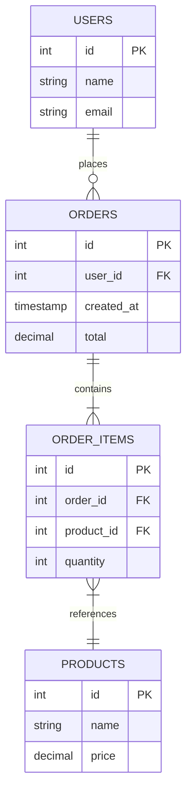
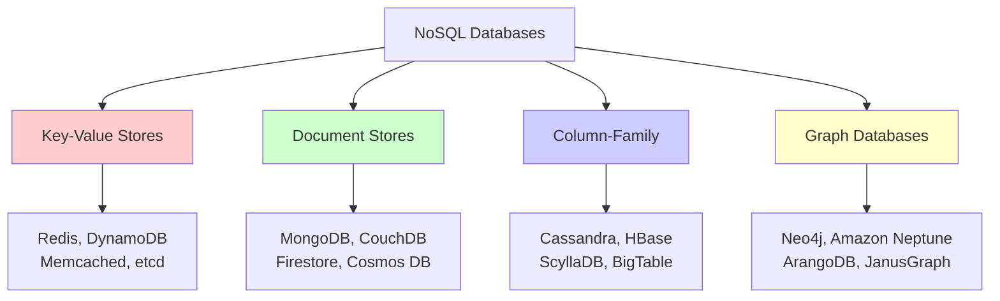
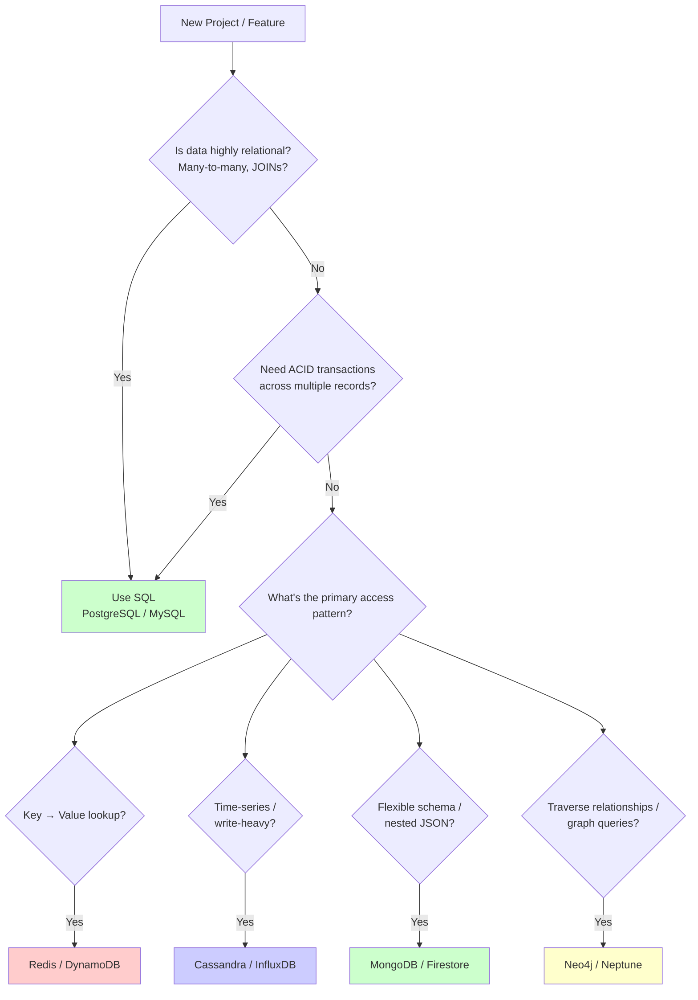
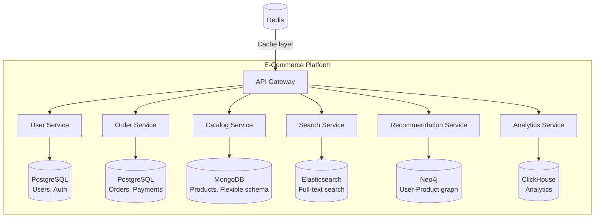

# SQL vs NoSQL — Choosing the Right Database

> "There is no best database. There is only the best database for your specific access pattern."

---

## 1. Why This Decision Matters

Database choice is one of the **hardest decisions to reverse** in system design. Migrating from PostgreSQL to MongoDB (or vice versa) mid-project is painful, risky, and expensive.

```
The Core Question:
├── How will you READ this data? (access patterns)
├── How will you WRITE this data? (volume, structure)
├── How will you SCALE this data? (growth rate)
├── How RELATED is this data? (joins, references)
└── How CONSISTENT must this data be? (ACID vs BASE)
```

---

## 2. SQL (Relational) Databases

### Core Concepts



### ACID Properties

```
A - Atomicity:    All or nothing. Transfer ₹500: debit AND credit, or neither.
C - Consistency:  DB moves from one valid state to another. No broken constraints.
I - Isolation:    Concurrent transactions don't interfere with each other.
D - Durability:   Once committed, data survives crashes.
```

```sql
-- ACID in action: Transfer money
BEGIN;
  UPDATE accounts SET balance = balance - 500 WHERE id = 1;
  UPDATE accounts SET balance = balance + 500 WHERE id = 2;
  -- Both succeed → COMMIT. Either fails → ROLLBACK (atomicity)
COMMIT;
```

### When to Use SQL

```
✅ Data is highly structured and relational
✅ Complex queries with JOINs, aggregations, subqueries
✅ ACID transactions are required (financial, inventory)
✅ Schema is well-defined and stable
✅ Data integrity is critical (foreign keys, constraints)
✅ Moderate scale (single-node or read replicas handle it)

Examples:
├── E-commerce: orders, payments, inventory
├── Banking: accounts, transactions, transfers
├── SaaS: multi-tenant user data
├── ERP: complex business logic with relations
└── Healthcare: patient records with strict integrity
```

### Popular SQL Databases

| Database | Best For | Max Scale | Special Feature |
|----------|----------|-----------|-----------------|
| **PostgreSQL** | General purpose, complex queries | ~100TB, read replicas | JSONB, extensions, full-text search |
| **MySQL** | Web apps, read-heavy workloads | ~100TB, replication | InnoDB, mature ecosystem |
| **SQL Server** | Enterprise/.NET ecosystem | ~100TB+ | BI integration, columnstore |
| **CockroachDB** | Distributed SQL (global scale) | Petabytes | Geo-partitioning, Spanner-like |
| **Spanner** | Global strong consistency | Unlimited | TrueTime, Google's infra |
| **SQLite** | Embedded, mobile, small apps | ~1TB | Zero config, single file |

---

## 3. NoSQL Databases

### Four Types of NoSQL



### 3.1 Key-Value Stores

```python
# Simplest model: key → value (opaque blob)
# Like a giant hash map

# Redis example
import redis
r = redis.Redis()

# Simple KV
r.set("user:123:name", "John")
r.get("user:123:name")  # → "John"

# With expiry (caching)
r.setex("session:abc", 3600, '{"userId": 123, "role": "admin"}')

# Atomic counter
r.incr("page:home:views")  # → 1, 2, 3...

# Use cases: Caching, sessions, counters, rate limiting, leaderboards
# Anti-pattern: Complex queries, relationships, scanning all data
```

### 3.2 Document Stores

```javascript
// Semi-structured data: key → JSON document
// Schema-flexible, nested objects, arrays

// MongoDB example
db.products.insertOne({
  _id: "prod-1",
  name: "Wireless Mouse",
  price: 799,
  category: "Electronics",
  specs: {                    // Nested object
    dpi: 1600,
    connectivity: "Bluetooth",
    battery: "AA x2"
  },
  reviews: [                  // Array of objects
    { user: "Alice", rating: 5, comment: "Great!" },
    { user: "Bob", rating: 4, comment: "Good value" }
  ],
  tags: ["wireless", "bluetooth", "ergonomic"]
});

// Query by nested field
db.products.find({ "specs.connectivity": "Bluetooth", price: { $lt: 1000 } });

// Use cases: Content management, catalogs, user profiles, real-time analytics
// Anti-pattern: Many-to-many relationships, complex transactions across documents
```

### 3.3 Column-Family Stores

```python
# Optimized for WRITE-HEAVY workloads and time-series data
# Data stored by COLUMN, not by row

# Cassandra data model:
# Partition Key determines which node stores the data
# Clustering Key determines sort order within a partition

"""
CREATE TABLE sensor_readings (
    sensor_id   TEXT,
    timestamp   TIMESTAMP,
    temperature DOUBLE,
    humidity    DOUBLE,
    PRIMARY KEY (sensor_id, timestamp)
)
WITH CLUSTERING ORDER BY (timestamp DESC);

-- Partition key: sensor_id (data for one sensor = one partition)
-- Clustering key: timestamp (sorted within partition)

-- FAST: Get latest 100 readings for sensor X (single partition scan)
SELECT * FROM sensor_readings 
WHERE sensor_id = 'sensor-42' 
ORDER BY timestamp DESC LIMIT 100;

-- SLOW: Get all sensors with temp > 30 (full cluster scan!)
SELECT * FROM sensor_readings WHERE temperature > 30;  -- AVOID!
"""

# Use cases: IoT/sensor data, time-series, event logs, messaging
# Anti-pattern: Ad-hoc queries, frequent updates, complex aggregations
```

### 3.4 Graph Databases

```cypher
// For highly connected data where RELATIONSHIPS are first-class citizens

// Neo4j (Cypher query language)

// Create nodes and relationships
CREATE (alice:Person {name: "Alice", age: 30})
CREATE (bob:Person {name: "Bob", age: 25})
CREATE (techCo:Company {name: "TechCo"})
CREATE (alice)-[:FRIENDS_WITH {since: 2020}]->(bob)
CREATE (alice)-[:WORKS_AT {role: "Engineer"}]->(techCo)
CREATE (bob)-[:WORKS_AT {role: "Designer"}]->(techCo)

// Find friends of friends (2 hops)
MATCH (alice:Person {name: "Alice"})-[:FRIENDS_WITH*2]->(fof:Person)
RETURN fof.name

// Find shortest path between two people
MATCH path = shortestPath(
  (a:Person {name: "Alice"})-[:FRIENDS_WITH*]-(b:Person {name: "Zara"})
)
RETURN path

// Use cases: Social networks, recommendation engines, fraud detection, knowledge graphs
// Anti-pattern: Simple CRUD, aggregations, full-text search
```

---

## 4. BASE Properties (NoSQL)

Opposite of ACID:

```
B - Basically Available:  System always responds (even if stale)
A - Soft state:           State may change over time (async replication)
E - Eventually consistent: Replicas converge eventually

ACID vs BASE:
┌───────────────┬──────────────────┬──────────────────────┐
│ Property      │ ACID (SQL)       │ BASE (NoSQL)         │
├───────────────┼──────────────────┼──────────────────────┤
│ Focus         │ Correctness      │ Availability         │
│ Transactions  │ Strong isolation │ No multi-doc txns    │
│ Consistency   │ Immediate        │ Eventual             │
│ Scaling       │ Vertical first   │ Horizontal first     │
│ Schema        │ Rigid, enforced  │ Flexible, evolving   │
│ Best for      │ Structured data  │ Unstructured/semi    │
└───────────────┴──────────────────┴──────────────────────┘
```

---

## 5. Head-to-Head Comparison

```
┌────────────────────┬──────────────────────┬──────────────────────┐
│ Criteria           │ SQL                  │ NoSQL                │
├────────────────────┼──────────────────────┼──────────────────────┤
│ Data Model         │ Tables, rows, cols   │ Documents/KV/columns │
│ Schema             │ Fixed, enforced      │ Dynamic, flexible    │
│ Query Language     │ SQL (standardized)   │ Varies per DB        │
│ Joins              │ Native, powerful     │ Limited/none         │
│ Transactions       │ Multi-row ACID       │ Usually single-doc   │
│ Scaling            │ Vertical → replicas  │ Horizontal (sharding)│
│ Consistency        │ Strong (default)     │ Eventual (default)   │
│ Schema Migration   │ ALTER TABLE (heavy)  │ Just write new shape │
│ Learning Curve     │ Moderate (SQL lang)  │ Low (JSON/API)       │
│ Aggregations       │ Powerful (GROUP BY)  │ Limited (MapReduce)  │
│ Relationships      │ First-class (FK)     │ Embedded/denormalized│
│ Write Speed        │ Moderate             │ Very fast (append)   │
│ Read Speed         │ Fast (indexed)       │ Very fast (by key)   │
│ Storage Efficiency │ Normalized (no dup)  │ Denormalized (dups)  │
│ Mature Tooling     │ Decades of tools     │ Rapidly catching up  │
└────────────────────┴──────────────────────┴──────────────────────┘
```

---

## 6. Decision Framework



### Quick Decision Table

```
┌──────────────────────────────┬────────────────────────┐
│ Requirement                  │ Best Choice            │
├──────────────────────────────┼────────────────────────┤
│ Complex JOINs & aggregations │ PostgreSQL / MySQL     │
│ ACID transactions            │ PostgreSQL / MySQL     │
│ High-speed caching           │ Redis                  │
│ Session storage              │ Redis / DynamoDB       │
│ Flexible/evolving schema     │ MongoDB                │
│ Massive write throughput     │ Cassandra / ScyllaDB   │
│ Time-series / IoT            │ InfluxDB / TimescaleDB │
│ Social graph / recommendations│ Neo4j                 │
│ Full-text search             │ Elasticsearch          │
│ Global distributed SQL       │ CockroachDB / Spanner  │
│ Real-time sync (mobile)      │ Firebase / Firestore   │
│ Event sourcing log           │ Kafka / EventStoreDB   │
└──────────────────────────────┴────────────────────────┘
```

---

## 7. Polyglot Persistence — Use Multiple Databases



### When to Use Polyglot Persistence

```
Use multiple databases when:
├── Different access patterns for different data
├── Team is large enough to manage multiple systems
├── Scale requirements differ per service
└── You're at microservices level

Stick to one database when:
├── Small team (< 5 developers)
├── Early-stage product (still finding product-market fit)
├── Data is uniformly structured
└── PostgreSQL can handle it (it usually can)
```

---

## 8. Common Anti-Patterns

### ❌ Choosing NoSQL because "it scales"

```
Reality:
├── PostgreSQL with proper indexing handles millions of rows
├── Read replicas + connection pooling scale reads massively
├── Sharding PostgreSQL (Citus) is production-ready
├── Most apps never outgrow a single PostgreSQL instance
└── NoSQL has its own scaling challenges (hotspots, rebalancing)

Rule: Start with PostgreSQL. Move data to specialized stores
when you have PROVEN the access pattern demands it.
```

### ❌ Using MongoDB for relational data

```javascript
// ❌ BAD: Forcing relations into document model
// Order references user, products, shipping address
db.orders.insertOne({
  userId: "u123",        // Manual reference (no FK constraint)
  productIds: ["p1", "p2"],  // Manual reference
  addressId: "a456",     // Manual reference
  // To get full data, you need multiple queries or $lookup (slow)
});

// ✅ GOOD: This data is relational → use PostgreSQL
// Foreign keys, JOINs, constraints enforce data integrity
```

### ❌ Using SQL for time-series at scale

```sql
-- ❌ BAD: Billions of sensor readings in PostgreSQL
SELECT avg(temperature) FROM readings 
WHERE sensor_id = 42 AND timestamp > NOW() - INTERVAL '1 day';
-- Table has 10 billion rows → even with index, this is slow

-- ✅ GOOD: Use TimescaleDB (PostgreSQL extension) or InfluxDB
-- Automatic partitioning by time, columnar compression, 
-- continuous aggregates → orders of magnitude faster
```

---

## 9. NewSQL — Best of Both Worlds?

```
NewSQL = SQL interface + NoSQL-like horizontal scaling

┌─────────────────┬────────────┬──────────────────────────────┐
│ Database        │ Type       │ Key Feature                  │
├─────────────────┼────────────┼──────────────────────────────┤
│ CockroachDB     │ NewSQL     │ Distributed, serializable    │
│ Google Spanner  │ NewSQL     │ Global consistency (TrueTime)│
│ TiDB            │ NewSQL     │ MySQL-compatible, distributed│
│ YugabyteDB      │ NewSQL     │ PostgreSQL-compatible        │
│ PlanetScale     │ NewSQL     │ MySQL + Vitess (managed)     │
│ Neon            │ NewSQL     │ Serverless PostgreSQL        │
└─────────────────┴────────────┴──────────────────────────────┘

Trade-off: Higher latency per query (consensus overhead)
           but horizontal write scaling + ACID
```

---

## 10. Interview Questions & Answers

### Q1: "When would you choose NoSQL over SQL?"

```
Choose NoSQL when:
1. Schema is highly variable or evolving rapidly (MongoDB)
2. Access pattern is simple key lookups at massive scale (DynamoDB)
3. Write throughput exceeds what single-node SQL can handle (Cassandra)
4. Data is naturally a graph (Neo4j)
5. You need sub-millisecond latency (Redis)

Choose SQL when:
1. Data is relational with complex JOINs
2. ACID transactions across multiple records
3. Schema is well-defined
4. Ad-hoc queries and reporting needed
5. Data integrity is critical

Default answer: "Start with PostgreSQL unless you have a specific 
reason not to. It handles JSON, full-text search, and scales 
surprisingly far."
```

### Q2: "Your e-commerce system has 100M products. SQL or NoSQL?"

```
It depends on the access pattern:

Product catalog (reads):
→ MongoDB (flexible schema, nested attributes vary per category)
→ OR PostgreSQL with JSONB column for variable attributes

Product search:
→ Elasticsearch (full-text search, faceted filtering)

Shopping cart:
→ Redis (fast reads/writes, TTL for expiry)

Orders + Payments:
→ PostgreSQL (ACID transactions, financial integrity)

Recommendation engine:
→ Neo4j or Redis (graph traversal / collaborative filtering)

Answer: Polyglot persistence — use the right database per access pattern.
```

### Q3: "How do you migrate from SQL to NoSQL (or vice versa)?"

```
Dual-write migration strategy:

Phase 1 - Shadow Write:
  Write to BOTH old and new database
  Read from old database only
  
Phase 2 - Shadow Read:
  Write to both
  Read from new, compare with old (detect discrepancies)
  
Phase 3 - Cutover:
  Read and write from new database
  Old database becomes backup
  
Phase 4 - Cleanup:
  Remove old database writes
  Decommission old database

Key: Never do a "big bang" migration. Always incremental.
```

---

## 11. Cheat Sheet

```
┌─────────────────────────────────────────────────────────────────┐
│                  SQL vs NoSQL CHEAT SHEET                        │
├─────────────────────────────────────────────────────────────────┤
│                                                                 │
│  SQL = ACID, JOINs, schema, mature (PostgreSQL, MySQL)          │
│  NoSQL = BASE, flexible, horizontal scale (Mongo, Redis, Cass.) │
│                                                                 │
│  4 Types: Key-Value | Document | Column-Family | Graph          │
│                                                                 │
│  Default: Start with PostgreSQL                                 │
│  Add Redis: When you need caching                               │
│  Add Elasticsearch: When you need full-text search              │
│  Add Cassandra: When writes exceed SQL capacity                 │
│  Add MongoDB: When schema varies wildly per record              │
│  Add Neo4j: When traversing relationships is core               │
│                                                                 │
│  Polyglot: Different databases for different services           │
│  NewSQL: CockroachDB/Spanner = SQL + horizontal scaling         │
│                                                                 │
│  Rule: Access pattern determines database choice                │
│  Rule: Don't use NoSQL just because "it scales"                 │
│  Rule: Don't force relational data into document stores         │
│                                                                 │
└─────────────────────────────────────────────────────────────────┘
```
