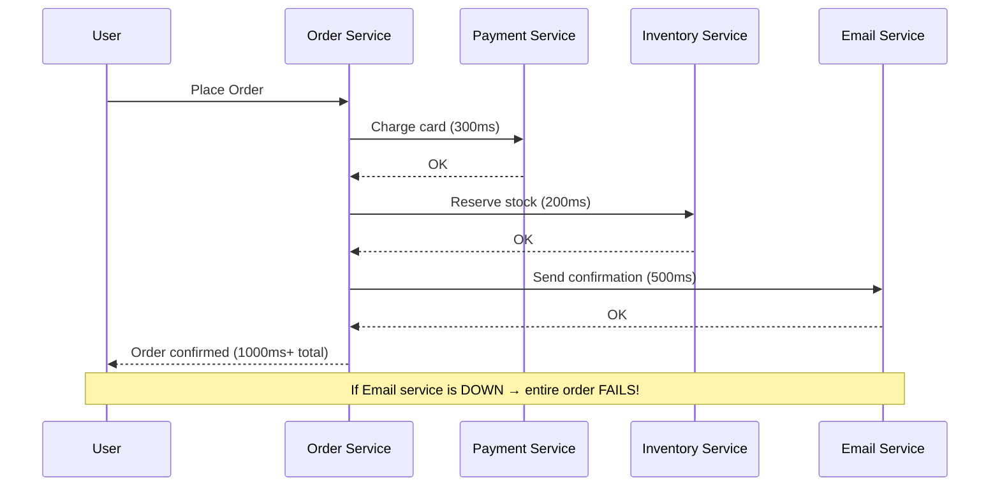
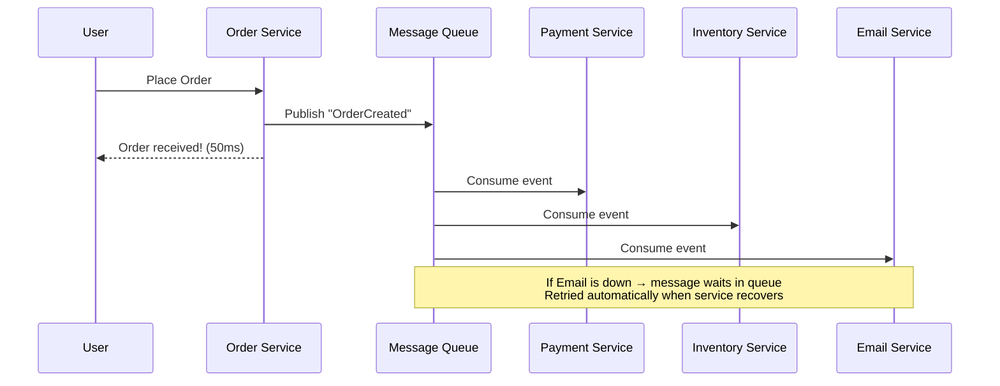
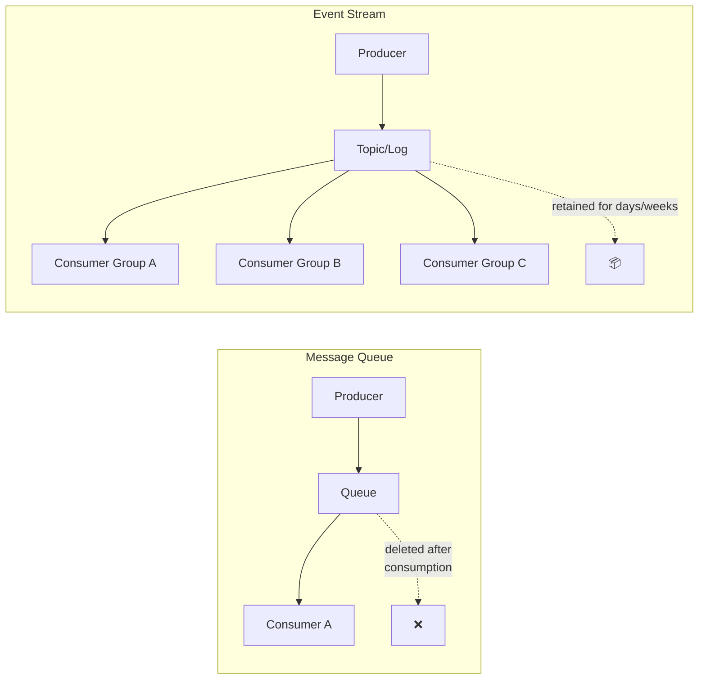
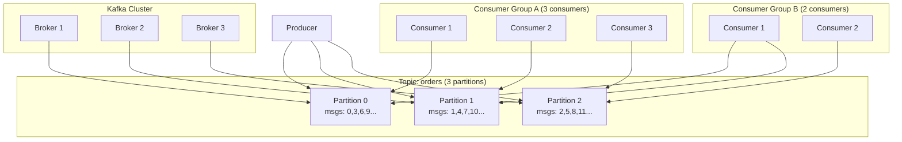
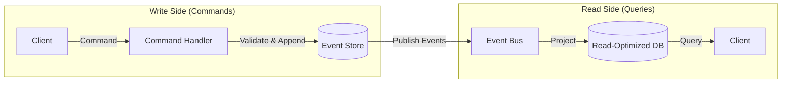
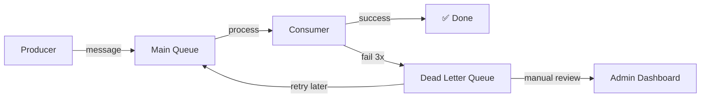

# Message Queues & Event-Driven Architecture

> "Don't call me, I'll call you. That's the essence of event-driven architecture."

---

## 1. Why Message Queues?

### The Problem: Synchronous Coupling



### The Solution: Async via Message Queue



---

## 2. Core Concepts

### Message Queue vs Event Stream

```
MESSAGE QUEUE (Point-to-Point):
├── One producer → One consumer (per message)
├── Message is DELETED after consumption
├── Like a to-do list: process and remove
├── Examples: RabbitMQ, SQS, ActiveMQ

EVENT STREAM (Pub/Sub + Log):
├── One producer → Many consumers
├── Events are RETAINED for a period
├── Like a newspaper: everyone reads the same issue
├── Examples: Kafka, Pulsar, Kinesis, NATS JetStream
```



### Key Terms

| Term | Definition |
|------|-----------|
| **Producer** | Sends messages/events |
| **Consumer** | Receives and processes messages |
| **Queue/Topic** | Named channel for messages |
| **Broker** | The messaging server (Kafka, RabbitMQ) |
| **Consumer Group** | Set of consumers sharing the load |
| **Offset** | Position in the log (Kafka) |
| **Partition** | Shard of a topic for parallelism |
| **Dead Letter Queue** | Where failed messages go |
| **Backpressure** | Slowing producers when consumers can't keep up |

---

## 3. Message Queue Patterns

### 3.1 Point-to-Point (Work Queue)

```python
# RabbitMQ: Each message processed by exactly one worker
import pika

# Producer
connection = pika.BlockingConnection(pika.ConnectionParameters('localhost'))
channel = connection.channel()
channel.queue_declare(queue='tasks', durable=True)

channel.basic_publish(
    exchange='',
    routing_key='tasks',
    body='process_order:12345',
    properties=pika.BasicProperties(delivery_mode=2)  # Persistent
)

# Consumer (run multiple instances for parallel processing)
def callback(ch, method, properties, body):
    task = body.decode()
    print(f"Processing: {task}")
    process_task(task)
    ch.basic_ack(delivery_tag=method.delivery_tag)  # Manual ACK

channel.basic_qos(prefetch_count=1)  # Fair dispatch
channel.basic_consume(queue='tasks', on_message_callback=callback)
channel.start_consuming()
```

### 3.2 Publish/Subscribe (Fan-out)

```python
# RabbitMQ: Every subscriber gets every message

# Publisher
channel.exchange_declare(exchange='order_events', exchange_type='fanout')
channel.basic_publish(
    exchange='order_events',
    routing_key='',
    body=json.dumps({
        'event': 'ORDER_CREATED',
        'orderId': '12345',
        'amount': 2500
    })
)

# Subscriber 1: Payment Service
channel.queue_declare(queue='payment_queue')
channel.queue_bind(queue='payment_queue', exchange='order_events')

# Subscriber 2: Inventory Service
channel.queue_declare(queue='inventory_queue')
channel.queue_bind(queue='inventory_queue', exchange='order_events')

# Subscriber 3: Notification Service
channel.queue_declare(queue='notification_queue')
channel.queue_bind(queue='notification_queue', exchange='order_events')
```

### 3.3 Topic-Based Routing

```python
# RabbitMQ: Route messages based on topic patterns

channel.exchange_declare(exchange='logs', exchange_type='topic')

# Publisher
channel.basic_publish(exchange='logs', routing_key='order.created.premium', body='...')
channel.basic_publish(exchange='logs', routing_key='order.failed.standard', body='...')
channel.basic_publish(exchange='logs', routing_key='payment.completed.premium', body='...')

# Consumer: Only premium order events
channel.queue_bind(queue='premium_queue', exchange='logs', routing_key='order.*.premium')

# Consumer: All failed events
channel.queue_bind(queue='alerts_queue', exchange='logs', routing_key='*.failed.*')

# Consumer: Everything
channel.queue_bind(queue='audit_queue', exchange='logs', routing_key='#')
```

---

## 4. Apache Kafka Deep Dive

### Architecture



### Core Kafka Concepts

```
Topic:     Named feed of messages (like a database table)
Partition: Ordered, immutable sequence of messages within a topic
Offset:    Sequential ID of a message within a partition
Broker:    A Kafka server that stores partitions
Replica:   Copy of a partition on another broker (fault tolerance)
Leader:    The broker serving reads/writes for a partition
ISR:       In-Sync Replicas — replicas that are caught up to leader

Key Guarantee:
- Messages within a partition are ORDERED
- Messages across partitions have NO ordering guarantee
- Consumer group: each partition consumed by exactly ONE consumer
```

### Producer: Publishing Events

```python
from kafka import KafkaProducer
import json

producer = KafkaProducer(
    bootstrap_servers=['localhost:9092'],
    value_serializer=lambda v: json.dumps(v).encode('utf-8'),
    key_serializer=lambda k: k.encode('utf-8') if k else None,
    acks='all',           # Wait for all replicas (strongest durability)
    retries=3,
    max_in_flight_requests_per_connection=1,  # Maintain order on retries
)

# Key determines partition (same key → same partition → ordered)
producer.send(
    topic='order-events',
    key='order-12345',  # All events for this order go to same partition
    value={
        'event_type': 'ORDER_CREATED',
        'order_id': '12345',
        'user_id': 'u-789',
        'items': [{'product_id': 'p-1', 'qty': 2}],
        'total': 2500,
        'timestamp': '2024-02-15T10:30:00Z'
    }
)
producer.flush()
```

### Consumer: Processing Events

```python
from kafka import KafkaConsumer
import json

consumer = KafkaConsumer(
    'order-events',
    bootstrap_servers=['localhost:9092'],
    group_id='payment-service',  # Consumer group
    auto_offset_reset='earliest',  # Start from beginning if no offset
    enable_auto_commit=False,      # Manual commit for exactly-once
    value_deserializer=lambda v: json.loads(v.decode('utf-8')),
)

for message in consumer:
    event = message.value
    print(f"Partition: {message.partition}, Offset: {message.offset}")
    print(f"Event: {event['event_type']}, Order: {event['order_id']}")
    
    try:
        if event['event_type'] == 'ORDER_CREATED':
            process_payment(event)
        elif event['event_type'] == 'ORDER_CANCELLED':
            refund_payment(event)
        
        # Commit offset AFTER successful processing
        consumer.commit()
    except Exception as e:
        # Don't commit → message will be reprocessed
        log_error(e, event)
        send_to_dead_letter_queue(event)
```

---

## 5. Delivery Guarantees

```
┌──────────────────┬──────────────────────────────────────────────┐
│ Guarantee        │ Meaning                                      │
├──────────────────┼──────────────────────────────────────────────┤
│ At-most-once     │ Message may be lost, never duplicated        │
│                  │ Fire-and-forget. Fast. Used for metrics/logs  │
│                  │                                              │
│ At-least-once    │ Message never lost, may be duplicated        │
│                  │ Consumer must be IDEMPOTENT. Most common.     │
│                  │                                              │
│ Exactly-once     │ Message processed exactly once               │
│                  │ Hardest. Kafka supports via transactions.     │
└──────────────────┴──────────────────────────────────────────────┘
```

### Implementing Idempotency (At-Least-Once → Effectively Exactly-Once)

```python
# Problem: Consumer crashes AFTER processing but BEFORE committing
# Result: Message redelivered → processed twice!

# Solution: Idempotency key + deduplication

class IdempotentConsumer:
    def __init__(self, db, consumer):
        self.db = db
        self.consumer = consumer
    
    def process(self):
        for message in self.consumer:
            event = message.value
            idempotency_key = f"{message.topic}:{message.partition}:{message.offset}"
            
            # Check if already processed
            if self.db.exists('processed_events', idempotency_key):
                print(f"Skipping duplicate: {idempotency_key}")
                self.consumer.commit()
                continue
            
            # Process in a transaction with the dedup record
            with self.db.transaction():
                self.handle_event(event)
                self.db.insert('processed_events', {
                    'key': idempotency_key,
                    'processed_at': datetime.now(),
                })
            
            self.consumer.commit()
```

---

## 6. Event-Driven Architecture Patterns

### 6.1 Event Notification

```
Simple: "Something happened" → receivers decide what to do

Producer: OrderService publishes "OrderCreated" event
Consumers: Each service independently decides its reaction
  ├── PaymentService → charge the customer
  ├── InventoryService → reserve the stock
  ├── EmailService → send confirmation
  └── AnalyticsService → track conversion
```

### 6.2 Event-Carried State Transfer

```python
# Event carries ALL the data needed — consumers don't need to call back

# ❌ Thin event (forces callback)
event = {
    "type": "ORDER_CREATED",
    "order_id": "12345"  # Consumer must call Order API to get details
}

# ✅ Fat event (self-contained)
event = {
    "type": "ORDER_CREATED",
    "order_id": "12345",
    "user_id": "u-789",
    "user_email": "john@example.com",
    "items": [{"product_id": "p-1", "name": "Widget", "qty": 2, "price": 500}],
    "total": 1000,
    "shipping_address": {"city": "Mumbai", "zip": "400001"},
    "timestamp": "2024-02-15T10:30:00Z"
}
# Email service can send confirmation WITHOUT calling Order or User service
```

### 6.3 Event Sourcing

```python
# Instead of storing CURRENT state, store every EVENT that happened

class EventStore:
    """
    Append-only log of events. Current state = replay all events.
    """
    def __init__(self):
        self.events = []  # Append-only
    
    def append(self, stream_id, event):
        self.events.append({
            'stream_id': stream_id,
            'event': event,
            'timestamp': time.time(),
            'version': len([e for e in self.events if e['stream_id'] == stream_id])
        })
    
    def get_events(self, stream_id):
        return [e for e in self.events if e['stream_id'] == stream_id]
    
    def get_current_state(self, stream_id):
        """Replay events to rebuild current state."""
        state = {}
        for event in self.get_events(stream_id):
            state = self.apply_event(state, event['event'])
        return state
    
    def apply_event(self, state, event):
        if event['type'] == 'ACCOUNT_CREATED':
            return {'balance': 0, 'status': 'active'}
        elif event['type'] == 'MONEY_DEPOSITED':
            state['balance'] += event['amount']
        elif event['type'] == 'MONEY_WITHDRAWN':
            state['balance'] -= event['amount']
        elif event['type'] == 'ACCOUNT_CLOSED':
            state['status'] = 'closed'
        return state

# Usage:
store = EventStore()
store.append('acc-1', {'type': 'ACCOUNT_CREATED'})
store.append('acc-1', {'type': 'MONEY_DEPOSITED', 'amount': 1000})
store.append('acc-1', {'type': 'MONEY_WITHDRAWN', 'amount': 300})

state = store.get_current_state('acc-1')
# → {'balance': 700, 'status': 'active'}
# Complete audit trail: WHO did WHAT and WHEN
```

### 6.4 CQRS + Event Sourcing



---

## 7. Comparison: Kafka vs RabbitMQ vs SQS

```
┌─────────────────┬──────────────────┬──────────────────┬──────────────────┐
│ Feature         │ Kafka            │ RabbitMQ         │ Amazon SQS       │
├─────────────────┼──────────────────┼──────────────────┼──────────────────┤
│ Model           │ Distributed log  │ Message broker   │ Managed queue    │
│ Ordering        │ Per partition    │ Per queue        │ FIFO queues only │
│ Retention       │ Time-based       │ Until consumed   │ 4-14 days        │
│ Throughput      │ Millions/sec     │ Tens of thousands│ Nearly unlimited │
│ Replay          │ ✅ (re-read log) │ ❌               │ ❌               │
│ Consumer Groups │ ✅ Native        │ ❌ (use exchanges)│ ❌               │
│ Exactly-once    │ ✅ (transactions)│ ❌ (at-least-once)│ ❌ (at-least-once)|
│ Ops Complexity  │ High             │ Medium           │ Zero (managed)   │
│ Best For        │ Event streaming  │ Task queues      │ Simple async     │
│ Latency         │ ms (batch)       │ μs-ms            │ ms               │
│ Cost            │ Infrastructure   │ Infrastructure   │ Pay-per-message  │
└─────────────────┴──────────────────┴──────────────────┴──────────────────┘
```

### When to Use What

```
Kafka:
├── Event sourcing / event streaming
├── High-throughput (millions of events/sec)
├── Need to replay events
├── Multiple consumers per event
├── Log aggregation, activity tracking

RabbitMQ:
├── Task/job queues (background processing)
├── Complex routing (topic, headers, direct)
├── Request-reply pattern
├── Lower throughput, lower latency
├── Simpler deployment

SQS:
├── Serverless architectures (Lambda triggers)
├── Simple async decoupling
├── Don't want to manage infrastructure
├── AWS-native applications
└── Standard or FIFO ordering
```

---

## 8. Dead Letter Queues (DLQ)



```python
# Implementation: Retry with exponential backoff, then DLQ

class ReliableConsumer:
    MAX_RETRIES = 3
    
    def process_message(self, message):
        retries = message.headers.get('retry_count', 0)
        
        try:
            self.handle(message)
        except TransientError:
            if retries < self.MAX_RETRIES:
                # Retry with exponential backoff
                delay = 2 ** retries  # 1s, 2s, 4s
                self.publish_with_delay(
                    message, 
                    delay_seconds=delay,
                    headers={'retry_count': retries + 1}
                )
            else:
                # Max retries exceeded → Dead Letter Queue
                self.send_to_dlq(message, reason='MAX_RETRIES_EXCEEDED')
        except PermanentError as e:
            # Don't retry (bad data, validation error)
            self.send_to_dlq(message, reason=str(e))
    
    def send_to_dlq(self, message, reason):
        self.dlq_producer.send(
            topic='dead-letter-queue',
            value={
                'original_topic': message.topic,
                'original_message': message.value,
                'failure_reason': reason,
                'failed_at': datetime.now().isoformat(),
            }
        )
```

---

## 9. Backpressure Handling

```
Problem: Producer sends 10,000 msg/sec, consumer processes 1,000 msg/sec
Result: Queue grows unbounded → memory exhaustion → crash

Solutions:
```

```python
# Strategy 1: Rate limiting the producer
class RateLimitedProducer:
    def __init__(self, producer, max_rate=5000):
        self.producer = producer
        self.limiter = TokenBucket(max_rate)
    
    def send(self, topic, message):
        self.limiter.acquire()  # Blocks if rate exceeded
        self.producer.send(topic, message)

# Strategy 2: Queue size limits (RabbitMQ)
# rabbitmq.conf:
# queue.max-length = 100000
# queue.overflow = reject-publish  # or drop-head

# Strategy 3: Consumer auto-scaling
class AutoScalingConsumer:
    def monitor_lag(self):
        lag = self.get_consumer_lag()
        if lag > 10000:
            self.scale_up_consumers()
        elif lag < 100:
            self.scale_down_consumers()
```

---

## 10. Common Mistakes

### ❌ Using message queue as a database

```python
# ❌ BAD: Storing state in the queue
# "I'll just keep messages in Kafka forever as my source of truth"
# Problems: No random access, expensive to query, no indexes

# ✅ GOOD: Queue for transport, database for storage
# Kafka: Event log (append-only, sequential read)
# PostgreSQL: Current state (random access, indexed queries)
```

### ❌ Not handling message ordering

```python
# ❌ BAD: Assuming global order across partitions
# Kafka: Only guarantees order WITHIN a partition

# Order events for same customer go to different partitions:
producer.send('orders', key=None, value=event)  # Random partition!

# ✅ GOOD: Use a consistent key
producer.send('orders', key=f'customer-{customer_id}', value=event)
# Same customer → same partition → guaranteed order
```

### ❌ Not making consumers idempotent

```python
# ❌ BAD: Non-idempotent consumer
def handle_payment(event):
    charge_credit_card(event['amount'])  # Charged TWICE on retry!

# ✅ GOOD: Idempotent with dedup
def handle_payment(event):
    if already_processed(event['payment_id']):
        return  # Skip duplicate
    charge_credit_card(event['amount'])
    mark_as_processed(event['payment_id'])
```

---

## 11. Interview Questions & Answers

### Q1: "Why use a message queue instead of direct HTTP calls?"

```
Five benefits:

1. Decoupling: Services don't know about each other
2. Resilience: If consumer is down, messages wait in queue
3. Scalability: Add more consumers to handle load
4. Load leveling: Absorb traffic spikes (queue buffers)
5. Async processing: User doesn't wait for slow operations

Trade-off: Added complexity, eventual consistency, harder debugging
```

### Q2: "How does Kafka guarantee ordering?"

```
Kafka guarantees order WITHIN a partition, not across partitions.

To ensure order for related events:
1. Use the same partition key (e.g., order_id, user_id)
2. Same key → same partition → same consumer → ordered processing
3. max.in.flight.requests.per.connection = 1 (prevents reordering on retry)
4. enable.idempotence = true (prevents duplicates)

If you need GLOBAL order: use a single partition (limits throughput)
```

### Q3: "How do you handle poison messages?"

```
A poison message is one that repeatedly fails processing:

1. Retry with exponential backoff (1s, 2s, 4s, 8s...)
2. After N retries, move to Dead Letter Queue (DLQ)
3. Alert ops team via monitoring
4. DLQ consumer: manual review, fix, and replay
5. Log the original message + error for debugging

Never: Block the queue (one bad message stops everything)
Never: Silently discard (you'll lose data without knowing)
```

---

## 12. Cheat Sheet

```
┌─────────────────────────────────────────────────────────────────┐
│            MESSAGE QUEUES & EVENTS CHEAT SHEET                   │
├─────────────────────────────────────────────────────────────────┤
│                                                                 │
│  Queue (RabbitMQ/SQS): One consumer per message, deleted after  │
│  Stream (Kafka): Many consumers, retained, replayable           │
│                                                                 │
│  Patterns:                                                      │
│  - Point-to-Point: Work queue (task distribution)               │
│  - Pub/Sub: Fan-out to all subscribers                          │
│  - Topic Routing: Pattern-based message routing                 │
│  - Event Sourcing: Append-only event log as source of truth     │
│                                                                 │
│  Delivery:                                                      │
│  - At-most-once: May lose (fast, for metrics)                   │
│  - At-least-once: May duplicate (need idempotency)              │
│  - Exactly-once: Hard (Kafka transactions)                      │
│                                                                 │
│  Kafka: key → partition → ordered per key                       │
│  Always: Make consumers idempotent                              │
│  Always: Use Dead Letter Queue for failures                     │
│  Never: Use queue as a database                                 │
│                                                                 │
│  Choose:                                                        │
│  - Kafka: Event streaming, high throughput, replay              │
│  - RabbitMQ: Task queues, complex routing, low latency          │
│  - SQS: Serverless, simple, zero-ops                            │
│                                                                 │
└─────────────────────────────────────────────────────────────────┘
```
