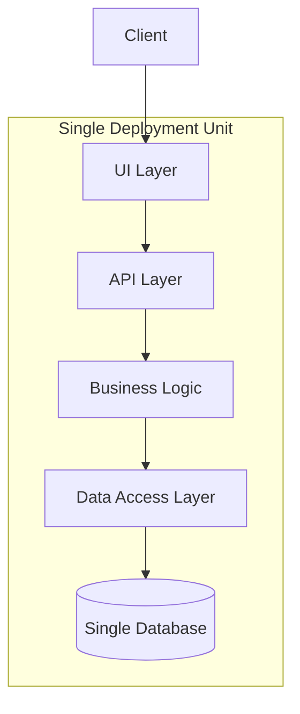
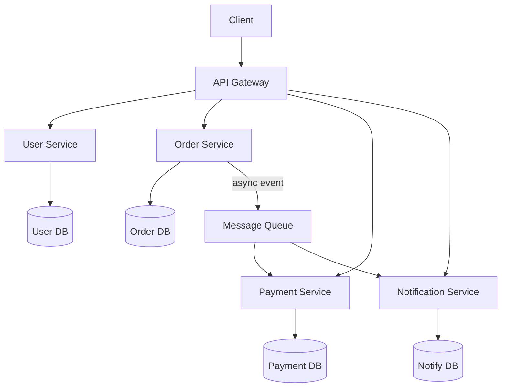
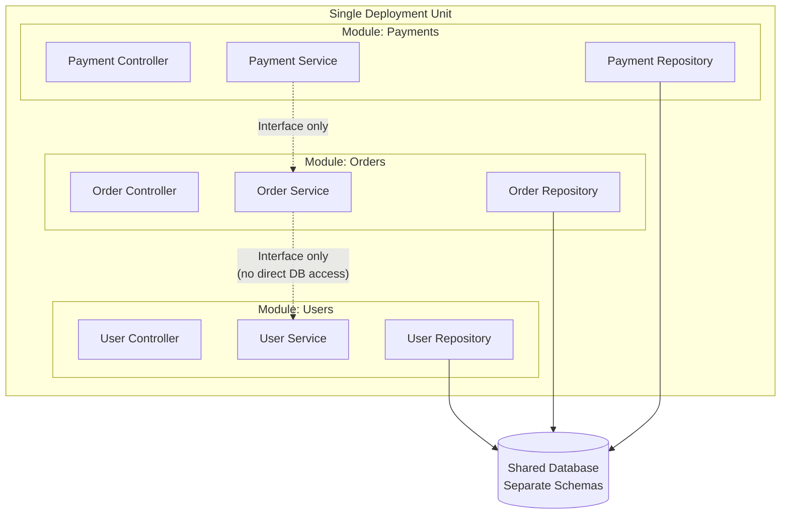
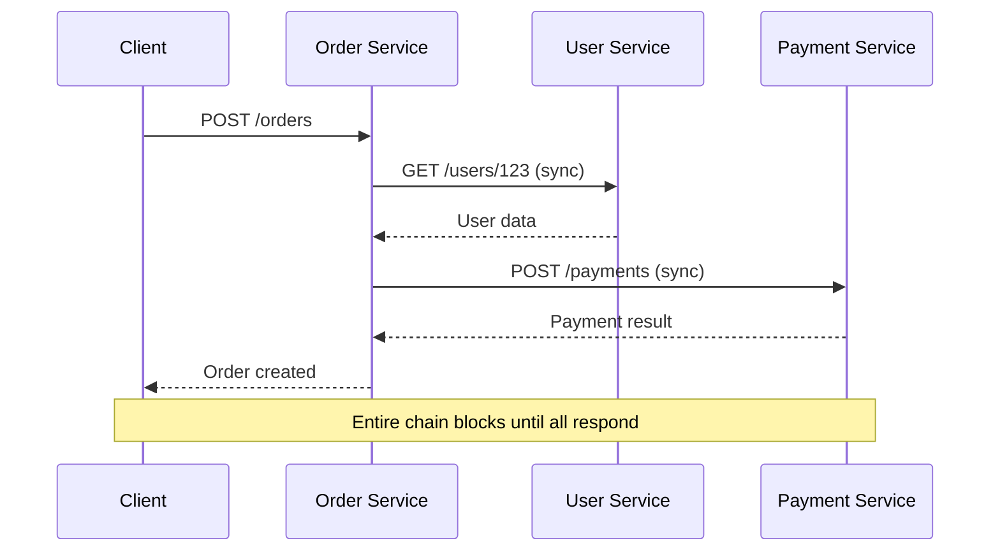
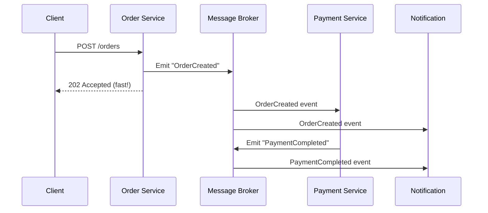
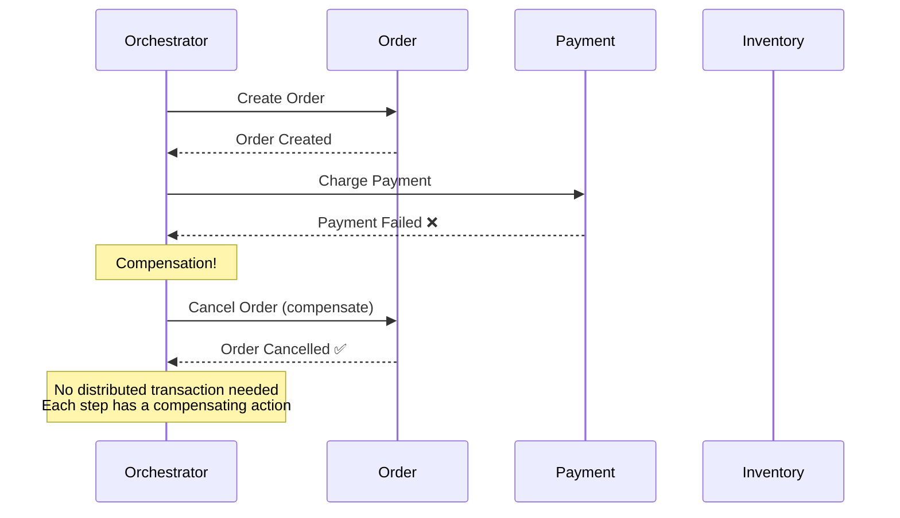
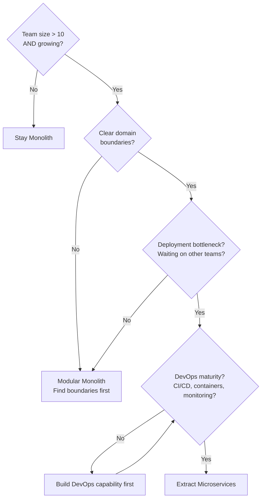

# Microservices vs Monolith — Architecture Evolution

> "A microservice architecture is not a goal. It's a trade-off you accept when your organization outgrows a monolith."

---

## 1. The Architecture Spectrum


```
Monolith          → Single deployable unit, single database
Modular Monolith  → Single deployable, well-separated modules
SOA               → Multiple services, shared enterprise bus (ESB)
Microservices     → Independent services, own databases, own deployment
```

---

## 2. Monolith Architecture

### Structure



### Advantages

```
✅ Simple to develop — one codebase, one IDE, one build
✅ Simple to deploy — one artifact, one server
✅ Simple to test — integration tests run in-process
✅ Simple to debug — single stack trace, single log
✅ No network latency between modules
✅ ACID transactions across all data (single DB)
✅ Shared code is trivial (just import)
✅ Perfect for small teams (1-10 developers)
```

### Disadvantages

```
❌ Scaling is all-or-nothing (can't scale just the payment module)
❌ Deployment couples everything (change in checkout deploys the whole app)
❌ Technology lock-in (one language/framework for everything)
❌ Large codebase becomes hard to understand
❌ Long build/test times as app grows
❌ One bug can crash everything
❌ Team coordination becomes bottleneck (10+ devs stepping on each other)
```

### When Monolith is the Right Choice

```
✅ Startup / MVP / early-stage product
✅ Small team (< 10 developers)
✅ Simple domain (not many bounded contexts)
✅ Tight deadlines (ship fast)
✅ Not sure about domain boundaries yet
✅ Read-heavy application with simple business logic
```

---

## 3. Microservices Architecture

### Structure



### Key Principles

| Principle | Meaning |
|-----------|---------|
| **Single Responsibility** | Each service does ONE thing well |
| **Own Database** | No shared databases (database per service) |
| **Independent Deployment** | Deploy one service without touching others |
| **Decentralized Governance** | Teams choose their own tech stack |
| **Design for Failure** | Every network call can fail |
| **Smart Endpoints, Dumb Pipes** | Logic in services, not in the bus |

### Advantages

```
✅ Independent scaling (scale only what's needed)
✅ Independent deployment (faster release cycles)
✅ Technology flexibility (Python for ML, Go for performance)
✅ Team autonomy (each team owns a service end-to-end)
✅ Fault isolation (one service down ≠ entire system down)
✅ Smaller codebases (easier to understand per service)
✅ Horizontal scaling per service
```

### Disadvantages

```
❌ Distributed system complexity (network failures, partial failures)
❌ Data consistency (no cross-service ACID transactions)
❌ Operational overhead (deploy, monitor, log N services)
❌ Network latency between services
❌ Testing is harder (integration tests across services)
❌ Debugging is harder (distributed tracing required)
❌ Service discovery, load balancing, circuit breakers needed
❌ Requires DevOps maturity (CI/CD, containers, orchestration)
```

---

## 4. Head-to-Head Comparison

```
┌──────────────────────┬───────────────────┬────────────────────────┐
│ Aspect               │ Monolith          │ Microservices          │
├──────────────────────┼───────────────────┼────────────────────────┤
│ Deployment           │ Single artifact   │ Per-service            │
│ Scaling              │ Entire app        │ Per-service            │
│ Database             │ Single shared     │ Per-service            │
│ Transactions         │ ACID (easy)       │ Saga pattern (hard)    │
│ Latency              │ In-process calls  │ Network calls (ms)     │
│ Team Size            │ 1-10 devs         │ 10-100+ devs           │
│ Tech Stack           │ One stack         │ Mixed (polyglot)       │
│ Debugging            │ Stack trace       │ Distributed tracing    │
│ Testing              │ Simple            │ Complex (contract test)│
│ DevOps               │ Minimal           │ Heavy (K8s, CI/CD)     │
│ Time to market       │ Faster (initially)│ Slower (initially)     │
│ Long-term agility    │ Decreases         │ Increases              │
│ Failure blast radius │ Entire app        │ Single service         │
│ Cost (small scale)   │ Low               │ High (operational)     │
│ Cost (large scale)   │ High (scaling all)│ Lower (scale targeted) │
└──────────────────────┴───────────────────┴────────────────────────┘
```

---

## 5. The Modular Monolith (Best of Both?)



```
Rules:
├── Modules communicate through well-defined INTERFACES
├── No module directly accesses another module's database tables
├── Each module has its own schema/tables
├── Modules CAN share the same physical database
├── Deploy as a single unit (simple ops)
└── When you need to split → extract a module into a service
```

### Why This is Often the Best Starting Point

```
1. Enforces boundaries like microservices
2. Simple deployment like monolith
3. No network latency between modules
4. ACID transactions still work
5. Easy to extract into microservices later
6. Shopify runs a modular monolith at massive scale
```

---

## 6. Communication Patterns (Microservices)

### Synchronous (Request-Response)



### Asynchronous (Event-Driven)



### Choosing Communication Style

```
Synchronous (HTTP/gRPC):
├── Need immediate response
├── Read operations (GET user profile)
├── Simple request-reply
└── Few service hops (< 3)

Asynchronous (Events/Queues):
├── Fire-and-forget operations
├── Multiple services need to react
├── Long-running processes
├── Resilience is critical (retry on failure)
└── Loose coupling between services
```

---

## 7. Key Microservice Patterns

### 7.1 API Gateway

```
                    ┌─────────────────┐
   Client ────────► │   API Gateway   │
                    │ - Authentication│
                    │ - Rate limiting │
                    │ - Request routing│
                    │ - Response cache│
                    │ - Load balancing│
                    └────────┬────────┘
                    ┌────────┼────────┐
                    ▼        ▼        ▼
              User Svc  Order Svc  Payment Svc
```

### 7.2 Service Discovery

```
Problem: Service A needs to call Service B. Where is B running?

Static config:
  SERVICE_B_URL=http://service-b:8080  # Breaks on scaling/failover

Service Discovery:
  1. Service B registers with registry on startup
  2. Service A asks registry: "Where is Service B?"
  3. Registry returns: ["10.0.1.5:8080", "10.0.1.6:8080"]
  4. Service A picks one (client-side load balancing)

Tools: Consul, etcd, Kubernetes DNS, Eureka
```

### 7.3 Circuit Breaker

```python
import time

class CircuitBreaker:
    """
    Prevent cascading failures.
    States: CLOSED (normal) → OPEN (failing) → HALF_OPEN (testing)
    """
    def __init__(self, failure_threshold=5, recovery_timeout=30):
        self.failure_threshold = failure_threshold
        self.recovery_timeout = recovery_timeout
        self.failure_count = 0
        self.state = 'CLOSED'
        self.last_failure_time = None
    
    def call(self, func, *args, **kwargs):
        if self.state == 'OPEN':
            if time.time() - self.last_failure_time > self.recovery_timeout:
                self.state = 'HALF_OPEN'
            else:
                raise CircuitOpenError("Service unavailable — circuit is open")
        
        try:
            result = func(*args, **kwargs)
            if self.state == 'HALF_OPEN':
                self.state = 'CLOSED'
                self.failure_count = 0
            return result
        except Exception as e:
            self.failure_count += 1
            self.last_failure_time = time.time()
            if self.failure_count >= self.failure_threshold:
                self.state = 'OPEN'
            raise e

# Usage:
breaker = CircuitBreaker(failure_threshold=3, recovery_timeout=60)
try:
    result = breaker.call(payment_service.charge, order_id, amount)
except CircuitOpenError:
    # Fallback: queue the payment for later
    queue.enqueue('pending_payments', {'order_id': order_id, 'amount': amount})
```

### 7.4 Saga Pattern (Distributed Transactions)



### 7.5 Strangler Fig (Migration Pattern)

```
Migrate from monolith to microservices INCREMENTALLY:

Phase 1: Monolith handles everything
  [Client] → [Monolith (User + Order + Payment)]

Phase 2: Extract one service, route through proxy
  [Client] → [Proxy] → [Monolith (User + Order)]
                     → [Payment Service] (new)

Phase 3: Extract more services
  [Client] → [Proxy] → [Monolith (User)]
                     → [Order Service]
                     → [Payment Service]

Phase 4: Monolith fully replaced
  [Client] → [API Gateway] → [User Service]
                            → [Order Service]
                            → [Payment Service]
```

---

## 8. Data Management in Microservices

### The Database-Per-Service Rule

```
❌ Shared database (coupling):
  Order Service ──┐
  Payment Service ─┼──→ [Single PostgreSQL]
  User Service ───┘
  Problem: Schema change in one service breaks others

✅ Database per service (independence):
  Order Service ──→ [Order DB]
  Payment Service ─→ [Payment DB]
  User Service ───→ [User DB]
  Benefit: Each service evolves its schema independently
```

### Cross-Service Data: How to Handle

```
Problem: Order Service needs user's email for confirmation

❌ Direct DB access: Order Service queries User DB
   → Tight coupling, breaks service boundaries

✅ API call: Order Service calls User Service API
   → Loose coupling, but adds latency + failure risk

✅ Event-carried state: User Service publishes events,
   Order Service maintains a local cache of user data
   → Autonomous, but eventually consistent

✅ Data duplication: Order stores user_email at creation time
   → Simple, but email changes won't retroactively update
```

---

## 9. When to Migrate: The Decision Matrix



### The Readiness Checklist

```
Before going microservices, you need:

Infrastructure:
□ Containerization (Docker)
□ Orchestration (Kubernetes / ECS)
□ CI/CD pipeline per service
□ Service mesh or API gateway

Observability:
□ Centralized logging (ELK / Loki)
□ Distributed tracing (Jaeger / Zipkin)
□ Metrics & alerting (Prometheus / Grafana)
□ Health checks per service

Team:
□ DevOps/SRE capability
□ Team per service (or small group of services)
□ On-call rotation
□ Clear service ownership
```

---

## 10. Real-World Examples

| Company | Architecture | Details |
|---------|-------------|---------|
| **Netflix** | Microservices (~1000) | Zuul gateway, Eureka discovery, Hystrix circuit breaker |
| **Amazon** | Microservices | "Two-pizza teams", each owns a service |
| **Shopify** | Modular Monolith | Ruby on Rails, enforced module boundaries |
| **Basecamp** | Monolith | Rails monolith, 50+ people, billions in revenue |
| **Uber** | Microservices (~4000) | Started monolith → migrated as they grew |
| **Etsy** | Monolith → Microservices | Stayed monolith until they absolutely had to |
| **Facebook** | Monolith + Services | PHP monolith (Hack) + microservices for specific needs |

---

## 11. Common Mistakes

### ❌ Starting with microservices for a new product

```
Problem: You don't know your domain boundaries yet.
Drawing wrong boundaries → distributed monolith (worst of both worlds)

Rule: Start monolith, extract services when pain points emerge.
"If you can't build a well-structured monolith, what makes you 
think you can build a well-structured set of microservices?"
— Simon Brown
```

### ❌ Distributed Monolith (the worst outcome)

```
Signs of a distributed monolith:
├── Services must be deployed together
├── Services share a database
├── Changing one service requires changing others
├── Synchronous call chains (A→B→C→D)
├── Shared libraries with business logic
└── No team can release independently

This has ALL the complexity of microservices
with NONE of the benefits.
```

### ❌ Too many services too early

```
5 developers managing 30 microservices:
├── Each dev "owns" 6 services
├── More time on infra than features
├── Integration testing is a nightmare
├── Nobody understands the full system
└── Velocity drops to near zero

Better: 5 devs → monolith or 3-5 well-defined services max
```

---

## 12. Interview Questions & Answers

### Q1: "When would you choose microservices over monolith?"

```
Choose microservices when:
1. Large team (20+) needing independent deployment
2. Different scaling needs per component
3. Need technology diversity (Python for ML, Go for performance)
4. Clear, stable domain boundaries
5. DevOps maturity to handle operational complexity

Start with monolith when:
1. New product / uncertain domain
2. Small team (< 10)
3. Simple deployment needs
4. Tight timelines
5. Single technology stack works fine
```

### Q2: "How do you handle transactions across microservices?"

```
No distributed ACID transactions. Instead:

1. Saga Pattern (Orchestration):
   Central orchestrator coordinates steps + compensation
   + Easy to understand, centralized logic
   - Single point of failure

2. Saga Pattern (Choreography):
   Each service listens to events, acts, emits next event
   + No central coordinator, loosely coupled
   - Hard to track flow, circular dependencies

3. Outbox Pattern:
   Write event to outbox table in same DB transaction
   Relay process publishes events from outbox
   + Atomic with local transaction
   - Added complexity, eventual consistency

4. Two-Phase Commit (2PC):
   Coordinator asks all to prepare, then commit
   - Blocks, doesn't scale, avoid in microservices
```

---

## 13. Cheat Sheet

```
┌─────────────────────────────────────────────────────────────────┐
│          MICROSERVICES vs MONOLITH CHEAT SHEET                   │
├─────────────────────────────────────────────────────────────────┤
│                                                                 │
│  Monolith: Simple, fast to start, hard to scale team/code       │
│  Modular Monolith: Best starting point (boundaries + simplicity)│
│  Microservices: Independent deploy/scale, operational overhead  │
│                                                                 │
│  Migration Path:                                                │
│  Monolith → Modular Monolith → Extract Services (Strangler Fig) │
│                                                                 │
│  Key Patterns:                                                  │
│  - API Gateway: Single entry point                              │
│  - Circuit Breaker: Prevent cascading failure                   │
│  - Saga: Distributed transactions via compensation              │
│  - Service Discovery: Find running instances                    │
│  - Outbox: Reliable event publishing                            │
│                                                                 │
│  Database: Each service owns its data (no shared DB)            │
│  Communication: Prefer async events over sync HTTP              │
│                                                                 │
│  Prerequisites: CI/CD, containers, monitoring, tracing          │
│                                                                 │
│  ⚠ Distributed monolith = worst outcome (all costs, no benefit)│
│  ⚠ Don't start with microservices for a new product            │
│  ⚠ 5 devs + 30 services = productivity disaster               │
│                                                                 │
└─────────────────────────────────────────────────────────────────┘
```
