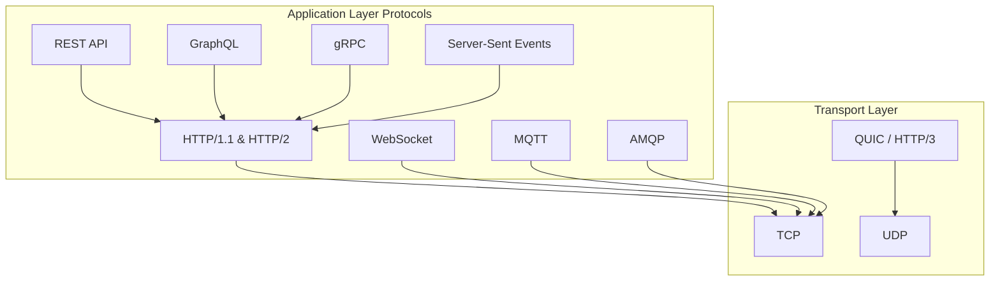
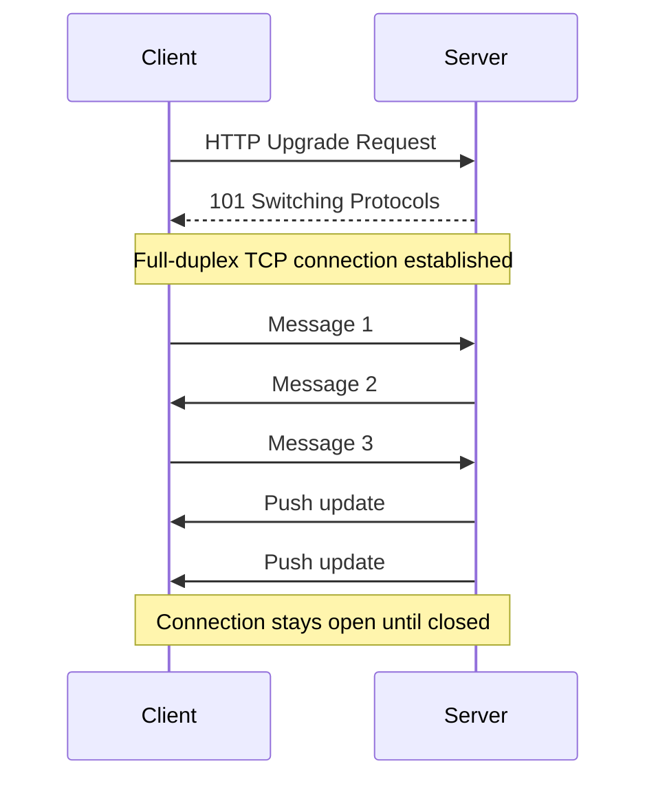
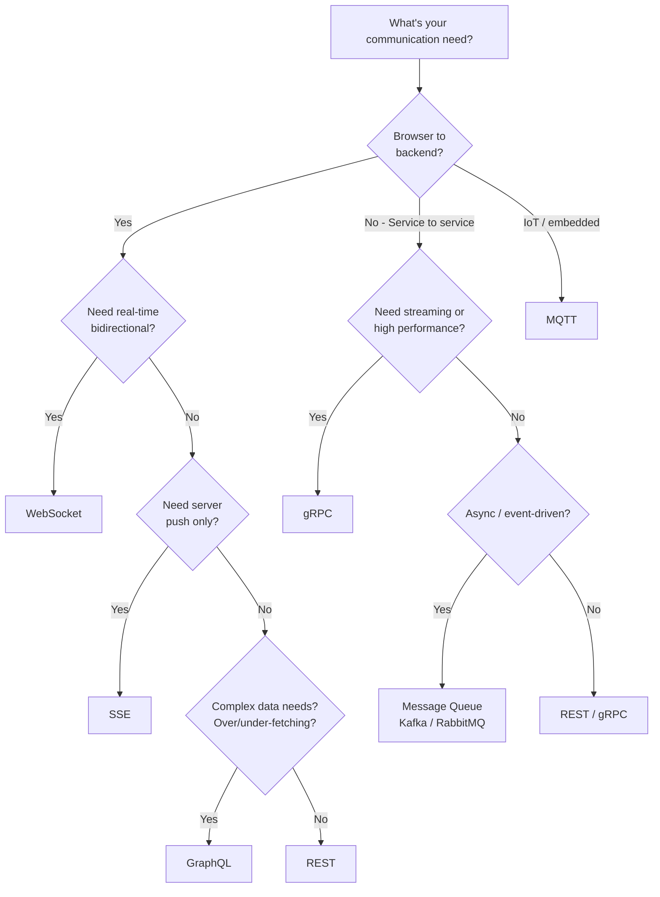

# Communication Protocols — How Services Talk

> "Choosing the wrong protocol is like speaking French in a Japanese restaurant — technically communication, but incredibly inefficient."

---

## 1. The Protocol Landscape



---

## 2. REST (Representational State Transfer)

### Core Principles

```
REST is an ARCHITECTURE STYLE, not a protocol.
Built on top of HTTP.

Principles:
├── Stateless: Each request contains all info needed
├── Resource-based: URLs represent resources (/users/123)
├── HTTP methods: GET, POST, PUT, PATCH, DELETE
├── Uniform interface: Consistent URL patterns
├── Cacheable: Responses can be cached (GET)
└── Layered: Client doesn't know if talking to server or proxy
```

### Example

```http
# Create user
POST /api/v1/users HTTP/1.1
Content-Type: application/json
{
  "name": "Alice",
  "email": "alice@example.com"
}

# Response
HTTP/1.1 201 Created
{
  "id": "u-123",
  "name": "Alice",
  "email": "alice@example.com",
  "created_at": "2024-02-15T10:00:00Z"
}

# Get user
GET /api/v1/users/u-123 HTTP/1.1

# Update user
PATCH /api/v1/users/u-123 HTTP/1.1
{ "name": "Alice Smith" }

# Delete user
DELETE /api/v1/users/u-123 HTTP/1.1
```

### Pros & Cons

```
✅ Universal (every language/framework supports HTTP)
✅ Simple to understand and debug (curl, Postman)
✅ Cacheable (CDN, browser, proxy caching)
✅ Stateless (easy to scale horizontally)
✅ Huge ecosystem (tools, libraries, documentation)

❌ Over-fetching: GET /users/123 returns ALL fields
❌ Under-fetching: Need 3 requests for user + orders + reviews
❌ Text-based (JSON): Larger payload than binary
❌ No streaming (request-response only)
❌ No server push (client must poll)
```

---

## 3. GraphQL

### How It Works

```graphql
# Client asks for EXACTLY what it needs — no more, no less

# Query (like GET)
query {
  user(id: "u-123") {
    name
    email
    orders(limit: 5) {
      id
      total
      items {
        productName
        quantity
      }
    }
  }
}

# Response: Only the requested fields
{
  "data": {
    "user": {
      "name": "Alice",
      "email": "alice@example.com",
      "orders": [
        {
          "id": "o-1",
          "total": 2500,
          "items": [
            { "productName": "Widget", "quantity": 2 }
          ]
        }
      ]
    }
  }
}

# Mutation (like POST/PUT)
mutation {
  createOrder(input: { userId: "u-123", items: [{productId: "p-1", qty: 2}] }) {
    id
    status
    total
  }
}

# Subscription (real-time)
subscription {
  orderStatusChanged(orderId: "o-1") {
    status
    updatedAt
  }
}
```

### Pros & Cons

```
✅ No over-fetching or under-fetching
✅ Single endpoint for all data needs
✅ Strongly typed schema
✅ Self-documenting (introspection)
✅ Real-time via subscriptions
✅ Great for mobile (minimize bandwidth)

❌ Complex server implementation
❌ Caching is harder (single endpoint, POST requests)
❌ N+1 query problem (use DataLoader)
❌ Not great for file uploads
❌ Query complexity attacks (nested queries can be expensive)
❌ Learning curve for team
```

---

## 4. gRPC (Google Remote Procedure Call)

### How It Works

```protobuf
// Define service in .proto file (Protocol Buffers)
syntax = "proto3";

service OrderService {
  rpc CreateOrder (CreateOrderRequest) returns (OrderResponse);
  rpc GetOrder (GetOrderRequest) returns (OrderResponse);
  rpc StreamUpdates (OrderId) returns (stream OrderUpdate);  // Server streaming
  rpc BidirectionalChat (stream Message) returns (stream Message);  // Bi-directional
}

message CreateOrderRequest {
  string user_id = 1;
  repeated OrderItem items = 2;
}

message OrderItem {
  string product_id = 1;
  int32 quantity = 2;
}

message OrderResponse {
  string id = 1;
  string status = 2;
  double total = 3;
}
```

```python
# Server implementation (Python)
import grpc
from generated import order_pb2, order_pb2_grpc

class OrderServicer(order_pb2_grpc.OrderServiceServicer):
    def CreateOrder(self, request, context):
        order = create_order(request.user_id, request.items)
        return order_pb2.OrderResponse(
            id=order.id,
            status="CREATED",
            total=order.total
        )
    
    def StreamUpdates(self, request, context):
        """Server streaming — push updates as they happen."""
        order_id = request.id
        while True:
            update = wait_for_update(order_id)
            yield order_pb2.OrderUpdate(
                order_id=order_id,
                status=update.status,
                timestamp=update.timestamp
            )

# Client
channel = grpc.insecure_channel('order-service:50051')
stub = order_pb2_grpc.OrderServiceStub(channel)

response = stub.CreateOrder(order_pb2.CreateOrderRequest(
    user_id="u-123",
    items=[order_pb2.OrderItem(product_id="p-1", quantity=2)]
))
print(f"Order: {response.id}, Total: {response.total}")
```

### Four Communication Patterns

```
1. Unary RPC:          Client sends one → Server returns one
   (like REST)         CreateOrder(request) → response

2. Server Streaming:   Client sends one → Server returns many
   (live updates)      StreamUpdates(orderId) → stream of updates

3. Client Streaming:   Client sends many → Server returns one
   (file upload)       UploadChunks(stream) → response

4. Bidirectional:      Client sends many ↔ Server returns many
   (real-time chat)    Chat(stream) ↔ stream
```

### Pros & Cons

```
✅ Binary protocol (Protocol Buffers) — 10x smaller than JSON
✅ HTTP/2 — multiplexing, header compression, streaming
✅ Strongly typed — code generation from .proto files
✅ 4 communication patterns (unary, streaming, bidirectional)
✅ Extremely fast (ideal for inter-service communication)
✅ Built-in deadlines, cancellation, load balancing

❌ Not human-readable (binary format)
❌ Limited browser support (needs gRPC-Web proxy)
❌ Steeper learning curve (proto files, code gen)
❌ Not cacheable (HTTP/2 POST requests)
❌ Debugging harder (can't just curl it)
❌ Schema evolution needs care (.proto versioning)
```

---

## 5. WebSocket

### How It Works



```javascript
// Server (Node.js with ws library)
const WebSocket = require('ws');
const wss = new WebSocket.Server({ port: 8080 });

wss.on('connection', (ws) => {
  console.log('Client connected');
  
  ws.on('message', (data) => {
    const message = JSON.parse(data);
    // Broadcast to all connected clients
    wss.clients.forEach((client) => {
      if (client.readyState === WebSocket.OPEN) {
        client.send(JSON.stringify({
          user: message.user,
          text: message.text,
          timestamp: Date.now()
        }));
      }
    });
  });
  
  ws.on('close', () => console.log('Client disconnected'));
});

// Client (Browser)
const ws = new WebSocket('ws://localhost:8080');

ws.onopen = () => ws.send(JSON.stringify({ user: 'Alice', text: 'Hello!' }));
ws.onmessage = (event) => console.log('Received:', JSON.parse(event.data));
ws.onclose = () => console.log('Disconnected');
```

### Pros & Cons

```
✅ Real-time bidirectional communication
✅ Low latency (persistent connection, no HTTP overhead)
✅ Server can push to client without polling
✅ Efficient for high-frequency updates

❌ Stateful (hard to scale — need sticky sessions or pub/sub)
❌ No built-in reconnection (must implement manually)
❌ Firewall/proxy issues (some block WebSocket)
❌ Resource intensive (one connection per client)
❌ No built-in message acknowledgment
```

---

## 6. Server-Sent Events (SSE)

```javascript
// Server → Client only (one-directional push)
// Built on HTTP — works through proxies and firewalls

// Server (Node.js)
app.get('/events', (req, res) => {
  res.setHeader('Content-Type', 'text/event-stream');
  res.setHeader('Cache-Control', 'no-cache');
  res.setHeader('Connection', 'keep-alive');
  
  const interval = setInterval(() => {
    const data = { price: getStockPrice('AAPL'), timestamp: Date.now() };
    res.write(`data: ${JSON.stringify(data)}\n\n`);
  }, 1000);
  
  req.on('close', () => clearInterval(interval));
});

// Client (Browser — built-in API!)
const events = new EventSource('/events');
events.onmessage = (event) => {
  const data = JSON.parse(event.data);
  updateStockTicker(data);
};
// Auto-reconnects on failure!
```

### SSE vs WebSocket

```
┌────────────────┬─────────────────┬──────────────────┐
│ Feature        │ SSE             │ WebSocket        │
├────────────────┼─────────────────┼──────────────────┤
│ Direction      │ Server → Client │ Bidirectional    │
│ Protocol       │ HTTP            │ WS (TCP upgrade) │
│ Reconnection   │ Automatic       │ Manual           │
│ Binary data    │ No (text only)  │ Yes              │
│ Proxy/firewall │ Works (HTTP)    │ May be blocked   │
│ Complexity     │ Simple          │ Complex          │
│ Browser API    │ Built-in        │ Built-in         │
│ Use case       │ Notifications,  │ Chat, gaming,    │
│                │ feeds, tickers  │ collaboration    │
└────────────────┴─────────────────┴──────────────────┘
```

---

## 7. HTTP Versions Comparison

```
┌──────────────┬───────────────┬───────────────┬───────────────┐
│ Feature      │ HTTP/1.1      │ HTTP/2        │ HTTP/3        │
├──────────────┼───────────────┼───────────────┼───────────────┤
│ Year         │ 1997          │ 2015          │ 2022          │
│ Transport    │ TCP           │ TCP           │ QUIC (UDP)    │
│ Multiplexing │ ❌ (one req   │ ✅ Multiple   │ ✅ Multiple   │
│              │ per connection)│ streams       │ streams       │
│ Compression  │ None          │ HPACK headers │ QPACK headers │
│ Server Push  │ ❌            │ ✅            │ ✅            │
│ Head-of-line │ Yes (blocks)  │ Yes (TCP lvl) │ No (QUIC)    │
│ blocking     │               │               │               │
│ Connection   │ Keep-alive    │ Single conn   │ 0-RTT resume │
│ setup        │ (sequential)  │ (multiplexed) │ (fastest)     │
│ Binary       │ ❌ (text)     │ ✅ (frames)   │ ✅ (frames)  │
│ Encryption   │ Optional      │ Practically   │ Mandatory     │
│              │ (HTTPS)       │ required      │ (TLS 1.3)    │
└──────────────┴───────────────┴───────────────┴───────────────┘
```

---

## 8. Protocol Decision Framework



### Quick Reference

```
┌──────────────────┬──────────────────────────────────────┐
│ Protocol         │ Best For                             │
├──────────────────┼──────────────────────────────────────┤
│ REST             │ Public APIs, CRUD, simple services   │
│ GraphQL          │ Complex frontends, mobile apps       │
│ gRPC             │ Internal microservice communication  │
│ WebSocket        │ Chat, gaming, collaborative editing  │
│ SSE              │ Notifications, live feeds, dashboards│
│ MQTT             │ IoT devices, low-bandwidth sensors   │
│ Message Queues   │ Async processing, event-driven       │
└──────────────────┴──────────────────────────────────────┘
```

---

## 9. Long Polling vs Polling vs WebSocket vs SSE

```
Polling:        Client asks every N seconds (wasteful)
Long Polling:   Client asks, server holds until data available
WebSocket:      Persistent bidirectional connection
SSE:            Persistent one-way server → client

Timeline:
Polling:      [req][res] ... [req][res] ... [req][res]  (many empty)
Long Polling: [req.........res] [req.........res]        (fewer, but blocks)
WebSocket:    [connect] ←→ ←→ ←→ ←→ ←→                 (continuous)
SSE:          [connect] ←  ←  ←  ←  ←                   (server push)
```

---

## 10. Common Mistakes

### ❌ Using REST for everything between microservices

```
Problem: REST over HTTP/1.1 between internal services
  → Text-based JSON → larger payloads
  → No streaming → polling for updates
  → Request-response only → can't push

Better: gRPC for internal service-to-service communication
  → Binary (10x smaller), HTTP/2, streaming, code generation
```

### ❌ Using WebSocket when SSE would suffice

```
If server only pushes TO client (no client→server messages):
  → SSE is simpler, auto-reconnects, works through proxies
  → WebSocket is overkill

Dashboard updates? → SSE
Live notifications? → SSE
Chat / gaming? → WebSocket (bidirectional needed)
```

### ❌ Not handling connection failures

```python
# ❌ BAD: Assume connection is always alive
ws.send(data)  # Crashes if connection dropped

# ✅ GOOD: Reconnection with exponential backoff
class ResilientWebSocket:
    def __init__(self, url, max_retries=10):
        self.url = url
        self.max_retries = max_retries
        self.retry_count = 0
    
    def connect(self):
        try:
            self.ws = websocket.connect(self.url)
            self.retry_count = 0
        except ConnectionError:
            delay = min(2 ** self.retry_count, 60)  # Max 60s
            self.retry_count += 1
            time.sleep(delay)
            if self.retry_count < self.max_retries:
                self.connect()
```

---

## 11. Interview Questions & Answers

### Q1: "When would you choose gRPC over REST?"

```
gRPC when:
- Internal microservice communication (not browser-facing)
- Need streaming (live updates, file transfer)
- High performance required (binary, HTTP/2)
- Strong typing matters (proto contract)
- Polyglot services (auto-generate clients in any language)

REST when:
- Public-facing API (universal support)
- Need browser compatibility (no gRPC proxy)
- Simple CRUD operations
- Want cacheability (GET requests)
- Team is more familiar with REST
```

### Q2: "How do you implement real-time features?"

```
Depends on the use case:

One-way server push (notifications, feeds):
→ SSE (simplest, auto-reconnect, HTTP)

Bidirectional real-time (chat, gaming):
→ WebSocket (full-duplex, low latency)

Occasional updates (dashboard refresh):
→ Long polling (simpler infra than WebSocket)

Internal service events:
→ gRPC server streaming or message queues

At scale:
→ Use pub/sub (Redis Pub/Sub) to broadcast across 
  multiple WebSocket server instances
```

---

## 12. Cheat Sheet

```
┌─────────────────────────────────────────────────────────────────┐
│           COMMUNICATION PROTOCOLS CHEAT SHEET                    │
├─────────────────────────────────────────────────────────────────┤
│                                                                 │
│  REST: Universal, cacheable, CRUD. Default for public APIs.     │
│  GraphQL: Flexible queries, one endpoint. For complex frontends.│
│  gRPC: Binary, fast, streaming. For internal microservices.     │
│  WebSocket: Bidirectional real-time. For chat, gaming.          │
│  SSE: Server push only. For notifications, dashboards.          │
│  MQTT: Lightweight pub/sub. For IoT.                            │
│                                                                 │
│  HTTP versions: 1.1 (sequential) → 2 (multiplexed) → 3 (QUIC) │
│                                                                 │
│  Rule: REST for public, gRPC for internal, WS for real-time    │
│  Rule: SSE > WebSocket if only server pushes                    │
│  Rule: Always handle reconnection and timeouts                  │
│                                                                 │
└─────────────────────────────────────────────────────────────────┘
```
