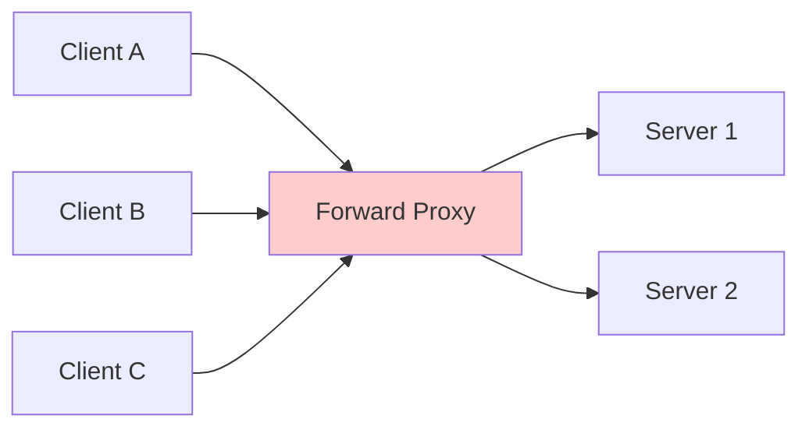
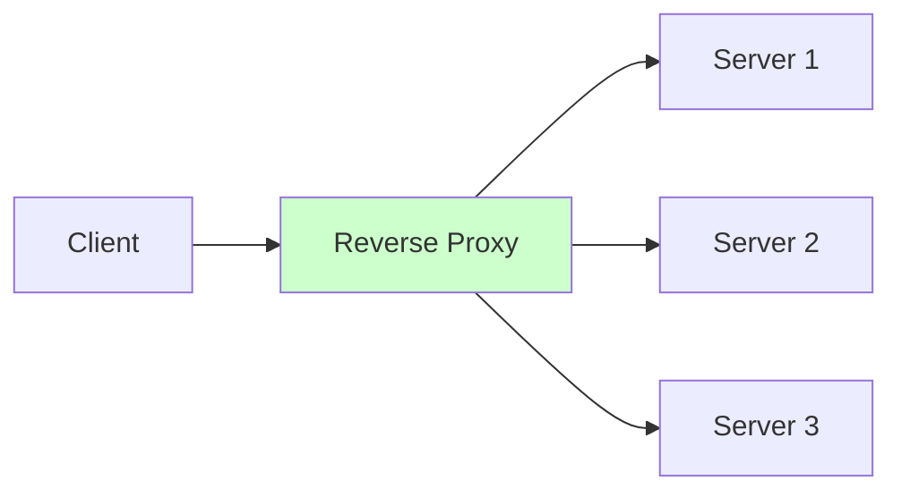
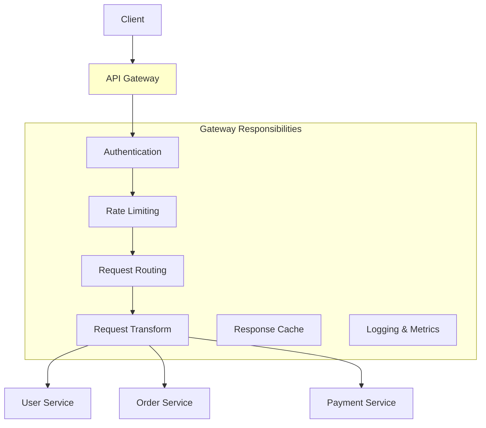
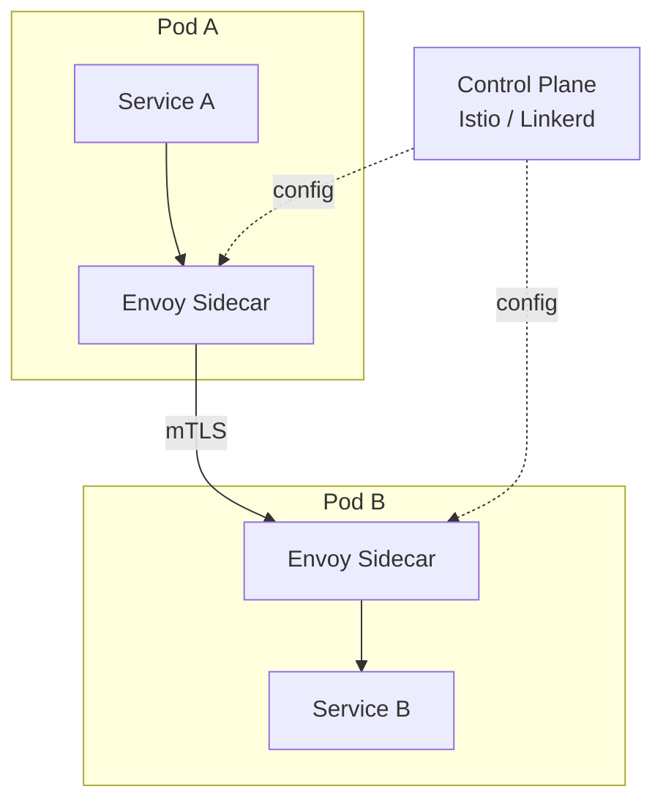

# Proxies — The Invisible Layer

> "A proxy is the bodyguard of distributed systems — it controls who gets in, who gets out, and what they can do."

---

## 1. What is a Proxy?

A proxy is an intermediary server that sits between clients and backend servers, forwarding requests and responses.

```
Without proxy:
  Client ──────────────► Server

With proxy:
  Client ──► [Proxy] ──► Server
```

---

## 2. Forward Proxy

Sits in front of **clients**. The server doesn't know the real client.



### Use Cases

```
1. Anonymity:        Hide client IP from servers (VPN, Tor)
2. Access control:   Block certain websites (corporate firewall)
3. Caching:          Cache responses for repeated requests
4. Bypass restrictions: Access geo-blocked content
5. Logging:          Monitor employee internet usage
```

---

## 3. Reverse Proxy

Sits in front of **servers**. The client doesn't know which server it's hitting.



### Use Cases

```
1. Load balancing:      Distribute requests across servers
2. SSL termination:     Handle HTTPS, forward HTTP internally
3. Caching:             Cache static content (images, CSS, JS)
4. Compression:         Gzip responses before sending to client
5. Security:            Hide backend topology, WAF, DDoS protection
6. Rate limiting:       Throttle abusive clients
7. A/B testing:         Route % of traffic to new version
8. URL rewriting:       /api/v1/... → internal-service:8080/...
```

### Nginx as Reverse Proxy

```nginx
# Basic reverse proxy configuration
upstream backend_servers {
    server 10.0.1.1:8080 weight=5;
    server 10.0.1.2:8080 weight=3;
    server 10.0.1.3:8080 weight=2;
}

server {
    listen 80;
    server_name api.example.com;

    # SSL termination
    listen 443 ssl;
    ssl_certificate /etc/nginx/ssl/cert.pem;
    ssl_certificate_key /etc/nginx/ssl/key.pem;

    # Caching
    proxy_cache_path /var/cache/nginx levels=1:2 keys_zone=api_cache:10m;

    location /api/ {
        proxy_pass http://backend_servers;
        proxy_set_header Host $host;
        proxy_set_header X-Real-IP $remote_addr;
        proxy_set_header X-Forwarded-For $proxy_add_x_forwarded_for;
        
        # Cache GET requests for 60 seconds
        proxy_cache api_cache;
        proxy_cache_valid 200 60s;
        proxy_cache_methods GET HEAD;
    }

    location /static/ {
        root /var/www/static;
        expires 30d;
        add_header Cache-Control "public, immutable";
    }
}
```

---

## 4. Forward vs Reverse Proxy

```
┌──────────────────┬──────────────────────┬──────────────────────┐
│ Aspect           │ Forward Proxy        │ Reverse Proxy        │
├──────────────────┼──────────────────────┼──────────────────────┤
│ Sits in front of │ Clients              │ Servers              │
│ Hides            │ Client identity      │ Server identity      │
│ Configured by    │ Client (or network)  │ Server admin         │
│ Server knows     │ Proxy's IP           │ N/A (proxy is entry) │
│ Client knows     │ N/A (sends to proxy) │ Proxy's IP only      │
│ Main use         │ Privacy, filtering   │ Load balance, cache  │
│ Example          │ VPN, corporate proxy │ Nginx, HAProxy, CDN  │
└──────────────────┴──────────────────────┴──────────────────────┘
```

---

## 5. API Gateway (Specialized Reverse Proxy)



### API Gateway vs Reverse Proxy

```
Reverse Proxy (Nginx, HAProxy):
├── Layer 4/7 routing
├── Load balancing
├── SSL termination
├── Basic caching
└── Protocol-level concerns

API Gateway (Kong, AWS API GW, Envoy):
├── Everything a reverse proxy does PLUS:
├── Authentication / Authorization
├── Rate limiting per API key
├── Request/response transformation
├── API versioning
├── Request aggregation (BFF pattern)
├── Circuit breaking
├── API analytics and billing
└── Developer portal
```

### Popular API Gateways

| Gateway | Type | Best For |
|---------|------|----------|
| **Nginx** | Reverse proxy | Simple routing, static content |
| **HAProxy** | Load balancer | High-performance L4/L7 |
| **Kong** | API Gateway | Plugin ecosystem, Lua extensible |
| **Envoy** | Service proxy | Service mesh (Istio sidecar) |
| **AWS API Gateway** | Managed | Serverless (Lambda integration) |
| **Traefik** | Reverse proxy | Docker/K8s native auto-discovery |

---

## 6. Service Mesh (Sidecar Proxy)



### What Service Mesh Handles

```
Without service mesh (each service implements):
├── Retry logic
├── Circuit breaking
├── mTLS encryption
├── Tracing headers
├── Load balancing
├── Rate limiting
└── Every service has this code → duplication

With service mesh (sidecar proxy handles):
├── All of the above, transparently
├── Service code just makes plain HTTP/gRPC calls
├── Sidecar intercepts and adds cross-cutting concerns
├── Configuration via control plane (central management)
└── Language-agnostic (works with any framework)
```

### When You Need a Service Mesh

```
You probably DON'T need one if:
├── < 10 microservices
├── Small team
├── Simple communication patterns

You might need one if:
├── 50+ microservices
├── Multiple programming languages
├── Need mTLS everywhere (zero-trust)
├── Complex traffic management (canary, blue-green)
├── Compliance requirements (audit all service calls)
```

---

## 7. CDN (Content Delivery Network) as a Proxy

```
CDN = globally distributed reverse proxy for static content

Origin Server (New York)
        ↓
   CDN Edge Nodes
  ├── Mumbai   ← Indian users served from here (20ms)
  ├── London   ← UK users served from here (15ms)
  ├── Tokyo    ← Japanese users served from here (10ms)
  └── São Paulo ← Brazilian users served from here (25ms)

Instead of everyone hitting New York (200-400ms), 
users hit their nearest CDN node.
```

### CDN Caching Strategy

```
Static assets (images, CSS, JS):
  Cache-Control: public, max-age=31536000, immutable
  → Cache for 1 year (use content hash in filename for cache busting)

API responses:
  Cache-Control: public, max-age=60, stale-while-revalidate=300
  → Cache for 60s, serve stale for 5min while refreshing

Private data:
  Cache-Control: private, no-store
  → Never cache on CDN (user-specific data)
```

---

## 8. Common Proxy Patterns

### Pattern 1: SSL Termination

```
Client ──[HTTPS]──► Proxy ──[HTTP]──► Backend
                     ↑
              SSL certificate here
              Decrypt once, forward plaintext

Benefits:
├── Backend servers don't need SSL certificates
├── Single place to manage/rotate certificates
├── Backend is simpler and faster
├── Let's Encrypt automation at proxy level
```

### Pattern 2: Request Aggregation (BFF)

```
Mobile app needs: user profile + recent orders + notifications

Without BFF:
  App → GET /users/123          (100ms)
  App → GET /users/123/orders   (150ms)
  App → GET /notifications      (80ms)
  Total: 330ms + 3 round trips

With BFF (Backend for Frontend):
  App → GET /mobile/dashboard   (single request)
  BFF → parallel: user + orders + notifications
  BFF → combined response
  Total: 150ms + 1 round trip
```

### Pattern 3: Sidecar

```
Application Pod:
┌──────────────────────────────────────┐
│  ┌──────────────┐ ┌───────────────┐  │
│  │ Your Service │→│ Sidecar Proxy │  │
│  │ (any lang)   │ │ (Envoy)       │  │
│  └──────────────┘ └───────┬───────┘  │
│                           │          │
└───────────────────────────┼──────────┘
                            │
                     Network calls
              (mTLS, retry, circuit break)
```

---

## 9. Common Mistakes

### ❌ Not preserving client IP through proxy chain

```nginx
# ❌ BAD: Backend sees proxy IP instead of client IP
proxy_pass http://backend;

# ✅ GOOD: Forward original client IP
proxy_set_header X-Real-IP $remote_addr;
proxy_set_header X-Forwarded-For $proxy_add_x_forwarded_for;
proxy_set_header X-Forwarded-Proto $scheme;
```

### ❌ Single point of failure

```
❌ BAD:
  Client → [Single Proxy] → Backend Servers
  Proxy dies → everything down

✅ GOOD:
  Client → DNS Round Robin → [Proxy A (Active)]  → Backend
                            → [Proxy B (Standby)] → Backend
  Use keepalived/VRRP for automatic failover
```

---

## 10. Interview Questions & Answers

### Q1: "What's the difference between forward and reverse proxy?"

```
Forward proxy: Sits in front of CLIENTS, hides client identity.
  Client → Forward Proxy → Server
  Example: VPN, corporate firewall, Tor

Reverse proxy: Sits in front of SERVERS, hides server identity.
  Client → Reverse Proxy → Server(s)
  Example: Nginx, CDN, API Gateway

Key difference: Who configured it and who it protects.
Forward = client-side (privacy). Reverse = server-side (security/scaling).
```

### Q2: "When would you use an API Gateway vs a simple reverse proxy?"

```
Simple reverse proxy (Nginx) when:
- Just need load balancing + SSL termination
- Static routing rules
- No per-API-key rate limiting
- Simple infrastructure

API Gateway (Kong, AWS API GW) when:
- Need authentication/authorization at the edge
- Per-client rate limiting and quotas
- Request/response transformation
- API versioning and analytics
- Developer portal and API key management
- Microservices architecture with many backend services
```

---

## 11. Cheat Sheet

```
┌─────────────────────────────────────────────────────────────────┐
│                    PROXIES CHEAT SHEET                           │
├─────────────────────────────────────────────────────────────────┤
│                                                                 │
│  Forward Proxy: Client → Proxy → Server (hides client)          │
│  Reverse Proxy: Client → Proxy → Server (hides server)          │
│  API Gateway: Reverse proxy + auth + rate limit + transform     │
│  Service Mesh: Sidecar proxy per service (cross-cutting)        │
│  CDN: Distributed reverse proxy for static content              │
│                                                                 │
│  Nginx/HAProxy: Load balancing, SSL, routing                    │
│  Kong/Envoy: Full API gateway with plugins                      │
│  Istio/Linkerd: Service mesh (50+ microservices)                │
│  Cloudflare/CloudFront: CDN + DDoS + edge compute              │
│                                                                 │
│  Key Features:                                                  │
│  - SSL termination (HTTPS → HTTP internally)                    │
│  - Load balancing (distribute traffic)                          │
│  - Caching (static content, API responses)                      │
│  - Security (WAF, DDoS, IP filtering)                           │
│  - Compression (gzip responses)                                 │
│                                                                 │
│  Always: Forward X-Real-IP and X-Forwarded-For headers          │
│  Always: Have proxy redundancy (no single point of failure)     │
│                                                                 │
└─────────────────────────────────────────────────────────────────┘
```

