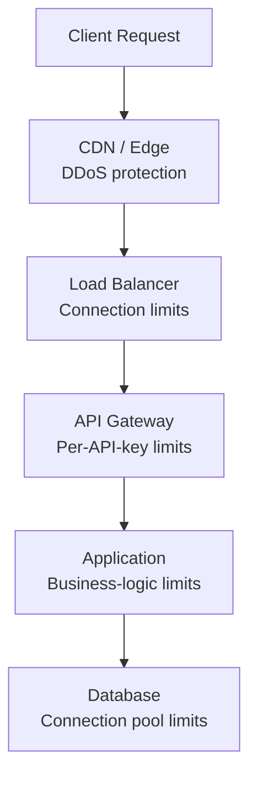

# Rate Limiting & Throttling — Protecting Your System

> "Rate limiting is the bouncer at your API's door — polite enough to serve real users, firm enough to stop abuse."

---

## 1. Why Rate Limiting?

```
Without rate limiting:
├── A single user sends 10,000 req/sec → crashes your server
├── Bot scrapes your entire product catalog
├── Brute-force attack tries 1M passwords/minute
├── One buggy client retries in a tight loop
└── DDoS attack overwhelms your infrastructure

With rate limiting:
├── Users get fair access (no one hogs resources)
├── System stays stable under load
├── Abuse is automatically blocked
├── Costs are controlled (each request = $$$)
└── Compliance with API SLAs
```

---

## 2. Rate Limiting Algorithms

### 2.1 Token Bucket

```
Imagine a bucket that holds tokens. Each request costs one token.
Tokens are added at a fixed rate. If bucket is empty → reject.

Allows BURSTS (spend saved tokens quickly).
```

```python
import time
import threading

class TokenBucket:
    def __init__(self, capacity: int, refill_rate: float):
        """
        capacity: Max tokens in the bucket
        refill_rate: Tokens added per second
        """
        self.capacity = capacity
        self.tokens = capacity
        self.refill_rate = refill_rate
        self.last_refill = time.time()
        self.lock = threading.Lock()
    
    def _refill(self):
        now = time.time()
        elapsed = now - self.last_refill
        new_tokens = elapsed * self.refill_rate
        self.tokens = min(self.capacity, self.tokens + new_tokens)
        self.last_refill = now
    
    def allow_request(self) -> bool:
        with self.lock:
            self._refill()
            if self.tokens >= 1:
                self.tokens -= 1
                return True
            return False

# Usage: 100 requests/minute with burst of 10
limiter = TokenBucket(capacity=10, refill_rate=100/60)  # ~1.67 tokens/sec
```

### 2.2 Leaky Bucket

```
Requests flow in at variable rate but are processed at a FIXED rate.
Like water leaking from a bucket at a constant rate.

No bursts — smooth, constant output rate.
```

```python
from collections import deque
import time, threading

class LeakyBucket:
    def __init__(self, capacity: int, leak_rate: float):
        """
        capacity: Max requests in queue
        leak_rate: Requests processed per second
        """
        self.capacity = capacity
        self.leak_rate = leak_rate
        self.queue = deque()
        self.lock = threading.Lock()
    
    def _leak(self):
        now = time.time()
        while self.queue and self.queue[0] <= now:
            self.queue.popleft()
    
    def allow_request(self) -> bool:
        with self.lock:
            self._leak()
            if len(self.queue) < self.capacity:
                # Schedule when this request will be "processed"
                if self.queue:
                    next_time = self.queue[-1] + 1 / self.leak_rate
                else:
                    next_time = time.time() + 1 / self.leak_rate
                self.queue.append(next_time)
                return True
            return False
```

### 2.3 Fixed Window Counter

```
Divide time into fixed windows (e.g., 1-minute windows).
Count requests per window. Reset at window boundary.

Problem: Burst at window edges (2x burst possible).
```

```python
import time, threading

class FixedWindowCounter:
    def __init__(self, max_requests: int, window_seconds: int):
        self.max_requests = max_requests
        self.window_seconds = window_seconds
        self.counts = {}  # window_key → count
        self.lock = threading.Lock()
    
    def _get_window_key(self, user_id: str) -> str:
        window = int(time.time() / self.window_seconds)
        return f"{user_id}:{window}"
    
    def allow_request(self, user_id: str) -> bool:
        with self.lock:
            key = self._get_window_key(user_id)
            count = self.counts.get(key, 0)
            if count < self.max_requests:
                self.counts[key] = count + 1
                return True
            return False

# Edge case: User sends 100 requests at 0:59 and 100 at 1:00
# Both pass! (200 requests in 2 seconds)
```

### 2.4 Sliding Window Log

```
Track EXACT timestamp of every request.
Count requests in the last N seconds from NOW.

Most accurate, but memory-intensive.
```

```python
import time, threading
from collections import defaultdict

class SlidingWindowLog:
    def __init__(self, max_requests: int, window_seconds: int):
        self.max_requests = max_requests
        self.window_seconds = window_seconds
        self.logs = defaultdict(list)  # user_id → [timestamps]
        self.lock = threading.Lock()
    
    def allow_request(self, user_id: str) -> bool:
        with self.lock:
            now = time.time()
            cutoff = now - self.window_seconds
            
            # Remove expired entries
            self.logs[user_id] = [
                ts for ts in self.logs[user_id] if ts > cutoff
            ]
            
            if len(self.logs[user_id]) < self.max_requests:
                self.logs[user_id].append(now)
                return True
            return False
```

### 2.5 Sliding Window Counter (Best of Both)

```
Combines fixed window + sliding window.
Uses weighted count from current and previous window.

Approximate but memory-efficient and smooth.
```

```python
import time, threading

class SlidingWindowCounter:
    def __init__(self, max_requests: int, window_seconds: int):
        self.max_requests = max_requests
        self.window_seconds = window_seconds
        self.windows = {}  # user_id → {window_num: count}
        self.lock = threading.Lock()
    
    def allow_request(self, user_id: str) -> bool:
        with self.lock:
            now = time.time()
            current_window = int(now / self.window_seconds)
            window_position = (now % self.window_seconds) / self.window_seconds
            
            user_windows = self.windows.setdefault(user_id, {})
            current_count = user_windows.get(current_window, 0)
            previous_count = user_windows.get(current_window - 1, 0)
            
            # Weighted: previous_count * (1 - position) + current_count
            estimated_count = previous_count * (1 - window_position) + current_count
            
            if estimated_count < self.max_requests:
                user_windows[current_window] = current_count + 1
                return True
            return False
```

### Algorithm Comparison

```
┌──────────────────────┬──────────┬─────────┬────────────┬──────────────┐
│ Algorithm            │ Memory   │ Accuracy│ Burst      │ Complexity   │
├──────────────────────┼──────────┼─────────┼────────────┼──────────────┤
│ Token Bucket         │ O(1)     │ Good    │ Allows     │ Simple       │
│ Leaky Bucket         │ O(N)     │ Good    │ Smooths out│ Medium       │
│ Fixed Window         │ O(1)     │ Low     │ Edge burst │ Simple       │
│ Sliding Window Log   │ O(N)     │ Perfect │ None       │ High (memory)│
│ Sliding Window Count │ O(1)     │ Good    │ Minimal    │ Medium       │
└──────────────────────┴──────────┴─────────┴────────────┴──────────────┘

Most used in production: Token Bucket (AWS, Stripe) 
                         Sliding Window Counter (Redis-based)
```

---

## 3. Distributed Rate Limiting

### The Problem

```
Single server: Easy — rate limiter in memory.
Multiple servers: User hits Server A with 50 requests, 
                  then Server B with 50 more.
                  Each server thinks: "only 50 — OK!"
                  But total = 100 (exceeds limit of 60).
```

### Solution: Centralized Counter (Redis)

```python
import redis
import time

class RedisRateLimiter:
    """Sliding window counter using Redis."""
    
    def __init__(self, redis_client, max_requests: int, window_seconds: int):
        self.redis = redis_client
        self.max_requests = max_requests
        self.window_seconds = window_seconds
    
    def allow_request(self, user_id: str) -> bool:
        key = f"rate_limit:{user_id}"
        now = time.time()
        pipe = self.redis.pipeline()
        
        # Remove expired entries
        pipe.zremrangebyscore(key, 0, now - self.window_seconds)
        # Count remaining
        pipe.zcard(key)
        # Add current request
        pipe.zadd(key, {f"{now}:{id(now)}": now})
        # Set expiry on the key
        pipe.expire(key, self.window_seconds)
        
        results = pipe.execute()
        request_count = results[1]
        
        if request_count < self.max_requests:
            return True
        
        # Remove the request we just added (it's rejected)
        self.redis.zrem(key, f"{now}:{id(now)}")
        return False

# Using Redis Lua script for atomicity (production-ready):
RATE_LIMIT_LUA = """
local key = KEYS[1]
local limit = tonumber(ARGV[1])
local window = tonumber(ARGV[2])
local now = tonumber(ARGV[3])

redis.call('ZREMRANGEBYSCORE', key, 0, now - window)
local count = redis.call('ZCARD', key)

if count < limit then
    redis.call('ZADD', key, now, now .. ':' .. math.random())
    redis.call('EXPIRE', key, window)
    return 1
end
return 0
"""
```

---

## 4. Rate Limiting at Different Layers



| Layer | What to Limit | Tool |
|-------|--------------|------|
| **CDN/Edge** | DDoS, geographic blocks | Cloudflare, AWS Shield |
| **Load Balancer** | Connections per IP | Nginx `limit_conn` |
| **API Gateway** | Requests per API key | Kong, AWS API Gateway |
| **Application** | Business rules (e.g., 5 orders/day) | Custom code + Redis |
| **Database** | Connection pool size | PgBouncer, connection limits |

### Nginx Rate Limiting

```nginx
# Limit by IP: 10 requests/second with burst of 20
http {
    limit_req_zone $binary_remote_addr zone=api_limit:10m rate=10r/s;
    
    server {
        location /api/ {
            limit_req zone=api_limit burst=20 nodelay;
            limit_req_status 429;  # Return 429 Too Many Requests
            
            proxy_pass http://backend;
        }
    }
}
```

---

## 5. Response Headers (Industry Standard)

```http
HTTP/1.1 200 OK
X-RateLimit-Limit: 100          # Max requests per window
X-RateLimit-Remaining: 67       # Requests remaining
X-RateLimit-Reset: 1708003600   # Unix timestamp when window resets
Retry-After: 30                 # Seconds to wait (on 429 response)

HTTP/1.1 429 Too Many Requests
{
  "error": "rate_limit_exceeded",
  "message": "You have exceeded the rate limit of 100 requests per minute",
  "retry_after": 30
}
```

---

## 6. Rate Limiting Strategies

```
┌────────────────────────┬────────────────────────────────────────┐
│ Strategy               │ Description                            │
├────────────────────────┼────────────────────────────────────────┤
│ Per-User               │ 100 req/min per authenticated user     │
│ Per-IP                 │ 50 req/min per IP address              │
│ Per-API-Key            │ Tiered: Free=100, Pro=1000, Enterprise │
│ Per-Endpoint           │ POST /login: 5/min, GET /products: 100 │
│ Global                 │ System-wide: 10,000 req/sec total      │
│ Concurrent             │ Max 10 simultaneous requests per user  │
│ Cost-based             │ Each endpoint has a "cost" — budget/min│
└────────────────────────┴────────────────────────────────────────┘
```

---

## 7. Throttling Patterns

```
Hard throttle:    Reject immediately when limit exceeded (429)
Soft throttle:    Allow some overflow (110% of limit), log warning
Elastic throttle: Allow bursts, charge extra / degrade quality
Graceful degrade: Serve cached/simplified response instead of 429
```

```python
class GracefulThrottler:
    """Instead of hard rejection, degrade service quality."""
    
    def handle_request(self, user_id, request):
        usage = self.get_usage(user_id)
        
        if usage < 0.8 * self.limit:
            # Under 80%: Full quality
            return self.full_response(request)
        
        elif usage < self.limit:
            # 80-100%: Degraded (cached, simplified)
            return self.cached_response(request)
        
        else:
            # Over limit: Minimal response
            return Response(
                status=429,
                body={"error": "rate_limited", "retry_after": self.reset_time()},
                headers={"Retry-After": str(self.reset_time())}
            )
```

---

## 8. Common Mistakes

### ❌ Rate limiting only at application layer

```
Problem: DDoS attack sends 1M requests/sec
Your app rate limiter never even gets to run — network is saturated

Fix: Layer your rate limiting:
  1. CDN/Edge: Block bad IPs, geo-restrictions (Cloudflare)
  2. Load balancer: Connection limits (Nginx limit_conn)
  3. API Gateway: API key limits (Kong)
  4. Application: Business logic limits (Redis)
```

### ❌ Not handling race conditions in distributed rate limiting

```python
# ❌ BAD: Check-then-act (race condition)
count = redis.get(f"limit:{user_id}")
if count < max_requests:
    redis.incr(f"limit:{user_id}")  # Between GET and INCR, another request snuck in!

# ✅ GOOD: Atomic operation with Lua script
ATOMIC_LIMIT = """
local count = redis.call('INCR', KEYS[1])
if count == 1 then
    redis.call('EXPIRE', KEYS[1], ARGV[2])
end
if count > tonumber(ARGV[1]) then
    return 0
end
return 1
"""
```

---

## 9. Interview Questions & Answers

### Q1: "Design a rate limiter for a distributed system"

```
Requirements:
- Multiple API servers behind a load balancer
- Per-user limit: 100 requests/minute
- Must be accurate (no race conditions)

Architecture:
1. Use Redis as centralized counter (shared state)
2. Sliding window counter algorithm (balanced accuracy/memory)
3. Lua script for atomic check-and-increment
4. Return standard rate limit headers
5. Separate rate limits per endpoint tier

Edge cases:
- Redis down? → Allow requests (fail open) or cache locally (fail closed)
- Clock skew? → Use Redis server time (TIME command)
- Hot users? → Local cache + periodic sync to Redis
```

### Q2: "Token bucket vs sliding window — when to use each?"

```
Token Bucket:
- When you want to allow BURSTS (saved tokens = burst budget)
- Simple to implement (O(1) memory)
- Used by: AWS API Gateway, Stripe
- Example: 10 tokens, 1/sec refill → can burst 10, then 1/sec steady

Sliding Window Counter:
- When you want SMOOTH rate limiting (no bursts)
- Weighted average avoids edge-case spikes
- Used by: Redis-based rate limiters
- Example: 60/min → never more than ~60 in any 60-sec window
```

---

## 10. Cheat Sheet

```
┌─────────────────────────────────────────────────────────────────┐
│              RATE LIMITING CHEAT SHEET                           │
├─────────────────────────────────────────────────────────────────┤
│                                                                 │
│  Algorithms:                                                    │
│  - Token Bucket: Allows bursts (AWS, Stripe)                    │
│  - Leaky Bucket: Smooth output rate                             │
│  - Fixed Window: Simple but edge-burst problem                  │
│  - Sliding Window Log: Perfect but memory-heavy                 │
│  - Sliding Window Counter: Best balance (production choice)     │
│                                                                 │
│  Distributed: Use Redis (Lua script for atomicity)              │
│                                                                 │
│  Layers: CDN → LB → API Gateway → App → DB                     │
│                                                                 │
│  Headers: X-RateLimit-Limit, Remaining, Reset, Retry-After      │
│  Status: 429 Too Many Requests                                  │
│                                                                 │
│  Strategies: Per-user, per-IP, per-API-key, per-endpoint        │
│  Throttle: Hard reject OR graceful degradation                  │
│                                                                 │
│  Rule: Always use atomic operations (Lua/MULTI)                 │
│  Rule: Layer rate limiting (don't rely on one layer)            │
│  Rule: Fail open vs fail closed — decide based on context       │
│                                                                 │
└─────────────────────────────────────────────────────────────────┘
```
