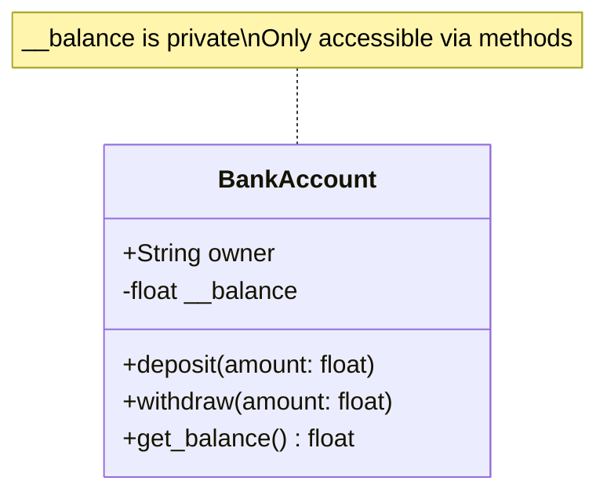
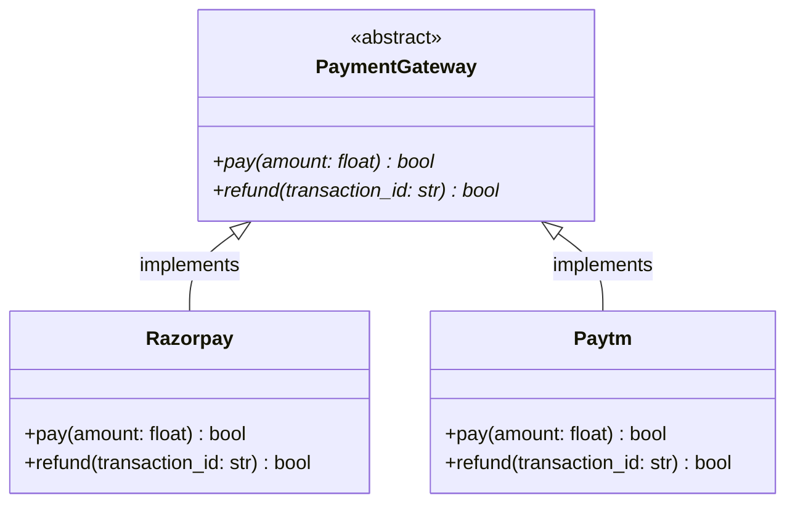
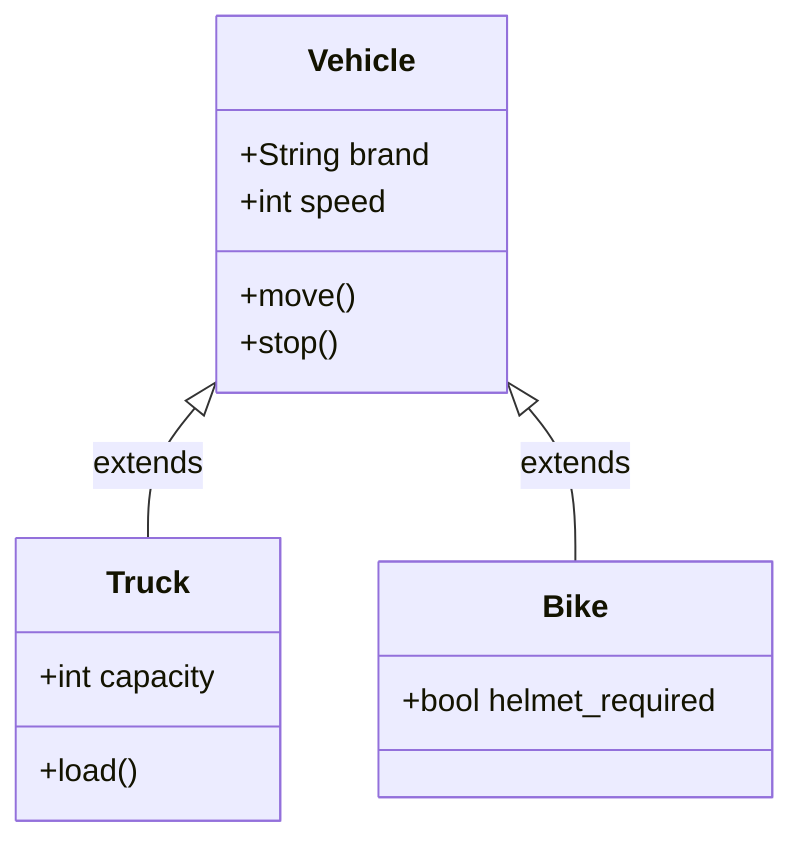
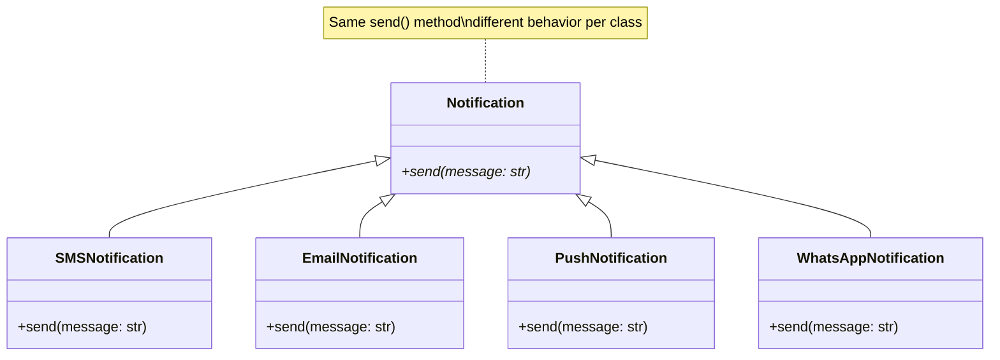
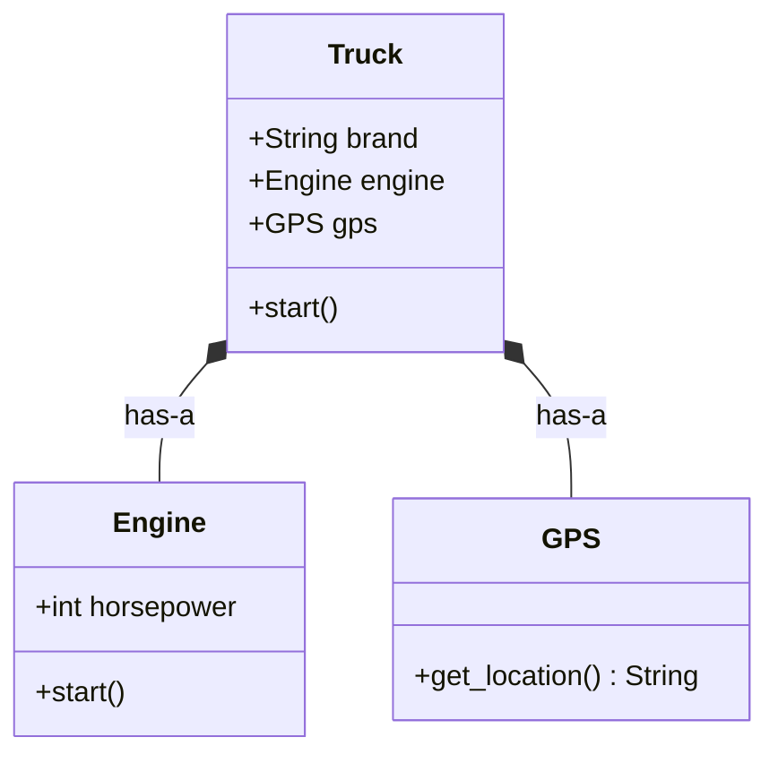

# OOP Fundamentals — The 4 Pillars

Object-Oriented Programming is the foundation of Low-Level Design. Every design pattern, every SOLID principle builds on top of these 4 concepts.

---

## 1. Encapsulation

> **Bundle data + methods together, hide internal state from the outside world.**

### Class Diagram



```python
class BankAccount:
    def __init__(self, owner: str, balance: float = 0):
        self.__balance = balance  # private — can't access directly
        self.owner = owner

    def deposit(self, amount: float):
        if amount > 0:
            self.__balance += amount

    def withdraw(self, amount: float):
        if 0 < amount <= self.__balance:
            self.__balance -= amount
        else:
            print("Insufficient balance")

    def get_balance(self) -> float:
        return self.__balance


acc = BankAccount("Shubham", 1000)
acc.deposit(500)
print(acc.get_balance())  # 1500
# acc.__balance  ← ERROR — hidden from outside
```

### Why Encapsulation?

- **Prevents invalid state** — nobody can set balance to `-9999` directly
- **Controls access** — withdrawals go through validation
- **Easy to change internals** — switch from `float` to `Decimal` without breaking callers

### Real-world Analogy

A car engine is hidden under the hood. You interact through the steering wheel, pedals, and gear — not by touching the pistons directly.

---

## 2. Abstraction

> **Show only what's needed, hide the complexity.**

### Class Diagram



```python
from abc import ABC, abstractmethod


class PaymentGateway(ABC):
    """Abstract interface — defines WHAT, not HOW."""

    @abstractmethod
    def pay(self, amount: float) -> bool:
        ...

    @abstractmethod
    def refund(self, transaction_id: str) -> bool:
        ...


class Razorpay(PaymentGateway):
    def pay(self, amount: float) -> bool:
        # complex API call, token generation, checksum — all hidden
        print(f"Paid ₹{amount} via Razorpay")
        return True

    def refund(self, transaction_id: str) -> bool:
        print(f"Refunded {transaction_id} via Razorpay")
        return True


class Paytm(PaymentGateway):
    def pay(self, amount: float) -> bool:
        print(f"Paid ₹{amount} via Paytm")
        return True

    def refund(self, transaction_id: str) -> bool:
        print(f"Refunded {transaction_id} via Paytm")
        return True


# Caller doesn't care HOW it works internally
gateway: PaymentGateway = Razorpay()
gateway.pay(500)
```

### Why Abstraction?

- **Reduces complexity** — caller only sees `.pay()` and `.refund()`
- **Swappable implementations** — switch from Razorpay to Paytm by changing one line
- **Enforces contracts** — every payment gateway MUST implement `pay()` and `refund()`

### Real-world Analogy

An ATM machine — you insert card, enter PIN, get cash. You don't see the vault, the network calls, or the ledger updates happening behind the scenes.

---

## 3. Inheritance

> **Child class reuses and extends parent class behavior.**

### Class Diagram



```python
class Vehicle:
    def __init__(self, brand: str, speed: int):
        self.brand = brand
        self.speed = speed

    def move(self):
        print(f"{self.brand} moving at {self.speed} km/h")

    def stop(self):
        print(f"{self.brand} stopped")


class Truck(Vehicle):
    def __init__(self, brand: str, speed: int, capacity: int):
        super().__init__(brand, speed)
        self.capacity = capacity  # extra field for Truck

    def load(self):
        print(f"Loading {self.capacity} tons into {self.brand}")


class Bike(Vehicle):
    def __init__(self, brand: str, speed: int, helmet_required: bool = True):
        super().__init__(brand, speed)
        self.helmet_required = helmet_required


# Truck IS-A Vehicle
t = Truck("Tata", 80, 20)
t.move()  # inherited from Vehicle
t.load()  # Truck-specific method

# Bike IS-A Vehicle
b = Bike("Royal Enfield", 120)
b.move()  # inherited from Vehicle
```

### Types of Inheritance

| Type | Example | Python Support |
|------|---------|---------------|
| Single | `Truck → Vehicle` | ✅ |
| Multi-level | `ElectricTruck → Truck → Vehicle` | ✅ |
| Multiple | `HybridVehicle → Electric, Petrol` | ✅ (via MRO) |
| Hierarchical | `Truck, Bike, Car → Vehicle` | ✅ |

### Why Inheritance?

- **Code reuse** — `Truck` gets `move()` and `stop()` for free
- **IS-A relationship** — a Truck IS-A Vehicle
- **Extensibility** — add new vehicle types without touching existing code

### When NOT to Use Inheritance

- When there's no genuine IS-A relationship
- When you only need one or two methods → use **Composition** instead
- Deep inheritance chains (> 3 levels) become hard to maintain

### Real-world Analogy

A Truck **is a** Vehicle. It has everything a vehicle has (brand, speed, move, stop) plus extra capabilities (load capacity).

---

## 4. Polymorphism

> **Same method name, different behavior depending on the object.**

### Class Diagram



```python
class Notification:
    def send(self, message: str):
        raise NotImplementedError


class SMSNotification(Notification):
    def send(self, message: str):
        print(f"📱 SMS: {message}")


class EmailNotification(Notification):
    def send(self, message: str):
        print(f"📧 Email: {message}")


class PushNotification(Notification):
    def send(self, message: str):
        print(f"🔔 Push: {message}")


class WhatsAppNotification(Notification):
    def send(self, message: str):
        print(f"💬 WhatsApp: {message}")


# Same interface, different behavior
def notify_all(notifications: list[Notification], msg: str):
    for n in notifications:
        n.send(msg)  # polymorphic call


channels = [
    SMSNotification(),
    EmailNotification(),
    PushNotification(),
    WhatsAppNotification(),
]

notify_all(channels, "Your truck is arriving in 10 mins!")
```

### Types of Polymorphism

| Type | How | Example |
|------|-----|---------|
| **Runtime (Override)** | Child overrides parent method | `SMSNotification.send()` overrides `Notification.send()` |
| **Compile-time (Overload)** | Same method, different params | Python uses `*args` / `**kwargs` or `@singledispatch` |

### Method Overloading in Python

Python doesn't support traditional overloading, but you can achieve it:

```python
from functools import singledispatchmethod


class Calculator:
    @singledispatchmethod
    def add(self, a, b):
        return a + b

    @add.register
    def _(self, a: str, b: str):
        return f"{a} {b}"
```

### Why Polymorphism?

- **Open for extension** — add `WhatsAppNotification` without changing `notify_all()`
- **Clean loops** — iterate over different types with one interface
- **Decoupling** — `notify_all()` doesn't know or care about specific notification types

### Real-world Analogy

A "Start" button works differently for a car (engine ignition), a washing machine (spin cycle), and a computer (boot OS) — same action, different behavior.

---

## Composition vs Inheritance

> **"Favor composition over inheritance"** — Gang of Four

### Class Diagram



| | Inheritance | Composition |
|---|-----------|------------|
| Relationship | IS-A | HAS-A |
| Coupling | Tight | Loose |
| Flexibility | Less (fixed at design time) | More (swap at runtime) |
| Example | `Truck IS-A Vehicle` | `Truck HAS-A Engine` |

```python
# Composition example — Truck HAS-A Engine
class Engine:
    def __init__(self, horsepower: int):
        self.horsepower = horsepower

    def start(self):
        print(f"Engine started ({self.horsepower} HP)")


class GPS:
    def get_location(self):
        return "18.5204° N, 73.8567° E"


class Truck:
    def __init__(self, brand: str, engine: Engine, gps: GPS):
        self.brand = brand
        self.engine = engine  # HAS-A Engine
        self.gps = gps        # HAS-A GPS

    def start(self):
        self.engine.start()
        location = self.gps.get_location()
        print(f"{self.brand} started at {location}")


truck = Truck("Tata", Engine(250), GPS())
truck.start()
```

### Rule of Thumb

- Use **Inheritance** when there's a clear IS-A relationship and shared behavior
- Use **Composition** when you want to combine capabilities from multiple sources

---

## Common Mistakes in OOP

### Mistake 1: Breaking Encapsulation — Exposing Everything as Public

```python
# ❌ BAD — no encapsulation, anyone can corrupt state
class User:
    def __init__(self, name, age):
        self.name = name
        self.age = age  # nothing stops: user.age = -5

# ✅ GOOD — validate through methods
class User:
    def __init__(self, name, age):
        self.name = name
        self.__age = age

    def set_age(self, age):
        if age < 0 or age > 150:
            raise ValueError("Invalid age")
        self.__age = age

    def get_age(self):
        return self.__age
```

---

### Mistake 2: God Class — One Class That Does Everything

```python
# ❌ BAD — OrderManager handles orders, payments, emails, inventory
class OrderManager:
    def create_order(self): ...
    def process_payment(self): ...
    def send_email(self): ...
    def update_inventory(self): ...
    def generate_invoice(self): ...
    def track_shipment(self): ...

# ✅ GOOD — each class has ONE responsibility
class OrderService:
    def create_order(self): ...

class PaymentService:
    def process_payment(self): ...

class NotificationService:
    def send_email(self): ...

class InventoryService:
    def update_inventory(self): ...
```

---

### Mistake 3: Inheriting Just for Code Reuse (Wrong IS-A)

```python
# ❌ BAD — Stack is NOT a list. Users can call insert(), sort(), etc.
class Stack(list):
    def push(self, item):
        self.append(item)

s = Stack()
s.push(1)
s.insert(0, 999)  # breaks stack behavior! list methods leak through

# ✅ GOOD — use composition, expose only what's needed
class Stack:
    def __init__(self):
        self.__items = []

    def push(self, item):
        self.__items.append(item)

    def pop(self):
        if not self.__items:
            raise IndexError("Stack is empty")
        return self.__items.pop()

    def peek(self):
        return self.__items[-1] if self.__items else None
```

---

### Mistake 4: Deep Inheritance Chains

```python
# ❌ BAD — 5 levels deep, nightmare to debug
class Animal: ...
class Mammal(Animal): ...
class DomesticAnimal(Mammal): ...
class Pet(DomesticAnimal): ...
class Dog(Pet): ...  # which class has the bug? good luck.

# ✅ GOOD — keep it flat, use composition/interfaces
class Dog:
    def __init__(self):
        self.behavior = DomesticBehavior()
        self.sound = BarkSound()
```

---

### Mistake 5: Not Using Polymorphism — if/elif Chains Instead

```python
# ❌ BAD — adding a new type means modifying this function
def calculate_area(shape_type, **kwargs):
    if shape_type == "circle":
        return 3.14 * kwargs["radius"] ** 2
    elif shape_type == "rectangle":
        return kwargs["width"] * kwargs["height"]
    elif shape_type == "triangle":
        return 0.5 * kwargs["base"] * kwargs["height"]
    # adding hexagon? modify this function again...

# ✅ GOOD — each shape knows how to calculate its own area
class Shape(ABC):
    @abstractmethod
    def area(self): ...

class Circle(Shape):
    def __init__(self, radius):
        self.radius = radius
    def area(self):
        return 3.14 * self.radius ** 2

class Rectangle(Shape):
    def __init__(self, width, height):
        self.width = width
        self.height = height
    def area(self):
        return self.width * self.height

# Adding Hexagon? Just add a new class. No existing code changes.
```

---

### Mistake 6: Leaking Abstraction — Exposing Internal Data Structures

```python
# ❌ BAD — caller gets direct access to internal list
class Classroom:
    def __init__(self):
        self.students = []  # anyone can do classroom.students.clear()

# ✅ GOOD — return a copy or expose read-only methods
class Classroom:
    def __init__(self):
        self.__students = []

    def add_student(self, name):
        self.__students.append(name)

    def get_students(self):
        return list(self.__students)  # return copy, not reference

    def count(self):
        return len(self.__students)
```

---

### Mistake 7: Ignoring `super().__init__()` in Inheritance

```python
# ❌ BAD — parent __init__ never runs, brand/speed are missing
class Truck(Vehicle):
    def __init__(self, capacity):
        self.capacity = capacity
        # forgot super().__init__() → self.brand and self.speed don't exist!

# ✅ GOOD
class Truck(Vehicle):
    def __init__(self, brand, speed, capacity):
        super().__init__(brand, speed)  # initialize parent fields
        self.capacity = capacity
```

---

### Quick Reference — Mistakes to Avoid

| # | Mistake | Fix |
|---|---------|-----|
| 1 | Public everything | Use private fields + getters/setters |
| 2 | God class | Split into focused classes |
| 3 | Wrong IS-A inheritance | Use composition (HAS-A) |
| 4 | Deep inheritance (>3 levels) | Flatten + compose |
| 5 | if/elif instead of polymorphism | Use method override |
| 6 | Leaking internal data | Return copies, not references |
| 7 | Forgetting `super().__init__()` | Always call parent constructor |

---

## Quick Cheat Sheet

| Pillar | One-liner | Key Benefit |
|--------|-----------|-------------|
| **Encapsulation** | Hide internal data, expose methods | Prevents invalid state |
| **Abstraction** | Show only what matters | Reduces complexity |
| **Inheritance** | Reuse parent behavior | Avoids code duplication |
| **Polymorphism** | Same action, different behavior | Open for extension |

---

