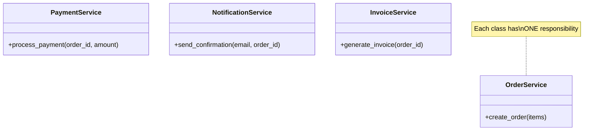
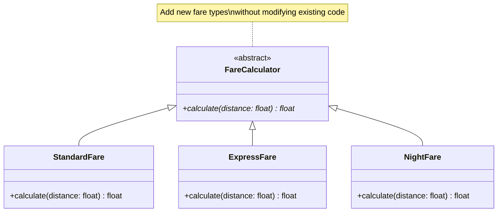
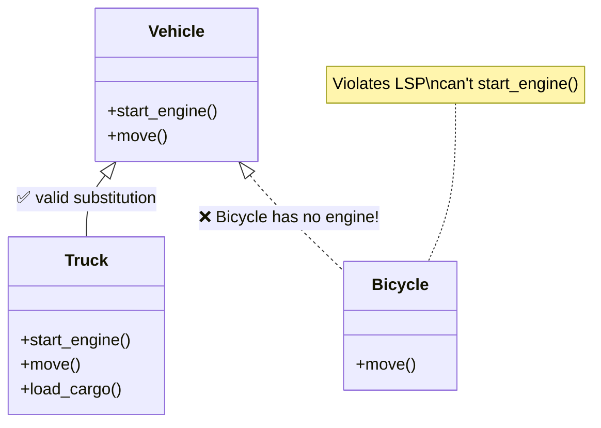
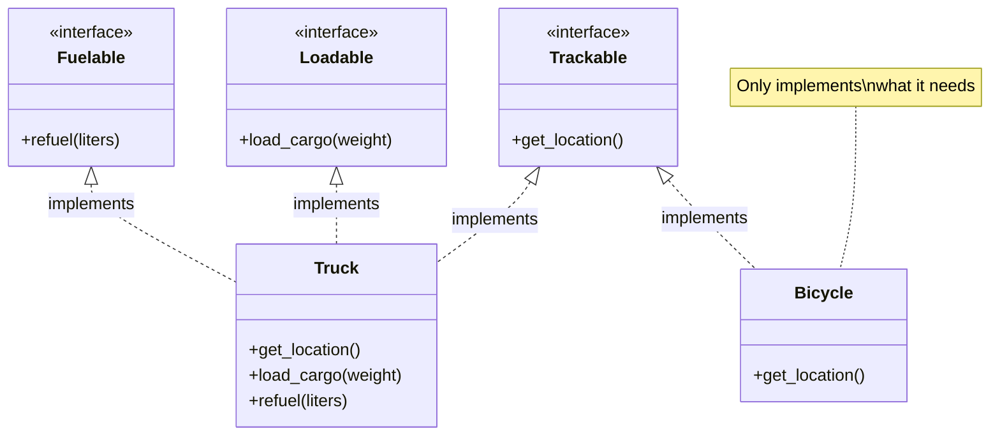
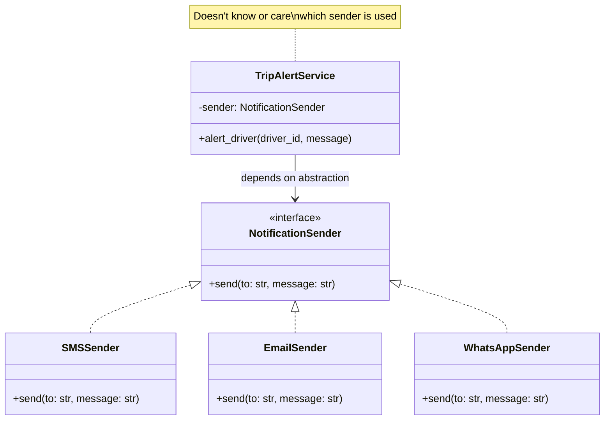

# SOLID Principles

SOLID is a set of 5 design principles that make your OOP code **maintainable, scalable, and flexible**. These are the rules that separate junior code from production-grade code.

| Letter | Principle | One-liner |
|--------|-----------|-----------|
| **S** | Single Responsibility | One class = one job |
| **O** | Open/Closed | Open for extension, closed for modification |
| **L** | Liskov Substitution | Child should work wherever parent is expected |
| **I** | Interface Segregation | Don't force classes to implement unused methods |
| **D** | Dependency Inversion | Depend on abstractions, not concrete classes |

---


- **Single Responsibility Principle (SRP):** A class should have only one reason to change, meaning it should have only one job or responsibility.
- **Open/Closed Principle (OCP):** Software entities (classes, modules, functions) should be open for extension but closed for modification — you should be able to add new behavior without changing existing code.
- **Liskov Substitution Principle (LSP):** Objects of a superclass should be replaceable with objects of a subclass without breaking the application's correctness.
- **Interface Segregation Principle (ISP):** No client should be forced to depend on methods it does not use — prefer many small, specific interfaces over one large, general-purpose interface.
- **Dependency Inversion Principle (DIP):** High-level modules should not depend on low-level modules; both should depend on abstractions. Abstractions should not depend on details; details should depend on abstractions.

---

## 1. Single Responsibility Principle (SRP)

> **A class should have only one reason to change.**

### Class Diagram



```python
# ❌ BAD — one class doing everything (God Class)
class OrderManager:
    def create_order(self, items):
        # create order logic
        print(f"Order created with {len(items)} items")

    def process_payment(self, order_id, amount):
        # payment logic
        print(f"Payment of ₹{amount} processed for order {order_id}")

    def send_email(self, email, order_id):
        # email logic
        print(f"Confirmation sent to {email}")

    def generate_invoice(self, order_id):
        # invoice logic
        print(f"Invoice generated for {order_id}")

    # 4 reasons to change = 4 responsibilities = violation!


# ✅ GOOD — each class has ONE job
class OrderService:
    def create_order(self, items):
        print(f"Order created with {len(items)} items")
        return {"order_id": "ORD-001", "items": items}


class PaymentService:
    def process_payment(self, order_id: str, amount: float):
        print(f"Payment of ₹{amount} processed for {order_id}")
        return True


class NotificationService:
    def send_confirmation(self, email: str, order_id: str):
        print(f"Confirmation sent to {email} for {order_id}")


class InvoiceService:
    def generate_invoice(self, order_id: str):
        print(f"Invoice generated for {order_id}")


# Usage — each service handles its own concern
order_svc = OrderService()
payment_svc = PaymentService()
notification_svc = NotificationService()
invoice_svc = InvoiceService()

order = order_svc.create_order(["GPS Tracker", "SIM Card"])
payment_svc.process_payment(order["order_id"], 2500)
notification_svc.send_confirmation("shubham@smartfreight.in", order["order_id"])
invoice_svc.generate_invoice(order["order_id"])
```

### Why SRP?

- **Easier to test** — test payment logic without touching email logic
- **Easier to change** — switching email provider doesn't affect order creation
- **Easier to understand** — each file/class does one thing

### Real-world Analogy

In a restaurant — the chef cooks, the waiter serves, the cashier handles billing. One person doesn't do all three.

---

## 2. Open/Closed Principle (OCP)

> **Open for extension, closed for modification.**

### Class Diagram



```python
from abc import ABC, abstractmethod


# ❌ BAD — adding a new fare type means modifying this function
def calculate_fare(fare_type: str, distance: float) -> float:
    if fare_type == "standard":
        return distance * 15
    elif fare_type == "express":
        return distance * 25
    elif fare_type == "night":
        return distance * 20
    # adding "premium"? modify this function AGAIN.


# ✅ GOOD — extend by adding new classes, never modify existing ones
class FareCalculator(ABC):
    @abstractmethod
    def calculate(self, distance: float) -> float:
        ...


class StandardFare(FareCalculator):
    def calculate(self, distance: float) -> float:
        return distance * 15  # ₹15/km


class ExpressFare(FareCalculator):
    def calculate(self, distance: float) -> float:
        return distance * 25  # ₹25/km


class NightFare(FareCalculator):
    def calculate(self, distance: float) -> float:
        return distance * 20  # ₹20/km


# Adding premium fare? Just add a new class. ZERO changes to existing code.
class PremiumFare(FareCalculator):
    def calculate(self, distance: float) -> float:
        return distance * 40  # ₹40/km


# Usage
def get_trip_cost(calculator: FareCalculator, distance: float):
    return calculator.calculate(distance)

fare = get_trip_cost(ExpressFare(), 120)
print(f"Trip cost: ₹{fare}")  # Trip cost: ₹3000
```

### Why OCP?

- **No risk of breaking existing code** — old fare types are untouched
- **Easy to add features** — new class = new behavior
- **Follows polymorphism** — `get_trip_cost()` works with any `FareCalculator`

### Real-world Analogy

A power strip — you can plug in new devices (extend) without rewiring the house (modifying).

---

## 3. Liskov Substitution Principle (LSP)

> **If S is a subtype of T, then objects of type T can be replaced with objects of type S without breaking the program.**

A child class should behave exactly like its parent promises.

### Class Diagram



```python
# ❌ BAD — Bicycle can't start an engine, breaks substitution
class Vehicle:
    def start_engine(self):
        print("Engine started")

    def move(self):
        print("Moving...")


class Truck(Vehicle):
    def start_engine(self):
        print("Truck diesel engine started")

    def move(self):
        print("Truck moving on highway")


class Bicycle(Vehicle):
    def start_engine(self):
        raise Exception("Bicycle has no engine!")  # 💥 BREAKS LSP

    def move(self):
        print("Pedaling...")


def start_trip(vehicle: Vehicle):
    vehicle.start_engine()  # 💥 crashes if Bicycle is passed
    vehicle.move()


# ✅ GOOD — separate hierarchies for motorized and non-motorized
class Movable(ABC):
    @abstractmethod
    def move(self):
        ...


class Motorized(Movable):
    @abstractmethod
    def start_engine(self):
        ...


class Truck(Motorized):
    def start_engine(self):
        print("Truck diesel engine started")

    def move(self):
        print("Truck moving on highway")


class Bicycle(Movable):
    def move(self):
        print("Pedaling...")
    # No start_engine() — not forced to implement something it can't do


def start_motorized_trip(vehicle: Motorized):
    vehicle.start_engine()
    vehicle.move()

def start_trip(vehicle: Movable):
    vehicle.move()

start_motorized_trip(Truck())   # ✅ works
start_trip(Bicycle())            # ✅ works
```

### Why LSP?

- **Prevents runtime crashes** — no surprise exceptions from subclasses
- **Reliable polymorphism** — any child can safely replace its parent
- **Better hierarchy design** — forces you to think about correct IS-A relationships

### Real-world Analogy

If you order a "vehicle" for delivery, a truck works fine. A bicycle shows up — it can't carry 20 tons. The substitution fails.

---

## 4. Interface Segregation Principle (ISP)

> **Don't force classes to implement methods they don't use.**

### Class Diagram



```python
from abc import ABC, abstractmethod


# ❌ BAD — fat interface forces Bicycle to implement things it can't do
class IVehicle(ABC):
    @abstractmethod
    def get_location(self): ...

    @abstractmethod
    def load_cargo(self, weight): ...

    @abstractmethod
    def refuel(self, liters): ...

    @abstractmethod
    def start_engine(self): ...


class Truck(IVehicle):
    def get_location(self):
        return "Pune → Mumbai Highway"

    def load_cargo(self, weight):
        print(f"Loaded {weight} tons")

    def refuel(self, liters):
        print(f"Refueled {liters}L diesel")

    def start_engine(self):
        print("Engine started")


class Bicycle(IVehicle):
    def get_location(self):
        return "Local street"

    def load_cargo(self, weight):
        raise Exception("Can't load cargo!")  # 💥 forced to implement

    def refuel(self, liters):
        raise Exception("No fuel tank!")  # 💥 forced to implement

    def start_engine(self):
        raise Exception("No engine!")  # 💥 forced to implement


# ✅ GOOD — small, focused interfaces
class Trackable(ABC):
    @abstractmethod
    def get_location(self) -> str: ...


class Loadable(ABC):
    @abstractmethod
    def load_cargo(self, weight: float): ...


class Fuelable(ABC):
    @abstractmethod
    def refuel(self, liters: float): ...


class Truck(Trackable, Loadable, Fuelable):
    def get_location(self) -> str:
        return "Pune → Mumbai Highway"

    def load_cargo(self, weight: float):
        print(f"Loaded {weight} tons")

    def refuel(self, liters: float):
        print(f"Refueled {liters}L diesel")


class Bicycle(Trackable):
    def get_location(self) -> str:
        return "Local street"
    # Only implements what it actually needs!


# Usage
def track(vehicle: Trackable):
    print(f"Location: {vehicle.get_location()}")

track(Truck())    # ✅
track(Bicycle())  # ✅ — no forced dummy methods
```

### Why ISP?

- **No dummy implementations** — classes only implement what they actually do
- **Cleaner code** — small interfaces are easier to understand
- **Flexible composition** — pick and choose capabilities via multiple interfaces

### Real-world Analogy

A restaurant menu with separate sections (starters, mains, desserts) — a vegetarian customer doesn't have to read through the entire non-veg section.

---

## 5. Dependency Inversion Principle (DIP)

> **High-level modules should not depend on low-level modules. Both should depend on abstractions.**

### Class Diagram



```python
from abc import ABC, abstractmethod


# ❌ BAD — high-level class directly depends on low-level class
class SMSSender:
    def send(self, to: str, message: str):
        print(f"SMS to {to}: {message}")


class TripAlertService:
    def __init__(self):
        self.sender = SMSSender()  # 💥 tightly coupled to SMS

    def alert_driver(self, driver_id: str, message: str):
        self.sender.send(driver_id, message)

# Want to switch to WhatsApp? Must modify TripAlertService!


# ✅ GOOD — depend on abstraction, inject the dependency
class NotificationSender(ABC):
    @abstractmethod
    def send(self, to: str, message: str): ...


class SMSSender(NotificationSender):
    def send(self, to: str, message: str):
        print(f"📱 SMS to {to}: {message}")


class EmailSender(NotificationSender):
    def send(self, to: str, message: str):
        print(f"📧 Email to {to}: {message}")


class WhatsAppSender(NotificationSender):
    def send(self, to: str, message: str):
        print(f"💬 WhatsApp to {to}: {message}")


class TripAlertService:
    def __init__(self, sender: NotificationSender):  # inject abstraction
        self.sender = sender

    def alert_driver(self, driver_id: str, message: str):
        self.sender.send(driver_id, message)


# Usage — swap implementations without touching TripAlertService
sms_alert = TripAlertService(SMSSender())
sms_alert.alert_driver("DRV-42", "Load ready at Pune warehouse")

whatsapp_alert = TripAlertService(WhatsAppSender())
whatsapp_alert.alert_driver("DRV-42", "Load ready at Pune warehouse")
```

### Why DIP?

- **Loose coupling** — `TripAlertService` doesn't know about `SMSSender`, `EmailSender`, etc.
- **Easy to test** — inject a `MockSender` for unit tests
- **Easy to swap** — switch from SMS to WhatsApp by changing one line at initialization

### Real-world Analogy

A phone charger uses a standard USB port (abstraction). You can plug it into any power source — wall socket, power bank, laptop. The phone doesn't care where the power comes from.

---

## Common Mistakes with SOLID

### Mistake 1: Over-engineering SRP — Too Many Tiny Classes

```python
# ❌ OVER-ENGINEERED — a class for every single line of logic
class OrderValidator: ...
class OrderCreator: ...
class OrderPersister: ...
class OrderLogger: ...
class OrderIdGenerator: ...  # 5 classes for one simple operation

# ✅ BALANCED — group related logic, split only when there's a real reason
class OrderService:
    def create_order(self, items):
        order_id = self._generate_id()
        self._validate(items)
        self._save(order_id, items)
        return order_id
```

**Rule:** Split when you have genuinely different reasons to change, not for every method.

---

### Mistake 2: Violating OCP with Type Checks

```python
# ❌ BAD — isinstance checks = you're not using polymorphism
def get_fare(vehicle):
    if isinstance(vehicle, Truck):
        return vehicle.distance * 20
    elif isinstance(vehicle, Bike):
        return vehicle.distance * 5

# ✅ GOOD — let each class define its own behavior
class Vehicle(ABC):
    @abstractmethod
    def get_fare(self) -> float: ...
```

---

### Mistake 3: Breaking LSP with Exceptions in Subclasses

```python
# ❌ BAD — subclass raises exception for inherited method
class Bird:
    def fly(self): ...

class Penguin(Bird):
    def fly(self):
        raise Exception("Can't fly!")  # 💥 violates LSP
```

---

### Mistake 4: Forgetting DIP — Hardcoding Dependencies

```python
# ❌ BAD
class ReportService:
    def __init__(self):
        self.db = PostgresDB()  # hardcoded — can't swap to MySQL or mock

# ✅ GOOD
class ReportService:
    def __init__(self, db: Database):  # inject abstraction
        self.db = db
```

---

### Quick Reference — SOLID Mistakes

| # | Mistake | Fix |
|---|---------|-----|
| 1 | Too many tiny classes (over-SRP) | Group related logic, split for real reasons |
| 2 | `isinstance` / type checks | Use polymorphism |
| 3 | Subclass raises exception for parent method | Redesign hierarchy (LSP) |
| 4 | Hardcoded dependencies | Inject abstractions (DIP) |

---

## SOLID at a Glance — Cheat Sheet

| Principle | Violation Smell | Quick Fix |
|-----------|----------------|-----------|
| **SRP** | Class has 500+ lines, does 5 things | Split into focused classes |
| **OCP** | Adding feature = modifying existing code | Use abstraction + polymorphism |
| **LSP** | Subclass throws "not supported" | Redesign the hierarchy |
| **ISP** | Class implements methods with `pass` or `raise` | Break into smaller interfaces |
| **DIP** | `self.x = ConcreteClass()` inside `__init__` | Inject via constructor parameter |

---


