# Design Patterns

Design Patterns are **proven, reusable solutions** to common problems in software design. They aren't code you copy-paste — they're templates for solving recurring design challenges.

---

## Why Learn Design Patterns?

| Without Patterns | With Patterns |
|------------------|---------------|
| Reinvent the wheel every time | Use battle-tested solutions |
| Code tightly coupled, hard to change | Loosely coupled, flexible |
| Can't communicate designs clearly | Shared vocabulary ("use a Strategy here") |
| Fails in interviews | Cracks LLD rounds |

---

## Categories at a Glance

| Category | Purpose | Patterns |
|----------|---------|----------|
| **Creational** | How objects are created | Singleton, Factory, Abstract Factory, Builder, Prototype |
| **Structural** | How objects are composed/connected | Adapter, Decorator, Proxy, Facade, Composite, Bridge |
| **Behavioral** | How objects communicate/behave | Strategy, Observer, Command, State, Template Method, Iterator, Chain of Responsibility |

---


- **Singleton:** A creational pattern that ensures a class has only one instance and provides a global point of access to it.
- **Factory Method:** A creational pattern that defines an interface for creating objects but lets subclasses decide which class to instantiate.
- **Abstract Factory:** A creational pattern that provides an interface for creating families of related objects without specifying their concrete classes.
- **Builder:** A creational pattern that separates the construction of a complex object from its representation, allowing the same construction process to create different representations.
- **Prototype:** A creational pattern that creates new objects by copying/cloning an existing object (prototype) instead of creating from scratch.
- **Adapter:** A structural pattern that allows incompatible interfaces to work together by wrapping one interface to match what the client expects.
- **Decorator:** A structural pattern that dynamically adds new responsibilities to an object by wrapping it, without modifying the original class.
- **Proxy:** A structural pattern that provides a surrogate or placeholder for another object to control access to it.
- **Facade:** A structural pattern that provides a simplified interface to a complex subsystem, hiding its internal complexity.
- **Composite:** A structural pattern that composes objects into tree structures to represent part-whole hierarchies, letting clients treat individual objects and compositions uniformly.
- **Bridge:** A structural pattern that decouples an abstraction from its implementation so the two can vary independently.
- **Strategy:** A behavioral pattern that defines a family of algorithms, encapsulates each one, and makes them interchangeable at runtime.
- **Observer:** A behavioral pattern that defines a one-to-many dependency so that when one object changes state, all its dependents are notified and updated automatically.
- **Command:** A behavioral pattern that encapsulates a request as an object, allowing parameterization, queuing, logging, and undo of operations.
- **State:** A behavioral pattern that allows an object to alter its behavior when its internal state changes — the object appears to change its class.
- **Template Method:** A behavioral pattern that defines the skeleton of an algorithm in a base class, letting subclasses override specific steps without changing the algorithm's structure.
- **Iterator:** A behavioral pattern that provides a way to access elements of a collection sequentially without exposing its underlying representation.
- **Chain of Responsibility:** A behavioral pattern that passes a request along a chain of handlers, where each handler decides either to process the request or pass it to the next handler.

---

---

# CREATIONAL PATTERNS

> **How objects are created — controlling instantiation logic.**

---

## 1. Singleton

> **Ensure a class has only one instance and provide a global access point.**

### Class Diagram

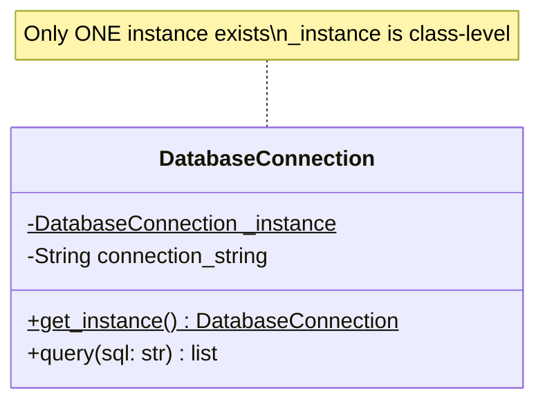

### Code Example

```python
class DatabaseConnection:
    """Only one DB connection pool across the entire app."""
    _instance = None

    def __new__(cls):
        if cls._instance is None:
            cls._instance = super().__new__(cls)
            cls._instance.connection = "postgresql://smartfreight:5432/logistics"
            print("✅ DB Connection created (once)")
        return cls._instance

    def query(self, sql: str):
        print(f"Executing: {sql}")
        return []


# Usage
db1 = DatabaseConnection()
db2 = DatabaseConnection()
print(db1 is db2)  # True — same instance!
```

### Why Singleton?

- **Shared resource** — DB connections, config managers, loggers
- **Prevents conflicts** — only one thread pool, one cache manager
- **Saves memory** — don't create 100 connection objects

### Real-world Analogy

India has one RBI (Reserve Bank of India). You don't create a new central bank every time you need monetary policy — you always refer to the same one.

### When NOT to Use

- Unit testing becomes hard (global state)
- Violates SRP if overloaded with responsibilities
- Use Dependency Injection instead in modern frameworks (NestJS `@Injectable()` with default singleton scope does this for you)

---

## 2. Factory Method

> **Define an interface for creating objects, but let subclasses decide which class to instantiate.**

### Class Diagram

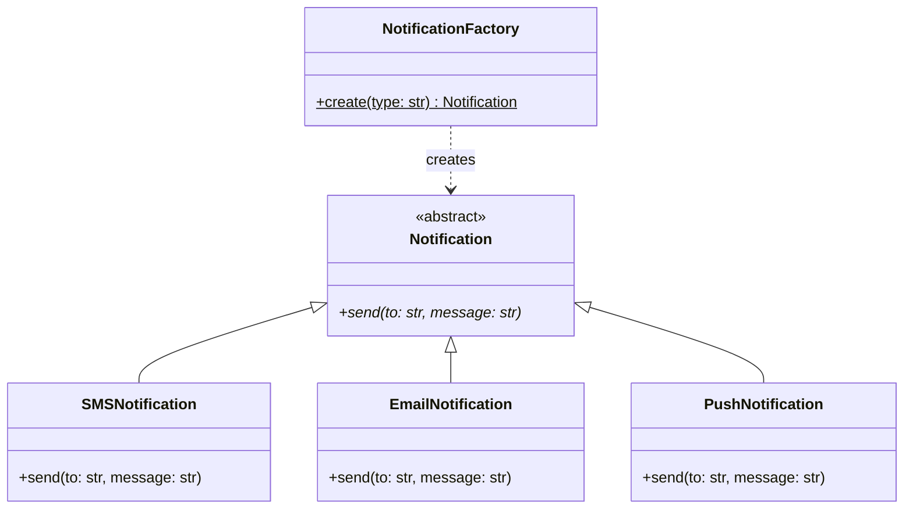

### Code Example

```python
from abc import ABC, abstractmethod


class Notification(ABC):
    @abstractmethod
    def send(self, to: str, message: str):
        ...


class SMSNotification(Notification):
    def send(self, to: str, message: str):
        print(f"📱 SMS to {to}: {message}")


class EmailNotification(Notification):
    def send(self, to: str, message: str):
        print(f"📧 Email to {to}: {message}")


class PushNotification(Notification):
    def send(self, to: str, message: str):
        print(f"🔔 Push to {to}: {message}")


class NotificationFactory:
    """Factory decides WHICH notification to create."""

    @staticmethod
    def create(channel: str) -> Notification:
        if channel == "sms":
            return SMSNotification()
        elif channel == "email":
            return EmailNotification()
        elif channel == "push":
            return PushNotification()
        else:
            raise ValueError(f"Unknown channel: {channel}")


# Usage — caller doesn't know concrete classes
notifier = NotificationFactory.create("sms")
notifier.send("+91-9876543210", "Your truck TN-01-AB-1234 reached Pune")
```

### Why Factory Method?

- **Decouples creation from usage** — caller doesn't import concrete classes
- **Easy to extend** — add WhatsApp notification without changing existing code (OCP!)
- **Centralizes creation logic** — validation, config, defaults in one place

### Real-world Analogy

A Swiggy order can be delivered by bike, car, or drone. You just say "deliver this" — the system (factory) decides which vehicle based on distance, weight, weather.

---

## 3. Abstract Factory

> **Create families of related objects without specifying concrete classes.**

### Class Diagram

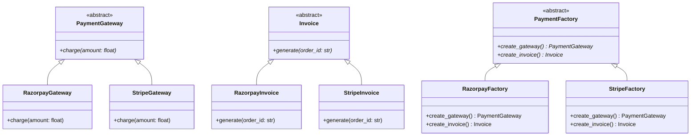

### Code Example

```python
from abc import ABC, abstractmethod


# --- Abstract Products ---
class PaymentGateway(ABC):
    @abstractmethod
    def charge(self, amount: float) -> str:
        ...


class Invoice(ABC):
    @abstractmethod
    def generate(self, order_id: str) -> str:
        ...


# --- Concrete Products: Razorpay Family ---
class RazorpayGateway(PaymentGateway):
    def charge(self, amount: float) -> str:
        return f"Charged ₹{amount} via Razorpay"


class RazorpayInvoice(Invoice):
    def generate(self, order_id: str) -> str:
        return f"Razorpay invoice for order {order_id}"


# --- Concrete Products: Stripe Family ---
class StripeGateway(PaymentGateway):
    def charge(self, amount: float) -> str:
        return f"Charged ${amount} via Stripe"


class StripeInvoice(Invoice):
    def generate(self, order_id: str) -> str:
        return f"Stripe invoice for order {order_id}"


# --- Abstract Factory ---
class PaymentFactory(ABC):
    @abstractmethod
    def create_gateway(self) -> PaymentGateway:
        ...

    @abstractmethod
    def create_invoice(self) -> Invoice:
        ...


class RazorpayFactory(PaymentFactory):
    def create_gateway(self) -> PaymentGateway:
        return RazorpayGateway()

    def create_invoice(self) -> Invoice:
        return RazorpayInvoice()


class StripeFactory(PaymentFactory):
    def create_gateway(self) -> PaymentGateway:
        return StripeGateway()

    def create_invoice(self) -> Invoice:
        return StripeInvoice()


# Usage — switch entire payment family by changing one line
factory: PaymentFactory = RazorpayFactory()
gateway = factory.create_gateway()
invoice = factory.create_invoice()

print(gateway.charge(1500))        # Charged ₹1500 via Razorpay
print(invoice.generate("ORD-789")) # Razorpay invoice for order ORD-789
```

### Why Abstract Factory?

- **Families stay consistent** — Razorpay gateway + Razorpay invoice (never mix Razorpay gateway + Stripe invoice)
- **Swap entire family** — switch from Indian to international payments by changing one factory
- **Enforces compatibility** — related objects are always created together

### Real-world Analogy

Maruti Suzuki factory produces Maruti engines + Maruti gearboxes + Maruti chassis. Tata factory produces Tata engines + Tata gearboxes + Tata chassis. You never mix a Maruti engine with a Tata gearbox — the factory ensures the family stays consistent.

---

## 4. Builder

> **Construct complex objects step by step. Same construction process can create different representations.**

### Class Diagram

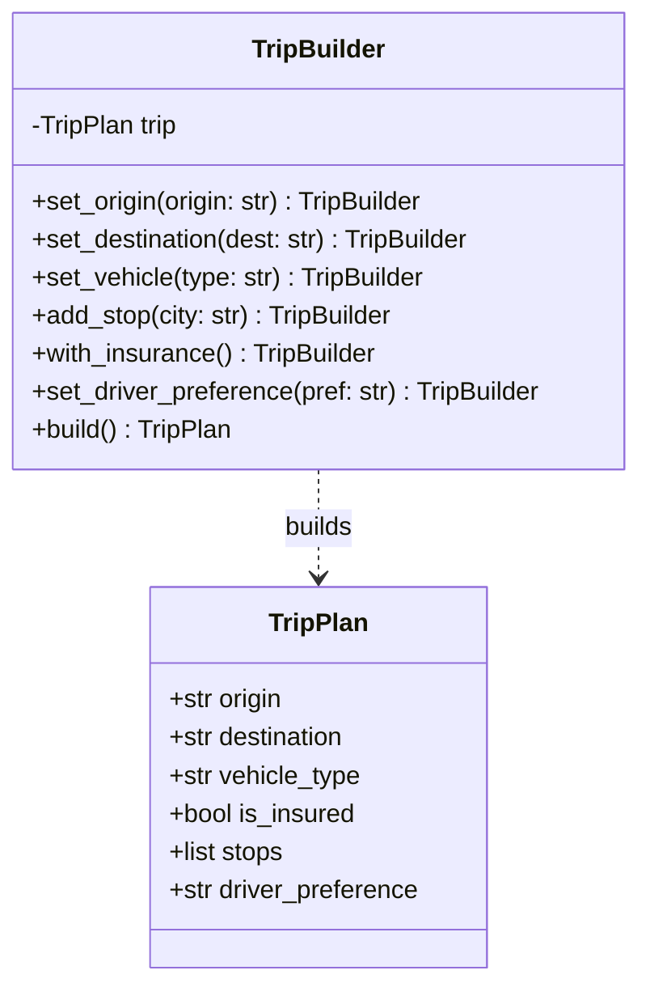

### Code Example

```python
class TripPlan:
    """Complex object with many optional fields."""

    def __init__(self):
        self.origin = None
        self.destination = None
        self.vehicle_type = "open_truck"
        self.is_insured = False
        self.stops = []
        self.driver_preference = "any"

    def __repr__(self):
        return (f"Trip: {self.origin} → {self.destination} | "
                f"Vehicle: {self.vehicle_type} | Stops: {self.stops} | "
                f"Insured: {self.is_insured}")


class TripBuilder:
    """Step-by-step construction with fluent interface."""

    def __init__(self):
        self._trip = TripPlan()

    def set_origin(self, origin: str):
        self._trip.origin = origin
        return self  # fluent — enables chaining

    def set_destination(self, dest: str):
        self._trip.destination = dest
        return self

    def set_vehicle(self, vehicle_type: str):
        self._trip.vehicle_type = vehicle_type
        return self

    def add_stop(self, city: str):
        self._trip.stops.append(city)
        return self

    def with_insurance(self):
        self._trip.is_insured = True
        return self

    def set_driver_preference(self, pref: str):
        self._trip.driver_preference = pref
        return self

    def build(self) -> TripPlan:
        if not self._trip.origin or not self._trip.destination:
            raise ValueError("Origin and destination are required")
        return self._trip


# Usage — readable, flexible, no 10-param constructor
trip = (TripBuilder()
        .set_origin("Mumbai")
        .set_destination("Delhi")
        .set_vehicle("container_truck")
        .add_stop("Nashik")
        .add_stop("Jaipur")
        .with_insurance()
        .build())

print(trip)
# Trip: Mumbai → Delhi | Vehicle: container_truck | Stops: ['Nashik', 'Jaipur'] | Insured: True
```

### Why Builder?

- **Readable construction** — no `TripPlan("Mumbai", "Delhi", None, True, [], "experienced")` mystery params
- **Optional parameters** — only set what you need
- **Validation at build time** — catch errors before object is used
- **Immutable results** — once built, the object is complete

### Real-world Analogy

Ordering a custom pizza at Domino's: choose base → choose size → add toppings → add cheese → add sauce → place order. You build step by step, and the final pizza is your "built" object.

---

## 5. Prototype

> **Create new objects by cloning an existing object instead of building from scratch.**

### Class Diagram

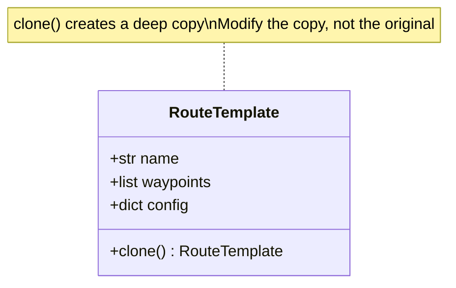

### Code Example

```python
import copy


class RouteTemplate:
    """A pre-configured route that can be cloned and customized."""

    def __init__(self, name: str, waypoints: list, config: dict):
        self.name = name
        self.waypoints = waypoints
        self.config = config

    def clone(self):
        """Deep copy — changes to clone don't affect original."""
        return copy.deepcopy(self)

    def __repr__(self):
        return f"Route({self.name}): {self.waypoints}"


# Create a template once (expensive setup)
mumbai_pune_template = RouteTemplate(
    name="Mumbai-Pune Express",
    waypoints=["Mumbai", "Lonavala", "Pune"],
    config={"toll_included": True, "max_weight_tons": 20, "highway": "NH48"}
)

# Clone and customize for different trips
morning_trip = mumbai_pune_template.clone()
morning_trip.name = "Mumbai-Pune Morning Batch"
morning_trip.config["departure_time"] = "06:00"

night_trip = mumbai_pune_template.clone()
night_trip.name = "Mumbai-Pune Night Batch"
night_trip.config["departure_time"] = "22:00"
night_trip.waypoints.append("Hinjewadi")  # extra stop

print(morning_trip)  # Route(Mumbai-Pune Morning Batch): ['Mumbai', 'Lonavala', 'Pune']
print(night_trip)    # Route(Mumbai-Pune Night Batch): ['Mumbai', 'Lonavala', 'Pune', 'Hinjewadi']
print(mumbai_pune_template)  # Original unchanged!
```

### Why Prototype?

- **Avoid expensive setup** — clone a pre-configured object instead of rebuilding
- **Runtime flexibility** — create variations without knowing concrete classes
- **Preserves defaults** — original template stays untouched

### Real-world Analogy

A franchise model — McDonald's doesn't design each restaurant from scratch. They clone a proven template (menu, layout, branding) and customize for local needs.

---

---

# STRUCTURAL PATTERNS

> **How objects are composed and connected — building larger structures from smaller pieces.**

---

## 6. Adapter

> **Convert one interface into another that the client expects. Makes incompatible things work together.**

### Class Diagram

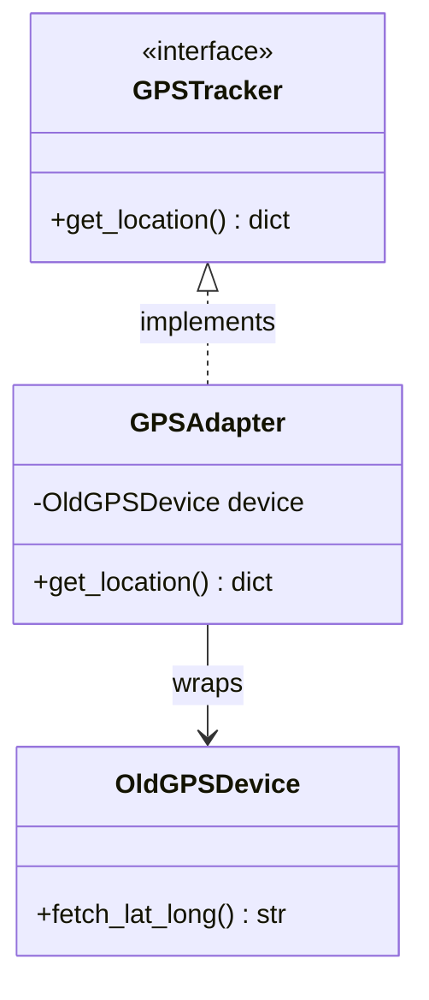

### Code Example

```python
from abc import ABC, abstractmethod


# What our system expects
class GPSTracker(ABC):
    @abstractmethod
    def get_location(self) -> dict:
        """Returns {'lat': float, 'lng': float}"""
        ...


# Old third-party device with different interface
class OldGPSDevice:
    """Legacy device — returns comma-separated string."""
    def fetch_lat_long(self) -> str:
        return "19.0760,72.8777"  # Mumbai coordinates


# Adapter makes old device compatible with our interface
class GPSAdapter(GPSTracker):
    def __init__(self, old_device: OldGPSDevice):
        self._device = old_device

    def get_location(self) -> dict:
        raw = self._device.fetch_lat_long()
        lat, lng = raw.split(",")
        return {"lat": float(lat), "lng": float(lng)}


# Usage — our system works with the standard interface
tracker: GPSTracker = GPSAdapter(OldGPSDevice())
location = tracker.get_location()
print(location)  # {'lat': 19.076, 'lng': 72.8777}
```

### Why Adapter?

- **Legacy integration** — make old code work with new system without rewriting
- **Third-party compatibility** — wrap external APIs to match your interface
- **Single Responsibility** — conversion logic lives in adapter, not in business code

### Real-world Analogy

A power adapter when you travel abroad. Indian plug → adapter → European socket. The adapter translates between incompatible interfaces.

---

## 7. Decorator

> **Add new behavior to an object dynamically by wrapping it, without modifying its class.**

### Class Diagram

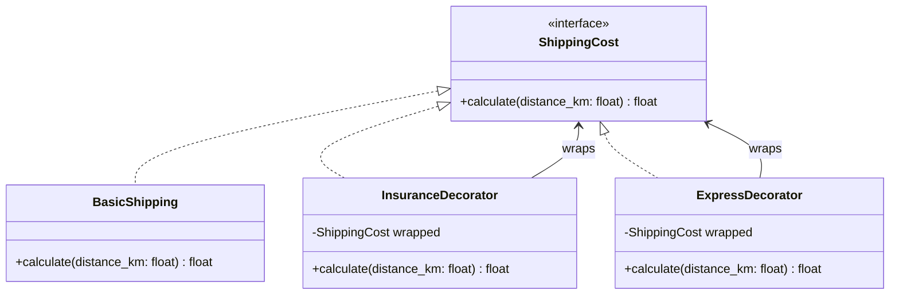

### Code Example

```python
from abc import ABC, abstractmethod


class ShippingCost(ABC):
    @abstractmethod
    def calculate(self, distance_km: float) -> float:
        ...


class BasicShipping(ShippingCost):
    """Base rate: ₹15 per km."""
    def calculate(self, distance_km: float) -> float:
        return distance_km * 15.0


class InsuranceDecorator(ShippingCost):
    """Adds insurance surcharge."""
    def __init__(self, wrapped: ShippingCost):
        self._wrapped = wrapped

    def calculate(self, distance_km: float) -> float:
        base = self._wrapped.calculate(distance_km)
        insurance = base * 0.05  # 5% insurance
        print(f"  + Insurance: ₹{insurance:.0f}")
        return base + insurance


class ExpressDecorator(ShippingCost):
    """Adds express delivery premium."""
    def __init__(self, wrapped: ShippingCost):
        self._wrapped = wrapped

    def calculate(self, distance_km: float) -> float:
        base = self._wrapped.calculate(distance_km)
        express = 500.0  # flat ₹500 for express
        print(f"  + Express: ₹{express:.0f}")
        return base + express


# Stack decorators — order matters!
shipping = BasicShipping()
shipping = InsuranceDecorator(shipping)    # wrap with insurance
shipping = ExpressDecorator(shipping)      # wrap with express

total = shipping.calculate(100)  # 100 km trip
print(f"Total: ₹{total:.0f}")
# Output:
#   + Insurance: ₹75
#   + Express: ₹500
# Total: ₹2075
```

### Why Decorator?

- **Open/Closed** — add features without modifying existing classes
- **Composable** — stack multiple decorators in any order
- **Runtime flexibility** — choose which features to add dynamically
- **Avoids class explosion** — no need for `InsuredExpressShipping`, `InsuredBasicShipping`, etc.

### Real-world Analogy

Adding toppings to a dosa at a restaurant. Start with plain dosa (base), add cheese (decorator), add extra masala (decorator). Each topping wraps the previous one and adds to the final price.

---

## 8. Proxy

> **Provide a surrogate/placeholder for another object to control access.**

### Class Diagram

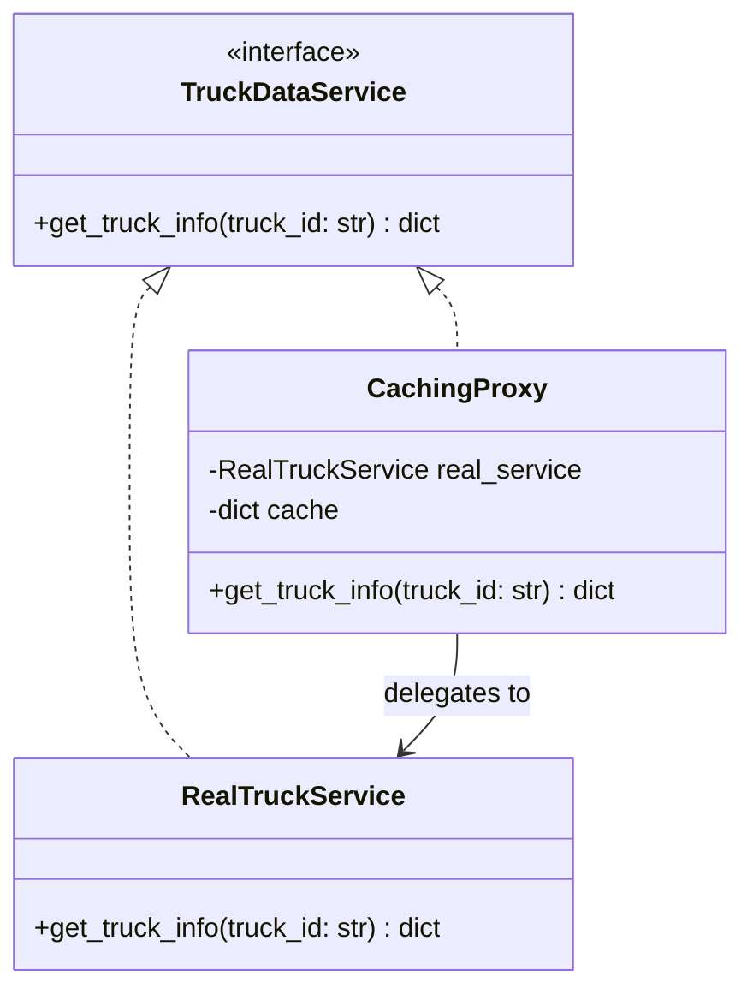

### Code Example

```python
from abc import ABC, abstractmethod
import time


class TruckDataService(ABC):
    @abstractmethod
    def get_truck_info(self, truck_id: str) -> dict:
        ...


class RealTruckService(TruckDataService):
    """Expensive DB/API call."""
    def get_truck_info(self, truck_id: str) -> dict:
        time.sleep(1)  # Simulates slow DB query
        return {"truck_id": truck_id, "status": "in_transit", "location": "Nashik"}


class CachingProxy(TruckDataService):
    """Controls access — adds caching layer."""

    def __init__(self):
        self._real_service = RealTruckService()
        self._cache = {}

    def get_truck_info(self, truck_id: str) -> dict:
        if truck_id in self._cache:
            print(f"⚡ Cache hit for {truck_id}")
            return self._cache[truck_id]

        print(f"🔄 Cache miss — fetching {truck_id} from DB...")
        result = self._real_service.get_truck_info(truck_id)
        self._cache[truck_id] = result
        return result


# Usage
service = CachingProxy()
print(service.get_truck_info("TN-01-AB-1234"))  # Slow (DB call)
print(service.get_truck_info("TN-01-AB-1234"))  # Fast (cached!)
```

### Types of Proxy

| Type | Purpose | Example |
|------|---------|---------|
| **Caching Proxy** | Cache expensive results | Redis in front of PostgreSQL |
| **Protection Proxy** | Access control / auth check | Check user role before DB access |
| **Virtual Proxy** | Lazy initialization | Load image only when displayed |
| **Logging Proxy** | Log all access | Audit trail for sensitive data |

### Real-world Analogy

A secretary for a CEO. You don't directly access the CEO — the secretary (proxy) filters calls, schedules meetings, and controls who gets access.

---

## 9. Facade

> **Provide a simple interface to a complex subsystem.**

### Class Diagram

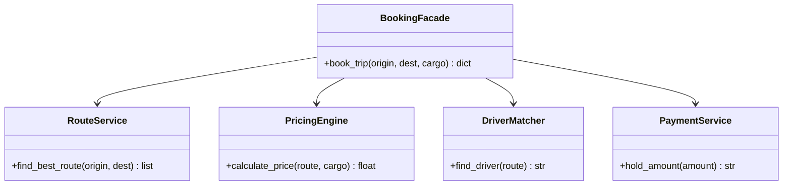

### Code Example

```python
# Complex subsystems
class RouteService:
    def find_best_route(self, origin: str, dest: str) -> list:
        print(f"📍 Finding route: {origin} → {dest}")
        return [origin, "Highway NH48", dest]


class PricingEngine:
    def calculate_price(self, route: list, cargo_tons: float) -> float:
        base = len(route) * 1000
        weight_charge = cargo_tons * 200
        return base + weight_charge


class DriverMatcher:
    def find_driver(self, route: list) -> str:
        print(f"🚛 Matching driver for route...")
        return "Driver: Ramesh (4.8★, 5yr exp)"


class PaymentService:
    def hold_amount(self, amount: float) -> str:
        print(f"💰 Holding ₹{amount}")
        return f"HOLD-{int(amount)}"


# Facade — one simple method hides all complexity
class BookingFacade:
    """Client calls ONE method instead of coordinating 4 services."""

    def __init__(self):
        self._route = RouteService()
        self._pricing = PricingEngine()
        self._driver = DriverMatcher()
        self._payment = PaymentService()

    def book_trip(self, origin: str, dest: str, cargo_tons: float) -> dict:
        route = self._route.find_best_route(origin, dest)
        price = self._pricing.calculate_price(route, cargo_tons)
        driver = self._driver.find_driver(route)
        hold_id = self._payment.hold_amount(price)

        return {
            "route": route,
            "price": price,
            "driver": driver,
            "payment_hold": hold_id,
            "status": "confirmed"
        }


# Usage — one line does everything
booking = BookingFacade()
result = booking.book_trip("Mumbai", "Pune", cargo_tons=10)
print(result)
```

### Why Facade?

- **Simplifies usage** — client doesn't need to know about 4 subsystems
- **Reduces coupling** — client depends on facade, not on internals
- **Entry point** — great for APIs that orchestrate multiple services

### Real-world Analogy

Booking a flight on MakeMyTrip. You press "Book" once — behind the scenes it checks seats, processes payment, sends confirmation, reserves meal. You don't coordinate each step manually.

---

## 10. Composite

> **Compose objects into tree structures. Treat individual objects and groups uniformly.**

### Class Diagram

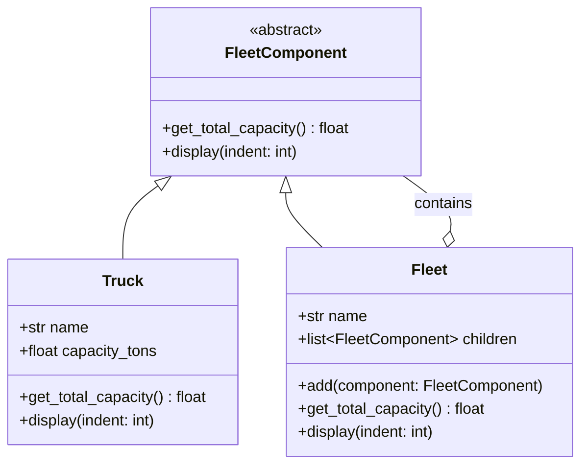

### Code Example

```python
from abc import ABC, abstractmethod


class FleetComponent(ABC):
    @abstractmethod
    def get_total_capacity(self) -> float:
        ...

    @abstractmethod
    def display(self, indent: int = 0):
        ...


class Truck(FleetComponent):
    """Leaf node — individual truck."""

    def __init__(self, name: str, capacity_tons: float):
        self.name = name
        self.capacity_tons = capacity_tons

    def get_total_capacity(self) -> float:
        return self.capacity_tons

    def display(self, indent: int = 0):
        print(" " * indent + f"🚛 {self.name} ({self.capacity_tons}T)")


class Fleet(FleetComponent):
    """Composite node — group of trucks or sub-fleets."""

    def __init__(self, name: str):
        self.name = name
        self._children: list[FleetComponent] = []

    def add(self, component: FleetComponent):
        self._children.append(component)

    def get_total_capacity(self) -> float:
        return sum(child.get_total_capacity() for child in self._children)

    def display(self, indent: int = 0):
        print(" " * indent + f"📦 {self.name} (Total: {self.get_total_capacity()}T)")
        for child in self._children:
            child.display(indent + 4)


# Build tree structure
mumbai_fleet = Fleet("Mumbai Fleet")
mumbai_fleet.add(Truck("MH-01-AA-1111", 16))
mumbai_fleet.add(Truck("MH-01-BB-2222", 20))

pune_fleet = Fleet("Pune Fleet")
pune_fleet.add(Truck("MH-12-CC-3333", 10))

west_region = Fleet("West Region")
west_region.add(mumbai_fleet)
west_region.add(pune_fleet)

# Treat tree uniformly
west_region.display()
print(f"\nTotal capacity: {west_region.get_total_capacity()}T")
```

### Why Composite?

- **Uniform treatment** — same method works on a single truck or entire fleet
- **Recursive structures** — menus, folders, org charts, fleet hierarchies
- **Easy to extend** — add new leaf types without changing composite logic

### Real-world Analogy

File system — a folder can contain files and other folders. You can ask "what's the total size?" on a single file or an entire folder tree — same operation.

---

## 11. Bridge

> **Decouple abstraction from implementation so both can vary independently.**

### Class Diagram

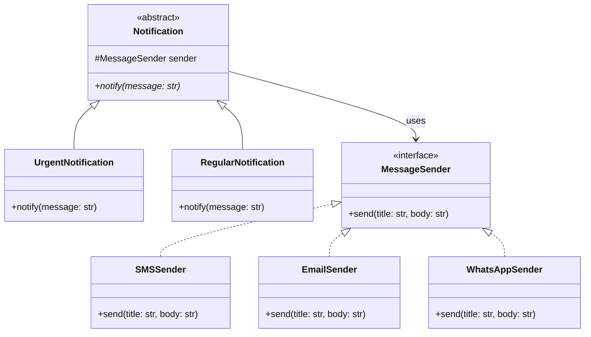

### Code Example

```python
from abc import ABC, abstractmethod


# Implementation hierarchy
class MessageSender(ABC):
    @abstractmethod
    def send(self, title: str, body: str):
        ...


class SMSSender(MessageSender):
    def send(self, title: str, body: str):
        print(f"📱 SMS | {title}: {body}")


class EmailSender(MessageSender):
    def send(self, title: str, body: str):
        print(f"📧 Email | Subject: {title}\nBody: {body}")


class WhatsAppSender(MessageSender):
    def send(self, title: str, body: str):
        print(f"💬 WhatsApp | *{title}*\n{body}")


# Abstraction hierarchy
class Notification(ABC):
    def __init__(self, sender: MessageSender):
        self._sender = sender

    @abstractmethod
    def notify(self, message: str):
        ...


class UrgentNotification(Notification):
    def notify(self, message: str):
        self._sender.send("🚨 URGENT", message.upper())


class RegularNotification(Notification):
    def notify(self, message: str):
        self._sender.send("Info", message)


# Mix and match independently!
urgent_sms = UrgentNotification(SMSSender())
urgent_sms.notify("Truck breakdown on NH48 near Lonavala")

regular_email = RegularNotification(EmailSender())
regular_email.notify("Monthly fleet report is ready")

urgent_whatsapp = UrgentNotification(WhatsAppSender())
urgent_whatsapp.notify("Payment of ₹50,000 overdue")
```

### Why Bridge?

- **Avoids class explosion** — without bridge you'd need `UrgentSMS`, `UrgentEmail`, `UrgentWhatsApp`, `RegularSMS`, `RegularEmail`... (M×N classes)
- **Independent variation** — add new notification types OR new channels without touching the other
- **Runtime switching** — change sender at runtime

### Real-world Analogy

TV remote (abstraction) and TV (implementation). You can have different remotes (basic, smart) and different TVs (Samsung, LG). They connect via a common interface (IR/Bluetooth), and both can vary independently.

---

---

# BEHAVIORAL PATTERNS

> **How objects communicate and distribute responsibility.**

---

## 12. Strategy

> **Define a family of algorithms, encapsulate each one, and make them interchangeable at runtime.**

### Class Diagram

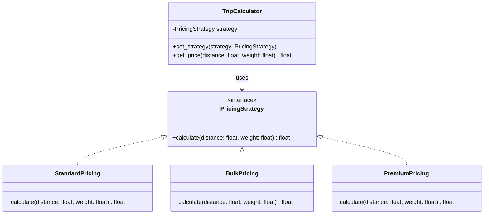

### Code Example

```python
from abc import ABC, abstractmethod


class PricingStrategy(ABC):
    @abstractmethod
    def calculate(self, distance_km: float, weight_tons: float) -> float:
        ...


class StandardPricing(PricingStrategy):
    """₹15/km + ₹200/ton."""
    def calculate(self, distance_km: float, weight_tons: float) -> float:
        return (distance_km * 15) + (weight_tons * 200)


class BulkPricing(PricingStrategy):
    """20% discount for bulk (>10 tons)."""
    def calculate(self, distance_km: float, weight_tons: float) -> float:
        base = (distance_km * 15) + (weight_tons * 200)
        return base * 0.80


class PremiumPricing(PricingStrategy):
    """Express delivery — 1.5x surcharge."""
    def calculate(self, distance_km: float, weight_tons: float) -> float:
        base = (distance_km * 15) + (weight_tons * 200)
        return base * 1.5


class TripCalculator:
    """Context — uses strategy at runtime."""

    def __init__(self, strategy: PricingStrategy):
        self._strategy = strategy

    def set_strategy(self, strategy: PricingStrategy):
        self._strategy = strategy

    def get_price(self, distance_km: float, weight_tons: float) -> float:
        return self._strategy.calculate(distance_km, weight_tons)


# Usage — swap algorithms at runtime
calc = TripCalculator(StandardPricing())
print(f"Standard: ₹{calc.get_price(500, 8)}")  # ₹9100

calc.set_strategy(BulkPricing())
print(f"Bulk: ₹{calc.get_price(500, 15)}")     # ₹8400

calc.set_strategy(PremiumPricing())
print(f"Premium: ₹{calc.get_price(500, 8)}")   # ₹13650
```

### Why Strategy?

- **Open/Closed** — add new pricing algorithms without modifying existing ones
- **Runtime flexibility** — switch algorithm based on user type, time of day, demand
- **Eliminates conditionals** — no giant `if/elif` chain for different pricing

### Real-world Analogy

Google Maps route selection — you choose "fastest", "shortest", or "avoid tolls". Same start/end, different algorithm. You can switch at any time.

---

## 13. Observer

> **When one object changes state, all its dependents are notified and updated automatically.**

### Class Diagram

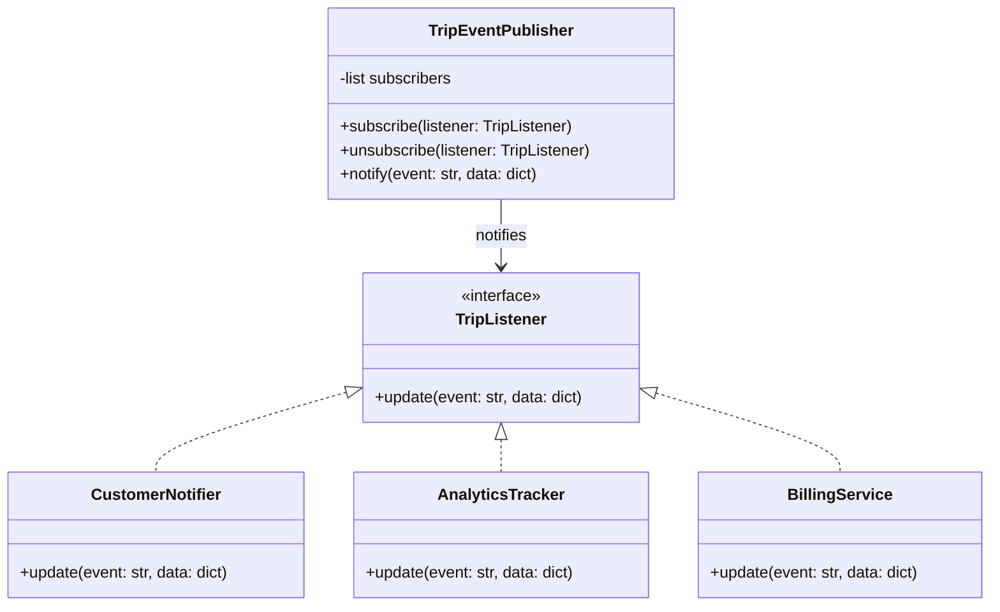

### Code Example

```python
from abc import ABC, abstractmethod


class TripListener(ABC):
    @abstractmethod
    def update(self, event: str, data: dict):
        ...


class TripEventPublisher:
    """Subject — publishes trip events to all subscribers."""

    def __init__(self):
        self._subscribers: list[TripListener] = []

    def subscribe(self, listener: TripListener):
        self._subscribers.append(listener)

    def unsubscribe(self, listener: TripListener):
        self._subscribers.remove(listener)

    def notify(self, event: str, data: dict):
        for subscriber in self._subscribers:
            subscriber.update(event, data)


# Observers
class CustomerNotifier(TripListener):
    def update(self, event: str, data: dict):
        print(f"📱 SMS to customer: Trip {data['trip_id']} — {event}")


class AnalyticsTracker(TripListener):
    def update(self, event: str, data: dict):
        print(f"📊 Analytics logged: {event} for trip {data['trip_id']}")


class BillingService(TripListener):
    def update(self, event: str, data: dict):
        if event == "trip_completed":
            print(f"💰 Generating invoice for trip {data['trip_id']}: ₹{data['amount']}")


# Usage
publisher = TripEventPublisher()
publisher.subscribe(CustomerNotifier())
publisher.subscribe(AnalyticsTracker())
publisher.subscribe(BillingService())

# When trip status changes, all observers react
publisher.notify("trip_started", {"trip_id": "TRIP-001", "driver": "Ramesh"})
print()
publisher.notify("trip_completed", {"trip_id": "TRIP-001", "amount": 15000})
```

### Why Observer?

- **Loose coupling** — publisher doesn't know or care who's listening
- **Easy to extend** — add new listener without modifying publisher
- **Event-driven** — foundation of message queues, webhooks, reactive systems

### Real-world Analogy

YouTube subscriptions. When a channel (publisher) uploads a video, all subscribers get notified. The channel doesn't send individual messages — it broadcasts once.

---

## 14. Command

> **Encapsulate a request as an object. Enables undo, queuing, and logging of operations.**

### Class Diagram

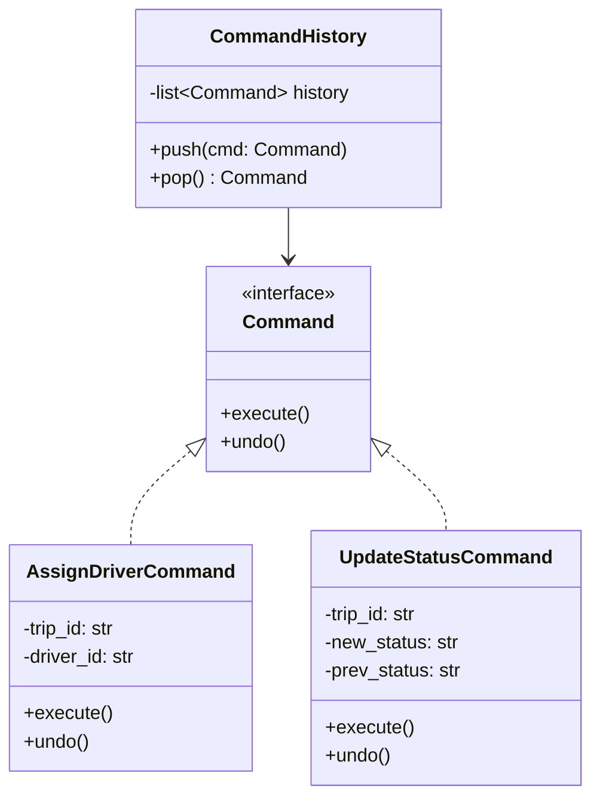

### Code Example

```python
from abc import ABC, abstractmethod


class Command(ABC):
    @abstractmethod
    def execute(self):
        ...

    @abstractmethod
    def undo(self):
        ...


class AssignDriverCommand(Command):
    def __init__(self, trip_id: str, driver_id: str):
        self.trip_id = trip_id
        self.driver_id = driver_id
        self._previous_driver = None

    def execute(self):
        # In real code: update DB
        self._previous_driver = None  # store current for undo
        print(f"✅ Assigned driver {self.driver_id} to trip {self.trip_id}")

    def undo(self):
        print(f"↩️ Reverted: removed driver {self.driver_id} from trip {self.trip_id}")


class UpdateStatusCommand(Command):
    def __init__(self, trip_id: str, new_status: str):
        self.trip_id = trip_id
        self.new_status = new_status
        self._previous_status = "pending"  # would fetch from DB

    def execute(self):
        print(f"✅ Trip {self.trip_id}: {self._previous_status} → {self.new_status}")

    def undo(self):
        print(f"↩️ Trip {self.trip_id}: reverted to {self._previous_status}")


class CommandHistory:
    """Stores executed commands for undo support."""

    def __init__(self):
        self._history: list[Command] = []

    def execute(self, cmd: Command):
        cmd.execute()
        self._history.append(cmd)

    def undo_last(self):
        if self._history:
            cmd = self._history.pop()
            cmd.undo()
        else:
            print("Nothing to undo")


# Usage
history = CommandHistory()

history.execute(AssignDriverCommand("TRIP-001", "DRV-42"))
history.execute(UpdateStatusCommand("TRIP-001", "in_transit"))

print("\n--- Undo last two ---")
history.undo_last()  # Undo status change
history.undo_last()  # Undo driver assignment
```

### Why Command?

- **Undo/Redo** — store command history, reverse them
- **Queuing** — queue commands for batch execution (job queues)
- **Logging** — record all operations for audit trail
- **Macro recording** — combine multiple commands into one

### Real-world Analogy

A restaurant order slip. The waiter writes your order (command object), passes it to the kitchen (executes). If you change your mind, the waiter can cancel the slip (undo). Orders can be queued during rush hour.

---

## 15. State

> **An object changes its behavior when its internal state changes — it appears to change its class.**

### Class Diagram

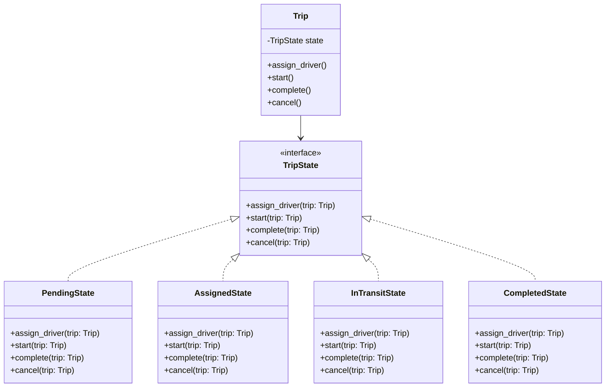

### Code Example

```python
from abc import ABC, abstractmethod


class TripState(ABC):
    @abstractmethod
    def assign_driver(self, trip):
        ...

    @abstractmethod
    def start(self, trip):
        ...

    @abstractmethod
    def complete(self, trip):
        ...

    @abstractmethod
    def cancel(self, trip):
        ...


class PendingState(TripState):
    def assign_driver(self, trip):
        print("✅ Driver assigned!")
        trip.state = AssignedState()

    def start(self, trip):
        print("❌ Can't start — no driver assigned yet")

    def complete(self, trip):
        print("❌ Can't complete — trip hasn't started")

    def cancel(self, trip):
        print("✅ Trip cancelled from pending")
        trip.state = CancelledState()


class AssignedState(TripState):
    def assign_driver(self, trip):
        print("❌ Driver already assigned")

    def start(self, trip):
        print("✅ Trip started! Truck is moving 🚛")
        trip.state = InTransitState()

    def complete(self, trip):
        print("❌ Can't complete — trip hasn't started")

    def cancel(self, trip):
        print("✅ Trip cancelled — driver released")
        trip.state = CancelledState()


class InTransitState(TripState):
    def assign_driver(self, trip):
        print("❌ Can't reassign — trip is moving")

    def start(self, trip):
        print("❌ Already in transit")

    def complete(self, trip):
        print("✅ Trip completed! Cargo delivered 📦")
        trip.state = CompletedState()

    def cancel(self, trip):
        print("❌ Can't cancel — truck is already on the road")


class CompletedState(TripState):
    def assign_driver(self, trip):
        print("❌ Trip already completed")

    def start(self, trip):
        print("❌ Trip already completed")

    def complete(self, trip):
        print("❌ Already completed")

    def cancel(self, trip):
        print("❌ Can't cancel a completed trip")


class CancelledState(TripState):
    def assign_driver(self, trip):
        print("❌ Trip is cancelled")

    def start(self, trip):
        print("❌ Trip is cancelled")

    def complete(self, trip):
        print("❌ Trip is cancelled")

    def cancel(self, trip):
        print("❌ Already cancelled")


class Trip:
    """Context — delegates to current state."""

    def __init__(self, trip_id: str):
        self.trip_id = trip_id
        self.state: TripState = PendingState()

    def assign_driver(self):
        self.state.assign_driver(self)

    def start(self):
        self.state.start(self)

    def complete(self):
        self.state.complete(self)

    def cancel(self):
        self.state.cancel(self)


# Usage — behavior changes based on state
trip = Trip("TRIP-001")
trip.start()           # ❌ Can't start — no driver
trip.assign_driver()   # ✅ Driver assigned!
trip.start()           # ✅ Trip started!
trip.cancel()          # ❌ Can't cancel — truck on road
trip.complete()        # ✅ Trip completed!
trip.start()           # ❌ Already completed
```

### Why State?

- **Eliminates giant if/elif** — no `if status == "pending": ... elif status == "in_transit": ...`
- **State transitions are explicit** — clear which actions are valid in each state
- **Easy to add states** — add "delayed" state without touching existing code
- **Self-documenting** — each state class shows exactly what's allowed

### Real-world Analogy

A traffic light. In "green" state, cars go. In "red" state, cars stop. The same signal (light) behaves completely differently based on its current state. You don't write `if light_color == "green": allow_cars()` — the state itself defines the behavior.

---

## 16. Template Method

> **Define the skeleton of an algorithm in a base class. Subclasses override specific steps.**

### Class Diagram

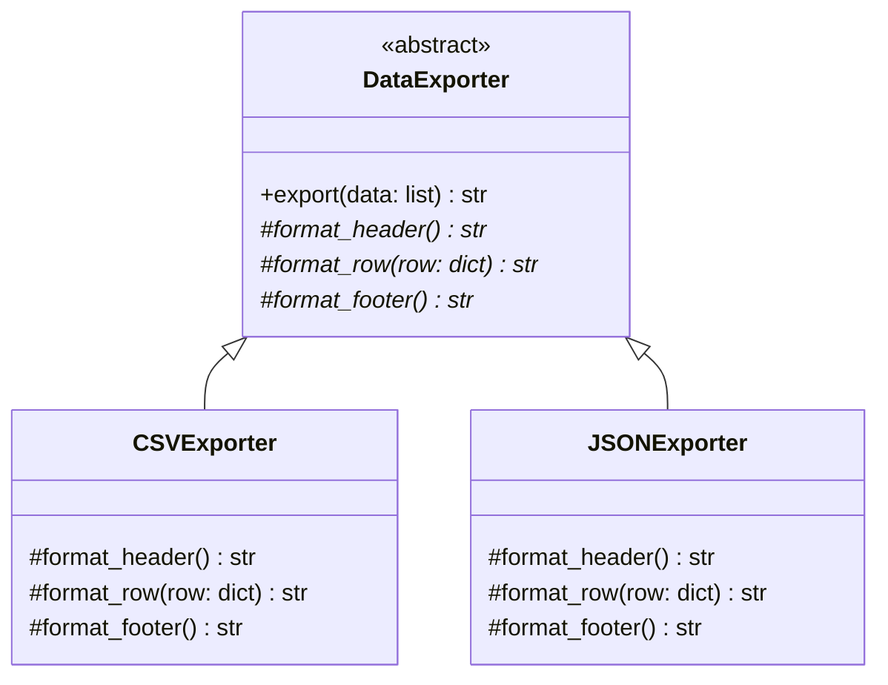

### Code Example

```python
from abc import ABC, abstractmethod


class DataExporter(ABC):
    """Template method — defines the algorithm skeleton."""

    def export(self, data: list[dict]) -> str:
        """This is the TEMPLATE METHOD — fixed algorithm."""
        output = []
        output.append(self.format_header())
        for row in data:
            output.append(self.format_row(row))
        output.append(self.format_footer())
        return "\n".join(output)

    @abstractmethod
    def format_header(self) -> str:
        ...

    @abstractmethod
    def format_row(self, row: dict) -> str:
        ...

    @abstractmethod
    def format_footer(self) -> str:
        ...


class CSVExporter(DataExporter):
    def format_header(self) -> str:
        return "trip_id,origin,destination,amount"

    def format_row(self, row: dict) -> str:
        return f"{row['trip_id']},{row['origin']},{row['dest']},{row['amount']}"

    def format_footer(self) -> str:
        return "# End of CSV export"


class JSONExporter(DataExporter):
    def format_header(self) -> str:
        return '{"trips": ['

    def format_row(self, row: dict) -> str:
        return f'  {{"id": "{row["trip_id"]}", "from": "{row["origin"]}", "to": "{row["dest"]}", "amount": {row["amount"]}}}'

    def format_footer(self) -> str:
        return ']}'


# Usage
trips = [
    {"trip_id": "T001", "origin": "Mumbai", "dest": "Pune", "amount": 15000},
    {"trip_id": "T002", "origin": "Delhi", "dest": "Jaipur", "amount": 22000},
]

csv_exporter = CSVExporter()
print(csv_exporter.export(trips))
print()

json_exporter = JSONExporter()
print(json_exporter.export(trips))
```

### Why Template Method?

- **Reuse the skeleton** — common algorithm logic stays in base class (DRY)
- **Control the flow** — subclasses customize steps, not the overall process
- **Hook methods** — base class can provide optional hooks subclasses may override

### Real-world Analogy

Making chai. The template is: boil water → add tea leaves → add milk → add sugar → strain. Whether you make adrak chai or elaichi chai, the template stays the same — you just customize the "add spices" step.

---

## 17. Iterator

> **Provide a way to access elements of a collection sequentially without exposing its internal structure.**

### Class Diagram

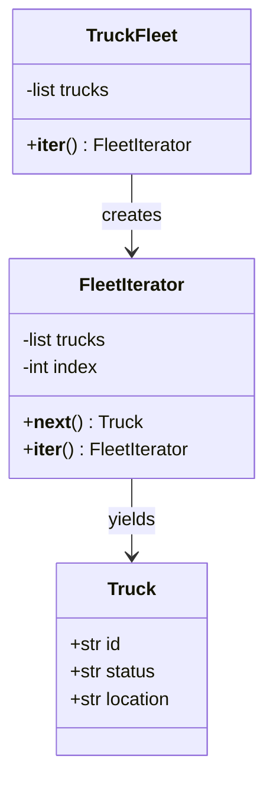

### Code Example

```python
class Truck:
    def __init__(self, truck_id: str, status: str, location: str):
        self.truck_id = truck_id
        self.status = status
        self.location = location

    def __repr__(self):
        return f"Truck({self.truck_id}, {self.status}, {self.location})"


class FleetIterator:
    """Custom iterator — can add filtering logic."""

    def __init__(self, trucks: list, status_filter: str = None):
        self._trucks = trucks
        self._filter = status_filter
        self._index = 0

    def __iter__(self):
        return self

    def __next__(self):
        while self._index < len(self._trucks):
            truck = self._trucks[self._index]
            self._index += 1
            if self._filter is None or truck.status == self._filter:
                return truck
        raise StopIteration


class TruckFleet:
    """Collection — exposes iterators without revealing internal list."""

    def __init__(self):
        self._trucks: list[Truck] = []

    def add(self, truck: Truck):
        self._trucks.append(truck)

    def __iter__(self):
        """Default: iterate all trucks."""
        return FleetIterator(self._trucks)

    def available_trucks(self):
        """Filtered iterator — only available trucks."""
        return FleetIterator(self._trucks, status_filter="available")


# Usage
fleet = TruckFleet()
fleet.add(Truck("MH-01-AA-1111", "available", "Mumbai"))
fleet.add(Truck("MH-01-BB-2222", "in_transit", "Nashik"))
fleet.add(Truck("MH-12-CC-3333", "available", "Pune"))
fleet.add(Truck("TN-01-DD-4444", "maintenance", "Chennai"))

print("All trucks:")
for truck in fleet:
    print(f"  {truck}")

print("\nAvailable trucks only:")
for truck in fleet.available_trucks():
    print(f"  {truck}")
```

### Why Iterator?

- **Encapsulates traversal** — client doesn't know if it's a list, tree, or DB cursor
- **Multiple iterators** — different traversal strategies on same collection
- **Lazy evaluation** — don't load all items into memory at once

### Real-world Analogy

A Netflix "Next Episode" button. You don't know how episodes are stored internally — you just keep pressing "Next" and get the next one.

---

## 18. Chain of Responsibility

> **Pass a request along a chain of handlers. Each handler decides to process it or pass it along.**

### Class Diagram

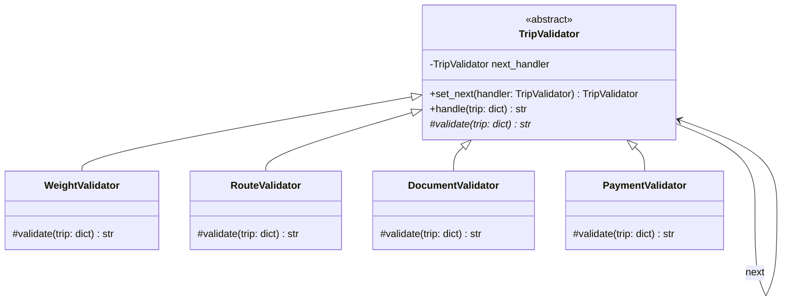

### Code Example

```python
from abc import ABC, abstractmethod


class TripValidator(ABC):
    """Base handler in the chain."""

    def __init__(self):
        self._next_handler: TripValidator = None

    def set_next(self, handler: "TripValidator") -> "TripValidator":
        self._next_handler = handler
        return handler  # enables chaining

    def handle(self, trip: dict) -> str:
        error = self.validate(trip)
        if error:
            return f"❌ REJECTED: {error}"
        if self._next_handler:
            return self._next_handler.handle(trip)
        return "✅ All validations passed!"

    @abstractmethod
    def validate(self, trip: dict) -> str | None:
        """Return error message or None if valid."""
        ...


class WeightValidator(TripValidator):
    def validate(self, trip: dict) -> str | None:
        if trip.get("weight_tons", 0) > 25:
            return f"Overweight: {trip['weight_tons']}T exceeds 25T limit"
        print("  ✓ Weight OK")
        return None


class RouteValidator(TripValidator):
    def validate(self, trip: dict) -> str | None:
        blocked_routes = ["Mumbai-Goa"]  # monsoon block
        route = f"{trip['origin']}-{trip['destination']}"
        if route in blocked_routes:
            return f"Route {route} is blocked (monsoon)"
        print("  ✓ Route OK")
        return None


class DocumentValidator(TripValidator):
    def validate(self, trip: dict) -> str | None:
        required = ["license", "rc", "insurance"]
        missing = [doc for doc in required if doc not in trip.get("documents", [])]
        if missing:
            return f"Missing documents: {missing}"
        print("  ✓ Documents OK")
        return None


class PaymentValidator(TripValidator):
    def validate(self, trip: dict) -> str | None:
        if not trip.get("advance_paid", False):
            return "Advance payment not received"
        print("  ✓ Payment OK")
        return None


# Build the chain
weight = WeightValidator()
route = RouteValidator()
docs = DocumentValidator()
payment = PaymentValidator()

weight.set_next(route).set_next(docs).set_next(payment)

# Test cases
trip1 = {
    "origin": "Mumbai", "destination": "Pune",
    "weight_tons": 18,
    "documents": ["license", "rc", "insurance"],
    "advance_paid": True
}
print("Trip 1:", weight.handle(trip1))

print()
trip2 = {
    "origin": "Mumbai", "destination": "Pune",
    "weight_tons": 30,  # overweight!
    "documents": ["license"],
    "advance_paid": False
}
print("Trip 2:", weight.handle(trip2))  # Fails at first check
```

### Why Chain of Responsibility?

- **Decouples sender from receiver** — request doesn't know which handler will process it
- **Flexible pipeline** — add/remove/reorder validators without changing others
- **Single Responsibility** — each handler does one validation
- **Short-circuit** — fails fast at the first invalid check

### Real-world Analogy

Airport security. Your bag goes through: X-ray scanner → weight check → customs → boarding gate. Each checkpoint either passes you or stops you. You don't know in advance which check will flag you.

---

---

# Common Mistakes

## ❌ BAD: God Factory (doing too much in one factory)

```python
class MegaFactory:
    def create(self, type: str):
        if type == "truck":
            return Truck()
        elif type == "driver":
            return Driver()
        elif type == "invoice":
            return Invoice()
        elif type == "route":
            return Route()
        # 50 more elif...
```

## ✅ GOOD: Separate factories per domain

```python
class VehicleFactory:
    def create(self, type: str) -> Vehicle: ...

class DocumentFactory:
    def create(self, type: str) -> Document: ...
```

---

## ❌ BAD: Using Singleton for everything

```python
class UserService:  # Why is this a singleton??
    _instance = None
    def __new__(cls):
        if cls._instance is None:
            cls._instance = super().__new__(cls)
        return cls._instance
```

## ✅ GOOD: Use Singleton only for shared resources

```python
# Singleton → DB connection, Config, Logger
# Regular class → Services, Controllers, Repositories
# Use DI framework (NestJS does this automatically)
```

---

## ❌ BAD: Observer with circular notifications

```python
class A(Observer):
    def update(self):
        publisher.notify()  # Notifies B, which notifies A → infinite loop!
```

## ✅ GOOD: Prevent re-entrance

```python
class A(Observer):
    def __init__(self):
        self._processing = False

    def update(self):
        if self._processing:
            return
        self._processing = True
        # ... do work ...
        self._processing = False
```

---

## ❌ BAD: Strategy pattern with just one strategy

```python
# Overkill — YAGNI!
class OnlyOnePricingStrategy:
    def calculate(self):
        return distance * 15  # There's only ever one algorithm
```

## ✅ GOOD: Use patterns when you have real variation

```python
# Use Strategy when you actually have 2+ algorithms that swap at runtime
# Don't use patterns "just in case" — wait until the need is real
```

---

# Quick Reference Table

| Mistake | Fix |
|---------|-----|
| God Factory (too many types) | Split into domain-specific factories |
| Singleton for everything | Only for shared resources (DB, Config) |
| Observer infinite loop | Guard against re-entrant notifications |
| Pattern for one case | Apply YAGNI — use pattern when need is real |
| Builder for simple objects | Use constructor if ≤3 params |
| Deep decorator nesting | Max 2-3 layers; consider Facade if too many |

---

# Quick Cheat Sheet

| Pattern | One-liner | When to Use |
|---------|-----------|-------------|
| **Singleton** | One instance, global access | DB connection, config, logger |
| **Factory** | Create without specifying concrete class | Multiple types sharing an interface |
| **Abstract Factory** | Create families of related objects | Switching between payment providers |
| **Builder** | Step-by-step complex construction | Objects with many optional params |
| **Prototype** | Clone existing objects | Templates, preset configurations |
| **Adapter** | Convert interface A to interface B | Integrating legacy/third-party code |
| **Decorator** | Add behavior dynamically by wrapping | Pricing add-ons, logging, caching |
| **Proxy** | Control access to an object | Caching, auth, lazy loading |
| **Facade** | Simple interface to complex subsystem | Orchestrating multiple services |
| **Composite** | Tree structure, uniform treatment | Hierarchies (fleet, menu, folders) |
| **Bridge** | Separate abstraction from implementation | Avoid M×N class explosion |
| **Strategy** | Swap algorithms at runtime | Pricing, sorting, routing algorithms |
| **Observer** | Notify dependents on state change | Events, pub-sub, webhooks |
| **Command** | Encapsulate request as object | Undo/redo, job queues, audit logs |
| **State** | Behavior changes with internal state | Order status, trip lifecycle |
| **Template Method** | Fixed skeleton, customizable steps | Exporters, ETL pipelines, workflows |
| **Iterator** | Sequential access without exposing internals | Custom collections, filtered traversal |
| **Chain of Responsibility** | Pass request through handler pipeline | Validation chains, middleware |

---

# Pattern Selection Guide

```
Need to create objects?
├── One instance only? → Singleton
├── Don't know concrete class? → Factory
├── Family of related objects? → Abstract Factory
├── Complex object, many params? → Builder
└── Clone existing objects? → Prototype

Need to structure/connect objects?
├── Incompatible interface? → Adapter
├── Add behavior dynamically? → Decorator
├── Control access? → Proxy
├── Simplify complex subsystem? → Facade
├── Tree/hierarchy structure? → Composite
└── Avoid M×N explosion? → Bridge

Need objects to communicate?
├── Swap algorithm at runtime? → Strategy
├── React to state changes? → Observer
├── Undo/queue operations? → Command
├── Object behavior depends on state? → State
├── Fixed algorithm, customizable steps? → Template Method
├── Sequential access to collection? → Iterator
└── Pipeline of handlers? → Chain of Responsibility
```

---

