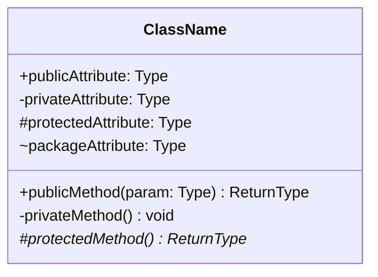
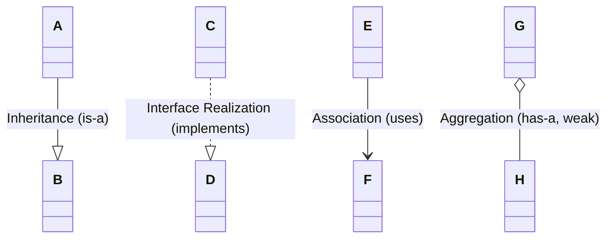
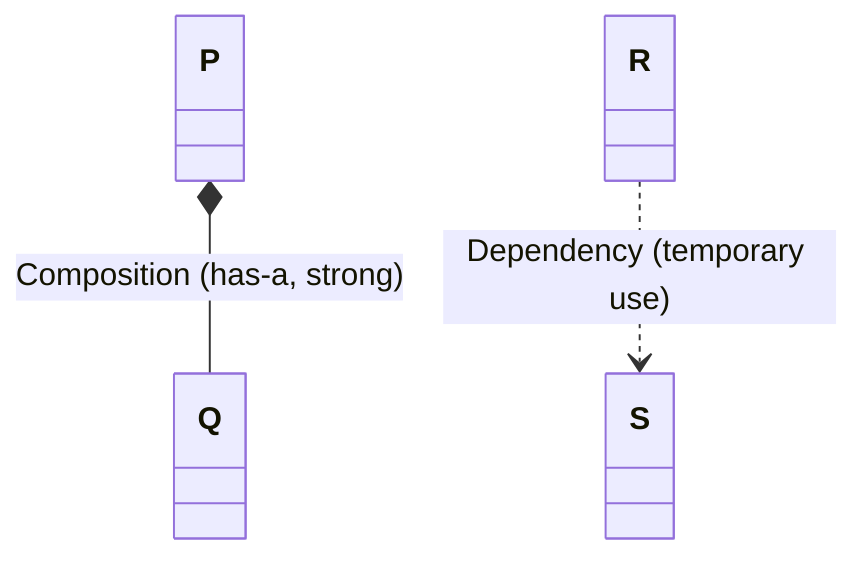
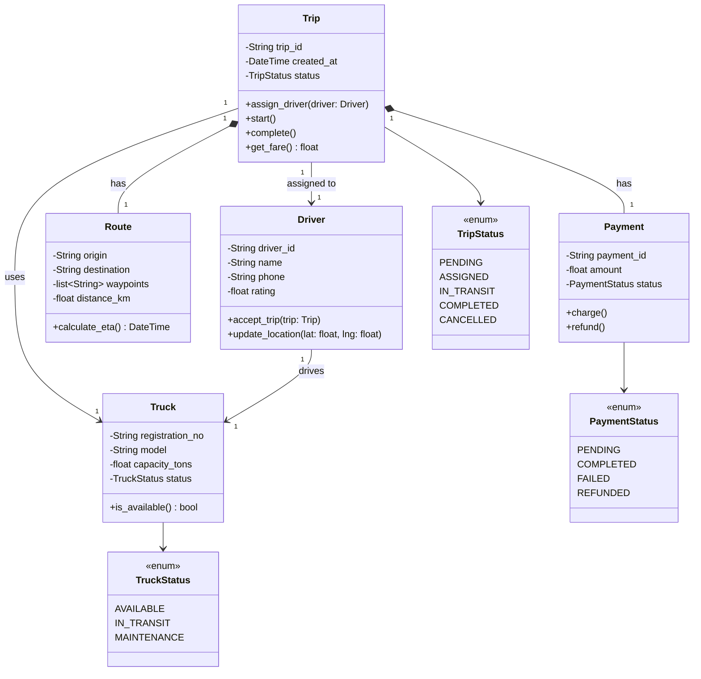
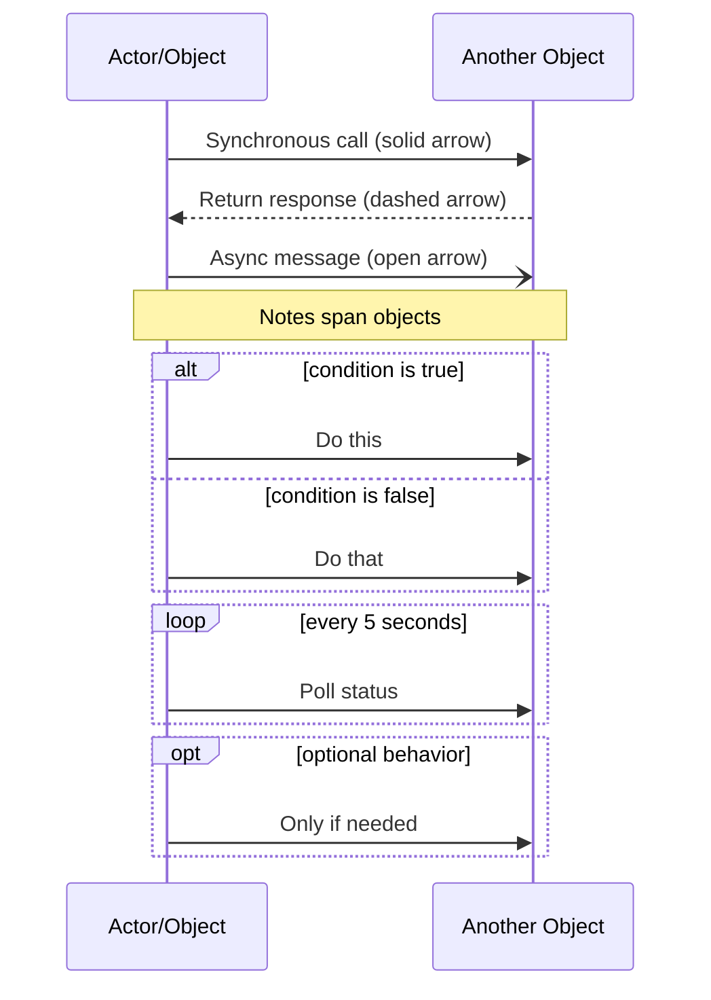
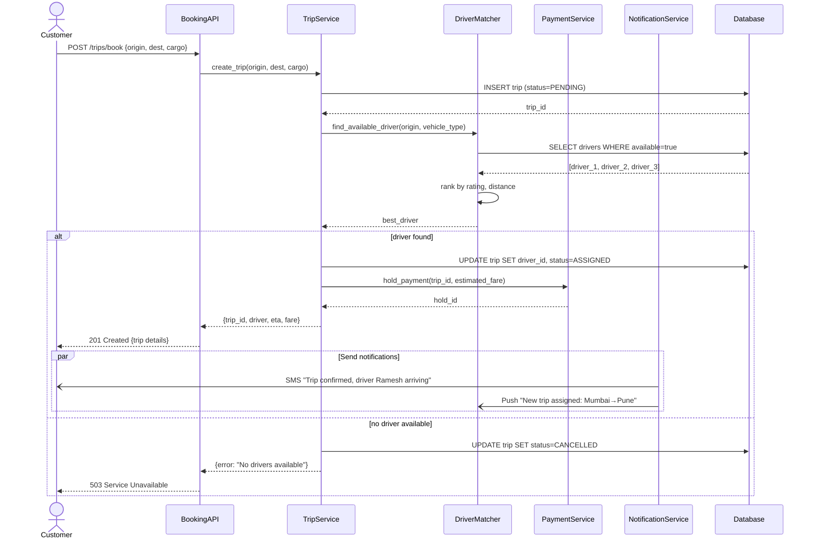
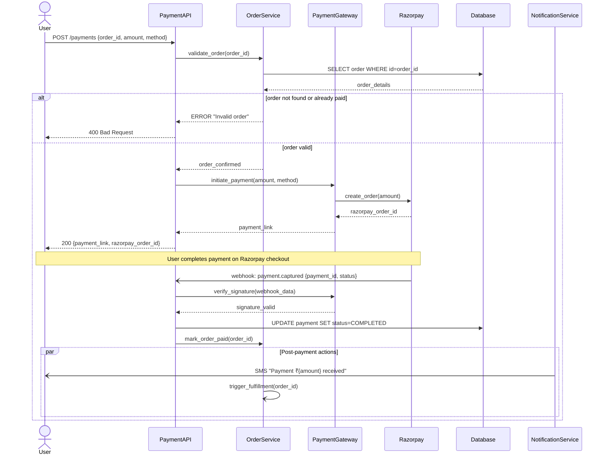
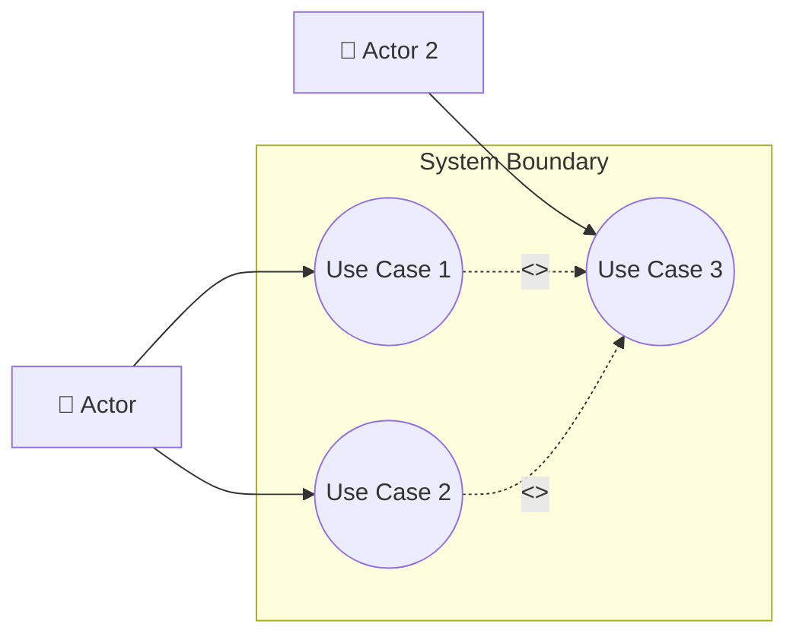
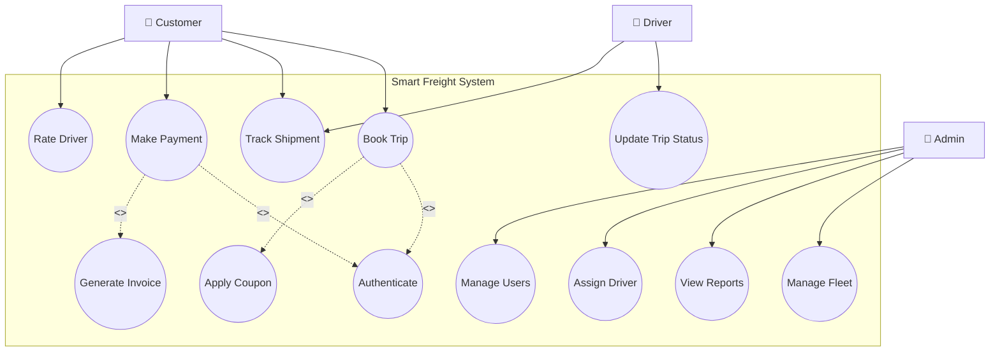
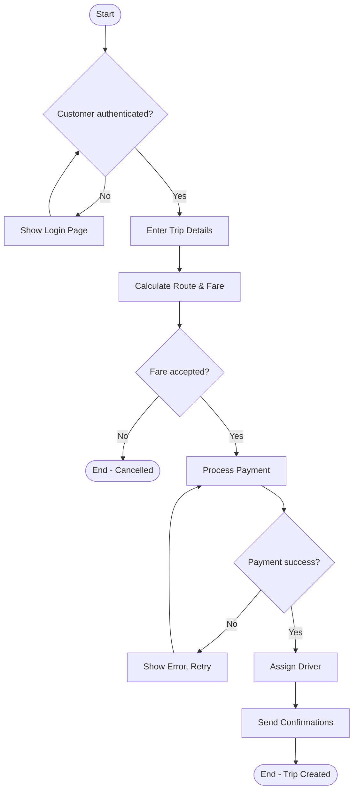

# UML Diagrams

UML (Unified Modeling Language) is a **standardized visual language** for modeling software systems. In LLD interviews, you draw these diagrams to communicate your design before writing code.

---

## Why UML?

| Without UML | With UML |
|-------------|----------|
| "Let me explain my 20 classes verbally..." | One diagram shows the entire structure |
| Ambiguous relationships between objects | Clear arrows: inheritance, composition, dependency |
| Interviewer confused about your flow | Sequence diagram shows exact call order |
| No shared vocabulary | Industry-standard notation everyone understands |

---

## The 3 Diagrams You MUST Know for Interviews

| Diagram | Shows | When to Use |
|---------|-------|-------------|
| **Class Diagram** | Structure — classes, attributes, methods, relationships | "Design the classes for X system" |
| **Sequence Diagram** | Behavior — interaction between objects over time | "Walk me through what happens when user does Y" |
| **Use-Case Diagram** | Requirements — what actors can do in the system | "What are the main features of this system?" |

---


- **UML:** A standardized visual modeling language used to specify, visualize, construct, and document the artifacts of a software system.
- **Class Diagram:** A structural UML diagram that shows classes, their attributes, methods, and the relationships (association, inheritance, composition, aggregation) between them.
- **Sequence Diagram:** A behavioral UML diagram that shows how objects interact in a particular sequence of time, depicting the order of messages exchanged.
- **Use-Case Diagram:** A behavioral UML diagram that captures the functional requirements of a system by showing actors (users/systems) and the use cases (actions) they can perform.
- **Association:** A relationship where one class uses or is connected to another (e.g., Driver drives Truck).
- **Aggregation:** A "has-a" relationship where the child can exist independently of the parent (e.g., Fleet has Trucks — trucks exist without the fleet).
- **Composition:** A strong "has-a" relationship where the child cannot exist without the parent (e.g., Order has OrderItems — items die when order is deleted).
- **Inheritance (Generalization):** An "is-a" relationship where a child class inherits from a parent class.
- **Dependency:** A weak relationship where one class uses another temporarily (e.g., as a method parameter).
- **Interface Realization:** A class implements an interface (contract).

---

---

# 1. CLASS DIAGRAMS

> **Show the static structure of your system — classes, their contents, and how they relate.**

This is the **#1 most important diagram** in LLD interviews. You'll draw this for every design problem.

---

## Class Notation



### Visibility Symbols

| Symbol | Meaning | Python Equivalent |
|--------|---------|-------------------|
| `+` | Public | `self.name` |
| `-` | Private | `self.__name` |
| `#` | Protected | `self._name` |
| `~` | Package/Internal | Module-level |

### Stereotypes

| Stereotype | Meaning |
|------------|---------|
| `<<abstract>>` | Abstract class (can't instantiate) |
| `<<interface>>` | Interface (only method signatures) |
| `<<enum>>` | Enumeration |
| `<<static>>` | Static/class-level |

---

## Relationship Types





### Relationship Cheat Sheet

| Arrow | Name | Meaning | Example | Memory Trick |
|-------|------|---------|---------|--------------|
| `──▷` (solid + triangle) | **Inheritance** | "is-a" | `Dog ──▷ Animal` | Solid = strong bond |
| `··▷` (dashed + triangle) | **Realization** | "implements" | `Razorpay ··▷ PaymentGateway` | Dashed = promise to fulfill |
| `──>` (solid + arrow) | **Association** | "uses/knows" | `Driver ──> Truck` | Simple connection |
| `◇──` (hollow diamond) | **Aggregation** | "has-a" (weak) | `Fleet ◇── Truck` | Hollow = truck can leave |
| `◆──` (filled diamond) | **Composition** | "has-a" (strong) | `Order ◆── OrderItem` | Filled = dies together |
| `··>` (dashed + arrow) | **Dependency** | "temporarily uses" | `Controller ··> Logger` | Dashed = weak/temporary |

### Multiplicity (Cardinality)

| Notation | Meaning |
|----------|---------|
| `1` | Exactly one |
| `0..1` | Zero or one (optional) |
| `*` or `0..*` | Zero or many |
| `1..*` | One or many |
| `3..5` | Between 3 and 5 |

---

## Full Class Diagram Example: Logistics Trip System



### How to Read This Diagram

1. **Trip** is the central entity — it connects drivers, trucks, routes, and payments
2. **Composition (◆)** — Route and Payment can't exist without a Trip (they die together)
3. **Association (→)** — Trip knows about Driver, but Driver can exist independently
4. **Enums** — Status fields are finite state machines

---

## Class Diagram: Drawing Process (Interview Steps)

```
Step 1: Identify NOUNS from requirements → These become classes
Step 2: Identify VERBS → These become methods
Step 3: Identify ADJECTIVES/DATA → These become attributes
Step 4: Draw relationships between classes
Step 5: Add multiplicity (1, *, 0..1)
Step 6: Mark visibility (+, -, #)
```

### Example Thought Process

**Problem:** "Design a parking lot system"

| Step | Extract | Result |
|------|---------|--------|
| Nouns | Parking lot, floor, spot, vehicle, ticket | Classes: `ParkingLot`, `Floor`, `Spot`, `Vehicle`, `Ticket` |
| Verbs | park, unpark, pay, find spot | Methods: `park()`, `unpark()`, `pay()`, `find_available_spot()` |
| Data | spot number, vehicle type, entry time | Attributes: `spot_no`, `vehicle_type`, `entry_time` |
| Relations | Lot has floors, floor has spots | `ParkingLot ◆── Floor ◆── Spot` |
| Multiplicity | One lot has many floors | `ParkingLot "1" *-- "1..*" Floor` |

---

---

# 2. SEQUENCE DIAGRAMS

> **Show how objects interact over time — the exact order of method calls and responses.**

Interviewers ask: "Walk me through what happens when a user books a trip." This is your answer — visually.

---

## Notation



### Arrow Types

| Arrow | Meaning |
|-------|---------|
| `─▶` (solid, filled) | Synchronous call (caller waits) |
| `──▶` (dashed, filled) | Return/response |
| `─▷` (solid, open) | Asynchronous message (fire & forget) |
| `──▷` (dashed, open) | Async response/callback |

### Fragments (Combined Frames)

| Fragment | Meaning | Use When |
|----------|---------|----------|
| `alt / else` | If-else branching | Different paths based on condition |
| `opt` | Optional | Step happens only sometimes |
| `loop` | Repetition | Polling, retries, batch processing |
| `par` | Parallel | Multiple things happen simultaneously |
| `break` | Break out | Error/exception exits the flow |

---

## Full Sequence Diagram Example: Trip Booking Flow



### How to Read This Diagram

1. **Time flows top → down** — first thing at top, last at bottom
2. **Lifelines** (vertical dashed lines) show object's existence over time
3. **Arrows** show messages/calls between objects
4. **`alt` block** shows branching — driver found vs not found
5. **`par` block** shows parallel notifications happening simultaneously

---

## Sequence Diagram: Drawing Process

```
Step 1: Identify the TRIGGER (user action or API call)
Step 2: List all PARTICIPANTS (objects/services involved)
Step 3: Walk through the HAPPY PATH first (everything works)
Step 4: Add ERROR/ALTERNATIVE paths (alt/else blocks)
Step 5: Mark async operations (notifications, background jobs)
Step 6: Add return values on dashed arrows
```

---

## Another Example: Payment Flow



---

---

# 3. USE-CASE DIAGRAMS

> **Show WHAT the system does from the user's perspective — actors and their actions.**

Use-case diagrams are drawn first during requirements gathering. They answer: "Who uses this system and what can they do?"

---

## Notation



### Elements

| Element | Symbol | Meaning |
|---------|--------|---------|
| **Actor** | Stick figure | External entity that interacts with system (user, admin, external API) |
| **Use Case** | Oval/ellipse | A specific action/feature the system provides |
| **System Boundary** | Rectangle | Defines what's inside vs outside the system |
| **Association** | Solid line | Actor can perform this use case |
| **Include** | Dashed arrow + `<<include>>` | Use case ALWAYS includes another (mandatory sub-step) |
| **Extend** | Dashed arrow + `<<extend>>` | Use case OPTIONALLY extends another (conditional) |
| **Generalization** | Solid arrow + triangle | Specialized actor inherits from general actor |

### Include vs Extend

| | `<<include>>` | `<<extend>>` |
|---|---|---|
| **When** | ALWAYS happens | SOMETIMES happens |
| **Direction** | Base → Included | Extension → Base |
| **Example** | "Book Trip" includes "Authenticate" | "Book Trip" extended by "Apply Coupon" |
| **Analogy** | Every ATM withdrawal includes PIN verification | ATM withdrawal optionally prints receipt |

---

## Full Use-Case Diagram: Smart Freight Platform



### Actors Identified

| Actor | Role | Key Use Cases |
|-------|------|---------------|
| **Customer** | Shipper who books freight | Book Trip, Track, Pay, Rate |
| **Driver** | Truck driver who fulfills trips | Update Status, Track |
| **Admin** | Platform operator | Manage Fleet, Reports, Users |
| **(System) Razorpay** | External payment system | Process Payment (external actor) |
| **(System) GPS API** | External tracking | Provide location data |

---

## Use-Case Description Template

For each use case in interviews, describe it briefly:

```
Use Case: Book Trip
───────────────────
Actor: Customer
Precondition: Customer is authenticated
Trigger: Customer clicks "Book Now"

Main Flow (Happy Path):
1. Customer enters origin, destination, cargo details
2. System calculates route and estimated fare
3. System shows available time slots
4. Customer confirms booking
5. System assigns driver
6. System sends confirmation

Alternative Flows:
- 3a. No slots available → Show next available date
- 5a. No driver available → Queue request, notify customer

Postcondition: Trip created with status PENDING/ASSIGNED
```

---

## Use-Case Diagram: Drawing Process

```
Step 1: Identify ACTORS — Who interacts with the system? (humans + external systems)
Step 2: Identify USE CASES — What can each actor DO? (use verb phrases)
Step 3: Draw SYSTEM BOUNDARY — What's inside your system vs external?
Step 4: Connect actors to their use cases (solid lines)
Step 5: Add <<include>> for mandatory sub-steps
Step 6: Add <<extend>> for optional features
```

---

---

# Bonus: Activity Diagram (Quick Overview)

> **Shows the flow of control — like a flowchart but with support for parallel and branching flows.**

Useful for showing business processes and workflows.



---

---

# Common Mistakes

## ❌ BAD: Missing multiplicity

```
Trip ──── Driver
```
How many drivers per trip? How many trips per driver? Nobody knows!

## ✅ GOOD: Always add multiplicity

```
Trip "1" ──── "1" Driver       (one trip, one driver)
Driver "1" ──── "0..*" Trip    (one driver, many trips over time)
```

---

## ❌ BAD: Every relationship is Association

```
Order ──── OrderItem ──── Product ──── Category
```
Are these all the same strength? Does OrderItem survive without Order?

## ✅ GOOD: Use correct relationship type

```
Order ◆── OrderItem     (Composition — item dies with order)
OrderItem ──> Product   (Association — product exists independently)
Product ──> Category    (Association — category exists independently)
```

---

## ❌ BAD: Sequence diagram without return arrows

```
User → API → Service → DB
```
What comes back? Did it succeed? What data was returned?

## ✅ GOOD: Show both calls AND returns

```
User → API: POST /book
API → DB: INSERT
DB --> API: trip_id
API --> User: 201 {trip_id}
```

---

## ❌ BAD: Use-case diagram with implementation details

```
((Connect to PostgreSQL))
((Execute SQL Query))
((Parse JSON Response))
```

## ✅ GOOD: Use cases are USER-LEVEL goals

```
((Book Trip))
((Track Shipment))
((Make Payment))
```

---

## ❌ BAD: Too many classes in one diagram

50 classes with arrows everywhere = unreadable spaghetti

## ✅ GOOD: Focus on core entities (5-8 classes per diagram)

Show the most important relationships. Use separate diagrams for different subsystems.

---

# Quick Reference Table

| Mistake | Fix |
|---------|-----|
| Missing multiplicity | Always add (1, *, 0..1, 1..*) |
| All relationships same type | Choose: Association, Aggregation, Composition, Dependency |
| No return arrows in sequence | Show response on dashed arrows |
| Implementation details in use cases | Keep use cases at user-goal level |
| 50-class mega diagram | 5-8 classes per diagram, split by subsystem |
| No visibility markers | Add +, -, # to all attributes/methods |

---

# Quick Cheat Sheet

| Concept | One-liner | Key Point |
|---------|-----------|-----------|
| **Class Diagram** | Static structure of classes & relationships | Draw for EVERY LLD problem |
| **Sequence Diagram** | Object interactions over time | Show the "what happens when" flow |
| **Use-Case Diagram** | Actor + actions overview | Requirements gathering, system scope |
| **Composition (◆)** | Strong has-a, child dies with parent | Order ◆── OrderItem |
| **Aggregation (◇)** | Weak has-a, child survives | Fleet ◇── Truck |
| **Association (→)** | Uses/knows relationship | Driver → Truck |
| **`<<include>>`** | Mandatory sub-step | Always happens |
| **`<<extend>>`** | Optional feature | Sometimes happens |
| **Multiplicity** | How many of each | 1, 0..1, *, 1..* |

---

# Interview Tips for UML

1. **Always start with a class diagram** — even if not asked, it shows you think structurally
2. **Use sequence diagrams for "walk me through"** questions — shows you understand the flow
3. **Don't over-engineer** — 5-8 classes is enough for most problems
4. **Name things clearly** — `TripService` not `TS`, `assign_driver()` not `do_stuff()`
5. **Draw relationships AFTER classes** — first get the nouns right, then connect them
6. **Explain as you draw** — "Trip HAS a Route (composition because route can't exist without trip)"

