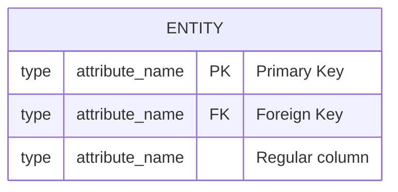
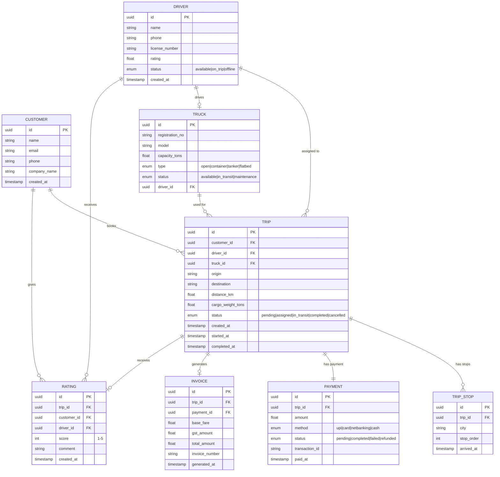

# Schema Design

Schema Design is the art of **structuring your database tables** to store data efficiently, avoid redundancy, and support your application's queries. It's where your class diagrams meet the real world of storage.

---

## Why Schema Design Matters?

| Bad Schema | Good Schema |
|------------|-------------|
| Data duplicated everywhere | Single source of truth |
| Updates break consistency | One update fixes everywhere |
| Queries are slow (full table scans) | Indexes make reads instant |
| Can't answer new business questions | Flexible enough for future queries |
| Joins are nightmares | Clean relationships, easy joins |

---

## Core Concepts at a Glance

| Concept | Purpose |
|---------|---------|
| **Normalization** | Eliminate redundancy, ensure data integrity |
| **ER Diagrams** | Visual model of entities and their relationships |
| **Table Relationships** | How tables connect (1:1, 1:N, M:N) |
| **Primary Key** | Unique identifier for each row |
| **Foreign Key** | Reference to another table's primary key |
| **Indexing** | Speed up reads at the cost of write speed |
| **Denormalization** | Intentionally add redundancy for read performance |

---

## Interview-Ready Definitions


- **Schema:** The structure/blueprint of a database that defines tables, columns, data types, relationships, and constraints.
- **Normalization:** The process of organizing database tables to minimize data redundancy and dependency by dividing large tables into smaller, related tables.
- **Denormalization:** The intentional introduction of redundancy into a normalized schema to improve read performance at the cost of write complexity.
- **Primary Key (PK):** A column (or set of columns) that uniquely identifies each row in a table; must be unique and non-null.
- **Foreign Key (FK):** A column that creates a link between two tables by referencing the primary key of another table, enforcing referential integrity.
- **Index:** A data structure (typically B-tree) that improves the speed of data retrieval operations on a table at the cost of additional storage and slower writes.
- **Composite Key:** A primary key made up of two or more columns that together uniquely identify a row.
- **ER Diagram:** Entity-Relationship diagram — a visual representation of entities (tables), their attributes (columns), and relationships between them.
- **Referential Integrity:** A constraint ensuring that a foreign key value always points to an existing row in the referenced table.
- **Cardinality:** The numerical relationship between two entities (one-to-one, one-to-many, many-to-many).
- **1NF (First Normal Form):** Each column contains atomic (indivisible) values, and each row is unique.
- **2NF (Second Normal Form):** Is in 1NF, and every non-key column depends on the entire primary key (no partial dependencies).
- **3NF (Third Normal Form):** Is in 2NF, and no non-key column depends on another non-key column (no transitive dependencies).

---

---

# 1. NORMALIZATION

> **Organize tables to eliminate redundancy and ensure data depends only on the primary key.**

---

## The Normal Forms

### 1NF — First Normal Form

> **Each cell contains ONE atomic value. No arrays, no comma-separated lists.**

#### ❌ BAD: Violates 1NF

| trip_id | driver_name | stops |
|---------|-------------|-------|
| T001 | Ramesh | Mumbai, Nashik, Pune |
| T002 | Suresh | Delhi, Jaipur |

**Problem:** `stops` has multiple values in one cell. You can't query "find trips that stop at Nashik" easily.

#### ✅ GOOD: 1NF compliant

**trips table:**
| trip_id | driver_name |
|---------|-------------|
| T001 | Ramesh |
| T002 | Suresh |

**trip_stops table:**
| trip_id | stop_order | city |
|---------|-----------|------|
| T001 | 1 | Mumbai |
| T001 | 2 | Nashik |
| T001 | 3 | Pune |
| T002 | 1 | Delhi |
| T002 | 2 | Jaipur |

---

### 2NF — Second Normal Form

> **No partial dependency — every non-key column depends on the ENTIRE primary key.**

Only relevant when you have a **composite primary key**.

#### ❌ BAD: Violates 2NF

**trip_drivers table** (composite PK: trip_id + driver_id):
| trip_id | driver_id | trip_date | driver_name | driver_phone |
|---------|-----------|-----------|-------------|--------------|
| T001 | D01 | 2024-01-15 | Ramesh | 9876543210 |
| T002 | D01 | 2024-01-16 | Ramesh | 9876543210 |

**Problem:** `driver_name` and `driver_phone` depend only on `driver_id`, not on the full key (`trip_id + driver_id`). That's a **partial dependency**.

#### ✅ GOOD: 2NF compliant — split into two tables

**trip_assignments:**
| trip_id | driver_id | trip_date |
|---------|-----------|-----------|
| T001 | D01 | 2024-01-15 |
| T002 | D01 | 2024-01-16 |

**drivers:**
| driver_id | driver_name | driver_phone |
|-----------|-------------|--------------|
| D01 | Ramesh | 9876543210 |

---

### 3NF — Third Normal Form

> **No transitive dependency — non-key columns depend ONLY on the primary key, not on other non-key columns.**

#### ❌ BAD: Violates 3NF

| trip_id | driver_id | driver_city | city_state |
|---------|-----------|-------------|------------|
| T001 | D01 | Pune | Maharashtra |
| T002 | D02 | Chennai | Tamil Nadu |

**Problem:** `city_state` depends on `driver_city`, which depends on `driver_id`. That's `trip_id → driver_id → driver_city → city_state` (transitive).

#### ✅ GOOD: 3NF compliant

**trips:** `trip_id, driver_id`
**drivers:** `driver_id, driver_city_id`
**cities:** `city_id, city_name, state`

---

### Summary: Normal Forms

| NF | Rule | Eliminates |
|----|------|-----------|
| **1NF** | Atomic values, no repeating groups | Multi-valued cells |
| **2NF** | No partial dependencies on composite PK | Redundant data from partial keys |
| **3NF** | No transitive dependencies | Non-key → non-key chains |

### Practical Rule of Thumb

> **"Every non-key column must depend on the key, the whole key, and nothing but the key."** — Bill Kent

- The key → 1NF (unique rows)
- The whole key → 2NF (no partial dependency)
- Nothing but the key → 3NF (no transitive dependency)

---

### When to STOP Normalizing?

Normalize to 3NF for most OLTP (transactional) systems. Beyond 3NF (BCNF, 4NF, 5NF) is rarely needed in practice.

**Denormalize when:**
- Read-heavy workloads (dashboards, reports)
- Joins are too expensive at scale
- Caching a computed value saves expensive queries

---

---

# 2. ER DIAGRAMS (Entity-Relationship)

> **Visual model of your database — entities (tables), attributes (columns), and relationships.**

---

## Notation



### Relationship Notation

| Symbol | Meaning |
|--------|---------|
| `||--||` | One-to-one (exactly one on both sides) |
| `||--o{` | One-to-many (one on left, zero or more on right) |
| `o{--o{` | Many-to-many (needs junction table) |
| `||--o|` | One-to-zero-or-one (optional) |

### Cardinality Symbols

| Symbol | Meaning |
|--------|---------|
| `||` | Exactly one |
| `o|` | Zero or one |
| `}|` | One or more |
| `o{` | Zero or more |

---

## Full ER Diagram: Smart Freight Logistics



---

## How to Read the ER Diagram

| Relationship | Reads As |
|--------------|----------|
| `CUSTOMER ||--o{ TRIP` | One customer can have zero or many trips |
| `TRIP ||--|| PAYMENT` | Every trip has exactly one payment |
| `TRIP ||--o| INVOICE` | A trip may or may not have an invoice |
| `TRIP ||--o{ TRIP_STOP` | A trip can have zero or many stops |
| `DRIVER ||--o| TRUCK` | A driver drives zero or one truck |

---

## ER Diagram: Drawing Process

```
Step 1: Identify ENTITIES — Major nouns from requirements
Step 2: Identify ATTRIBUTES — What data does each entity hold?
Step 3: Mark PRIMARY KEYS — Usually UUID or auto-increment id
Step 4: Identify RELATIONSHIPS — How do entities connect?
Step 5: Determine CARDINALITY — 1:1, 1:N, M:N
Step 6: Add FOREIGN KEYS — How relationships are implemented in tables
Step 7: Identify ENUMS — Status fields, types (finite values)
```

---

---

# 3. TABLE RELATIONSHIPS

> **How tables connect — the implementation of ER diagram relationships in actual SQL.**

---

## One-to-One (1:1)

> One row in Table A relates to exactly one row in Table B.

**Use when:** Splitting a table for performance or security (e.g., sensitive data in separate table).

```sql
-- Trip has exactly ONE payment
CREATE TABLE trips (
    id UUID PRIMARY KEY,
    origin VARCHAR(100),
    destination VARCHAR(100),
    status VARCHAR(20)
);

CREATE TABLE payments (
    id UUID PRIMARY KEY,
    trip_id UUID UNIQUE NOT NULL,  -- UNIQUE enforces 1:1
    amount DECIMAL(10,2),
    status VARCHAR(20),
    FOREIGN KEY (trip_id) REFERENCES trips(id)
);
```

**Key:** `UNIQUE` constraint on the foreign key ensures one-to-one.

---

## One-to-Many (1:N)

> One row in Table A relates to many rows in Table B. **Most common relationship.**

**Use when:** Parent has many children (customer has many trips, trip has many stops).

```sql
-- One customer, many trips
CREATE TABLE customers (
    id UUID PRIMARY KEY,
    name VARCHAR(100),
    email VARCHAR(100) UNIQUE,
    phone VARCHAR(15)
);

CREATE TABLE trips (
    id UUID PRIMARY KEY,
    customer_id UUID NOT NULL,  -- FK without UNIQUE = 1:N
    origin VARCHAR(100),
    destination VARCHAR(100),
    FOREIGN KEY (customer_id) REFERENCES customers(id)
);
```

**Key:** Foreign key WITHOUT unique constraint = one-to-many.

---

## Many-to-Many (M:N)

> Many rows in Table A relate to many rows in Table B. **Requires a junction/bridge table.**

**Use when:** Drivers can handle multiple vehicle types, trucks can carry multiple cargo types.

```sql
-- Drivers can have many skills, skills can belong to many drivers
CREATE TABLE drivers (
    id UUID PRIMARY KEY,
    name VARCHAR(100)
);

CREATE TABLE skills (
    id UUID PRIMARY KEY,
    name VARCHAR(50)  -- 'hazardous', 'refrigerated', 'oversized', etc.
);

-- Junction table
CREATE TABLE driver_skills (
    driver_id UUID NOT NULL,
    skill_id UUID NOT NULL,
    certified_at TIMESTAMP,
    PRIMARY KEY (driver_id, skill_id),  -- Composite PK prevents duplicates
    FOREIGN KEY (driver_id) REFERENCES drivers(id),
    FOREIGN KEY (skill_id) REFERENCES skills(id)
);
```

**Key:** Junction table with composite primary key. Can also hold relationship-specific data (like `certified_at`).

---

## Self-Referencing Relationship

> A table references itself. Used for hierarchies.

```sql
-- Employee → Manager (manager is also an employee)
CREATE TABLE employees (
    id UUID PRIMARY KEY,
    name VARCHAR(100),
    manager_id UUID,  -- Points to same table
    FOREIGN KEY (manager_id) REFERENCES employees(id)
);

-- Fleet hierarchy: region → zone → depot
CREATE TABLE fleet_units (
    id UUID PRIMARY KEY,
    name VARCHAR(100),
    type VARCHAR(20),  -- 'region', 'zone', 'depot'
    parent_id UUID,
    FOREIGN KEY (parent_id) REFERENCES fleet_units(id)
);
```

---

## Relationship Summary

| Type | FK Constraint | Example |
|------|--------------|---------|
| **1:1** | FK + UNIQUE | Trip ↔ Payment |
| **1:N** | FK (no unique) | Customer → Trips |
| **M:N** | Junction table | Driver ↔ Skills |
| **Self-ref** | FK to same table | Employee → Manager |

---

---

# 4. INDEXING

> **Speed up SELECT queries by creating a sorted lookup structure (like a book's index).**

---

## When to Index

| Index When | Don't Index When |
|------------|-----------------|
| Column used in WHERE clause frequently | Column rarely queried |
| Column used in JOIN conditions | Table has very few rows (<1000) |
| Column used in ORDER BY | Column has low cardinality (e.g., boolean) |
| Column used in GROUP BY | Write-heavy table (indexes slow writes) |
| Foreign key columns | Column values change very frequently |

---

## Types of Indexes

```sql
-- Single column index
CREATE INDEX idx_trips_status ON trips(status);

-- Composite index (order matters!)
CREATE INDEX idx_trips_customer_status ON trips(customer_id, status);

-- Unique index (also enforces uniqueness)
CREATE UNIQUE INDEX idx_customers_email ON customers(email);

-- Partial index (only index subset of rows)
CREATE INDEX idx_active_drivers ON drivers(id) WHERE status = 'available';
```

### Composite Index Rule: Leftmost Prefix

A composite index on `(A, B, C)` can be used for:
- Queries on `A` ✅
- Queries on `A, B` ✅
- Queries on `A, B, C` ✅
- Queries on `B` only ❌ (doesn't use index)
- Queries on `C` only ❌

**Rule:** Put the most selective (most unique values) column first.

---

## Index Trade-offs

| Benefit | Cost |
|---------|------|
| Faster reads (SELECT) | Slower writes (INSERT/UPDATE/DELETE) |
| Faster sorts (ORDER BY) | Extra storage space |
| Faster joins | Index maintenance overhead |

---

---

# 5. PRACTICAL SCHEMA DESIGN PROCESS

> **Step-by-step approach for designing schemas in interviews.**

---

## Process

```
Step 1: List ENTITIES from requirements (nouns)
Step 2: List ATTRIBUTES for each entity
Step 3: Choose PRIMARY KEYS (UUID vs auto-increment)
Step 4: Identify RELATIONSHIPS and cardinality
Step 5: Add FOREIGN KEYS
Step 6: Normalize to 3NF
Step 7: Add INDEXES for common queries
Step 8: Consider DENORMALIZATION for read-heavy patterns
Step 9: Add CONSTRAINTS (NOT NULL, UNIQUE, CHECK, DEFAULT)
Step 10: Add TIMESTAMPS (created_at, updated_at) and SOFT DELETE (deleted_at)
```

---

## UUID vs Auto-Increment

| | UUID | Auto-Increment |
|---|------|----------------|
| **Globally unique** | ✅ Yes | ❌ Only within table |
| **Distributed systems** | ✅ No coordination needed | ❌ Requires central sequence |
| **Predictability** | ✅ Can't guess next ID | ❌ Sequential, guessable |
| **Storage** | ❌ 16 bytes | ✅ 4-8 bytes |
| **Index performance** | ❌ Random inserts (page splits) | ✅ Sequential inserts |
| **URL safety** | ✅ No info leakage | ❌ Reveals record count |

**Recommendation:** Use UUID for user-facing IDs (trip_id in URLs), auto-increment for internal joins or high-write tables.

---

## Common Schema Patterns

### Soft Delete

```sql
CREATE TABLE trips (
    id UUID PRIMARY KEY,
    -- ... other columns ...
    deleted_at TIMESTAMP DEFAULT NULL  -- NULL = not deleted
);

-- Query active records
SELECT * FROM trips WHERE deleted_at IS NULL;
```

### Audit Timestamps

```sql
CREATE TABLE trips (
    id UUID PRIMARY KEY,
    -- ... other columns ...
    created_at TIMESTAMP DEFAULT NOW(),
    updated_at TIMESTAMP DEFAULT NOW()  -- Update via trigger or app code
);
```

### Status as Enum

```sql
-- PostgreSQL enum type
CREATE TYPE trip_status AS ENUM ('pending', 'assigned', 'in_transit', 'completed', 'cancelled');

CREATE TABLE trips (
    id UUID PRIMARY KEY,
    status trip_status DEFAULT 'pending'
);
```

### Storing Money

```sql
-- NEVER use FLOAT for money!
CREATE TABLE payments (
    id UUID PRIMARY KEY,
    amount_paise BIGINT NOT NULL,  -- Store in smallest unit (paise for INR)
    currency VARCHAR(3) DEFAULT 'INR'
);

-- OR use DECIMAL
CREATE TABLE payments (
    id UUID PRIMARY KEY,
    amount DECIMAL(12, 2) NOT NULL  -- 12 digits, 2 after decimal
);
```

### Polymorphic Relationships (Multiple entity types)

```sql
-- Notifications can belong to trips, payments, or drivers
CREATE TABLE notifications (
    id UUID PRIMARY KEY,
    entity_type VARCHAR(20) NOT NULL,  -- 'trip', 'payment', 'driver'
    entity_id UUID NOT NULL,
    message TEXT,
    sent_at TIMESTAMP
);

-- Better: separate FK columns (NULL for non-applicable)
CREATE TABLE notifications (
    id UUID PRIMARY KEY,
    trip_id UUID REFERENCES trips(id),
    payment_id UUID REFERENCES payments(id),
    driver_id UUID REFERENCES drivers(id),
    message TEXT,
    CHECK (
        (trip_id IS NOT NULL)::int +
        (payment_id IS NOT NULL)::int +
        (driver_id IS NOT NULL)::int = 1
    )  -- Exactly one must be set
);
```

---

---

# 6. DENORMALIZATION PATTERNS

> **When normalized schema is too slow, strategically add redundancy.**

---

| Pattern | When | Example |
|---------|------|---------|
| **Cached count** | Avoid COUNT(*) on large tables | `customers.total_trips` column |
| **Duplicated column** | Avoid expensive JOIN for frequent reads | `trips.customer_name` (denormalized from customers) |
| **Materialized view** | Complex aggregations queried often | Daily revenue summary table |
| **Pre-computed column** | Avoid recalculating every read | `trips.total_fare` instead of summing line items |

### Example: Cached Count

```sql
-- Instead of: SELECT COUNT(*) FROM trips WHERE customer_id = ?  (slow at scale)

-- Add a counter to customers table
ALTER TABLE customers ADD COLUMN total_trips INT DEFAULT 0;

-- Increment on new trip (in app code or trigger)
UPDATE customers SET total_trips = total_trips + 1 WHERE id = ?;
```

**Trade-off:** Faster reads, but writes must maintain the counter. Eventual consistency risk if update fails.

---

---

# Full Schema Example: Smart Freight (PostgreSQL)

```sql
-- ==========================================
-- SMART FREIGHT LOGISTICS - DATABASE SCHEMA
-- ==========================================

-- Enums
CREATE TYPE trip_status AS ENUM ('pending', 'assigned', 'in_transit', 'completed', 'cancelled');
CREATE TYPE payment_status AS ENUM ('pending', 'completed', 'failed', 'refunded');
CREATE TYPE truck_type AS ENUM ('open', 'container', 'tanker', 'flatbed', 'refrigerated');
CREATE TYPE driver_status AS ENUM ('available', 'on_trip', 'offline');

-- Customers
CREATE TABLE customers (
    id UUID PRIMARY KEY DEFAULT gen_random_uuid(),
    name VARCHAR(100) NOT NULL,
    email VARCHAR(100) UNIQUE NOT NULL,
    phone VARCHAR(15) NOT NULL,
    company_name VARCHAR(100),
    total_trips INT DEFAULT 0,  -- denormalized counter
    created_at TIMESTAMP DEFAULT NOW(),
    updated_at TIMESTAMP DEFAULT NOW()
);

-- Drivers
CREATE TABLE drivers (
    id UUID PRIMARY KEY DEFAULT gen_random_uuid(),
    name VARCHAR(100) NOT NULL,
    phone VARCHAR(15) UNIQUE NOT NULL,
    license_number VARCHAR(20) UNIQUE NOT NULL,
    rating DECIMAL(2,1) DEFAULT 0.0,
    total_trips INT DEFAULT 0,
    status driver_status DEFAULT 'offline',
    created_at TIMESTAMP DEFAULT NOW(),
    updated_at TIMESTAMP DEFAULT NOW()
);

-- Trucks
CREATE TABLE trucks (
    id UUID PRIMARY KEY DEFAULT gen_random_uuid(),
    registration_no VARCHAR(15) UNIQUE NOT NULL,
    model VARCHAR(50) NOT NULL,
    capacity_tons DECIMAL(5,2) NOT NULL,
    type truck_type NOT NULL,
    driver_id UUID REFERENCES drivers(id),
    is_available BOOLEAN DEFAULT true,
    created_at TIMESTAMP DEFAULT NOW()
);

-- Trips
CREATE TABLE trips (
    id UUID PRIMARY KEY DEFAULT gen_random_uuid(),
    customer_id UUID NOT NULL REFERENCES customers(id),
    driver_id UUID REFERENCES drivers(id),
    truck_id UUID REFERENCES trucks(id),
    origin VARCHAR(100) NOT NULL,
    destination VARCHAR(100) NOT NULL,
    distance_km DECIMAL(8,2),
    cargo_weight_tons DECIMAL(5,2) NOT NULL,
    cargo_description TEXT,
    status trip_status DEFAULT 'pending',
    estimated_fare DECIMAL(10,2),
    actual_fare DECIMAL(10,2),
    created_at TIMESTAMP DEFAULT NOW(),
    assigned_at TIMESTAMP,
    started_at TIMESTAMP,
    completed_at TIMESTAMP,
    cancelled_at TIMESTAMP
);

-- Trip Stops
CREATE TABLE trip_stops (
    id UUID PRIMARY KEY DEFAULT gen_random_uuid(),
    trip_id UUID NOT NULL REFERENCES trips(id) ON DELETE CASCADE,
    city VARCHAR(100) NOT NULL,
    stop_order INT NOT NULL,
    arrived_at TIMESTAMP,
    departed_at TIMESTAMP,
    UNIQUE(trip_id, stop_order)
);

-- Payments
CREATE TABLE payments (
    id UUID PRIMARY KEY DEFAULT gen_random_uuid(),
    trip_id UUID UNIQUE NOT NULL REFERENCES trips(id),  -- 1:1
    amount DECIMAL(10,2) NOT NULL,
    method VARCHAR(20) NOT NULL,
    status payment_status DEFAULT 'pending',
    transaction_id VARCHAR(100),
    paid_at TIMESTAMP,
    created_at TIMESTAMP DEFAULT NOW()
);

-- Ratings
CREATE TABLE ratings (
    id UUID PRIMARY KEY DEFAULT gen_random_uuid(),
    trip_id UUID UNIQUE NOT NULL REFERENCES trips(id),  -- one rating per trip
    customer_id UUID NOT NULL REFERENCES customers(id),
    driver_id UUID NOT NULL REFERENCES drivers(id),
    score INT NOT NULL CHECK (score >= 1 AND score <= 5),
    comment TEXT,
    created_at TIMESTAMP DEFAULT NOW()
);

-- ==========================================
-- INDEXES
-- ==========================================

-- Trips: most queried table
CREATE INDEX idx_trips_customer ON trips(customer_id);
CREATE INDEX idx_trips_driver ON trips(driver_id);
CREATE INDEX idx_trips_status ON trips(status);
CREATE INDEX idx_trips_created ON trips(created_at DESC);
CREATE INDEX idx_trips_customer_status ON trips(customer_id, status);

-- Drivers: find available drivers
CREATE INDEX idx_drivers_status ON drivers(status);
CREATE INDEX idx_available_drivers ON drivers(id) WHERE status = 'available';

-- Payments: lookup by transaction
CREATE INDEX idx_payments_transaction ON payments(transaction_id);
CREATE INDEX idx_payments_status ON payments(status);

-- Trip stops: ordered retrieval
CREATE INDEX idx_trip_stops_trip ON trip_stops(trip_id, stop_order);
```

---

---

# Common Mistakes

## ❌ BAD: Using FLOAT for money

```sql
CREATE TABLE payments (
    amount FLOAT  -- 0.1 + 0.2 = 0.30000000000000004 !!!
);
```

## ✅ GOOD: Use DECIMAL or store in smallest unit

```sql
CREATE TABLE payments (
    amount DECIMAL(10,2)  -- exact decimal arithmetic
    -- OR: amount_paise BIGINT  -- ₹150.50 stored as 15050
);
```

---

## ❌ BAD: No indexes on foreign keys

```sql
CREATE TABLE trips (
    customer_id UUID REFERENCES customers(id)
    -- No index! Every JOIN/WHERE on customer_id = full table scan
);
```

## ✅ GOOD: Index all foreign keys and frequent WHERE columns

```sql
CREATE TABLE trips (
    customer_id UUID REFERENCES customers(id)
);
CREATE INDEX idx_trips_customer ON trips(customer_id);
```

---

## ❌ BAD: Storing comma-separated values

```sql
-- How do you query "trips going through Nashik"? LIKE '%Nashik%' ← TERRIBLE
INSERT INTO trips (stops) VALUES ('Mumbai,Nashik,Pune');
```

## ✅ GOOD: Separate table for multi-valued data

```sql
CREATE TABLE trip_stops (
    trip_id UUID REFERENCES trips(id),
    city VARCHAR(100),
    stop_order INT
);
```

---

## ❌ BAD: Hard delete (data gone forever)

```sql
DELETE FROM trips WHERE id = 'xyz';  -- Gone! No audit trail!
```

## ✅ GOOD: Soft delete

```sql
UPDATE trips SET deleted_at = NOW() WHERE id = 'xyz';
-- Data preserved for auditing, can be recovered
```

---

## ❌ BAD: No constraints

```sql
CREATE TABLE ratings (
    score INT  -- Someone inserts score = 999 or -5
);
```

## ✅ GOOD: Add CHECK constraints

```sql
CREATE TABLE ratings (
    score INT NOT NULL CHECK (score >= 1 AND score <= 5)
);
```

---

## ❌ BAD: Nullable everywhere (lazy defaults)

```sql
CREATE TABLE trips (
    customer_id UUID,  -- Can be NULL? A trip without a customer??
    origin VARCHAR(100),  -- NULL origin makes no sense
);
```

## ✅ GOOD: NOT NULL where business logic demands it

```sql
CREATE TABLE trips (
    customer_id UUID NOT NULL,
    origin VARCHAR(100) NOT NULL,
    destination VARCHAR(100) NOT NULL,
    cargo_weight_tons DECIMAL(5,2) NOT NULL
);
```

---

# Quick Reference Table

| Mistake | Fix |
|---------|-----|
| FLOAT for money | DECIMAL(10,2) or store in paise/cents |
| No indexes on FKs | CREATE INDEX on every FK and WHERE column |
| Comma-separated values | Separate table (1NF) |
| Hard delete | Soft delete (deleted_at column) |
| No constraints | CHECK, NOT NULL, UNIQUE where needed |
| Nullable everything | NOT NULL for required business fields |
| No timestamps | Always add created_at, updated_at |
| ENUM as string | Use DB enum type or reference table |

---

# Quick Cheat Sheet

| Concept | One-liner | Key Rule |
|---------|-----------|----------|
| **1NF** | Atomic values only | No arrays/lists in cells |
| **2NF** | Full dependency on PK | No partial dependency on composite key |
| **3NF** | No transitive deps | Non-key depends only on PK |
| **1:1** | FK + UNIQUE | One payment per trip |
| **1:N** | FK (no unique) | One customer, many trips |
| **M:N** | Junction table | driver_skills bridge table |
| **Index** | B-tree for fast lookup | Index FKs and WHERE columns |
| **Composite Index** | Leftmost prefix rule | Order matters: (A,B,C) works for A, AB, ABC |
| **Denormalize** | Add redundancy for speed | Counter columns, cached values |
| **UUID** | Globally unique, URL-safe | Use for user-facing IDs |
| **Soft Delete** | deleted_at instead of DELETE | Preserves audit trail |
| **Money** | DECIMAL, never FLOAT | Or store in smallest unit (paise) |

---

# Interview Tips for Schema Design

1. **Start with entities** — identify 5-8 main tables from requirements
2. **Draw ER diagram first** — then translate to SQL
3. **Always add:** `id (PK)`, `created_at`, `updated_at`, proper FKs
4. **Normalize to 3NF** — then denormalize only where you can justify it
5. **Think about queries** — "What will the app need to SELECT?" → design indexes for those
6. **State your trade-offs** — "I'm denormalizing here because reads >> writes for this table"
7. **Use enums for status** — finite set of values = enum type
8. **Consider scale** — "At 1M trips, this JOIN will be expensive, so I'll add an index on..."

---


