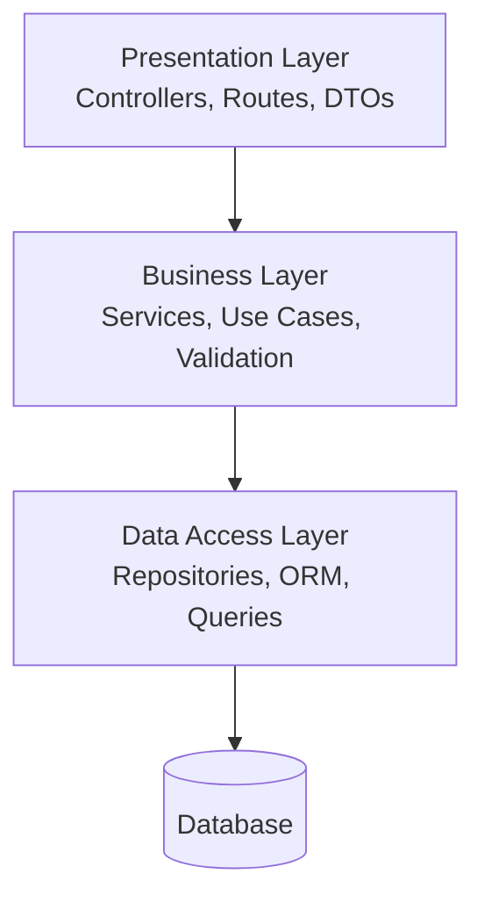
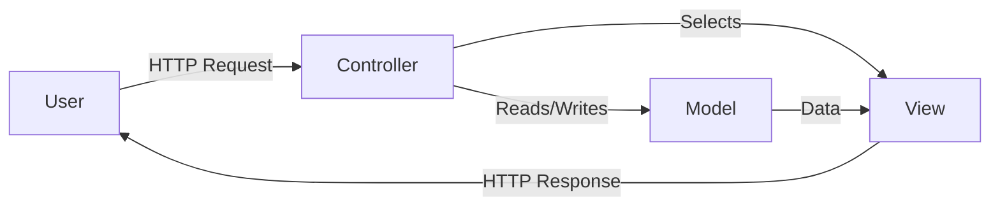
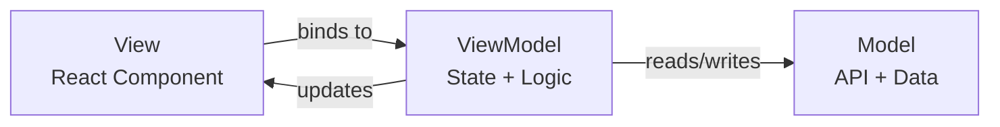
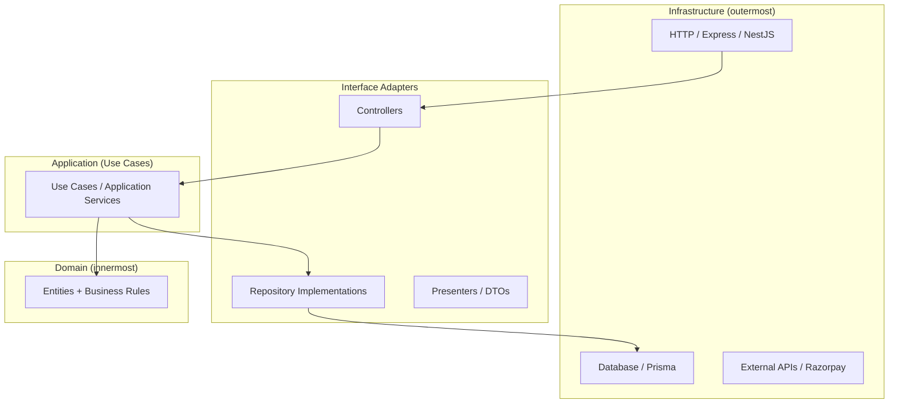
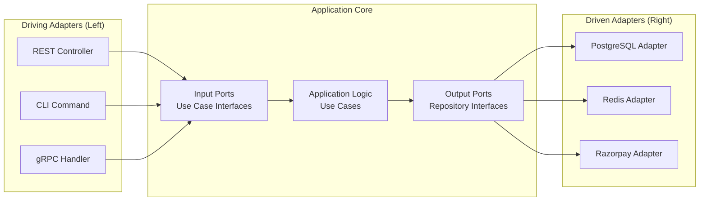

# Code Organization

Code Organization is the art of **structuring your application into layers and modules** so that it's maintainable, testable, and scalable. It answers: "Where does this code live?"

---

## Why Code Organization Matters?

| Bad Organization | Good Organization |
|-----------------|-------------------|
| Everything in one file/folder | Clear separation of concerns |
| Change one thing → break 10 others | Changes are isolated to one layer |
| Can't test without spinning up entire app | Each layer testable independently |
| New developer lost for days | Folder structure tells the story |
| Business logic mixed with framework code | Business logic is framework-agnostic |

---

## Architectures at a Glance

| Architecture | Core Idea | Best For |
|-------------|-----------|----------|
| **Layered (N-tier)** | Stack of layers, each talks to layer below | Simple CRUD apps, small teams |
| **MVC** | Model-View-Controller separation | Web apps (Rails, Django, Express) |
| **MVVM** | Model-View-ViewModel (reactive binding) | Frontend apps (React, Angular, Vue) |
| **Clean Architecture** | Dependencies point inward, business logic at core | Complex domain logic, long-lived projects |
| **Hexagonal (Ports & Adapters)** | Core logic surrounded by interchangeable adapters | Microservices, high testability needs |

---


- **Layered Architecture:** An architectural pattern that organizes code into horizontal layers (presentation, business, data access), where each layer only depends on the layer directly below it.
- **MVC (Model-View-Controller):** A pattern that separates an application into three components: Model (data/business logic), View (UI/presentation), and Controller (handles user input, coordinates between Model and View).
- **MVVM (Model-View-ViewModel):** A pattern where the ViewModel exposes data and commands that the View binds to reactively, decoupling the View from the Model entirely.
- **Clean Architecture:** An architecture where dependencies point inward — outer layers (frameworks, DB) depend on inner layers (use cases, entities), never the reverse, making business logic independent of external concerns.
- **Hexagonal Architecture (Ports & Adapters):** An architecture where the core application logic communicates with the outside world through well-defined ports (interfaces) and adapters (implementations), making external systems interchangeable.
- **Separation of Concerns:** The principle that each module/layer should have one well-defined responsibility, reducing coupling and increasing cohesion.
- **Dependency Inversion:** High-level modules define interfaces (ports); low-level modules implement them (adapters). The core never depends on infrastructure.
- **Domain Layer:** The innermost layer containing business entities and rules — pure logic with zero framework or database dependencies.
- **Use Case (Application Layer):** Orchestrates the flow of data between entities and external systems, implementing specific business operations.
- **Infrastructure Layer:** The outermost layer containing concrete implementations — database, HTTP, file system, third-party APIs.

---

---

# 1. LAYERED ARCHITECTURE (N-Tier)

> **Stack of horizontal layers. Each layer calls only the layer directly below.**

---

## The Classic 3-Layer Architecture



### Layer Responsibilities

| Layer | Responsibility | Contains | Example |
|-------|---------------|----------|---------|
| **Presentation** | Handle HTTP, format responses | Controllers, middleware, DTOs | `TripController` |
| **Business** | Core logic, rules, orchestration | Services, validators | `TripService` |
| **Data Access** | Persistence, DB queries | Repositories, ORM models | `TripRepository` |

### Rules

1. **Downward only** — Presentation → Business → Data (never upward)
2. **No skipping** — Controller should NOT call Repository directly
3. **Each layer has its own models** — DTO (presentation), Entity (business), ORM Model (data)

---

## Code Example: NestJS Layered Architecture

```
src/
├── trips/
│   ├── trips.controller.ts    ← Presentation
│   ├── trips.service.ts       ← Business Logic
│   ├── trips.repository.ts   ← Data Access
│   ├── dto/
│   │   ├── create-trip.dto.ts
│   │   └── trip-response.dto.ts
│   └── entities/
│       └── trip.entity.ts
├── drivers/
│   ├── drivers.controller.ts
│   ├── drivers.service.ts
│   └── drivers.repository.ts
└── common/
    ├── guards/
    ├── filters/
    └── interceptors/
```

### Flow of a Request

```typescript
// 1. CONTROLLER (Presentation) — handles HTTP
@Controller('v1/trips')
export class TripsController {
  constructor(private tripsService: TripsService) {}

  @Post()
  async create(@Body() dto: CreateTripDto) {
    const trip = await this.tripsService.createTrip(dto);
    return { success: true, data: trip };
  }
}

// 2. SERVICE (Business) — logic, validation, orchestration
@Injectable()
export class TripsService {
  constructor(
    private tripsRepo: TripsRepository,
    private pricingEngine: PricingEngine,
  ) {}

  async createTrip(dto: CreateTripDto): Promise<Trip> {
    // Business rules
    if (dto.cargoWeightTons > 25) {
      throw new BadRequestException('Max weight exceeded');
    }

    const fare = this.pricingEngine.calculate(dto.distance, dto.cargoWeightTons);
    
    return this.tripsRepo.create({
      ...dto,
      status: 'pending',
      estimatedFare: fare,
    });
  }
}

// 3. REPOSITORY (Data Access) — database operations
@Injectable()
export class TripsRepository {
  constructor(private prisma: PrismaService) {}

  async create(data: Partial<Trip>): Promise<Trip> {
    return this.prisma.trip.create({ data });
  }

  async findById(id: string): Promise<Trip | null> {
    return this.prisma.trip.findUnique({ where: { id } });
  }
}
```

### Why Layered?

- **Simple to understand** — top-to-bottom flow
- **Team-friendly** — frontend devs touch controllers, backend devs touch services
- **Testable** — mock repository to test service logic in isolation

### Limitations

- **Tight coupling to layers** — changing data layer can ripple upward
- **Business logic leaks** — tempting to put logic in controllers
- **Doesn't scale well** — 50 services in one business layer = chaos

---

---

# 2. MVC (Model-View-Controller)

> **Separate data (Model), presentation (View), and logic/coordination (Controller).**

---

## Diagram



## Components

| Component | Responsibility | Example |
|-----------|---------------|---------|
| **Model** | Data + business rules | `Trip` entity, database queries |
| **View** | Presentation (HTML, JSON) | EJS template, JSON serializer |
| **Controller** | Receives input, calls model, returns view | `TripsController.create()` |

---

## MVC in Backend APIs (No Views)

For REST APIs, MVC simplifies to **MC** (Model-Controller) since the "View" is just JSON:

```
Controller → receives request, calls service/model → returns JSON response
Model → data entities + business logic + DB interaction
```

### NestJS is MVC-inspired:

```
Controller (handles HTTP) → Service (business logic) → Entity/Prisma (model/data)
```

---

## MVC vs Layered

| | MVC | Layered |
|---|-----|---------|
| **Focus** | UI interaction pattern | Application structure |
| **Layers** | 3 specific roles (M, V, C) | N layers (can be 2, 3, 4...) |
| **Best for** | Web applications with views | APIs, backend services |
| **View** | Required (HTML/template) | Not needed (JSON response) |

---

---

# 3. MVVM (Model-View-ViewModel)

> **ViewModel exposes data that the View binds to reactively. View never touches Model directly.**

---

## Diagram



## Components

| Component | Responsibility | React Example |
|-----------|---------------|---------------|
| **Model** | Data source, API calls | `tripApi.fetchTrips()`, server state |
| **ViewModel** | State management + logic | Custom hook: `useTripDashboard()` |
| **View** | Pure presentation (JSX) | `TripCard` component |

---

## Code Example: React + MVVM

```typescript
// MODEL — API layer (data fetching)
// api/trips.ts
export const tripApi = {
  fetchTrips: async (filters: TripFilters): Promise<Trip[]> => {
    const res = await fetch(`/v1/trips?${new URLSearchParams(filters)}`);
    return res.json();
  },
  
  cancelTrip: async (id: string): Promise<void> => {
    await fetch(`/v1/trips/${id}`, { method: 'DELETE' });
  },
};

// VIEWMODEL — state + logic (custom hook)
// hooks/useTripDashboard.ts
export function useTripDashboard() {
  const [trips, setTrips] = useState<Trip[]>([]);
  const [loading, setLoading] = useState(true);
  const [filter, setFilter] = useState<TripStatus>('all');

  useEffect(() => {
    setLoading(true);
    tripApi.fetchTrips({ status: filter }).then(setTrips).finally(() => setLoading(false));
  }, [filter]);

  const cancelTrip = async (id: string) => {
    await tripApi.cancelTrip(id);
    setTrips(prev => prev.filter(t => t.id !== id));
  };

  const activeTrips = trips.filter(t => t.status === 'in_transit');
  const completedCount = trips.filter(t => t.status === 'completed').length;

  return { trips, loading, filter, setFilter, cancelTrip, activeTrips, completedCount };
}

// VIEW — pure presentation (no logic, no API calls)
// components/TripDashboard.tsx
export function TripDashboard() {
  const { trips, loading, filter, setFilter, cancelTrip, completedCount } = useTripDashboard();

  if (loading) return <Spinner />;

  return (
    <div>
      <h1>Trips ({completedCount} completed)</h1>
      <FilterBar value={filter} onChange={setFilter} />
      {trips.map(trip => (
        <TripCard key={trip.id} trip={trip} onCancel={() => cancelTrip(trip.id)} />
      ))}
    </div>
  );
}
```

### Why MVVM for Frontend?

- **Testable** — test ViewModel (hook) without rendering UI
- **Reusable** — same ViewModel can power web + mobile views
- **Clean Views** — components are dumb, just render props
- **Reactive** — state changes automatically update the view

---

---

# 4. CLEAN ARCHITECTURE

> **Dependencies point inward. Inner layers know NOTHING about outer layers.**

This is the gold standard for complex business applications.

---

## The Concentric Circles



---

## The Dependency Rule

> **Source code dependencies ALWAYS point inward.** Nothing in an inner circle can know about anything in an outer circle.

| Layer | Knows About | Doesn't Know About |
|-------|-------------|-------------------|
| **Domain (Entities)** | Nothing else | Use cases, controllers, DB, HTTP |
| **Use Cases** | Domain entities | Controllers, DB, framework |
| **Interface Adapters** | Use cases, entities | Framework specifics (which DB) |
| **Infrastructure** | Everything inside | — |

---

## Folder Structure

```
src/
├── domain/                    ← Innermost (zero dependencies)
│   ├── entities/
│   │   ├── trip.entity.ts
│   │   ├── driver.entity.ts
│   │   └── payment.entity.ts
│   ├── value-objects/
│   │   ├── money.vo.ts
│   │   └── location.vo.ts
│   └── repositories/          ← INTERFACES only (ports)
│       ├── trip.repository.ts
│       └── driver.repository.ts
│
├── application/               ← Use Cases (orchestration)
│   ├── use-cases/
│   │   ├── create-trip.use-case.ts
│   │   ├── assign-driver.use-case.ts
│   │   └── complete-trip.use-case.ts
│   └── dtos/
│       ├── create-trip.input.ts
│       └── trip.output.ts
│
├── infrastructure/            ← Outermost (concrete implementations)
│   ├── database/
│   │   ├── prisma/
│   │   │   ├── trip.prisma-repository.ts   ← implements domain interface
│   │   │   └── driver.prisma-repository.ts
│   │   └── prisma.service.ts
│   ├── http/
│   │   ├── controllers/
│   │   │   └── trips.controller.ts
│   │   └── middleware/
│   └── external/
│       ├── razorpay.adapter.ts
│       └── google-maps.adapter.ts
│
└── main.ts                    ← Composition root (wires everything)
```

---

## Code Example: Clean Architecture

```typescript
// ═══════════════════════════════════════
// DOMAIN LAYER (innermost — no dependencies)
// ═══════════════════════════════════════

// domain/entities/trip.entity.ts
export class Trip {
  constructor(
    public readonly id: string,
    public origin: string,
    public destination: string,
    public cargoWeightTons: number,
    public status: TripStatus,
    public driverId?: string,
  ) {}

  // Business rules live HERE
  canAssignDriver(): boolean {
    return this.status === 'pending';
  }

  canStart(): boolean {
    return this.status === 'assigned' && this.driverId != null;
  }

  canCancel(): boolean {
    return ['pending', 'assigned'].includes(this.status);
  }

  assignDriver(driverId: string): void {
    if (!this.canAssignDriver()) {
      throw new Error('Trip cannot be assigned in current state');
    }
    this.driverId = driverId;
    this.status = 'assigned';
  }
}

// domain/repositories/trip.repository.ts (INTERFACE — port)
export interface ITripRepository {
  findById(id: string): Promise<Trip | null>;
  save(trip: Trip): Promise<Trip>;
  findByCustomer(customerId: string): Promise<Trip[]>;
}


// ═══════════════════════════════════════
// APPLICATION LAYER (use cases)
// ═══════════════════════════════════════

// application/use-cases/assign-driver.use-case.ts
export class AssignDriverUseCase {
  constructor(
    private tripRepo: ITripRepository,       // depends on INTERFACE, not Prisma
    private driverRepo: IDriverRepository,
    private notifier: INotificationService,
  ) {}

  async execute(tripId: string, driverId: string): Promise<Trip> {
    const trip = await this.tripRepo.findById(tripId);
    if (!trip) throw new NotFoundException('Trip not found');

    const driver = await this.driverRepo.findById(driverId);
    if (!driver) throw new NotFoundException('Driver not found');
    if (!driver.isAvailable()) throw new ConflictException('Driver not available');

    // Domain logic
    trip.assignDriver(driverId);
    driver.markBusy();

    // Persist
    await this.tripRepo.save(trip);
    await this.driverRepo.save(driver);

    // Side effect
    await this.notifier.notify(driverId, `New trip assigned: ${trip.origin} → ${trip.destination}`);

    return trip;
  }
}


// ═══════════════════════════════════════
// INFRASTRUCTURE LAYER (outermost — concrete)
// ═══════════════════════════════════════

// infrastructure/database/prisma/trip.prisma-repository.ts
export class TripPrismaRepository implements ITripRepository {
  constructor(private prisma: PrismaService) {}

  async findById(id: string): Promise<Trip | null> {
    const data = await this.prisma.trip.findUnique({ where: { id } });
    if (!data) return null;
    return new Trip(data.id, data.origin, data.destination, data.cargoWeightTons, data.status, data.driverId);
  }

  async save(trip: Trip): Promise<Trip> {
    await this.prisma.trip.update({
      where: { id: trip.id },
      data: { status: trip.status, driverId: trip.driverId },
    });
    return trip;
  }
}

// infrastructure/http/controllers/trips.controller.ts
@Controller('v1/trips')
export class TripsController {
  constructor(private assignDriver: AssignDriverUseCase) {}

  @Post(':id/assign')
  async assign(@Param('id') tripId: string, @Body() body: AssignDriverDto) {
    const trip = await this.assignDriver.execute(tripId, body.driverId);
    return { success: true, data: TripMapper.toResponse(trip) };
  }
}
```

---

### Why Clean Architecture?

- **Framework-independent** — swap NestJS for Fastify without touching business logic
- **Database-independent** — swap Prisma for TypeORM, or PostgreSQL for MongoDB
- **Testable** — test use cases with mock repositories (no DB needed)
- **Business logic is protected** — entities contain rules, not scattered in controllers

### When NOT to Use

- Simple CRUD apps (overkill)
- Prototypes/MVPs where speed > architecture
- Small team with <5 entities

---

---

# 5. HEXAGONAL ARCHITECTURE (Ports & Adapters)

> **Core logic at the center. Ports define HOW to communicate. Adapters implement the communication.**

Very similar to Clean Architecture — the key difference is the **metaphor** (hexagon vs circles) and emphasis on **ports/adapters** terminology.

---

## Diagram



---

## Key Concepts

| Concept | Definition | Example |
|---------|-----------|---------|
| **Port** | Interface that defines a capability | `ITripRepository`, `IPaymentGateway` |
| **Driving Adapter** (left/primary) | Things that CALL our app | REST controller, CLI, test harness |
| **Driven Adapter** (right/secondary) | Things our app CALLS | Database, external APIs, message queue |
| **Input Port** | Interface for incoming requests | `ICreateTripUseCase` |
| **Output Port** | Interface for outgoing operations | `ITripRepository`, `INotificationSender` |

---

## Ports (Interfaces)

```typescript
// INPUT PORT — what the outside world can ask us to do
export interface ICreateTripUseCase {
  execute(input: CreateTripInput): Promise<TripOutput>;
}

// OUTPUT PORT — what we need from the outside world
export interface ITripRepository {
  save(trip: Trip): Promise<Trip>;
  findById(id: string): Promise<Trip | null>;
}

export interface IPaymentGateway {
  createOrder(amount: number): Promise<{ orderId: string; paymentLink: string }>;
  verifyPayment(paymentId: string): Promise<boolean>;
}

export interface INotificationSender {
  send(to: string, message: string): Promise<void>;
}
```

## Adapters (Implementations)

```typescript
// DRIVING ADAPTER — REST controller calls input port
@Controller('v1/trips')
export class TripsController {
  constructor(@Inject('ICreateTripUseCase') private createTrip: ICreateTripUseCase) {}

  @Post()
  async create(@Body() dto: CreateTripDto) {
    return this.createTrip.execute(dto);
  }
}

// DRIVEN ADAPTER — implements output port for PostgreSQL
export class PostgresTripRepository implements ITripRepository {
  async save(trip: Trip): Promise<Trip> { /* Prisma/SQL */ }
  async findById(id: string): Promise<Trip | null> { /* Prisma/SQL */ }
}

// DRIVEN ADAPTER — implements output port for Razorpay
export class RazorpayPaymentAdapter implements IPaymentGateway {
  async createOrder(amount: number) { /* Razorpay API call */ }
  async verifyPayment(paymentId: string) { /* Verify signature */ }
}

// DRIVEN ADAPTER — implements output port for notifications
export class WhatsAppNotificationAdapter implements INotificationSender {
  async send(to: string, message: string) { /* WhatsApp Business API */ }
}
```

---

### Why Hexagonal?

- **Swap anything** — replace Razorpay with Stripe by writing a new adapter (same port)
- **Test in isolation** — mock all ports, test core logic purely
- **Multiple entry points** — same business logic accessible via REST, gRPC, CLI, webhook
- **Explicit boundaries** — clear what's "inside" vs "outside"

---

## Hexagonal vs Clean Architecture

| | Clean Architecture | Hexagonal |
|---|-------------------|-----------|
| **Mental model** | Concentric circles (layers) | Hexagon with ports on edges |
| **Terminology** | Entities, Use Cases, Interface Adapters | Ports, Adapters, Application Core |
| **Direction** | Dependencies point inward | Adapters point inward to ports |
| **In practice** | Almost identical | Almost identical |

They're **the same concept** with different metaphors. Use whichever terminology your team prefers.

---

---

# 6. COMPARISON: ALL ARCHITECTURES

| Architecture | When to Use | Team Size | Complexity |
|-------------|-------------|-----------|------------|
| **Layered** | Simple CRUD, small apps | 1-3 devs | Low |
| **MVC** | Web apps with views | 1-5 devs | Low-Medium |
| **MVVM** | Frontend with complex state | 2-5 devs | Medium |
| **Clean Architecture** | Complex domains, long-lived products | 3-10+ devs | High |
| **Hexagonal** | Microservices, many integrations | 3-10+ devs | High |

---

## The Pragmatic Path (for Smart Freight)

```
MVP / Early Stage:
  → Simple Layered (Controller → Service → Repository)
  → Get to market fast

Growing (5-20 entities, 3+ devs):
  → Clean Architecture for core modules (Trips, Payments)
  → Layered for simple CRUD modules (Settings, Admin)

Scale (microservices):
  → Hexagonal per service
  → Each service has its own ports/adapters
```

---

---

# 7. PRACTICAL FOLDER STRUCTURE: NestJS

> **The structure you'll actually use for Smart Freight.**

---

## Simple (Layered — good for starting)

```
src/
├── modules/
│   ├── trips/
│   │   ├── trips.controller.ts
│   │   ├── trips.service.ts
│   │   ├── trips.repository.ts
│   │   ├── trips.module.ts
│   │   ├── dto/
│   │   │   ├── create-trip.dto.ts
│   │   │   └── update-trip.dto.ts
│   │   └── entities/
│   │       └── trip.entity.ts
│   ├── drivers/
│   ├── payments/
│   └── auth/
├── common/
│   ├── guards/
│   ├── filters/
│   ├── interceptors/
│   └── decorators/
├── config/
│   └── configuration.ts
├── prisma/
│   ├── prisma.service.ts
│   └── schema.prisma
├── app.module.ts
└── main.ts
```

## Advanced (Clean Architecture — for complex modules)

```
src/
├── modules/
│   ├── trips/
│   │   ├── domain/
│   │   │   ├── trip.entity.ts
│   │   │   ├── trip.repository.interface.ts
│   │   │   └── trip-status.enum.ts
│   │   ├── application/
│   │   │   ├── create-trip.use-case.ts
│   │   │   ├── assign-driver.use-case.ts
│   │   │   └── complete-trip.use-case.ts
│   │   ├── infrastructure/
│   │   │   ├── trip.prisma-repository.ts
│   │   │   └── trip.controller.ts
│   │   ├── dto/
│   │   │   ├── create-trip.dto.ts
│   │   │   └── trip-response.dto.ts
│   │   └── trips.module.ts
│   ├── payments/
│   │   ├── domain/
│   │   ├── application/
│   │   └── infrastructure/
│   └── drivers/
├── shared/
│   ├── domain/
│   │   └── value-objects/
│   └── infrastructure/
│       ├── database/
│       └── external-services/
└── main.ts
```

---

---

# Common Mistakes

## ❌ BAD: Business logic in controllers

```typescript
@Post()
async create(@Body() dto: CreateTripDto) {
  // Controller doing EVERYTHING
  if (dto.weight > 25) throw new BadRequest('Too heavy');
  const fare = dto.distance * 15 + dto.weight * 200;
  const trip = await this.prisma.trip.create({
    data: { ...dto, fare, status: 'pending' }
  });
  await this.mailer.send(dto.email, 'Trip created');
  return trip;
}
```

## ✅ GOOD: Controller is thin, service has logic

```typescript
// Controller — only HTTP concerns
@Post()
async create(@Body() dto: CreateTripDto) {
  const trip = await this.tripsService.createTrip(dto);
  return { success: true, data: trip };
}

// Service — business logic
async createTrip(dto: CreateTripDto): Promise<Trip> {
  this.validateWeight(dto.weight);
  const fare = this.pricingEngine.calculate(dto);
  const trip = await this.tripRepo.create({ ...dto, fare });
  await this.notifier.tripCreated(trip);
  return trip;
}
```

---

## ❌ BAD: Service directly using Prisma (tight coupling)

```typescript
@Injectable()
export class TripsService {
  constructor(private prisma: PrismaService) {}  // Direct dependency on Prisma

  async findActive() {
    return this.prisma.trip.findMany({ where: { status: 'in_transit' } });
  }
}
```

## ✅ GOOD: Service uses repository interface

```typescript
@Injectable()
export class TripsService {
  constructor(private tripRepo: ITripRepository) {}  // Depends on interface

  async findActive() {
    return this.tripRepo.findByStatus('in_transit');
  }
}
```

Now you can swap PostgreSQL for MongoDB without touching the service.

---

## ❌ BAD: Circular dependencies between modules

```
TripsService → DriversService → TripsService  // 💥 Circular!
```

## ✅ GOOD: Use events or shared interfaces

```typescript
// Instead of TripsService calling DriversService directly:
// Emit an event that DriversModule listens to

// trips.service.ts
this.eventEmitter.emit('trip.created', { tripId, origin, destination });

// drivers.service.ts (listener)
@OnEvent('trip.created')
handleTripCreated(payload: TripCreatedEvent) {
  this.matchDriver(payload);
}
```

---

## ❌ BAD: God service (one service doing everything)

```typescript
class TripService {
  createTrip() { ... }
  assignDriver() { ... }
  processPayment() { ... }
  sendNotification() { ... }
  generateInvoice() { ... }
  calculateRoute() { ... }
  // 50 more methods...
}
```

## ✅ GOOD: Split by responsibility (or use cases)

```typescript
class CreateTripUseCase { ... }
class AssignDriverUseCase { ... }
class PricingService { ... }
class NotificationService { ... }
class InvoiceService { ... }
```

---

# Quick Reference Table

| Mistake | Fix |
|---------|-----|
| Logic in controllers | Thin controllers, fat services |
| Direct Prisma in service | Use repository interface |
| Circular dependencies | Use events or shared interfaces |
| God service (50 methods) | Split into focused use cases/services |
| No folder structure convention | Pick one, document it, enforce it |
| Domain depends on framework | Domain layer has zero imports from NestJS/Express |
| Skipping layers | Controller → Service → Repository (never skip) |

---

# Quick Cheat Sheet

| Concept | One-liner | Key Rule |
|---------|-----------|----------|
| **Layered** | Stack of layers, top calls bottom | Never skip layers, never call upward |
| **MVC** | Model + View + Controller | Controller coordinates, never holds logic |
| **MVVM** | ViewModel binds View to Model reactively | View is dumb, ViewModel holds state |
| **Clean Architecture** | Dependencies point inward | Inner layers never know about outer |
| **Hexagonal** | Ports (interfaces) + Adapters (implementations) | Core defines ports, infra implements |
| **Thin Controller** | Controller only does HTTP | Validation, logic, DB = in service/use case |
| **Repository Pattern** | Interface for data access | Swap DB without touching business logic |
| **Domain Entity** | Contains business rules | No framework imports, no DB awareness |
| **Use Case** | One business operation | Single responsibility, orchestrates flow |
| **Port** | Interface that core defines | "What I need" vs "How it's done" |
| **Adapter** | Concrete implementation of port | PostgreSQL adapter, Razorpay adapter |

---

# Interview Tips for Code Organization

1. **Start simple** — "For an MVP I'd use layered architecture, then evolve to Clean Architecture as complexity grows"
2. **Know the trade-off** — "Clean Architecture adds boilerplate but protects business logic from framework changes"
3. **Explain dependency direction** — "My domain layer has zero imports from NestJS or Prisma"
4. **Show the Repository pattern** — interface in domain, implementation in infrastructure
5. **Mention testability** — "I can test my use case with mock repositories, no DB connection needed"
6. **Don't over-engineer** — "I wouldn't use Clean Architecture for a simple CRUD endpoint"


