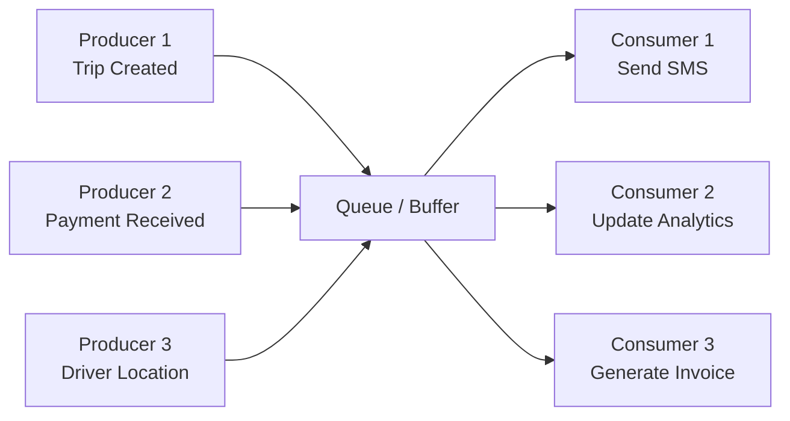
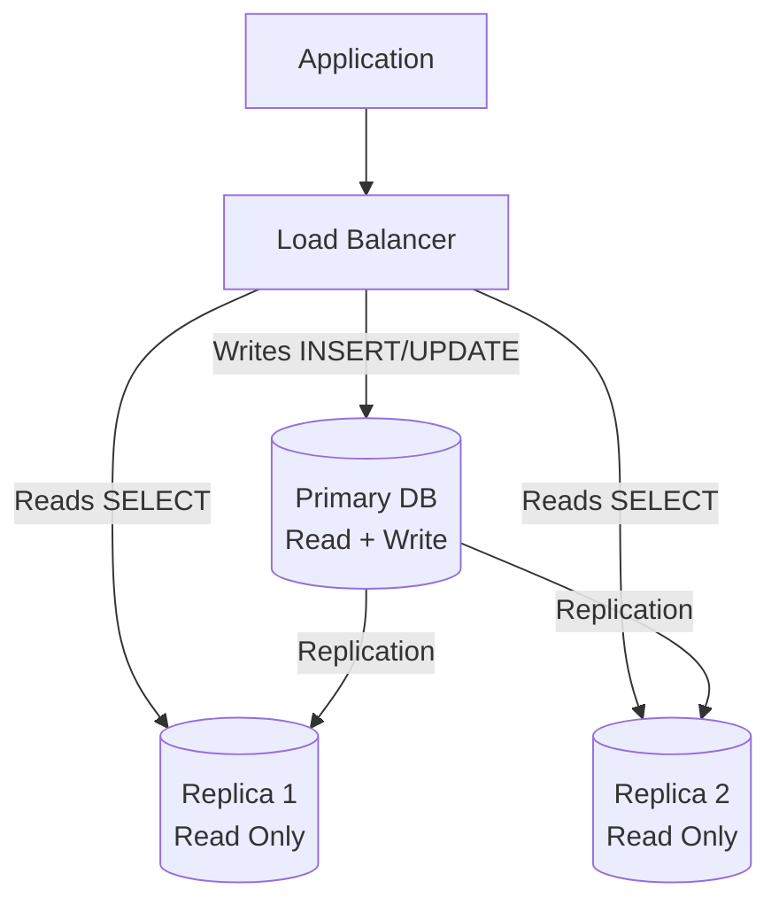
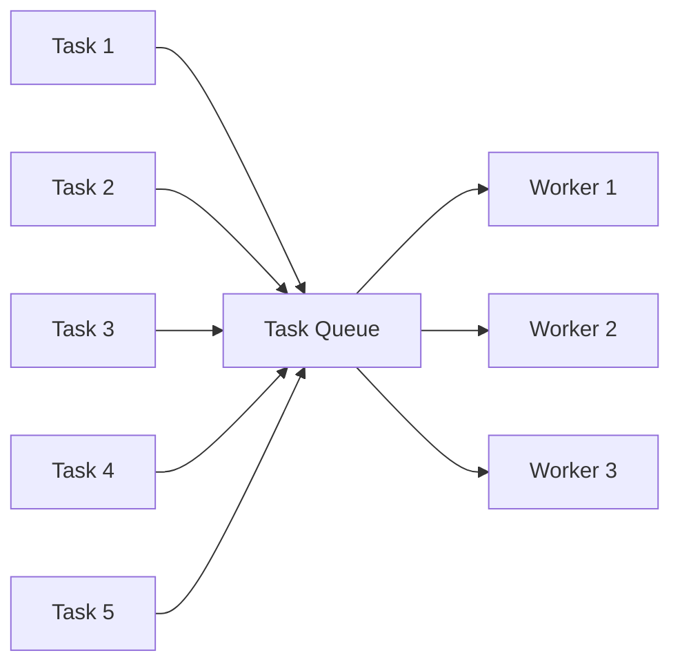

# Concurrency Patterns

Concurrency is about **multiple things happening at the same time** — and ensuring they don't corrupt shared data or deadlock each other. It's the difference between a smooth app and one that randomly loses money or crashes under load.

---

## Why Concurrency Matters?

| Without Concurrency Control | With Concurrency Control |
|---------------------------|--------------------------|
| Two users book the same driver → double assignment | Lock ensures only one gets the driver |
| Payment processed twice → double charge | Idempotency + mutex prevents duplicates |
| Counter shows wrong trip count | Atomic operations ensure accuracy |
| System handles 1 request at a time | Parallel processing = higher throughput |
| App freezes during DB query | Async I/O keeps app responsive |

---

## Core Concepts at a Glance

| Concept | Purpose |
|---------|---------|
| **Thread** | Independent unit of execution within a process |
| **Process** | Independent program with its own memory space |
| **Race Condition** | Bug where outcome depends on timing of operations |
| **Deadlock** | Two threads waiting for each other forever |
| **Mutex (Lock)** | Ensures only one thread accesses a resource at a time |
| **Semaphore** | Allows N threads to access a resource simultaneously |
| **Atomic Operation** | Indivisible operation that completes without interruption |
| **Thread Pool** | Pre-created pool of threads that handle tasks from a queue |

---


- **Concurrency:** The ability of a system to handle multiple tasks by interleaving their execution (may not be truly simultaneous on a single core).
- **Parallelism:** The actual simultaneous execution of multiple tasks on multiple CPU cores.
- **Thread:** The smallest unit of execution within a process; threads within the same process share memory space.
- **Process:** An independent execution environment with its own memory space; processes are isolated from each other.
- **Race Condition:** A bug that occurs when the correctness of a program depends on the relative timing of two or more threads accessing shared data.
- **Critical Section:** A section of code that accesses shared resources and must not be executed by more than one thread at a time.
- **Mutex (Mutual Exclusion):** A synchronization primitive that ensures only one thread can enter the critical section at a time (binary lock).
- **Semaphore:** A synchronization primitive that maintains a counter to control access, allowing up to N threads to access a resource concurrently.
- **Deadlock:** A situation where two or more threads are blocked forever, each waiting for a resource held by the other.
- **Livelock:** A situation where threads keep changing state in response to each other without making progress.
- **Starvation:** A situation where a thread is perpetually denied access to a resource because other threads keep taking priority.
- **Atomic Operation:** An operation that is executed as a single, indivisible unit — either fully completes or doesn't execute at all, with no visible intermediate state.
- **Thread Safety:** The property of code that functions correctly when accessed from multiple threads simultaneously.
- **Thread Pool:** A collection of pre-initialized threads waiting to execute tasks, avoiding the overhead of creating/destroying threads for each task.
- **Producer-Consumer Pattern:** A concurrency pattern where producer threads generate data and place it in a buffer, while consumer threads take data from the buffer and process it.
- **Reader-Writer Lock:** A lock that allows multiple concurrent readers OR a single exclusive writer, optimizing for read-heavy workloads.

---

---

# 1. THREADS vs PROCESSES

> **Process = separate apartment. Thread = separate room in the same apartment.**

---

## Comparison

| | Process | Thread |
|---|---------|--------|
| **Memory** | Own memory space (isolated) | Shared memory with other threads |
| **Communication** | IPC (Inter-Process Communication) — pipes, sockets | Direct shared memory access |
| **Creation cost** | Expensive (copy memory) | Cheap (share parent's memory) |
| **Crash impact** | Only that process dies | Can crash entire process |
| **Use case** | Microservices, worker processes | Concurrent tasks within one app |
| **Example** | Each Node.js server = 1 process | Python threads, Java threads |

---

## Node.js Concurrency Model

Node.js is **single-threaded** with an **event loop** — but that doesn't mean no concurrency:

```
┌─────────────────────────────────────┐
│         Node.js Process             │
│                                     │
│  ┌──────────────────────────────┐   │
│  │     Main Thread (Event Loop) │   │
│  │                              │   │
│  │  - Handles all JS code       │   │
│  │  - Processes callbacks        │   │
│  │  - Non-blocking I/O          │   │
│  └──────────────────────────────┘   │
│                                     │
│  ┌──────────────────────────────┐   │
│  │     Worker Thread Pool       │   │
│  │     (libuv — 4 threads)      │   │
│  │                              │   │
│  │  - File system I/O           │   │
│  │  - DNS lookups               │   │
│  │  - Crypto operations         │   │
│  │  - Compression               │   │
│  └──────────────────────────────┘   │
└─────────────────────────────────────┘
```

**Key insight:** Your NestJS app handles thousands of concurrent requests on ONE thread because I/O (DB queries, HTTP calls) is non-blocking. The event loop just schedules callbacks.

---

---

# 2. RACE CONDITIONS

> **When the outcome depends on WHO runs first — and it's unpredictable.**

---

## Classic Example: Double Booking

```python
import threading

available_seats = 10  # Shared state

def book_seat(user):
    global available_seats
    
    # RACE CONDITION: Between check and update, another thread can run
    if available_seats > 0:          # Thread A checks: 1 seat left ✓
        # <<< Thread B also checks: 1 seat left ✓ >>>
        available_seats -= 1         # Thread A books: 0 seats
        print(f"✅ {user} booked! Remaining: {available_seats}")
    else:
        print(f"❌ {user}: No seats available")
    # Thread B also books: -1 seats 💥 OVERSOLD!


# Simulate concurrent booking
threads = []
for i in range(15):
    t = threading.Thread(target=book_seat, args=(f"User-{i}",))
    threads.append(t)

for t in threads:
    t.start()
for t in threads:
    t.join()

print(f"Final seats: {available_seats}")  # Could be NEGATIVE!
```

### The Problem (Time Interleaving)

```
Time    Thread A              Thread B              available_seats
────    ────────────          ────────────          ───────────────
 t1     read seats (= 1)                           1
 t2                           read seats (= 1)     1
 t3     seats > 0? YES                             1
 t4                           seats > 0? YES       1
 t5     seats -= 1                                 0
 t6                           seats -= 1           -1  💥 OVERSOLD!
```

---

## Real-World Race Conditions in Your App

| Scenario | Race Condition | Impact |
|----------|---------------|--------|
| Two admins assign same driver | Both check driver available → both assign | Driver double-booked |
| Two payments for same trip | Both check payment pending → both charge | Double payment |
| Concurrent trip creation with same coupon | Both validate coupon → both apply | Coupon used twice |
| Updating wallet balance | Both read ₹1000 → both deduct ₹500 | Balance shows ₹500 instead of ₹0 |

---

---

# 3. MUTEX (MUTUAL EXCLUSION) / LOCKS

> **Only ONE thread can enter the critical section at a time. Others wait.**

---

## Python Example

```python
import threading

available_seats = 10
lock = threading.Lock()  # Mutex

def book_seat(user):
    global available_seats
    
    with lock:  # Only ONE thread enters this block at a time
        if available_seats > 0:
            available_seats -= 1
            print(f"✅ {user} booked! Remaining: {available_seats}")
        else:
            print(f"❌ {user}: No seats")
    # Lock released here — next thread can enter


# Now it's safe!
threads = [threading.Thread(target=book_seat, args=(f"User-{i}",)) for i in range(15)]
for t in threads:
    t.start()
for t in threads:
    t.join()

print(f"Final seats: {available_seats}")  # Always >= 0 ✅
```

---

## Database-Level Locking (What You'll Actually Use)

In web applications, you don't use thread mutexes — you use **database locks**:

### Pessimistic Locking (SELECT FOR UPDATE)

```sql
-- Lock the row so nobody else can read/modify it until transaction commits
BEGIN;

SELECT * FROM drivers WHERE id = 'DRV-42' FOR UPDATE;
-- Row is now LOCKED — other transactions wait here

-- Check and update safely
UPDATE drivers SET status = 'on_trip' WHERE id = 'DRV-42' AND status = 'available';

COMMIT;  -- Lock released
```

### Optimistic Locking (Version Column)

```sql
-- Read the current version
SELECT id, status, version FROM trips WHERE id = 'TRIP-001';
-- Returns: { status: 'pending', version: 3 }

-- Update ONLY IF version hasn't changed
UPDATE trips 
SET status = 'assigned', version = version + 1 
WHERE id = 'TRIP-001' AND version = 3;
-- If affected rows = 0, someone else changed it → retry!
```

### Comparison

| | Pessimistic Lock | Optimistic Lock |
|---|-----------------|-----------------|
| **Mechanism** | Lock row, hold until commit | Check version on update |
| **Contention** | Blocks other transactions | Fails and retries |
| **Best for** | High contention (everyone wants same row) | Low contention (conflicts are rare) |
| **Downside** | Can cause deadlocks, reduces throughput | Retries under high contention |
| **Example** | Booking last seat | Updating user profile |

---

## Distributed Locks (Redis)

When your app runs on multiple servers, DB locks aren't enough:

```typescript
// Using Redis for distributed lock (Redlock algorithm)
import Redis from 'ioredis';

const redis = new Redis();

async function acquireLock(key: string, ttlMs: number): Promise<boolean> {
  const result = await redis.set(key, 'locked', 'PX', ttlMs, 'NX');
  return result === 'OK';  // NX = only set if key doesn't exist
}

async function releaseLock(key: string): Promise<void> {
  await redis.del(key);
}

// Usage: assign driver (only one server can do it at a time)
async function assignDriver(tripId: string, driverId: string) {
  const lockKey = `lock:assign:${driverId}`;
  
  const acquired = await acquireLock(lockKey, 5000); // 5s TTL
  if (!acquired) {
    throw new ConflictException('Driver assignment in progress');
  }

  try {
    // Safe zone — only this server can execute
    const driver = await driverRepo.findById(driverId);
    if (driver.status !== 'available') throw new Error('Driver busy');
    
    await tripRepo.assignDriver(tripId, driverId);
    await driverRepo.updateStatus(driverId, 'on_trip');
  } finally {
    await releaseLock(lockKey);  // ALWAYS release!
  }
}
```

---

---

# 4. SEMAPHORE

> **Allow up to N threads/processes to access a resource concurrently.**

Mutex = semaphore with N=1. Semaphore generalizes to N.

---

## Use Cases

| N | Behavior | Use Case |
|---|----------|----------|
| 1 | Mutex (exclusive) | Writing to a file |
| 5 | Pool of 5 | DB connection pool (max 5 connections) |
| 10 | Rate limiter | Max 10 concurrent API calls to Razorpay |
| 100 | Bounded parallelism | Max 100 concurrent trip calculations |

---

## Python Example

```python
import threading
import time

# Only 3 trucks can load at the warehouse simultaneously
warehouse_semaphore = threading.Semaphore(3)

def load_truck(truck_id):
    print(f"🚛 Truck {truck_id}: Waiting at warehouse gate...")
    
    with warehouse_semaphore:  # Blocks if 3 trucks already inside
        print(f"🚛 Truck {truck_id}: Loading... (slot acquired)")
        time.sleep(2)  # Simulates loading time
        print(f"✅ Truck {truck_id}: Done loading, leaving warehouse")


# 8 trucks arrive but only 3 can load at once
threads = [threading.Thread(target=load_truck, args=(i,)) for i in range(8)]
for t in threads:
    t.start()
for t in threads:
    t.join()
```

Output:
```
🚛 Truck 0: Loading... (slot acquired)
🚛 Truck 1: Loading... (slot acquired)
🚛 Truck 2: Loading... (slot acquired)
🚛 Truck 3: Waiting at warehouse gate...   ← blocked!
🚛 Truck 4: Waiting at warehouse gate...
...
✅ Truck 0: Done loading, leaving warehouse
🚛 Truck 3: Loading... (slot acquired)     ← gets in after Truck 0 leaves
```

---

## Real-World: Connection Pool

```typescript
// Database connection pool = semaphore concept
// Prisma/TypeORM manage this internally

// prisma connection pool (schema.prisma)
datasource db {
  provider = "postgresql"
  url      = env("DATABASE_URL")
}

// This controls max concurrent DB connections:
// DATABASE_URL="postgresql://...?connection_limit=10"
// ^^ Only 10 queries can execute simultaneously. Others queue up.
```

---

## Real-World: Rate Limiting External API Calls

```typescript
// Limit concurrent calls to Razorpay API to avoid getting throttled
class RateLimitedClient {
  private semaphore: number = 0;
  private maxConcurrent = 5;
  private queue: (() => void)[] = [];

  private async acquire(): Promise<void> {
    if (this.semaphore < this.maxConcurrent) {
      this.semaphore++;
      return;
    }
    // Wait in queue
    return new Promise(resolve => this.queue.push(resolve));
  }

  private release(): void {
    this.semaphore--;
    if (this.queue.length > 0) {
      this.semaphore++;
      const next = this.queue.shift()!;
      next();
    }
  }

  async callRazorpay(endpoint: string): Promise<any> {
    await this.acquire();
    try {
      return await fetch(`https://api.razorpay.com${endpoint}`);
    } finally {
      this.release();
    }
  }
}
```

---

---

# 5. DEADLOCK

> **Thread A holds Lock 1 and waits for Lock 2. Thread B holds Lock 2 and waits for Lock 1. Both wait forever.**

---

## Classic Deadlock Scenario

```python
import threading

lock_a = threading.Lock()
lock_b = threading.Lock()

def transfer_money_AB():
    """Transfer from Account A to Account B."""
    with lock_a:                    # Hold lock A
        print("Thread 1: Acquired lock A, waiting for lock B...")
        with lock_b:                # Wait for lock B ← DEADLOCK!
            print("Thread 1: Transferring A → B")

def transfer_money_BA():
    """Transfer from Account B to Account A."""
    with lock_b:                    # Hold lock B
        print("Thread 2: Acquired lock B, waiting for lock A...")
        with lock_a:                # Wait for lock A ← DEADLOCK!
            print("Thread 2: Transferring B → A")

# Both threads start → DEADLOCK (program hangs forever)
t1 = threading.Thread(target=transfer_money_AB)
t2 = threading.Thread(target=transfer_money_BA)
t1.start()
t2.start()
```

---

## 4 Conditions for Deadlock (ALL must be true)

| # | Condition | Meaning |
|---|-----------|---------|
| 1 | **Mutual Exclusion** | Resource can only be held by one thread |
| 2 | **Hold and Wait** | Thread holds one resource while waiting for another |
| 3 | **No Preemption** | Resources can't be forcibly taken away |
| 4 | **Circular Wait** | A → B → C → A (circular dependency) |

**Break ANY one condition = no deadlock.**

---

## Prevention Strategies

| Strategy | How | Example |
|----------|-----|---------|
| **Lock Ordering** | Always acquire locks in same order | Always lock A before B (never B before A) |
| **Lock Timeout** | Give up if can't acquire within time | `tryLock(5000ms)` — fail instead of wait forever |
| **Single Lock** | Use one lock for related resources | One lock for both accounts |
| **Lock-Free Algorithms** | Use atomic operations instead | `compareAndSwap`, atomic counters |

### Fix: Lock Ordering

```python
def transfer_money(from_acct, to_acct, amount):
    # Always lock in consistent order (e.g., by ID)
    first, second = sorted([from_acct, to_acct], key=lambda a: a.id)
    
    with first.lock:
        with second.lock:
            from_acct.balance -= amount
            to_acct.balance += amount
```

### Fix: Timeout

```sql
-- PostgreSQL: lock timeout prevents infinite waiting
SET lock_timeout = '5s';

SELECT * FROM drivers WHERE id = 'DRV-42' FOR UPDATE;
-- If can't acquire lock within 5s → throws error instead of deadlocking
```

---

---

# 6. PRODUCER-CONSUMER PATTERN

> **Producers generate work items. Consumers process them. A queue sits in between.**

This is the **foundation of message queues** (Kafka, RabbitMQ, BullMQ).

---

## Diagram



---

## Python Example

```python
import threading
import queue
import time
import random

# Shared buffer (thread-safe queue)
task_queue = queue.Queue(maxsize=5)  # bounded buffer

def producer(name):
    """Creates trip notifications."""
    for i in range(5):
        trip = f"TRIP-{name}-{i}"
        task_queue.put(trip)  # Blocks if queue is full
        print(f"📤 Producer {name}: Created {trip}")
        time.sleep(random.uniform(0.1, 0.5))
    
    task_queue.put(None)  # Poison pill — signal to stop

def consumer(name):
    """Processes notifications."""
    while True:
        trip = task_queue.get()  # Blocks if queue is empty
        if trip is None:
            print(f"🛑 Consumer {name}: Shutting down")
            break
        print(f"📥 Consumer {name}: Processing {trip}")
        time.sleep(random.uniform(0.2, 0.8))  # Simulates work
        task_queue.task_done()


# Start producers and consumers
producers = [threading.Thread(target=producer, args=(f"P{i}",)) for i in range(2)]
consumers = [threading.Thread(target=consumer, args=(f"C{i}",)) for i in range(3)]

for t in producers + consumers:
    t.start()
for t in producers:
    t.join()

# Signal consumers to stop
for _ in consumers:
    task_queue.put(None)
for t in consumers:
    t.join()
```

---

## Real-World: BullMQ in NestJS (Your Stack)

```typescript
// Producer: Trip module creates job when trip is completed
@Injectable()
export class TripsService {
  constructor(@InjectQueue('notifications') private notifQueue: Queue) {}

  async completeTrip(tripId: string) {
    await this.tripRepo.updateStatus(tripId, 'completed');
    
    // Producer: enqueue notification job
    await this.notifQueue.add('trip-completed', {
      tripId,
      type: 'sms',
      recipient: trip.customer.phone,
      message: `Your shipment ${tripId} delivered!`,
    });
  }
}

// Consumer: Notification worker processes jobs
@Processor('notifications')
export class NotificationConsumer {
  @Process('trip-completed')
  async handleTripCompleted(job: Job<NotificationPayload>) {
    const { recipient, message } = job.data;
    await this.smsService.send(recipient, message);
    console.log(`✅ SMS sent to ${recipient}`);
  }
}
```

### Why Producer-Consumer?

- **Decoupling** — producer doesn't wait for consumer to finish
- **Buffering** — handles traffic spikes (queue absorbs burst)
- **Scaling** — add more consumers to process faster
- **Reliability** — if consumer crashes, message stays in queue for retry
- **Async processing** — long tasks don't block the API response

---

---

# 7. READER-WRITER PATTERN

> **Multiple readers can access simultaneously, but writers need exclusive access.**

Optimizes for **read-heavy workloads** where writes are rare.

---

## Rules

| | Readers | Writer |
|---|---------|--------|
| **Readers present** | ✅ More readers allowed | ❌ Writer must wait |
| **Writer present** | ❌ Readers must wait | ❌ Other writers must wait |
| **Nobody present** | ✅ Reader enters | ✅ Writer enters |

---

## Python Example

```python
import threading
import time

class TripCache:
    """Read-heavy cache — many reads, rare writes."""
    
    def __init__(self):
        self._data = {}
        self._lock = threading.RWLock()  # Python 3.13+, or use custom

    def read(self, trip_id: str) -> dict:
        """Multiple threads can read simultaneously."""
        with self._lock.read_lock():
            return self._data.get(trip_id)

    def write(self, trip_id: str, data: dict):
        """Only one thread can write (exclusive access)."""
        with self._lock.write_lock():
            self._data[trip_id] = data


# Simulating with threading.Condition (pre-3.13 Python)
class ReadWriteLock:
    def __init__(self):
        self._readers = 0
        self._lock = threading.Lock()
        self._write_lock = threading.Lock()
    
    def acquire_read(self):
        with self._lock:
            self._readers += 1
            if self._readers == 1:
                self._write_lock.acquire()  # First reader blocks writers
    
    def release_read(self):
        with self._lock:
            self._readers -= 1
            if self._readers == 0:
                self._write_lock.release()  # Last reader unblocks writers
    
    def acquire_write(self):
        self._write_lock.acquire()  # Exclusive access
    
    def release_write(self):
        self._write_lock.release()
```

---

## Real-World: Database Read/Write Splitting



```typescript
// NestJS/Prisma: Route reads to replica, writes to primary
@Injectable()
export class TripsRepository {
  constructor(
    @Inject('PRISMA_PRIMARY') private primary: PrismaClient,
    @Inject('PRISMA_REPLICA') private replica: PrismaClient,
  ) {}

  // READ — goes to replica (can handle many concurrent reads)
  async findMany(filters: TripFilters): Promise<Trip[]> {
    return this.replica.trip.findMany({ where: filters });
  }

  // WRITE — goes to primary (exclusive writer)
  async updateStatus(id: string, status: TripStatus): Promise<Trip> {
    return this.primary.trip.update({ where: { id }, data: { status } });
  }
}
```

---

---

# 8. THREAD POOL

> **Pre-create a pool of threads/workers. Tasks go into a queue, threads pick them up.**

Avoids the overhead of creating/destroying threads for each task.

---

## Diagram



---

## Python Example

```python
from concurrent.futures import ThreadPoolExecutor
import time

def calculate_route(trip):
    """Expensive computation — calculate optimal route."""
    print(f"🔄 Calculating route for {trip}...")
    time.sleep(1)  # Simulates complex calculation
    return f"Route for {trip}: via NH48"

# Thread pool with 4 workers
trips = ["Mumbai→Pune", "Delhi→Jaipur", "Chennai→Bangalore", 
         "Kolkata→Patna", "Hyderabad→Vizag", "Pune→Nashik"]

with ThreadPoolExecutor(max_workers=4) as pool:
    # Submit all tasks — pool manages which thread runs what
    futures = [pool.submit(calculate_route, trip) for trip in trips]
    
    # Collect results as they complete
    for future in futures:
        result = future.result()
        print(f"✅ {result}")

# 6 trips processed by 4 threads — first 4 run parallel, 
# remaining 2 start when a thread becomes free
```

---

## Node.js Worker Threads (CPU-Intensive Tasks)

```typescript
// For CPU-heavy work in Node.js (route optimization, PDF generation)
import { Worker, isMainThread, parentPort, workerData } from 'worker_threads';

if (isMainThread) {
  // Main thread — delegates heavy work to workers
  function optimizeRoute(waypoints: string[]): Promise<string[]> {
    return new Promise((resolve, reject) => {
      const worker = new Worker(__filename, { workerData: { waypoints } });
      worker.on('message', resolve);
      worker.on('error', reject);
    });
  }

  // Usage
  const optimized = await optimizeRoute(['Mumbai', 'Nashik', 'Pune', 'Satara']);
} else {
  // Worker thread — does the heavy computation
  const { waypoints } = workerData;
  const result = computeTSP(waypoints); // Heavy computation
  parentPort!.postMessage(result);
}
```

---

---

# 9. COMMON CONCURRENCY PATTERNS IN WEB APPS

> **What you'll actually encounter building Smart Freight.**

---

## Pattern 1: Database Transaction (ACID)

```typescript
// Ensure all-or-nothing: assign driver + update trip + deduct balance
async function assignDriverToTrip(tripId: string, driverId: string) {
  await prisma.$transaction(async (tx) => {
    // All these succeed or ALL roll back
    const driver = await tx.driver.findUnique({ where: { id: driverId } });
    if (driver.status !== 'available') throw new Error('Driver busy');

    await tx.trip.update({ where: { id: tripId }, data: { driverId, status: 'assigned' } });
    await tx.driver.update({ where: { id: driverId }, data: { status: 'on_trip' } });
    await tx.wallet.update({ 
      where: { driverId }, 
      data: { balance: { decrement: 50 } }  // Platform fee
    });
  });
}
```

---

## Pattern 2: Optimistic Concurrency Control

```typescript
// Two admins try to assign different drivers to same trip
async function assignDriver(tripId: string, driverId: string) {
  const trip = await prisma.trip.findUnique({ where: { id: tripId } });
  
  // Update ONLY IF version matches (nobody else changed it)
  const result = await prisma.trip.updateMany({
    where: { id: tripId, version: trip.version },  // Optimistic check
    data: { driverId, status: 'assigned', version: { increment: 1 } },
  });

  if (result.count === 0) {
    throw new ConflictException('Trip was modified by another user. Please retry.');
  }
}
```

---

## Pattern 3: Idempotent Operations

```typescript
// Payment webhook may be called multiple times
async function handlePaymentWebhook(paymentId: string, status: string) {
  // Idempotent: if already processed, skip
  const existing = await prisma.payment.findUnique({ where: { paymentId } });
  if (existing && existing.status === 'completed') {
    return existing;  // Already done — safe to return same result
  }

  return prisma.payment.update({
    where: { paymentId },
    data: { status: 'completed', processedAt: new Date() },
  });
}
```

---

## Pattern 4: Queue-Based Processing

```typescript
// Instead of processing everything in the request:
@Post('trips')
async createTrip(@Body() dto: CreateTripDto) {
  // Fast: just save trip and return
  const trip = await this.tripService.create(dto);
  
  // Slow tasks → queue (don't block response)
  await this.queue.add('trip-created', {
    tripId: trip.id,
    tasks: ['calculate-route', 'find-driver', 'notify-customer']
  });

  return { data: trip, message: 'Trip created, processing in background' };
}
```

---

## Pattern 5: Retry with Backoff

```typescript
// External API call with exponential backoff
async function callWithRetry<T>(
  fn: () => Promise<T>,
  maxRetries = 3,
  baseDelayMs = 1000
): Promise<T> {
  for (let attempt = 0; attempt <= maxRetries; attempt++) {
    try {
      return await fn();
    } catch (error) {
      if (attempt === maxRetries) throw error;
      
      const delay = baseDelayMs * Math.pow(2, attempt); // 1s, 2s, 4s
      console.log(`Retry ${attempt + 1}/${maxRetries} in ${delay}ms...`);
      await new Promise(r => setTimeout(r, delay));
    }
  }
}

// Usage
const payment = await callWithRetry(() => razorpay.createOrder(amount));
```

---

---

# Common Mistakes

## ❌ BAD: No lock on shared resource

```typescript
// Two concurrent requests both read balance=1000, both deduct 500
// Final balance: 500 (should be 0!)
async function deductBalance(userId: string, amount: number) {
  const wallet = await prisma.wallet.findUnique({ where: { userId } });
  if (wallet.balance >= amount) {
    await prisma.wallet.update({
      where: { userId },
      data: { balance: wallet.balance - amount },  // NOT ATOMIC!
    });
  }
}
```

## ✅ GOOD: Atomic database operation

```typescript
async function deductBalance(userId: string, amount: number) {
  // Atomic decrement — no race condition possible
  const result = await prisma.wallet.updateMany({
    where: { userId, balance: { gte: amount } },  // Check + update in one query
    data: { balance: { decrement: amount } },
  });
  if (result.count === 0) throw new Error('Insufficient balance');
}
```

---

## ❌ BAD: Long-running task in request handler

```typescript
@Post('trips/:id/complete')
async completeTrip(@Param('id') id: string) {
  await this.tripService.complete(id);       // Fast
  await this.invoiceService.generate(id);    // 2 seconds
  await this.analyticsService.track(id);     // 1 second
  await this.notificationService.send(id);   // 1 second
  await this.walletService.settle(id);       // 500ms
  return { success: true };  // Customer waits 4.5 seconds!
}
```

## ✅ GOOD: Do critical work synchronously, rest async

```typescript
@Post('trips/:id/complete')
async completeTrip(@Param('id') id: string) {
  await this.tripService.complete(id);  // Only the essential part
  
  // Everything else → background queue
  await this.queue.add('trip-completed', { tripId: id });
  
  return { success: true };  // Customer gets response in 200ms
}
```

---

## ❌ BAD: Unbounded parallelism

```typescript
// 10,000 trips → 10,000 simultaneous DB queries → connection pool exhausted!
const trips = await getAllTrips();
await Promise.all(trips.map(trip => processTrip(trip)));
```

## ✅ GOOD: Bounded concurrency (semaphore concept)

```typescript
// Process 10 at a time (like a semaphore with N=10)
import pLimit from 'p-limit';
const limit = pLimit(10);

const trips = await getAllTrips();
await Promise.all(trips.map(trip => limit(() => processTrip(trip))));
```

---

# Quick Reference Table

| Mistake | Fix |
|---------|-----|
| No lock on shared resource | Use DB transactions or atomic operations |
| Long tasks in request handler | Move to background queue |
| Unbounded parallelism | Use p-limit or semaphore pattern |
| Read-then-update (non-atomic) | Atomic updateMany with condition |
| No retry on external calls | Exponential backoff with max retries |
| Deadlock from lock ordering | Always acquire locks in consistent order |

---

# Quick Cheat Sheet

| Concept | One-liner | When to Use |
|---------|-----------|-------------|
| **Mutex / Lock** | Only one thread enters | Writing to shared resource |
| **Semaphore** | Up to N threads enter | Connection pools, rate limiting |
| **Deadlock** | Threads wait for each other forever | Prevent with lock ordering / timeouts |
| **Race Condition** | Timing-dependent bug | Fix with locks or atomic operations |
| **Producer-Consumer** | Queue between creator and processor | Background jobs, notifications |
| **Reader-Writer** | Many readers OR one writer | Read-heavy caches, DB replicas |
| **Thread Pool** | Pre-created workers pick from queue | CPU-intensive tasks, batch processing |
| **Optimistic Lock** | Version check on update | Low-contention updates |
| **Pessimistic Lock** | SELECT FOR UPDATE | High-contention (booking last seat) |
| **Distributed Lock** | Redis-based lock across servers | Multi-server critical sections |
| **Atomic Operation** | Single indivisible DB operation | Balance updates, counters |
| **Transaction** | All succeed or all rollback | Multi-step mutations |
| **Idempotency** | Same operation = same result | Webhook handlers, payment retries |
| **Retry + Backoff** | Retry with increasing delays | External API failures |

---

# Interview Tips for Concurrency

1. **Identify the race condition** — "If two requests hit simultaneously, what goes wrong?"
2. **Choose the right lock** — pessimistic for high contention, optimistic for low
3. **Think about scale** — "On multiple servers, I'd use Redis distributed lock"
4. **Mention queues** — for anything that doesn't need immediate response
5. **Atomic operations first** — simpler than locks when possible
6. **Mention deadlock prevention** — consistent lock ordering, timeouts
7. **Know your runtime** — "Node.js is single-threaded, so I use async/await + queues rather than thread locks"


